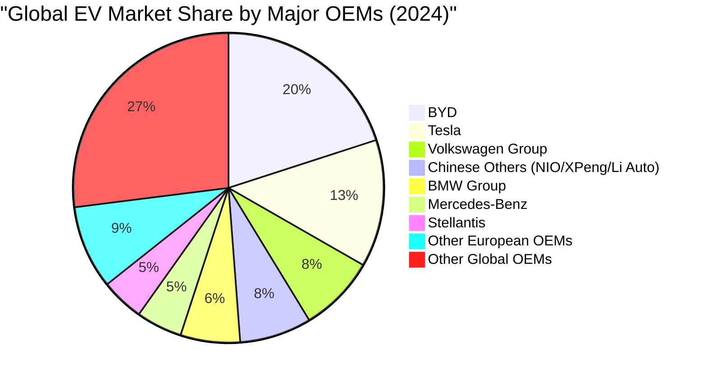
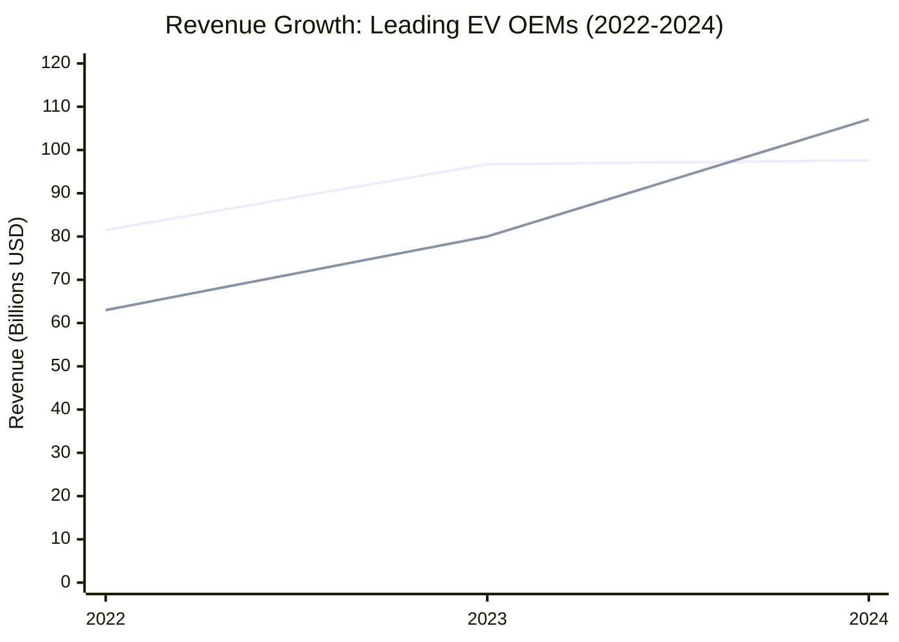
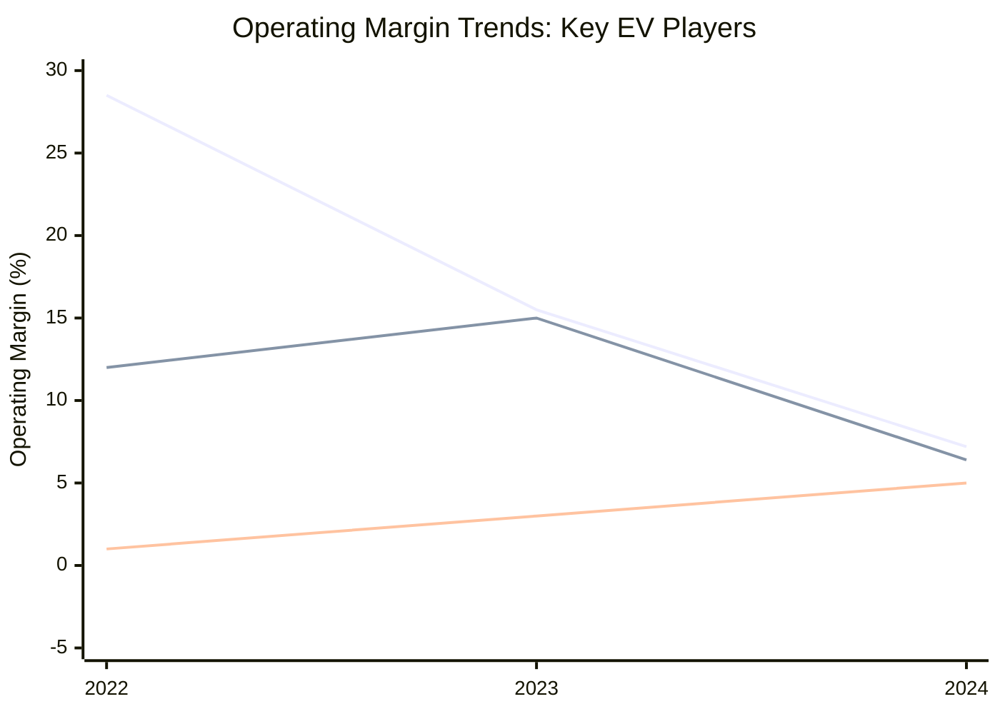
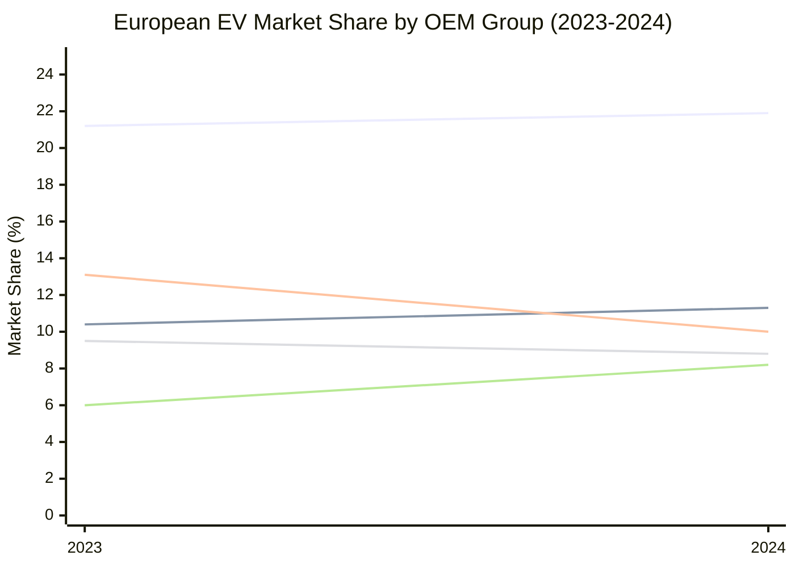
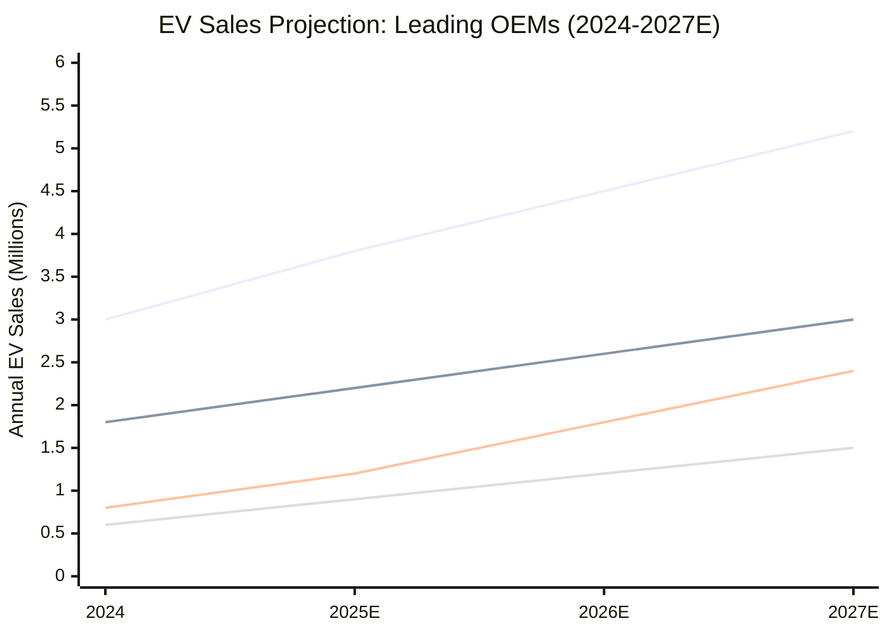
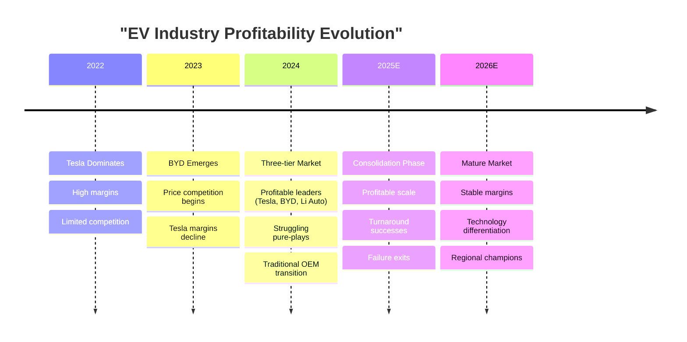
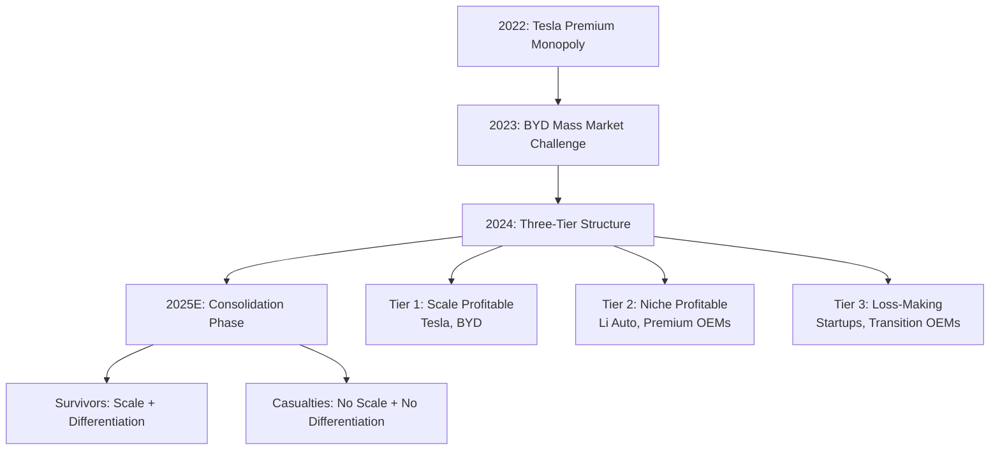

# Task 5: Visual Market Analysis and Financial Trends

## Data Visualization of EV OEM Financial Performance and Market Positioning

This report presents comprehensive visual analysis of electric vehicle manufacturer financial performance, market positioning, and strategic outlook.

---

## Market Share and Scale Analysis

### **Global EV Market Distribution (2024)**



### **Production Volume vs Profitability Matrix (2024)**

```mermaid
quadrant-chart
    title "EV OEM Positioning: Scale vs Profitability"
    x-axis "Low Production Volume" --> "High Production Volume"
    y-axis "Losses" --> "Profits"
    
    quadrant-1 "Scale Leaders"
    quadrant-2 "Profitable Niche"  
    quadrant-3 "Struggling Startups"
    quadrant-4 "Volume Burners"
    
    Tesla: [0.6, 0.75]
    BYD: [0.9, 0.7]
    Li Auto: [0.2, 0.65]
    BMW: [0.4, 0.45]
    Mercedes: [0.3, 0.4]
    NIO: [0.1, 0.15]
    XPeng: [0.15, 0.25]
    Rivian: [0.05, 0.1]
    Lucid: [0.02, 0.05]
```

---

## Financial Performance Trends (2022-2024)

### **Revenue Growth Trajectory**



### **Profitability Margin Evolution**



---

## Regional Market Analysis

### **Chinese EV Market Leaders Financial Comparison**

```mermaid
bar-chart
    title "Chinese EV OEMs: Gross Margin Comparison (Q1 2024)"
    x-axis ["Li Auto", "BYD", "Tesla China", "XPeng", "NIO", "Zeekr"]
    y-axis "Gross Margin (%)" 0 --> 25
    
    bar [22]
    bar [21.9]
    bar [18]
    bar [5]
    bar [5]
    bar [12]
```

### **European Market EV Share Evolution**



---

## Profitability Category Analysis

### **Category Distribution and Financial Health**

```mermaid
sankey-beta
    title "EV OEMs: From Market Position to Profitability"
    
    Global Leaders,Tesla,15
    Global Leaders,BYD,20
    Chinese Pure EVs,Li Auto,3
    Chinese Pure EVs,NIO,2
    Chinese Pure EVs,XPeng,2
    Chinese Pure EVs,Zeekr,1
    Traditional OEMs,BMW,6
    Traditional OEMs,Mercedes,5
    Traditional OEMs,Volkswagen,8
    Traditional OEMs,Stellantis,4
    US Startups,Rivian,1
    US Startups,Lucid,0.5
    
    Tesla,Profitable,15
    BYD,Profitable,20
    Li Auto,Profitable,3
    BMW,Turnaround,6
    Mercedes,Turnaround,5
    Volkswagen,Turnaround,8
    Stellantis,Declining,4
    NIO,Losses,2
    XPeng,Turnaround,2
    Zeekr,Turnaround,1
    Rivian,Losses,1
    Lucid,Losses,0.5
```

### **Loss Magnitude Analysis**

```mermaid
bar-chart
    title "Operating Losses: Struggling EV OEMs (2024)"
    x-axis ["Zeekr", "XPeng", "NIO", "Rivian", "Lucid"]
    y-axis "Operating Margin (%)" -400 --> 0
    
    bar [-8.5]
    bar [-25]
    bar [-30]
    bar [-150]
    bar [-374]
```

---

## Strategic Positioning Matrix

### **Business Model vs Financial Performance**

```mermaid
quadrant-chart
    title "EV Business Models: Complexity vs Profitability"
    x-axis "Simple Business Model" --> "Complex Business Model"  
    y-axis "Losses" --> "Profits"
    
    quadrant-1 "Complex & Profitable"
    quadrant-2 "Simple & Profitable"
    quadrant-3 "Complex & Losing"
    quadrant-4 "Simple & Losing"
    
    Tesla: [0.3, 0.8]
    BYD: [0.2, 0.75]
    Li Auto: [0.15, 0.7]
    BMW EV: [0.6, 0.5]
    Mercedes EV: [0.65, 0.45]
    NIO: [0.9, 0.2]
    XPeng: [0.7, 0.3]
    Rivian: [0.5, 0.15]
    Lucid: [0.4, 0.05]
```

### **Technology Strategy vs Market Success**

```mermaid
quadrant-chart
    title "Technology Focus vs Market Performance"
    x-axis "Commodity Technology" --> "Proprietary Technology"
    y-axis "Poor Market Performance" --> "Strong Market Performance"
    
    quadrant-1 "Tech Leaders"
    quadrant-2 "Execution Masters"
    quadrant-3 "Tech Strugglers" 
    quadrant-4 "Efficient Followers"
    
    Tesla: [0.85, 0.9]
    BYD: [0.7, 0.85]
    Li Auto: [0.6, 0.75]
    NIO: [0.8, 0.3]
    XPeng: [0.85, 0.35]
    Lucid: [0.9, 0.1]
    BMW: [0.5, 0.6]
    VW: [0.4, 0.65]
```

---

## Financial Health Indicators

### **Key Metrics Dashboard (2024)**

| **Metric** | **Tesla** | **BYD** | **Li Auto** | **NIO** | **Rivian** | **Lucid** |
|------------|-----------|----------|-------------|----------|------------|-----------|
| Operating Margin | 7.2% | 6.4% | 5.0% | -30% | -150% | -374% |
| Gross Margin | 18.0% | 21.9% | 22.0% | 5.0% | Negative | Negative |
| Revenue Growth | 1.0% | 29.0% | 15.0% | -10% | 25% | -5% |
| Cash Position | Strong | Strong | Adequate | Concerning | Dependent | Supported |
| Production Volume | 1.8M | 3.0M | 376K | 122K | 51K | 4K |

### **Capital Efficiency Analysis**

```mermaid
scatter-chart
    title "Capital Efficiency: Revenue per Employee (2024)"
    x-axis "Employees (thousands)" 0 --> 200
    y-axis "Revenue per Employee ($000)" 0 --> 800
    
    "Tesla" : [140, 697]
    "BYD" : [190, 564]
    "Li Auto" : [45, 289]
    "BMW" : [155, 918]
    "Mercedes" : [180, 809]
    "NIO" : [26, 192]
    "Rivian" : [18, 278]
```

---

## Market Outlook and Trend Analysis

### **Growth Trajectory Projection (2024-2027E)**



### **Profitability Path Analysis**



---

## Strategic Insights from Visual Analysis

### **Key Patterns Identified:**

1. **Scale-Profitability Correlation**: Clear positive relationship between production volume and profitability
2. **Technology Paradox**: Highest tech companies (Lucid, NIO) often least profitable
3. **Regional Success Models**: Different success strategies work in different markets
4. **Business Model Complexity**: Simpler models generally more profitable
5. **Margin Pressure**: All companies facing margin compression from competition

### **Market Structure Evolution:**



### **Investment Implications:**

- **Safe Bets**: Tesla and BYD with proven scale and profitability
- **Turnaround Plays**: XPeng, BMW, Mercedes with improving trends
- **High Risk**: NIO, Rivian, Lucid requiring significant transformation
- **Dark Horses**: Li Auto model could be replicated in other markets

This visual analysis confirms that the EV industry is following traditional automotive patterns: scale economics, operational efficiency, and clear market positioning determine financial success. The data visualization reveals that despite technological advances, fundamental business principles drive profitability in the electric vehicle sector.