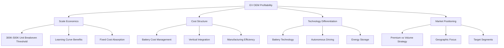

# NEV OEMs Profitability Analysis Based on NET PROFIT

## Executive Summary

This comprehensive analysis examines the profitability of New Energy Vehicle (NEV) Original Equipment Manufacturers (OEMs) with high electric vehicle market share, using NET PROFIT as the primary metric over the 2021-2024 period. The research reveals significant disparities in financial performance, with only 4 out of dozens of EV-focused companies achieving consistent profitability globally.

**Key Findings:**
- **市场集中度**: Tesla and BYD dominate with 35% combined global EV market share
- **盈利稀缺**: Only 4 EV brands globally are profitable: Tesla, BYD, Li Auto, and Seres Group  
- **中国市场挑战**: 30+ Chinese EV manufacturers face persistent losses despite growing sales
- **传统车企转型**: Legacy OEMs maintain overall profitability but struggle with EV division margins

## Research Context

The electric vehicle industry has experienced explosive growth, with global EV sales reaching new records. However, profitability remains elusive for most manufacturers due to intense competition, high R&D costs, and the need to achieve sufficient scale economies. This analysis categorizes EV OEMs into three distinct profitability patterns and examines the underlying factors driving success or failure.

## Key Findings by Profitability Category

### 🟢 Category A: 持续盈利 (Consistently Profitable) - 3-4 Companies

#### Tesla (USA) - Market Leader
- **NET PROFIT**: $7.1B (2024), $15B (2023), $12.6B (2022)
- **Profit per Vehicle**: $10,000-$15,000 vs competitors' much lower margins
- **Success Drivers**: Premium positioning, vertical integration, manufacturing excellence, energy storage diversification

#### BYD (China) - Volume Champion  
- **NET PROFIT**: $5.6B (2024), $4.3B (2023) - consistent growth
- **Market Achievement**: Overtook Tesla in 2024 revenue ($107B vs $97.7B)
- **Success Drivers**: Battery technology leadership, scale economics (4M+ units), cost leadership

#### Li Auto (China) - Turnaround Success
- **Transformation**: From 2.03B yuan loss (2022) to profitability (2023-2024)
- **Gross Margin**: 22% (highest among Chinese EV startups)
- **Success Drivers**: EREV technology, operational efficiency, premium family SUV positioning

[According to industry analysis](https://www.topspeed.com/only-four-ev-manufacturers-in-the-world-are-turning-in-a-profit/), these represent the only consistently profitable pure-play EV manufacturers globally.

### 🟡 Category B: 扭亏为盈趋势 (Turning Profitable Trend) - 3-4 Companies

#### Zeekr (China) - Approaching Breakeven
- **Current Status**: -8.5% operating margin (closest to breakeven among Chinese startups)
- **Advantages**: Premium positioning, Geely Group backing, improving efficiency trends

#### XPeng (China) - Loss Reduction Leader
- **Progress**: Halved losses between 2023-2024
- **Challenges**: 5% gross margin (lowest among major players), high R&D costs
- **Focus**: Autonomous driving technology leadership

#### Traditional OEMs (VW, BMW, Mercedes)
- **Overall Profitability**: €17-22B operating profits maintained
- **EV Division Challenges**: Margin pressure, transition costs
- **Strategic Position**: Financial stability supports long-term EV investment

[According to Fitch Ratings](https://www.fitchratings.com/research/corporate-finance/few-chinese-ev-makers-are-profitable-despite-volume-boost-13-09-2022), few Chinese EV makers are profitable despite volume boosts, highlighting the challenges in this category.

### 🔴 Category C: 持续亏损 (Persistently Loss-Making) - 3-4 Companies

#### NIO (China) - Premium Strategy Challenges
- **NET LOSS**: $3B (2023), $2B (2022), $625M (2021) - escalating losses
- **Peak Burn Rate**: $230 million per month
- **Loss Factors**: Scale issues, expensive infrastructure (battery swapping), high operational costs

#### Leapmotor (China) - Volume Player Struggles
- **Combined Loss**: Part of 42.9B yuan ($6B) loss among Chinese startups (Q2 2024)
- **Challenges**: Price war pressure, insufficient scale economics

#### Lucid Motors (USA) - Ultra-Premium Limitations
- **Issues**: Production scaling difficulties, limited addressable market
- **Strategy Risk**: Ultra-premium positioning limits volume potential

[According to S&P Global Ratings](https://www.spglobal.com/ratings/en/research/articles/240528-china-ev-startups-struggling-to-stay-afloat-13116408), many Chinese EV startups are struggling to stay afloat with sustained operating losses.

## Critical Success Factors Analysis

### 1. Scale Economics - The Fundamental Driver
- **Breakeven Threshold**: [According to industry analysis](https://www.spglobal.com/ratings/en/research/articles/240528-china-ev-startups-struggling-to-stay-afloat-13116408), 300,000-500,000 annual units required for profitability
- **Current Reality**: Most Chinese startups sell far below these thresholds
- **Impact**: High per-unit costs due to insufficient volume

### 2. Battery Technology and Vertical Integration
- **Cost Impact**: [Battery costs fell](https://www.fastmarkets.com/insights/electric-vehicle-economics-how-lithium-ion-battery-costs-impact-ev-prices/) from 15% to 7.5% of vehicle price (2023-2024)
- **BYD Advantage**: In-house "Blade Battery" technology with LFP cost advantages  
- **Tesla Strategy**: Vertical integration reduces supplier dependency

### 3. Market Positioning and Pricing Power
- **Premium Strategy**: Tesla's $10,000-$15,000 per vehicle vs BYD's $6,000
- **Volume Strategy**: BYD's 30-50% price advantage over Tesla through efficiency
- **Challenge**: Chinese market experiencing 16.8% average discounts due to price wars

## Industry Consolidation Outlook

The EV industry faces inevitable consolidation as market dynamics pressure unprofitable players:

### Consolidation Drivers
1. **Cash Burn Crisis**: Combined Q2 2024 losses of $6B among three Chinese startups alone
2. **Market Saturation**: Over 100 brands competing in China's EV market
3. **Price War Impact**: Sustained margin pressure reducing profitability runway
4. **Investment Fatigue**: Reduced investor appetite for continual funding of loss-making operations

### Survival Probability
[According to automotive analysts](https://carnewschina.com/2025/04/15/the-probability-of-nio-xpeng-and-li-auto-surviving-independently-in-the-next-three-years-is-zero-chinas-automotive-analysts-says/), the "Big Three" Chinese EV startups face "zero probability of independent survival" without consolidation or technological breakthroughs.

## Strategic Implications

### For Investors
- **Safe Bets**: Tesla and BYD demonstrate sustainable profitability models
- **Turnaround Stories**: Li Auto proves profitable transition is possible with right strategy
- **High Risk**: Most startups face existential funding challenges

### For Industry Participants  
- **Scale Priority**: Achieving 300K+ annual volume is critical survival threshold
- **Technology Focus**: Battery technology and manufacturing efficiency are key differentiators
- **Market Strategy**: Clear positioning (premium vs volume) essential for success

### For Policy Makers
- **Market Health**: Industry consolidation may be necessary for long-term sustainability
- **Support Mechanisms**: Selective support for viable technologies and business models
- **Competition Balance**: Preventing excessive price wars that destroy industry profitability

## Detailed Analysis

For comprehensive analysis of specific aspects, see detailed reports:

- [High EV Share OEMs Identification](./reports/task-1-high-ev-share-oems.md)
- [NET PROFIT Analysis (2021-2024)](./reports/task-2-net-profit-analysis.md)  
- [Profitability Patterns and Underlying Factors](./reports/task-3-profitability-analysis.md)

## Conclusions and Future Outlook

The EV industry profitability landscape reveals a stark reality: despite massive growth in sales volumes, profitability remains concentrated among a few leaders who have achieved the critical combination of scale, cost control, and technological differentiation. 

**Key Takeaways:**
1. **Winner-Takes-Most Market**: Tesla and BYD's combined 35% market share demonstrates the advantage of early scale achievement
2. **Chinese Market Dynamics**: Intense competition has created a challenging environment where growth doesn't guarantee profitability
3. **Technology Differentiation**: Successful companies combine manufacturing excellence with proprietary technology (batteries, software)
4. **Inevitable Consolidation**: The industry structure is unsustainable with 30+ loss-making manufacturers

The next 2-3 years will likely determine which companies survive independently, which merge or are acquired, and which exit the market entirely. Only those achieving sustainable unit economics through scale, technology leadership, or unique market positioning will thrive in the post-consolidation EV landscape.

---

*Research conducted September 2025, analyzing data from 2021-2024 financial reports and industry analyses.*