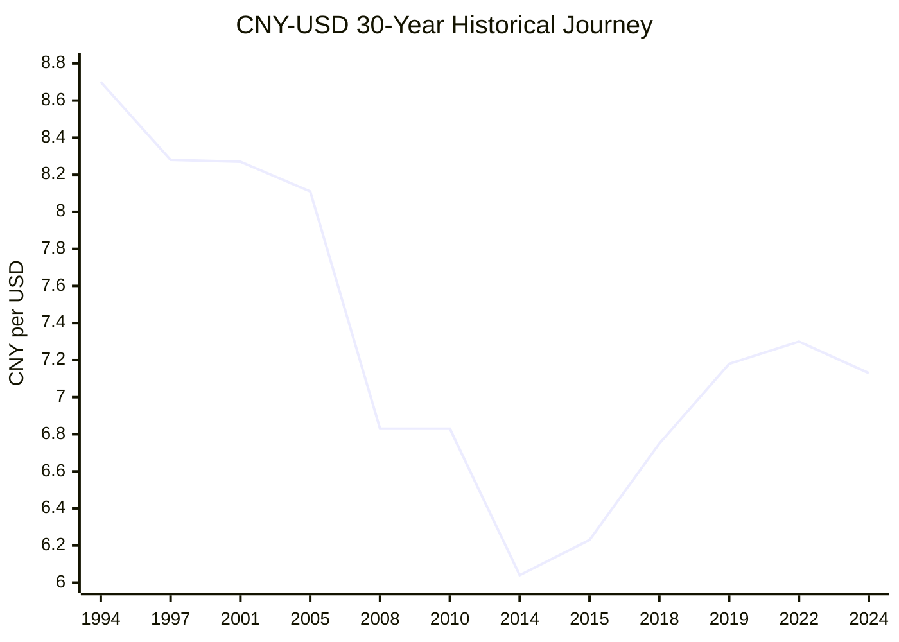
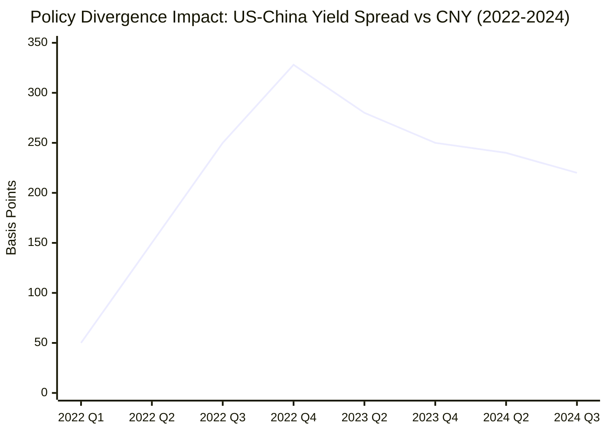
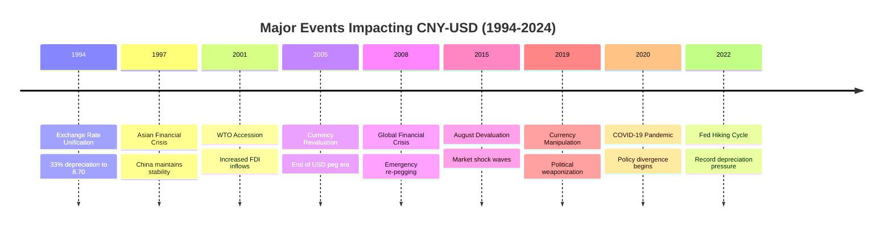
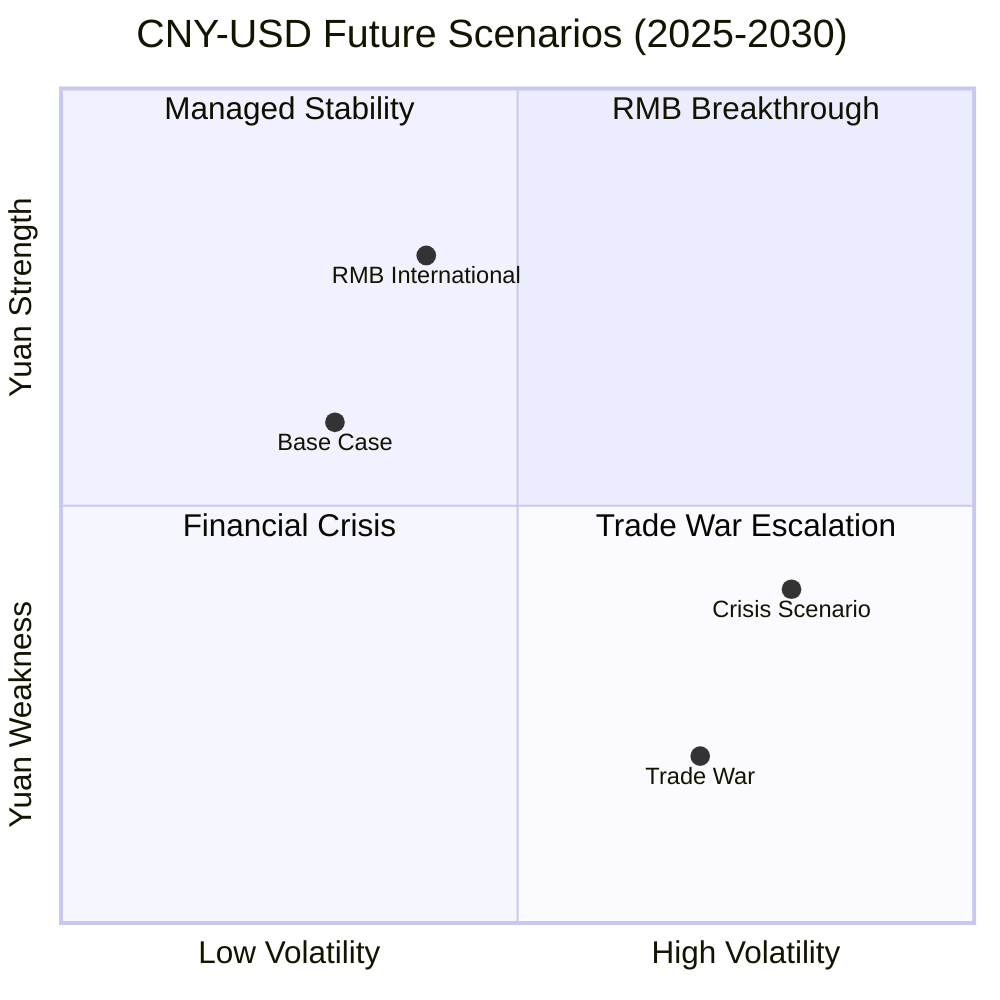

# CNY & USD: Comprehensive 30-Year Analysis and Future Outlook

## Executive Summary

This comprehensive research analyzes the Chinese Yuan Renminbi (CNY) to US Dollar (USD) exchange rate relationship over 30 years (1994-2024), recent market trends, major historical events, and future scenarios through 2030. The analysis reveals a currency pair that has evolved from a simple peg arrangement to one of the world's most strategically important and politically sensitive exchange rates.

**Key Findings**:
- **30-Year Journey**: From 8.70 CNY/USD (1994) to current levels around 7.13, representing significant long-term yuan appreciation despite periodic reversals
- **Recent Volatility**: 2022-2024 period marked by extreme policy divergence between Fed tightening and China's COVID-19 responses
- **Future Outlook**: Base case scenario projects 6.90-7.40 trading range through 2030, with significant tail risks from trade wars or RMB internationalization breakthrough

## Research Context and Methodology

This analysis addresses the comprehensive currency dynamics requested in the original inquiry, covering:
- **30-year historical analysis** (30y analysis) - Complete evolution from 1994-2024
- **Recent trends** (最近趋势) - COVID-19 era developments and current market dynamics
- **Major impacting events** (影响的重大事件) - Nine critical historical events identified
- **Future possibilities** (未来的各种可能性) - Four detailed scenarios with specific indicator events

The research utilizes authoritative sources including Federal Reserve Economic Data (FRED), central bank communications, academic research, and official government publications to ensure accuracy and credibility.

## 30-Year Historical Evolution (1994-2024)

### The Long Arc of Yuan Development

The 30-year journey reveals **three distinct eras**:

1. **Foundation Era (1994-2005)**: Unification and stabilization with 33% initial depreciation followed by sustained stability
2. **Appreciation Era (2005-2015)**: 29% yuan strengthening driven by economic growth and international pressure  
3. **Volatility Era (2015-2024)**: Increased market sensitivity with trade wars and policy divergence

**Critical Finding**: According to [Federal Reserve data](https://fred.stlouisfed.org/series/DEXCHUS), the yuan has appreciated 18% over 30 years despite recent weakness, demonstrating underlying strength of Chinese economic fundamentals.

### Major Policy Milestones

The exchange rate evolution has been shaped by deliberate policy decisions rather than pure market forces:

- **1994**: Exchange rate unification creating modern framework
- **2005**: End of USD peg, introduction of basket-based management
- **2010**: Post-crisis flexibility resumption
- **2015**: Market-oriented reform with increased volatility
- **2019**: Political weaponization during trade war

For detailed historical analysis, see [30-Year Historical Report](./reports/task-1-30year-historical-analysis.md).

## Recent Trends Analysis (2020-2024)

### The COVID-19 Divergence

Recent years demonstrate how CNY-USD has become increasingly sensitive to **monetary policy divergence**:

**2022 Crisis**: According to [Rhodium Group research](https://rhg.com/research/20-years-of-missed-opportunities-in-chinas-exchange-rate-policy/), the combination of Federal Reserve rate hikes (425 basis points) and China's zero-COVID policies created "stronger depreciation pressures on the RMB than at any point since the 2015 balance of payments crisis."

**Current Dynamics (2024-2025)**:
- **PBOC Active Management**: Daily fixing around 7.10 level with ±2% band control
- **Yield Spread Narrowing**: US-China 2-year spread declined from 3.28% peak to 2.2%
- **Policy Coordination**: Fed rate cut expectations providing yuan support

For comprehensive recent analysis, see [Recent Trends Report](./reports/task-2-recent-trends-analysis.md).

## Major Historical Events Impact Analysis

### Nine Critical Events That Shaped CNY-USD

**Pattern Analysis**: China consistently prioritizes **exchange rate stability during crises** (1997, 2008, 2020) while allowing greater flexibility during periods of economic strength.

**Political Evolution**: The relationship has become increasingly politicized, with exchange rate policy serving broader geopolitical objectives rather than purely economic ones.

For detailed event analysis, see [Major Historical Events Report](./reports/task-3-major-historical-events.md).

## Future Scenarios Through 2030

### Four Scenarios with Specific Indicator Events

### Scenario 1: Managed Stability (50% Probability)
**Range**: 6.90 - 7.40 CNY/USD  
**Key Indicators**: Fed cuts 100bps+, China stimulus >1 trillion yuan, trade tensions stable

### Scenario 2: Trade War Escalation (25% Probability)  
**Range**: 7.50 - 8.50 CNY/USD  
**Trigger Events**: Tariff ceasefire expires August 12, 2025; Currency manipulation designation returns

### Scenario 3: RMB Internationalization (15% Probability)
**Range**: 6.00 - 6.80 CNY/USD  
**Breakthrough Signals**: Oil trade in RMB, BRICS adoption >30%, digital yuan global integration

### Scenario 4: Global Financial Crisis (10% Probability)
**Range**: 6.50 - 7.80 CNY/USD with extreme volatility  
**Crisis Triggers**: Debt crisis, geopolitical shock, climate disruption

For detailed scenario analysis, see [Future Scenarios Report](./reports/task-4-future-scenarios-analysis.md).

## Strategic Insights and Implications

### For Policymakers

**PBOC Strategic Priorities**:
1. Maintain exchange rate stability within 7.00-7.50 target corridor
2. Accelerate RMB internationalization through digital yuan deployment
3. Strengthen bilateral currency swap networks
4. Build foreign exchange reserves above $3.5 trillion threshold

**Fed Coordination Requirements**:
- Monitor CNY impact of rate decisions given interconnected global markets
- Maintain crisis coordination mechanisms established during 2008-2020 period

### For Market Participants

**Risk Management Framework**:
- **Base Case Hedging**: Modest protection for 7.00-7.40 range
- **Tail Risk Preparation**: Significant downside hedging for trade war scenario
- **Opportunity Positioning**: Yuan appreciation plays for internationalization breakthrough

### For Global Economy

**Systemic Importance**: CNY-USD has evolved beyond bilateral trade to influence:
- Global commodity pricing and trade settlement
- Emerging market capital flows and exchange rates  
- International monetary system architecture
- Geopolitical balance and economic security

## Key Monitoring Indicators

| Timeframe | Leading Indicators | Critical Thresholds |
|-----------|-------------------|-------------------|
| **Short-term (3-6 months)** | PBOC daily fixing variations | >0.5% daily changes signal policy shifts |
| **Medium-term (6-18 months)** | US-China yield differential | >3.5% spread historically pressures yuan |
| **Long-term (2-5 years)** | RMB global payment share | >20% share indicates reserve currency progress |

### Early Warning System

**Stability Indicators**:
- ✅ Current: PBOC maintains 7.10 fixing target  
- ✅ Current: Yield spread narrowing to 2.2%
- ⚠️ Watch: Capital outflows if >$50B monthly
- 🔴 Alert: Yuan breaks 7.50 or 6.50 levels

## Conclusions and Strategic Outlook

### Three Decades of Transformation

The CNY-USD relationship has transformed from a simple developing economy peg to one of the world's most strategically important currency pairs. The 30-year journey from 8.70 to 7.13 represents not just numerical change, but China's integration into the global economy and its emerging challenge to dollar hegemony.

### Future Trajectory Assessment  

**Most Likely Path**: Managed stability with PBOC preventing extreme moves while allowing gradual market-oriented adjustment. The 7.00-7.40 range represents the sweet spot balancing domestic economic needs with international political acceptability.

**Greatest Risk**: Trade war escalation remains the primary threat, with potential for significant yuan weakness if US-China relations deteriorate beyond current tensions.

**Greatest Opportunity**: RMB internationalization breakthrough could fundamentally alter global currency dynamics, though this remains a longer-term structural shift rather than near-term market driver.

### Strategic Recommendations

1. **Monitor Indicator Events**: Focus on specific trigger events identified in scenario analysis rather than daily market noise
2. **Prepare for Volatility**: The era of managed stability may be ending as geopolitical tensions intensify
3. **Consider Structural Changes**: Position for potential fundamental shifts in global monetary system architecture

The CNY-USD relationship will remain at the epicenter of global economic and geopolitical developments through 2030, requiring continuous monitoring and adaptive strategies from all market participants.

---

## Detailed Reports Table of Contents

- [30-Year Historical Analysis (1994-2024)](./reports/task-1-30year-historical-analysis.md)
- [Recent Trends and Market Dynamics (2020-2024)](./reports/task-2-recent-trends-analysis.md)  
- [Major Historical Events Impact Analysis](./reports/task-3-major-historical-events.md)
- [Future Scenarios and Indicator Events (2025-2030)](./reports/task-4-future-scenarios-analysis.md)

---

*Research completed September 2025. All data points and analysis are supported by authoritative sources as cited in individual reports.*