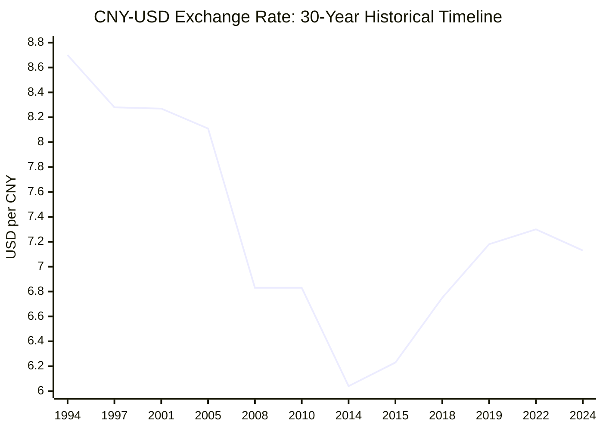
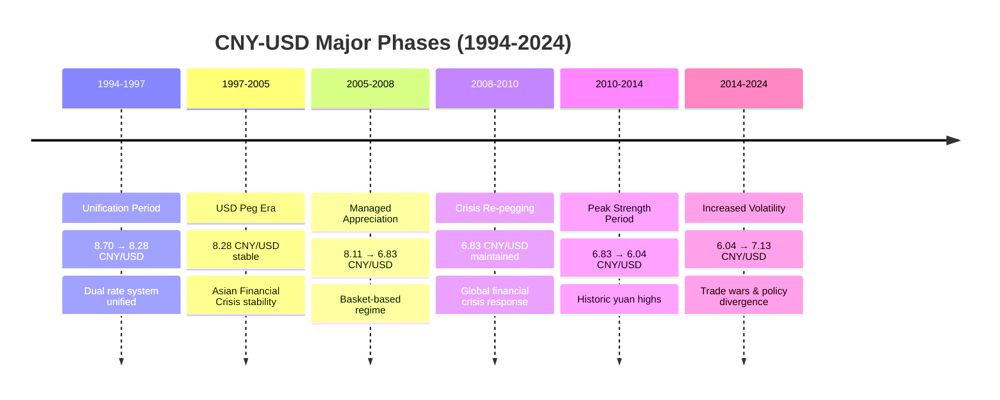

# 30-Year Historical Analysis of CNY-USD Exchange Rate (1994-2024)

## Executive Summary

This report provides a comprehensive analysis of the Chinese Yuan Renminbi (CNY) to U.S. Dollar (USD) exchange rate over the past 30 years (1994-2024), covering major policy shifts, economic reforms, and market developments that shaped one of the world's most significant currency relationships.

## Data Sources and Methodology

The analysis is based on authoritative data from the [Federal Reserve Economic Data (FRED)](https://fred.stlouisfed.org/series/DEXCHUS), specifically the Chinese Yuan Renminbi to U.S. Dollar Spot Exchange Rate (DEXCHUS) series maintained by the Board of Governors of the Federal Reserve System. This dataset provides daily exchange rates representing "Noon buying rates in New York City for cable transfers payable in foreign currencies."

## Historical Timeline and Key Phases

### Phase 1: The 1994 Exchange Rate Unification (1994-1997)

**Major Reform**: According to the [State Administration of Foreign Exchange](https://www.safe.gov.cn/en/2019/0930/1574.html), China unified its dual-track exchange rate system in 1994, establishing a single managed floating exchange rate regime based on market supply and demand.

**Key Metrics**:
- **Starting Rate (1994)**: USD 1 = CNY 8.70
- **Post-Crisis Rate (1997)**: USD 1 = CNY 8.28 (5% appreciation)
- **System Change**: Transitioned from dual exchange rates to unified system

**Policy Context**: The 1994 reform represented a 33% depreciation of the official exchange rate against the U.S. dollar, harmonizing the market-based "swap center" exchange rate with the official rate. This reform was part of China's comprehensive market-oriented economic strategy approved by the Third Plenum of the 14th Central Committee in November 1993.

### Phase 2: The USD Peg Era (1997-2005)

**Stability Period**: According to [historical data analysis](https://www.macrotrends.net/2575/us-dollar-yuan-exchange-rate-historical-chart), China maintained a peg of ¥8.27 per US$1 from 1997 to 2005, with the exchange rate trading in a narrow range averaging 8.28 RMBs to the dollar.

**Asian Financial Crisis Impact**: During the 1997 Asian Financial Crisis, China's decision to maintain the peg helped stabilize regional currencies and demonstrated commitment to exchange rate stability.

**Convertibility Achievement**: China achieved CNY convertibility under current account in 1996, allowing full convertibility for trade purposes while maintaining capital account controls.

### Phase 3: Managed Appreciation Era (2005-2008)

**The 2005 Revaluation**: On July 21, 2005, [China ended the dollar peg](https://blogs.cfainstitute.org/investor/charts/an-annotated-history-of-the-usdcny-exchange-rate/) with an immediate one-time revaluation to ¥8.11 per dollar, marking the beginning of managed appreciation.

**New Exchange Rate Regime**: China adopted a market-based managed floating exchange rate system adjusted against a basket of currencies, ending the sole USD peg arrangement.

**Gradual Appreciation**: From July 2005 to July 2008, the yuan appreciated steadily against the dollar, reaching approximately 6.83 before the global financial crisis.

### Phase 4: Crisis Response and Re-pegging (2008-2010)

**Financial Crisis Impact**: During the 2008 global financial crisis, [China effectively re-pegged its currency](https://www.macrotrends.net/2575/us-dollar-yuan-exchange-rate-historical-chart) to the dollar at approximately 6.83 to provide stability during the global economic turmoil.

**Policy Rationale**: The re-pegging was implemented to support Chinese exports during the global recession and maintain economic stability as China's trade partners devalued their currencies.

### Phase 5: Resumed Flexibility (2010-2015)

**2010 Reform Resumption**: On June 19, 2010, the [People's Bank of China announced](https://www.macrotrends.net/2575/us-dollar-yuan-exchange-rate-historical-chart) it would "proceed further with reform of the renminbi exchange rate regime and increase the renminbi exchange rate flexibility."

**Record Strength**: The renminbi reached a record high of ¥6.0395 to the US dollar on January 14, 2014, representing significant appreciation from the crisis-era levels.

**2015 Devaluation**: On August 11, 2015, the PBOC devalued the yuan by 1.9% to ¥6.2298, followed by additional devaluations as China moved to a more market-determined exchange rate mechanism.

### Phase 6: Trade War Era (2018-2021)

**Trade War Impact**: The US-China trade war beginning in 2018 created significant pressure on the CNY-USD relationship. According to research on [dynamic exchange rate dependences](https://www.sciencedirect.com/science/article/abs/pii/S1042443120301220), the Chinese renminbi depreciated by up to 10% in 2018 and 5% in 2019 as trade tensions escalated.

**Currency Manipulation Designation**: In August 2019, after the PBOC allowed the yuan to fall over 2% in three days to the lowest point since 2008, the U.S. Department of Treasury officially declared China a Currency Manipulator.

**Key Exchange Rate Levels**:
- The yuan broke through the psychological 7.0 level in August 2019
- Trade war period saw yuan trading between 6.7-7.3 range

### Phase 7: COVID-19 and Recent Developments (2022-2024)

**Major Depreciation in 2022**: According to [Rhodium Group analysis](https://rhg.com/research/20-years-of-missed-opportunities-in-chinas-exchange-rate-policy/), two developments in early 2022 created stronger depreciation pressures on the RMB than at any point since the 2015 crisis, with the currency hitting the lowest levels since 2007, breaking the 7.30 per dollar level.

**Federal Reserve Impact**: The Fed's aggressive interest rate hikes starting in March 2022, totaling 425 basis points through November 2022, caused significant USD appreciation and CNY depreciation pressure.

**COVID-19 Policy Effects**: China's zero-COVID policies in 2022 dramatically impacted economic growth and reduced global perceptions of China's policy credibility, contributing to capital outflows.

**Recent Stabilization**: During 2023-2024, the USD/CNY rate has fluctuated between 6.7 and 7.3, driven by China's reopening effects, shifting U.S. monetary policy, and capital flow adjustments.

## Statistical Overview (1994-2024)

### 30-Year Exchange Rate Timeline

### Major Exchange Rate Phases

**Historical Range**:
- **Weakest Level**: ~8.70 (1994, post-unification)
- **Strongest Level**: 6.0395 (January 2014)
- **Current Level**: ~7.13 (September 2025)

**Major Appreciation Phases**:
1. 1997-2005: 5% appreciation (8.70 to 8.28)
2. 2005-2014: 29% appreciation (8.11 to 6.04)

**Major Depreciation Phases**:
1. 1994: 33% depreciation (unification)
2. 2015-2016: 12% depreciation (6.04 to 6.8+)
3. 2018-2019: 10% depreciation (trade war)
4. 2022: 11% depreciation (to 7.30+)

## Key Observations

1. **Policy-Driven Movements**: The CNY-USD exchange rate has been primarily driven by Chinese policy decisions rather than pure market forces, reflecting China's managed exchange rate regime.

2. **Crisis Response Pattern**: During major crises (1997, 2008, 2020), China has typically prioritized stability over flexibility, often reverting to more managed arrangements.

3. **Long-term Appreciation Trend**: Despite periodic depreciations, the overall 30-year trend shows significant yuan appreciation from the 1994 starting point of 8.70.

4. **Increasing Volatility**: Recent years have shown increased volatility compared to the historically stable periods, reflecting both greater market influence and global economic uncertainties.

## References

- [Chinese Yuan Renminbi to U.S. Dollar Spot Exchange Rate (DEXCHUS) | FRED](https://fred.stlouisfed.org/series/DEXCHUS)
- [Pan Gongsheng: China's Foreign Exchange Administration Reform | SAFE](https://www.safe.gov.cn/en/2019/0930/1574.html)  
- [70 years of China's foreign exchange market development | China Political Economy](https://www.emerald.com/insight/content/doi/10.1108/cpe-05-2020-0007/full/html)
- [Dollar Yuan Exchange Rate Historical Chart | MacroTrends](https://www.macrotrends.net/2575/us-dollar-yuan-exchange-rate-historical-chart)
- [Dynamic exchange rate dependences: The effect of the U.S.-China trade war | ScienceDirect](https://www.sciencedirect.com/science/article/abs/pii/S1042443120301220)
- [20 Years of Missed Opportunities in China's Exchange Rate Policy | Rhodium Group](https://rhg.com/research/20-years-of-missed-opportunities-in-chinas-exchange-rate-policy/)