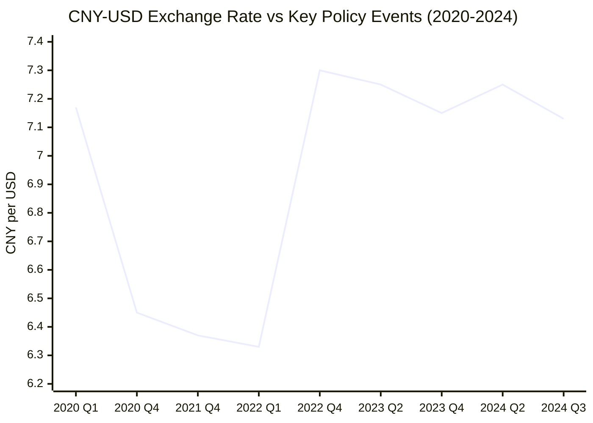
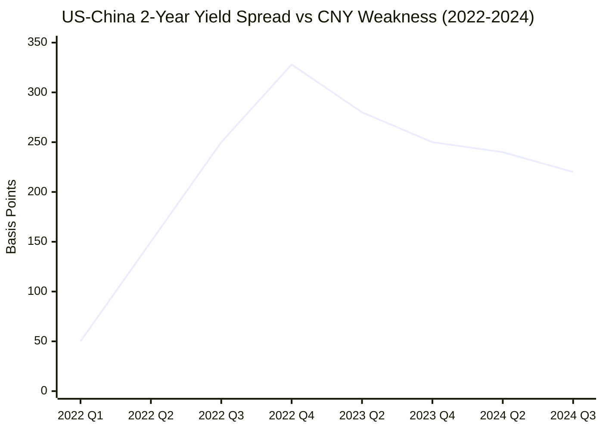
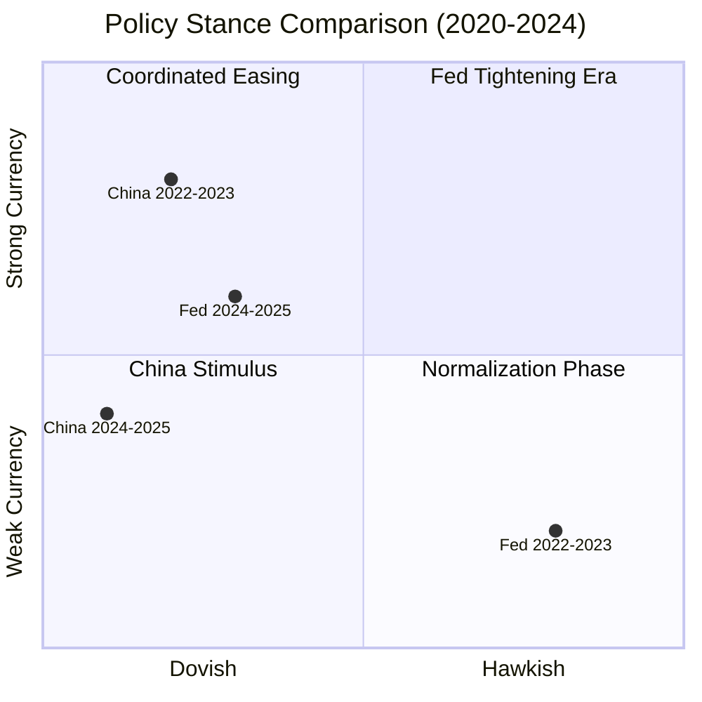

# Recent Trends and Current Market Dynamics (2020-2024)

## Executive Summary

This report analyzes the recent trends in the CNY-USD exchange rate from 2020-2024, covering the impacts of COVID-19, China's economic policies, Federal Reserve monetary policy changes, and current market dynamics. The period has been characterized by significant volatility driven by pandemic responses, policy divergence between the US and China, and evolving global economic conditions.

## COVID-19 Pandemic Impact (2020-2021)

### Initial Pandemic Response
During the initial COVID-19 outbreak in early 2020, the yuan experienced moderate depreciation as global risk sentiment deteriorated and capital flows shifted toward safe-haven assets like the US dollar.

### China's Early Recovery
China's relatively early control of the pandemic and subsequent economic recovery in 2020-2021 led to yuan strength, with the currency appreciating from around 7.17 in May 2020 to below 6.40 by early 2021.

## The Great Divergence Era (2022-2023)

### Federal Reserve Aggressive Tightening
According to research on [Fed rate impacts](https://www.researchgate.net/publication/376131422_The_Impact_of_the_Interest_Rates_Raised_by_Federal_Reserve_System_on_the_Exchange_Rate_of_the_US_Dollar_Against_the_Chinese_Yuan), the Federal Reserve's persistent interest rate hikes starting March 16, 2022, fundamentally altered the CNY-USD dynamics:

**Key Rate Hike Timeline**:
- March 2022: 25 basis points (first increase)
- Subsequent increases in May, July, September, and November 2022
- **Total increase**: 425 basis points cumulative through November 2022

**Exchange Rate Impact**: The analysis discovered that the Fed's interest rate increases caused appreciation of the USD and depreciation of the CNY, reversing the benefit that Chinese assets had held over US dollar rates for the previous fifteen years.

### China's Zero-COVID Policy Impact
According to [Rhodium Group analysis](https://rhg.com/research/20-years-of-missed-opportunities-in-chinas-exchange-rate-policy/), zero-COVID policies in China during 2022 were dramatically impacting China's economic growth and reducing global perceptions of China's policy credibility.

**Major Depreciation**: Two developments in early 2022 created stronger depreciation pressures on the RMB than at any point since the 2015 balance of payments crisis:
1. Federal Reserve rate hiking cycle
2. Zero-COVID policy impacts on growth and credibility

**Record Weakness**: The currency hit the lowest levels seen since 2007, breaking the 7.30 per dollar level in late October 2022.

### Capital Flow Reversals
The [combination of these factors](https://rhg.com/research/20-years-of-missed-opportunities-in-chinas-exchange-rate-policy/) created a significant shift in capital flows from inflows to outflows in China's balance of international payments. As China's economic outlook deteriorated under COVID-19 restrictions, capital outflows intensified as Chinese investors began accumulating US dollar assets.

## China's Reopening Phase (2023)

### Policy Pivot Impact
China's abrupt abandonment of zero-COVID policies in late 2022 and subsequent reopening in 2023 created new dynamics for the yuan. According to [ING analysis](https://think.ing.com/articles/chinese-yuan-at-a-glance-there-and-back-again/), the 2023-2024 period saw volatility and rebalancing, with the USD/CNY rate fluctuating between 6.7 and 7.3.

### Mixed Economic Recovery
Despite reopening optimism, China's economic recovery proved more subdued than initially expected, with persistent challenges in the property sector and consumer confidence limiting the yuan's recovery potential.

## Current Market Dynamics (2024-2025)

### Yield Spread Dynamics
According to recent analysis, [US-China yield spreads](https://www.ebc.com/forex/usd-to-rmb-forecast--is-the-dollar-getting-weaker) have been a major driving force behind CNY depreciation pressure since the US rate hike cycle in 2022:

**Recent Developments**:
- **Peak Spread**: The 2-year yield spread reached 3.28 percentage points in December 2024
- **Current Level**: Around 2.2 percentage points (lowest since September 2024)
- **Narrowing Trend**: Gradual narrowing as expectations for Fed rate cuts increased

### PBOC Active Management
The [People's Bank of China](https://www.fxstreet.com/news/pboc-sets-usd-cny-reference-rate-at-71034-vs-71062-previous-202509110115) has been actively managing the yuan's exchange rate:

**Daily Fixing Management**:
- Recent USD/CNY central rates: 7.1034 (vs. 7.1062 previous)
- Since August 2023, PBOC has set notably stable fixings to limit renminbi depreciation
- Yuan often trades at the lower end of its ±2% trading band

### Monetary Policy Divergence
**China's Accommodative Stance**: According to [Trading Economics](https://tradingeconomics.com/china/interest-rate), China's benchmark interest rate stands at 3%, reflecting accommodative policies to:
- Stimulate sluggish property sector
- Boost domestic demand  
- Stabilize employment

**Fed Policy Transition**: The US Federal Reserve has shifted toward a neutral-to-dovish stance after the aggressive 2022-2023 hiking cycle, with market expectations for 100 basis points of cuts before year-end.

## Cross-Border Capital Flows

### Dollar Lending Decline
According to [Federal Reserve research](https://www.federalreserve.gov/econres/notes/feds-notes/chinese-banks-dollar-lending-decline-20250516.html), cross-border lending in dollars to emerging Asia fell 16% from early 2022 through Q2 2024, exceeding the decline during the 2015-2016 "China scare" period.

**Key Drivers**:
- Concerns about slow Chinese growth
- Strong dollar appreciation
- Chinese banks reducing dollar lending exposure

## Current Market Assessment (2024-2025)

### Exchange Rate Outlook
[Market forecasts](https://www.ebc.com/forex/usd-to-rmb-forecast--is-the-dollar-getting-weaker) suggest:
- **Trading Range**: USD/CNY 7.00-7.40 forecasting band
- **Year-end Target**: 7.30 with risks tilted toward yuan strength
- **Key Factor**: Potential de-escalation of US-China tensions

### Structural Factors
1. **Interest Rate Differential**: Narrowing US-China yield spreads supportive of yuan
2. **Policy Coordination**: PBOC's active management preventing excessive volatility
3. **Growth Expectations**: China's economic stimulus versus US monetary easing
4. **Trade Relations**: Ongoing US-China economic relationship developments

## Visual Analysis: Recent CNY-USD Trends

### Policy Impact Timeline (2020-2024)

### Interest Rate Differential Impact

### Policy Divergence Matrix

## Key Trends Summary

**2020-2021**: Yuan strength during China's early pandemic recovery
**2022**: Major yuan weakness due to Fed tightening and China's zero-COVID policies  
**2023**: Volatility during China's reopening with mixed recovery
**2024-2025**: Stabilization around 7.10 level with PBOC active management

The recent period demonstrates how CNY-USD dynamics have become increasingly sensitive to monetary policy divergence, economic policy credibility, and capital flow patterns, moving beyond traditional trade-based drivers.

## References

- [The Impact of Interest Rates Raised by Federal Reserve System on USD/CNY | ResearchGate](https://www.researchgate.net/publication/376131422_The_Impact_of_the_Interest_Rates_Raised_by_Federal_Reserve_System_on_the_Exchange_Rate_of_the_US_Dollar_Against_the_Chinese_Yuan)
- [20 Years of Missed Opportunities in China's Exchange Rate Policy | Rhodium Group](https://rhg.com/research/20-years-of-missed-opportunities-in-chinas-exchange-rate-policy/)
- [Chinese yuan at a glance: There and back again | ING Think](https://think.ing.com/articles/chinese-yuan-at-a-glance-there-and-back-again/)
- [PBOC sets USD/CNY reference rate | FXStreet](https://www.fxstreet.com/news/pboc-sets-usd-cny-reference-rate-at-71034-vs-71062-previous-202509110115)
- [USD to RMB Forecast 2025 | EBC Financial Group](https://www.ebc.com/forex/usd-to-rmb-forecast--is-the-dollar-getting-weaker)
- [Chinese Banks' Dollar Lending Decline | Federal Reserve](https://www.federalreserve.gov/econres/notes/feds-notes/chinese-banks-dollar-lending-decline-20250516.html)
- [China Interest Rate | Trading Economics](https://tradingeconomics.com/china/interest-rate)