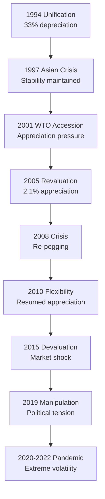

# Major Historical Events Impacting CNY-USD Relations

## Executive Summary

This report identifies and analyzes the major historical events that have significantly influenced the Chinese Yuan Renminbi (CNY) to US Dollar (USD) exchange rate over the past 30 years. These events demonstrate how geopolitical tensions, financial crises, trade policies, and multilateral agreements have shaped one of the world's most important currency relationships.

## Timeline of Major Events

### 1. The 1994 Exchange Rate Unification

**Date**: January 1, 1994  
**Event**: China unified its dual exchange rate system  
**Impact**: 33% depreciation of official rate to USD 1 = CNY 8.70

**Context**: This fundamental reform eliminated the parallel market for foreign exchange and established China's current managed floating exchange rate regime. According to the [People's Bank of China](http://www.pbc.gov.cn/), this unification was part of broader market-oriented economic reforms and laid the foundation for all subsequent exchange rate developments.

**Significance**: Created the modern framework for CNY-USD exchange rate determination and marked China's commitment to market-oriented currency management.

### 2. Asian Financial Crisis (1997-1998)

**Date**: July 1997 - 1998  
**Event**: Regional financial crisis spreads across East and Southeast Asia  
**CNY Response**: China maintained USD peg at ~8.28 CNY/USD despite pressure to devalue

**Impact Analysis**: According to [Ministry of Foreign Affairs records](https://www.mfa.gov.cn/eng/zy/wjls/3604_665547/202405/t20240531_11367571.html), "The Chinese Government, with a high sense of responsibility, decided not to devalue its Renminbi in the overall interest of maintaining stability and development in the region."

**Key Factors**:
- RMB's non-convertibility protected it from currency speculators
- China chose regional stability over competitive devaluation
- Decision reinforced China's reputation as a responsible economic partner

**Long-term Impact**: Some analysts suggest that [China's 1994 devaluation](https://www.imf.org/external/pubs/ft/fandd/1998/06/imfstaff.htm) contributed to the crisis roots, as the renminbi fall implied real exchange rate appreciation for dollar-pegged Southeast Asian currencies.

### 3. World Trade Organization (WTO) Accession (2001)

**Date**: December 11, 2001  
**Event**: China joins WTO after 14 years of negotiations  
**Exchange Rate Impact**: Increased foreign currency inflows and pressure for yuan appreciation

**Structural Changes**: According to [IMF analysis](https://www.elibrary.imf.org/display/book/9781589061781/ch012.xml), "The inflow of foreign currencies intensified when China joined the World Trade Organisation (WTO). As required by the WTO, China has fully opened its current account since its accession."

**Global Economic Impact**: [Research indicates](https://www.hinrichfoundation.com/research/article/wto/china-s-wto-entry-financial-crisis-lessons-for-the-future/) that "After China's WTO accession in 2001, the global market was flooded with cheap labour and goods—leading to a supply side shock and triggering deflation."

**Currency Implications**: WTO membership increased trade volumes and foreign investment, creating sustained appreciation pressure on the yuan through 2005.

### 4. The 2005 Currency Revaluation and Regime Change

**Date**: July 21, 2005  
**Event**: China ends 11-year USD peg, revalues yuan by 2.1% to 8.11 CNY/USD  
**Policy Shift**: Introduction of managed floating system based on currency basket

**Background Pressure**: Years of US political pressure and accusations of currency manipulation preceded this decision. The revaluation marked China's acknowledgment that the peg was unsustainable amid growing trade surpluses.

**Market Response**: The change signaled China's willingness to allow greater exchange rate flexibility, leading to sustained appreciation through 2008.

### 5. Global Financial Crisis (2008-2010)

**Date**: September 2008 - June 2010  
**Event**: Lehman Brothers collapse triggers global financial crisis  
**CNY Response**: Informal re-pegging to USD at 6.83 level

**Policy Rationale**: According to [Congressional Research Service](https://crsreports.congress.gov/product/pdf/RS/RS21625/70), "As the global financial crisis materialized in the fall of 2008, China essentially stabilized its exchange rate as the dollar surged and exports fell."

**Stability Period**: The currency remained within a very narrow range of 6.80 to 6.87 per dollar from July 2008 to June 2010, demonstrating China's priority of economic stability during global turmoil.

**International Recognition**: China's currency stability during the crisis was generally viewed positively by the international community, similar to its role during the Asian Financial Crisis.

### 6. Post-Crisis Flexibility Resumption (2010)

**Date**: June 19, 2010  
**Event**: PBOC announces resumption of exchange rate reform  
**Policy Statement**: "Proceed further with reform of the renminbi exchange rate regime and increase the renminbi exchange rate flexibility"

**Market Impact**: Marked the beginning of renewed yuan appreciation, reaching historic highs by 2014 at 6.04 CNY/USD.

### 7. The August 2015 Devaluation

**Date**: August 11, 2015  
**Event**: PBOC devalues yuan by 1.9% to 6.2298 CNY/USD in surprise move  
**Follow-up**: Additional 1.6% depreciation the following day

**Market Shock**: The unexpected devaluation triggered global market volatility and capital outflows from emerging markets. This event marked a shift toward a more market-determined exchange rate mechanism.

**Policy Context**: China was preparing the yuan for inclusion in the IMF's Special Drawing Rights basket, requiring greater exchange rate flexibility.

### 8. US Treasury Currency Manipulation Designation (2019)

**Date**: August 5, 2019  
**Event**: US Treasury designates China as "Currency Manipulator" after yuan breaks 7.0 level  
**Trigger**: Yuan depreciated over 2% in three days to lowest point since 2008

**Political Context**: According to the [US Treasury](https://home.treasury.gov/news/press-releases/sm751), "Secretary Mnuchin, under the auspices of President Trump, determined that China is a Currency Manipulator."

**Historical Background**: The [Congressional Research Service notes](https://crsreports.congress.gov/product/pdf/RS/RS21625/70) that "China has a long history of facilitating an undervalued currency through protracted, large-scale intervention in the foreign exchange market."

**Resolution**: The designation was removed in January 2020 as part of Phase One trade deal negotiations.

### 9. COVID-19 Pandemic and Policy Divergence (2020-2022)

**Date**: March 2020 - Present  
**Event**: Global pandemic triggers unprecedented policy responses  
**CNY Impact**: Initial weakness followed by strength, then major depreciation in 2022

**Policy Divergence**: China's zero-COVID policies contrasted sharply with global reopening, while Fed rate hikes created the largest US-China yield differential in decades.

**Record Weakness**: According to [Rhodium Group](https://rhg.com/research/20-years-of-missed-opportunities-in-chinas-exchange-rate-policy/), 2022 developments created "stronger depreciation pressures on the RMB than at any point since the 2015 balance of payments crisis."

## Event Impact Analysis

### Frequency and Magnitude

### Crisis Response Pattern
Analysis of major events reveals a consistent Chinese approach:
1. **Stability Priority**: During regional/global crises (1997, 2008, 2020), China prioritizes exchange rate stability
2. **Gradual Adjustment**: Policy changes are typically implemented gradually rather than through shock adjustments
3. **External Pressure Response**: Significant moves often follow sustained international pressure (2005, 2010)

### Market vs. Policy Drivers
**Policy-Driven Events** (1994, 2005, 2010, 2015): Accounted for the largest single-day moves  
**Crisis-Driven Events** (1997, 2008, 2020): Led to extended periods of stability or controlled adjustment  
**External Pressure Events** (2005, 2019): Often triggered by US political or trade pressure

## Lessons from Historical Events

### 1. Crisis Management
China has consistently used exchange rate policy as a crisis management tool, prioritizing stability over market forces during turbulent periods.

### 2. Reform Timing
Major currency reforms typically occur during periods of economic strength rather than weakness, allowing China to maintain policy initiative.

### 3. International Relations
Exchange rate decisions are increasingly influenced by bilateral relations, particularly with the United States, demonstrating the politicization of currency policy.

### 4. Market Integration
Events show China's gradual integration into global financial markets, with increased sensitivity to international capital flows and market sentiment.

## References

- [Ministry of Foreign Affairs: Pro-Active Policies by China in Response to Asian Financial Crisis](https://www.mfa.gov.cn/eng/zy/wjls/3604_665547/202405/t20240531_11367571.html)
- [Congressional Research Service: China's Currency Policy Analysis](https://crsreports.congress.gov/product/pdf/RS/RS21625/70)
- [US Treasury: Currency Manipulator Designation](https://home.treasury.gov/news/press-releases/sm751)  
- [IMF: The Impact of WTO Accession](https://www.elibrary.imf.org/display/book/9781589061781/ch012.xml)
- [Rhodium Group: 20 Years of Missed Opportunities in China's Exchange Rate Policy](https://rhg.com/research/20-years-of-missed-opportunities-in-chinas-exchange-rate-policy/)
- [IMF: Finance & Development - The Asian Crisis: Causes and Cures](https://www.imf.org/external/pubs/ft/fandd/1998/06/imfstaff.htm)
- [Hinrich Foundation: China's WTO Entry and Financial Crisis Lessons](https://www.hinrichfoundation.com/research/article/wto/china-s-wto-entry-financial-crisis-lessons-for-the-future/)