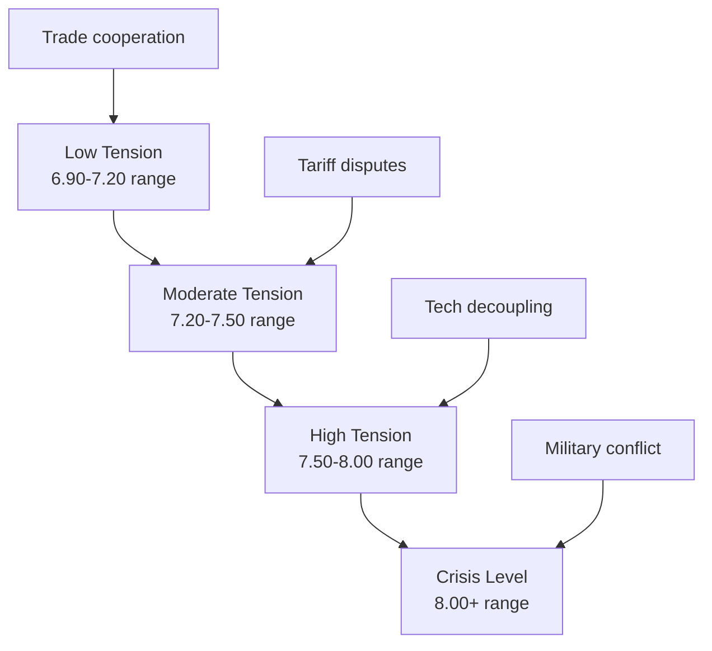

# Future Scenarios and Indicator Events Analysis (2025-2030)

## Executive Summary

This report analyzes potential future scenarios for the CNY-USD exchange rate through 2030, identifying key driver events and their likely impacts. The analysis considers geopolitical tensions, monetary policy divergence, economic structural changes, and China's strategic initiatives including RMB internationalization and digital currency deployment.

## Methodology

The scenario analysis is based on:
- Current economic fundamentals and policy trajectories
- Historical precedents and pattern analysis  
- Geopolitical risk assessments
- Expert forecasts from central banks and financial institutions
- Market-based forward indicators

## Base Case Scenario: Managed Stability (Probability: 50%)

### Scenario Overview
CNY-USD trading range: 6.90 - 7.40 through 2030  
Characterized by continued PBOC active management with gradual RMB appreciation

### Key Assumptions
- Moderate US-China trade tensions without escalation
- Fed normalizes policy with gradual rate adjustments
- China implements steady stimulus supporting 4-5% growth
- No major geopolitical shocks

### Indicator Events
**Positive Signals**:
- US-China trade talks resume constructively
- Fed cuts rates by 100bps+ in 2025 as forecasted by [Michigan Journal of Economics](https://sites.lsa.umich.edu/mje/2025/01/08/whats-the-impact-of-the-fed-interest-rate-cut-on-the-chinese-investment-market/)
- China's stimulus measures exceed 1 trillion yuan as announced by [PBOC Governor Pan Gongsheng](https://www.cnbc.com/2025/05/07/china-to-cut-key-lending-rates-by-10-points-bank-reserve-requirement-ratio-by-50-points-.html)

**Warning Signals**:
- US-China yield spread widens beyond 3.5 percentage points
- China's property sector crisis deepens without resolution
- Capital outflows from China exceed $200 billion annually

### Timeline Projections
- **2025**: CNY strengthens to 7.10-7.20 as Fed rate cuts narrow yield differentials
- **2026-2027**: Range trading 7.00-7.30 with PBOC intervention limiting volatility
- **2028-2030**: Gradual appreciation toward 6.90 as China's economy stabilizes

## Scenario 2: Trade War Escalation (Probability: 25%)

### Scenario Overview
CNY-USD range: 7.50 - 8.50 through 2030  
Significant yuan weakness due to renewed US-China trade conflict

### Key Drivers
According to [Peterson Institute analysis](https://www.piie.com/blogs/realtime-economics/2025/trumps-trade-war-timeline-20-date-guide), the current trade war timeline shows escalating tensions with US tariffs on Chinese goods at 57.6% and Chinese retaliatory tariffs at 32.6%.

### Trigger Events
**Escalation Indicators**:
- Tariff ceasefire expires August 12, 2025 without renewal
- US implements universal tariffs on Chinese goods above current levels
- China designation as "currency manipulator" returns
- Technology sector decoupling accelerates beyond semiconductors

**Economic Impact**: [CEPR research](https://cepr.org/voxeu/columns/roaring-tariffs-global-impact-2025-us-trade-war) indicates welfare declines of 2% in the US and 1.5% in China under full trade war scenarios.

### Timeline Projections
- **2025**: Yuan breaks 7.50 if trade talks fail and tariffs reimposed
- **2026**: Potential test of 8.00 level amid capital flight
- **2027-2030**: Range 7.50-8.50 with periodic PBOC intervention

### Market Response Patterns
Following historical precedent from 2018-2019 trade war, expect:
- 10-15% yuan depreciation in first 12 months
- Increased volatility with policy uncertainty
- Potential circuit breaker interventions by PBOC

## Scenario 3: RMB Internationalization Breakthrough (Probability: 15%)

### Scenario Overview  
CNY-USD range: 6.00 - 6.80 through 2030
Significant yuan strength driven by reserve currency adoption

### Strategic Context
According to [Georgetown Journal analysis](https://gjia.georgetown.edu/2024/04/18/de-dollarization-the-belt-and-road-initiative-and-the-future-of-the-chinese-yuan/), RMB internationalization is "a strategic response to the geopolitical and economic risks of a dollar-centric order."

### Progress Indicators
**Current Status**: [Bank of China reports](https://pic.bankofchina.com/bocappd/rareport/202506/P020250606660020317918.pdf) that over 52.9% of China's cross-border payments are settled in RMB via CIPS, surpassing the USD's 42.8%.

**Digital Yuan Adoption**: By 2025, the e-CNY has [cumulative transactions exceeding $7.3 trillion](https://www.geopoliticalmonitor.com/cbdc-with-chinese-characteristics-political-economy-of-the-e-yuan/) with over 260 million users.

### Breakthrough Events
**Acceleration Indicators**:
- Major oil exporters (Saudi Arabia, UAE) accept RMB for petroleum transactions
- BRICS+ nations adopt RMB for 30%+ of bilateral trade
- Digital yuan integration with major international payment systems
- IMF increases RMB weight in Special Drawing Rights above 15%

**Structural Changes**:
- China opens capital account for qualified institutional investors
- RMB bond market accessibility increases significantly
- Major central banks add RMB reserves beyond current 3% average

### Timeline Projections
- **2025-2026**: Gradual appreciation to 6.80 as adoption accelerates
- **2027-2028**: Test of 6.50 level with increased global usage
- **2029-2030**: Potential approach to 6.00 parity as reserve currency status solidifies

## Scenario 4: Global Financial Crisis 2.0 (Probability: 10%)

### Scenario Overview
CNY-USD range: 6.50 - 7.80 with extreme volatility
Crisis-driven flight to safety initially favoring USD, followed by coordinated policy response

### Crisis Triggers
**Potential Catalysts**:
- Global debt crisis triggered by rising interest rates
- Major financial institution failures in developed markets
- Geopolitical shock (Taiwan Strait, Middle East conflict escalation)
- Climate-related economic disruption

### Historical Pattern Analysis
Based on 2008 financial crisis response:
- Initial USD strength as safe-haven demand surges
- PBOC re-pegs yuan to provide stability (precedent: 6.83 level in 2008-2010)
- Coordinated global monetary easing benefits yuan over time

### Policy Response Expectations
**China's Likely Actions**:
- Temporary exchange rate stabilization
- Massive fiscal and monetary stimulus (potentially 5-10 trillion yuan)
- Capital controls to prevent excessive outflows
- International cooperation through swap lines

### Timeline Projections
- **Crisis Phase (6 months)**: Yuan weakens to 7.50-7.80 amid capital flight
- **Stabilization (12 months)**: PBOC intervention maintains 7.20-7.50 range
- **Recovery (24+ months)**: Gradual appreciation as Chinese stimulus takes effect

## Cross-Scenario Analysis

### Common Critical Indicators
1. **US-China Yield Differential**: Spreads above 3.5% historically pressure yuan
2. **Capital Flow Direction**: Monthly outflows >$50 billion indicate stress
3. **PBOC Intervention Frequency**: Daily fixing variations >0.5% signal policy shifts
4. **Trade Balance Trends**: Monthly deficit would mark fundamental shift

### Policy Tool Effectiveness
**PBOC Management Capacity**:
- Foreign reserves of $3.2+ trillion provide substantial intervention capacity
- Capital controls remain effective deterrent to speculation
- Digital yuan infrastructure enhances monetary policy transmission

### Geopolitical Risk Matrix

## Investment and Policy Implications

### For Policymakers
**PBOC Priorities**:
- Maintain 7.00-7.50 target range through active management
- Develop digital yuan cross-border functionality
- Strengthen bilateral currency swap agreements
- Build foreign exchange reserves above $3.5 trillion

**Fed Coordination**:
- Monitor CNY impact of rate decisions
- Maintain financial stability cooperation channels
- Coordinate crisis response mechanisms

### For Market Participants
**Hedging Strategies**:
- Base case requires modest hedging for 7.00-7.40 range
- Trade war scenario demands significant downside protection
- RMB internationalization offers appreciation opportunity
- Crisis scenario requires maximum flexibility

### Key Monitoring Indicators by Scenario

| Scenario | Leading Indicators | Confirmation Signals |
|----------|-------------------|---------------------|
| Base Case | Fed cuts 100bps+, China stimulus 1T yuan | CNY strengthens below 7.20 |
| Trade War | Tariff reimposition Aug 12, 2025 | CNY breaks 7.50 level |
| RMB International | Oil trade in RMB, BRICS adoption | CNY approaches 6.50 |
| Crisis | Global market stress, credit spreads widen | Extreme volatility, policy coordination |

## Conclusion

The CNY-USD exchange rate through 2030 will be primarily determined by US-China relations, monetary policy coordination, and China's success in internationalizing the RMB. The base case of managed stability remains most likely, but significant tail risks exist in both directions. Market participants should monitor the identified indicator events for early signals of scenario transitions.

## References

- [Michigan Journal of Economics: Fed Interest Rate Cut Impact](https://sites.lsa.umich.edu/mje/2025/01/08/whats-the-impact-of-the-fed-interest-rate-cut-on-the-chinese-investment-market/)
- [CNBC: China Stimulus Measures](https://www.cnbc.com/2025/05/07/china-to-cut-key-lending-rates-by-10-points-bank-reserve-requirement-ratio-by-50-points-.html)
- [Peterson Institute: Trump Trade War Timeline](https://www.piie.com/blogs/realtime-economics/2025/trumps-trade-war-timeline-20-date-guide)
- [CEPR: Global Impact of 2025 US Trade War](https://cepr.org/voxeu/columns/roaring-tariffs-global-impact-2025-us-trade-war)
- [Georgetown Journal: Future of the Chinese Yuan](https://gjia.georgetown.edu/2024/04/18/de-dollarization-the-belt-and-road-initiative-and-the-future-of-the-chinese-yuan/)
- [Bank of China: RMB Internationalization Report](https://pic.bankofchina.com/bocappd/rareport/202506/P020250606660020317918.pdf)
- [Federal Reserve: Internationalization of Chinese Renminbi](https://www.federalreserve.gov/econres/notes/feds-notes/internationalization-of-the-chinese-renminbi-progress-and-outlook-20240830.html)
- [Geopolitical Monitor: CBDC with Chinese Characteristics](https://www.geopoliticalmonitor.com/cbdc-with-chinese-characteristics-political-economy-of-the-e-yuan/)