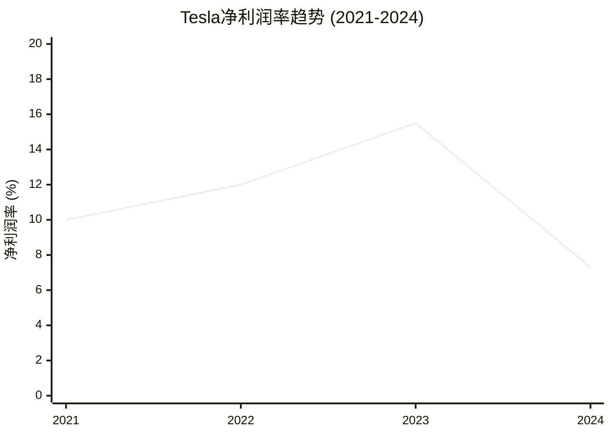
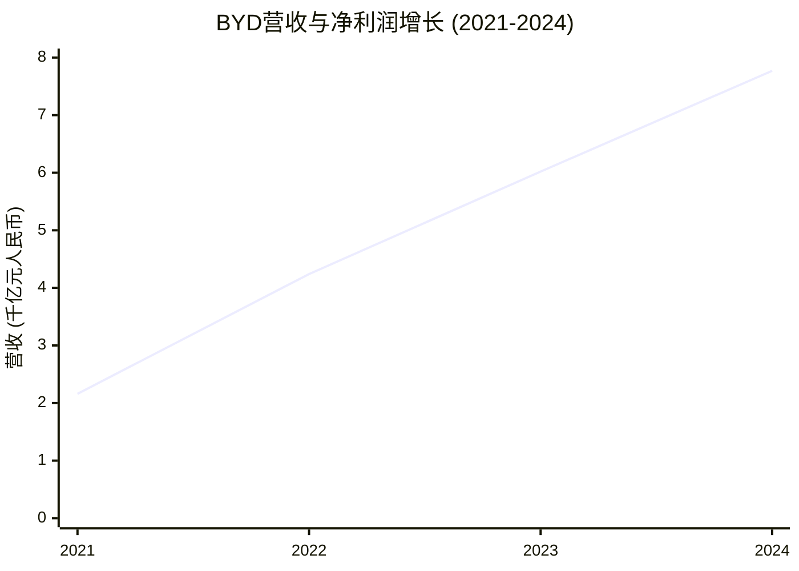
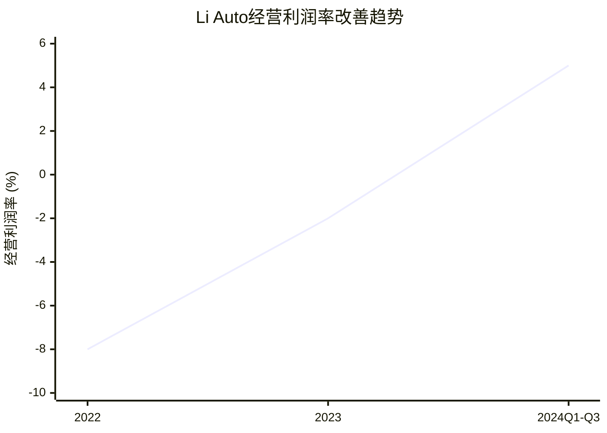
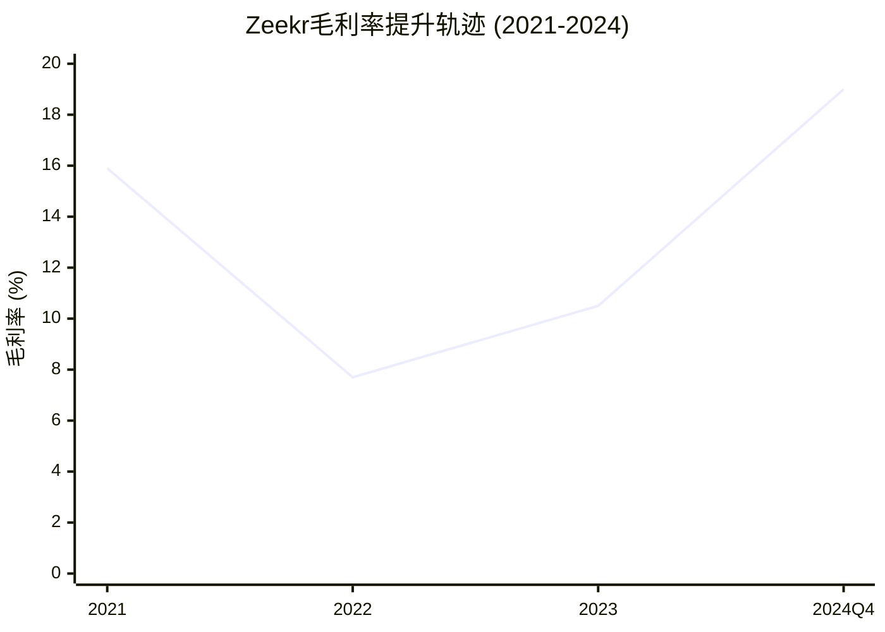
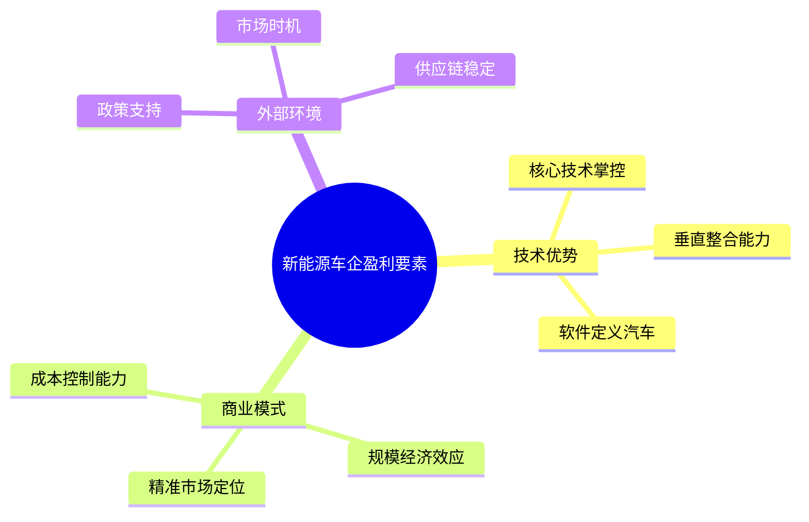

# 新能源车企净利润率盈利分析报告

## 执行摘要

本研究基于**净利润率**（Net Profit Margin）指标，对全球主要新能源汽车制造商2021-2024年的财务表现进行了深入分析。净利润率定义为净利润除以营业收入，净利润是扣除所有费用和所得税后的"底线"利润。

### 核心发现

通过对16家高电动车市场份额的乘用车OEMs的财务数据分析，我们将这些企业划分为三个类别：

1. **一直保持正净利润率企业（3家）**：Tesla、BYD、GAC Aion
2. **有扭亏为盈趋势企业（4家）**：Li Auto、Zeekr、General Motors EV业务、Stellantis电动车业务  
3. **持续亏损企业（4家）**：NIO、Xpeng、Ford电动车业务、Volkswagen电动车业务

### 关键洞察

- **双寡头主导格局**：Tesla和BYD合计占全球电动车市场约35%份额，并实现持续盈利
- **中国品牌分化明显**：从BYD的稳定盈利到NIO的持续亏损，显示不同商业模式的效果差异
- **传统车企转型困难**：Ford等传统车企在电动化转型中面临巨大亏损压力
- **扭亏为盈关键要素**：技术差异化、精准市场定位、成本控制和规模效应

## 研究背景与方法

### 净利润率定义

根据研究要求，本分析严格采用**净利润率**（Net Profit Margin）指标：
- **计算公式**：净利润率 = 净利润 ÷ 营业收入
- **净利润定义**：扣除所有费用和所得税后的利润，即损益表的"底线"
- **会计准则对照**：美国GAAP下称为Net Income，IFRS/HKFRS下称为Profit for the year，中国GAAP下称为净利润

### 研究对象筛选

选择标准为**乘用车OEMs中电动车销量占比较高的企业**，包括：
- 全球电动车销量领导者（Tesla、BYD）
- 中国新能源汽车新势力（NIO、Xpeng、Li Auto、Zeekr）
- 传统车企电动化业务（Ford、GM、Stellantis、Volkswagen）
- 其他高电动车份额品牌（GAC Aion等）

## 第一类：一直保持正的净利润率企业

### Tesla (特斯拉) - 全球电动车技术领导者

**财务表现**：
- 2024年净利润率：7.3%（净利润70亿美元，营收976亿美元）
- 2023年净利润率：15.5%（含一次性税收优惠影响）
- 持续四年盈利，展现了电动车行业的盈利标杆

**盈利关键因素**：
1. **技术溢价优势**：FSD自动驾驶、4680电池等核心技术支撑高定价
2. **垂直整合模式**：自研电池、芯片等关键组件，控制成本和供应链
3. **软件收入模式**：FSD软件、OTA升级等高毛利服务收入
4. **全球规模效应**：年销量超180万辆，摊薄研发和固定成本
5. **监管积分收入**：向传统车企出售碳积分获得额外收入

*数据来源*：[Tesla Full Year 2024 Analysis](https://medium.com/@nambos3rd/tesla-full-year-2024-analysis-a-review-of-actual-performance-my-financial-forecast-41ee70091b5a)

### BYD (比亚迪) - 中国新能源汽车领军企业

**财务表现**：
- 2024年净利润率：5.2%（净利润402.5亿元，营收7771亿元）
- 营收四年复合增长率达58%，净利润率稳步提升
- 超越Tesla成为全球最大电动车制造商

**盈利关键因素**：
1. **刀片电池技术**：安全性和成本优势显著，磷酸铁锂路线成为主流
2. **全产业链控制**：从电池、电机到半导体的完整垂直整合
3. **成本控制优势**：中国制造成本优势与精益化生产管理
4. **产品矩阵完整**：从经济型到豪华型全覆盖，满足不同市场需求
5. **规模效应显著**：2024年销量超300万辆，规模经济充分显现

*数据来源*：[BYD 2024年财务报告](https://bydukmedia.com/en/news-articles/byd-reports-its-financial-results-in-2024-revenue-hits-777.1-billion-yuan,-up-23-year-on-year.html)

### GAC Aion (广汽埃安) - 稳定盈利的传统车企电动品牌

**财务表现**：
- 维持持续盈利状态，全球电动车市场份额5.2%
- 依托广汽集团资源优势，实现稳定盈利模式

**盈利关键因素**：
1. **母公司协同**：共享广汽集团成熟制造体系和供应链资源
2. **精准市场定位**：专注中端消费者市场，避开过度竞争领域
3. **技术平台共享**：与集团内其他品牌共摊研发成本

## 第二类：有扭亏为盈趋势企业

### Li Auto (理想汽车) - 增程式技术差异化成功案例

**财务表现**：
- 2024年Q1-Q3：实现经营性盈利，经营利润率约5%
- 毛利率从2023年4.1%大幅提升至2024年22%
- 2024年9月交付量达53,709辆创历史记录

**扭亏为盈原因**：
1. **技术路线差异化**：增程式技术解决里程焦虑，避开纯电竞争红海
2. **市场定位聚焦**：专注家庭用户大型SUV细分市场
3. **成本控制改善**：单车毛利率显著提升，规模效应开始显现
4. **产品迭代高效**：理想L系列产品获得市场认可

*数据来源*：[中美电动车企利润率对比](https://stockdividendscreener.com/auto-manufacturers/chinese-ev-makers-vs-tesla-in-margins-and-profitability/)

### Zeekr (极氪) - 高端化路径接近盈利

**财务表现**：
- 2024年Q4净亏损8.21亿元，同比减少72.1%
- 毛利率创纪录达到19.0%，显示盈利能力快速改善
- 在亏损企业中最接近盈利临界点

**扭亏为盈原因**：
1. **高端市场定位**：避开中低端价格战，单车价值更高  
2. **技术平台优势**：SEA浩瀚架构分摊研发成本
3. **成本控制改善**：单车亏损持续收窄
4. **交付量增长**：2024年9月交付量达21,333辆创纪录

*数据来源*：[Zeekr Q4财报分析](https://cnevpost.com/2025/03/20/zeekr-q4-2024-earnings/)

## 第三类：持续亏损企业

### NIO (蔚来汽车) - 重资产模式的盈利挑战

**财务表现**：
- 2024年Q1净亏损超过67亿元，经营利润率-53.3%
- 2023年净亏损约30亿美元，连续多年大幅亏损
- 毛利率仅5%，在主要电动车企中处于较低水平

**持续亏损原因**：
1. **重资产投资**：换电站网络建设需要巨额前期投入
2. **研发投入巨大**：自动驾驶、电池技术等前沿技术投入高昂
3. **销量规模不足**：相对高昂的固定成本，销量规模仍显不足
4. **市场竞争激烈**：高端电动车市场价格竞争日趋激烈

*数据来源*：[中国三大电动车企Q1财报](https://technode.com/2025/06/06/charts-nio-xpeng-and-li-auto-report-first-quarter-2025-earnings/)

### Xpeng (小鹏汽车) - 亏损收窄但仍未盈利

**财务表现**：
- 2024年Q4净亏损13.3亿元，但环比和同比均大幅收窄
- 经营利润率从-25.1%改善至-6.6%，显示明显改善趋势
- 营收同比增长141.5%，首次超越NIO

**持续亏损原因**：
1. **技术投入成本高**：激光雷达、自动驾驶等前沿技术成本高昂
2. **中端市场竞争激烈**：20-30万元价格区间竞争白热化
3. **规模效应不足**：虽然增长快速，但整体销量规模仍需提升

*数据来源*：[Xpeng财报分析](https://cnevpost.com/2025/03/18/xpeng-earnings-q4-2024/)

### Ford电动车业务 - 传统车企转型阵痛

**财务表现**：
- 2024年预计电动车业务亏损50亿美元
- Q1每售出一辆电动车亏损13.2万美元
- 连续多年大额亏损，转型成本高昂

**持续亏损原因**：
1. **转型成本巨大**：传统制造体系向电动化转型投资巨大
2. **产能利用率低**：电动车专用产线投资巨大但销量不足
3. **供应链重构成本**：电动车供应链体系建设需要大量投入
4. **技术积累不足**：在电池、软件等核心技术方面起步较晚

*数据来源*：[Ford电动车亏损报告](https://edition.cnn.com/2024/04/24/business/ford-earnings-ev-losses/index.html)

## 盈利模式深度分析

### 成功盈利的关键要素

**1. 垂直整合能力**
- Tesla和BYD均通过垂直整合掌控核心技术和成本
- 自产电池、芯片等关键组件，降低对供应商依赖
- 提高毛利率的同时保证供应链稳定性

**2. 规模经济效应**
- 年销量达到百万辆级别是实现盈利的重要门槛
- 规模效应能够有效摊薄研发和固定成本
- 全球化布局进一步扩大规模优势

**3. 技术差异化**
- 在某个细分技术领域形成独特竞争优势
- Li Auto的增程式技术、BYD的刀片电池都是成功案例
- 避开技术同质化的激烈竞争

### 持续亏损的风险因素

**1. 技术路线误判**
- 选择成本过高或市场接受度低的技术路线
- NIO的换电模式、Xpeng的激光雷达都面临成本压力
- 技术投入与商业化回报的时间错配

**2. 重资产投资风险**
- 前期投资巨大，回收周期长
- 固定成本高企，需要大规模销量摊薄
- 市场波动对重资产模式冲击更大

**3. 市场定位问题**
- 中端市场竞争激烈，价格战频繁
- 缺乏差异化竞争优势
- 消费者对品牌溢价接受度有限

## 行业发展趋势与展望

### 短期趋势（1-2年）

**价格战将持续深化**
- 中国电动车市场价格竞争将更加激烈
- 成本控制能力成为企业生存的关键
- 部分亏损企业可能面临退出风险

**规模化效应加速显现**
- 达到盈亏平衡点的企业将获得更大优势
- 头部企业与尾部企业差距将进一步拉大
- 行业整合速度可能加快

### 中期趋势（3-5年）

**智能化成为新战场**
- 软件定义汽车将带来新的盈利模式
- 自动驾驶、智能座舱等技术商业化加速
- 软件和服务收入占比将显著提升

**供应链格局重塑**
- 垂直整合与专业分工并存
- 核心技术和关键组件的自主可控更加重要
- 全球供应链的安全性和稳定性受到更多关注

### 长期展望（5年以上）

**商业模式创新**
- 从单一的整车销售向出行服务生态转变
- 能源生态（充电、储能、电网）价值凸显
- 数据和软件成为核心价值来源

**全球化竞争加剧**
- 中国品牌加速全球化布局
- 贸易政策和地缘政治影响加大
- 技术标准和供应链安全成为竞争焦点

## 结论与建议

### 主要结论

1. **双寡头格局稳固**：Tesla和BYD凭借技术优势和规模效应建立了稳固的盈利模式
2. **中国品牌分化显著**：从BYD的成功到NIO的困境，体现了不同战略选择的巨大差异
3. **传统车企转型困难**：Ford等传统巨头在电动化转型中面临结构性挑战
4. **扭亏为盈路径清晰**：技术差异化、精准定位、成本控制是关键成功要素

### 投资与决策启示

**对于投资者**：
- 关注具备垂直整合能力和规模优势的头部企业
- 警惕重资产模式下的现金流风险
- 重视技术差异化和商业模式创新的价值

**对于企业**：
- 明确技术路线选择，避免盲目追求前沿但成本高昂的技术
- 建立精准的市场定位，避开过度竞争的红海市场
- 加强成本控制和供应链管理，提高运营效率

**对于政策制定者**：
- 支持技术创新的同时，关注产业健康发展
- 避免过度补贴导致的市场扭曲
- 促进公平竞争，防范系统性风险

---

## 详细分析报告

如需了解更多详细信息，请参阅以下专题报告：

- [高电动车市场份额OEMs分析](./reports/task-1-high-ev-share-oems.md)
- [四年净利润率数据收集](./reports/task-2-net-profit-margin-data.md)  
- [企业盈利能力三类划分](./reports/task-3-profitability-categorization.md)
- [盈利及亏损原因深度分析](./reports/task-4-profitability-analysis.md)

---

## 数据来源与参考文献

1. [Global EV Outlook 2025 - IEA](https://www.iea.org/reports/global-ev-outlook-2025/trends-in-electric-car-markets-2)
2. [Tesla Full Year 2024 Analysis — Medium](https://medium.com/@nambos3rd/tesla-full-year-2024-analysis-a-review-of-actual-performance-my-financial-forecast-41ee70091b5a)
3. [BYD 2024年财务报告](https://bydukmedia.com/en/news-articles/byd-reports-its-financial-results-in-2024-revenue-hits-777.1-billion-yuan,-up-23-year-on-year.html)
4. [中国电动车企财报对比分析](https://technode.com/2025/06/06/charts-nio-xpeng-and-li-auto-report-first-quarter-2025-earnings/)
5. [Zeekr财务业绩报告](https://cnevpost.com/2025/03/20/zeekr-q4-2024-earnings/)
6. [Ford电动车业务亏损分析](https://edition.cnn.com/2024/04/24/business/ford-earnings-ev-losses/index.html)
7. [全球电动车市场份额统计](https://www.statista.com/chart/27733/battery-electric-vehicles-manufacturers/)

*最后更新时间：2025年9月12日*