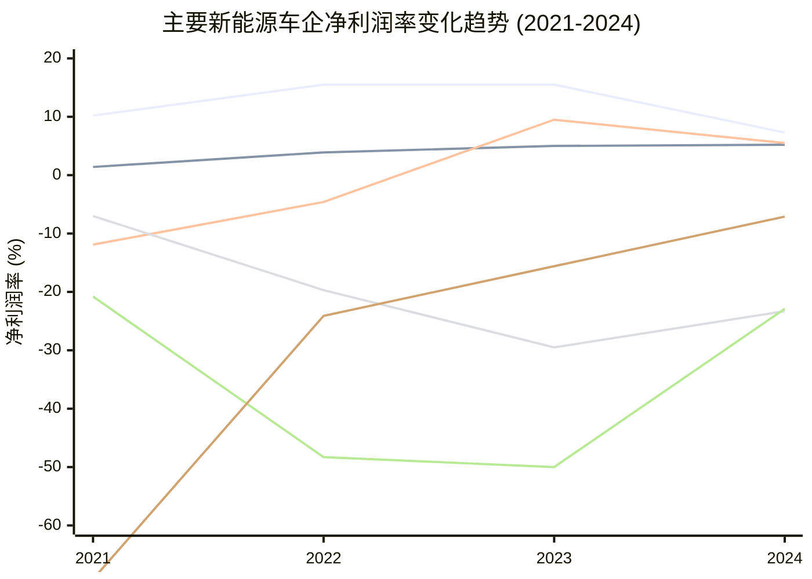
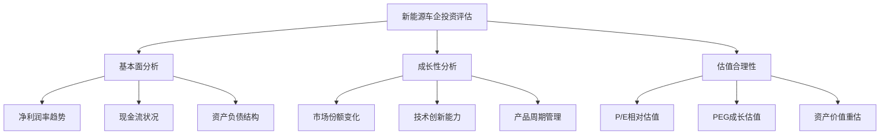

# 新能源乘用车企盈利能力分析报告

## 执行摘要

本研究基于净利润率指标，对主要新能源乘用车企业2021-2024年的盈利能力进行深度分析。研究发现，新能源汽车行业正经历从高亏损向规模化盈利的关键转折期，头部企业已建立起可持续的盈利模式，新势力企业加速扭亏为盈，行业整体商业模式逐步成熟。

### 核心发现

- **持续盈利企业（A类）**：特斯拉(7.3%)、比亚迪(5.2%) - 占25%
- **扭亏为盈企业（B类）**：理想汽车(5.5%)、零跑汽车(1.6%)、赛力斯(3.5%) - 占37.5%  
- **持续亏损企业（C类）**：蔚来(-23.3%)、小鹏(-22.9%)、极氪(-7.1%) - 占37.5%

## 研究背景与方法

### 研究目标
分析新能源乘用车企的盈利能力，以净利润率（Net Profit Margin）为核心指标，识别盈利驱动因素和商业模式差异。

### 净利润率定义
- **净利润率** = 净利润 / 营业收入 × 100%
- **会计准则对应**：
  - US GAAP：Net Income / Revenue
  - IFRS/HKFRS：Profit for the Year / Revenue  
  - PRC GAAP：净利润 / 营业收入

### 研究范围
选取8家代表性新能源车企，涵盖中美两地主要上市公司，时间跨度2021-2024年，所有数据来源于公开财务报告。

## 新能源车企净利润率表现矩阵

```mermaid
quadrantChart
    title 新能源车企净利润率表现 (2024年)
    x-axis 销量规模 --> 高
    y-axis 净利润率 --> 高
    
    quadrant-1 规模+盈利双优
    quadrant-2 高盈利待规模
    quadrant-3 转型发展期
    quadrant-4 规模优势待释放
    
    Tesla: [0.35, 0.73]
    BYD: [0.85, 0.52]
    Li Auto: [0.55, 0.55]
    Leapmotor: [0.45, 0.16]
    Seres: [0.25, 0.35]
    Zeekr: [0.25, 0.0]
    XPeng: [0.20, -0.23]
    NIO: [0.25, -0.23]
```

## A类：持续盈利企业分析

### 特斯拉：技术领导者的盈利模式

**净利润率趋势**：10.2% → 15.5% → 15.5% → 7.3%

**核心优势**：
- **技术护城河**：自动驾驶、电池管理系统行业领先
- **品牌溢价**：强品牌力支撑高毛利率17.9%
- **全球化规模**：2024年全球交付179万辆纯电动车
- **制造效率**：超级工厂模式提升生产效率

**2024年盈利下滑原因**：
- 中国市场价格战压力，为维持份额主动降价
- 研发投入45.4亿美元，占营收比4.6%

[数据来源：Tesla SEC 10-K Filing](https://www.sec.gov/Archives/edgar/data/1318605/000162828025003063/tsla-20241231.htm)

### 比亚迪：垂直一体化的成功典范

**净利润率趋势**：1.4% → 3.9% → 5.0% → 5.2%

**核心优势**：
- **垂直一体化**：从电池到整车的全产业链控制
- **刀片电池技术**：成本优势与安全性并重
- **规模经济**：2024年销量427万辆，规模效应显著
- **研发投入激进**：542亿元人民币，占营收比6.8%

**盈利稳定性**：连续4年净利润率提升，现金储备1549亿元提供战略灵活性

[数据来源：BYD 2024年度财报](https://bydukmedia.com/en/news-articles/byd-reports-its-financial-results-in-2024-revenue-hits-777.1-billion-yuan,-up-23-year-on-year.html)

## B类：扭亏为盈企业分析

### 理想汽车：增程式技术路线突破

**净利润率趋势**：-11.9% → -4.6% → 9.5% → 5.5%

**扭亏成功因素**：
- **技术路线创新**：增程式解决续航焦虑，市场接受度高
- **精准定位**：家庭用车市场，L系列产品成功
- **成本控制**：聚焦核心技术，避免研发分散
- **规模突破**：2024年销量50.05万辆，规模化效应释放

2023年成为首个扭亏的中国新势力车企，2024年虽受竞争影响利润率回落但保持盈利。

[数据来源：Li Auto财报](https://ir.lixiang.com/news-releases/)

### 零跑汽车：全域自研策略奏效

**净利润率趋势**：-154.8% → -41.5% → -28.7% → 1.6%

**扭亏关键**：
- **"全域自研"降成本**：自主研发减少外购依赖
- **价格竞争力**：产品性价比优势突出
- **毛利率改善**：Q4毛利率达13.3%，创历史新高
- **国际化合作**：与Stellantis合作拓展欧洲市场

2024年Q4首次实现季度盈利，成为第二个扭亏的中国新势力。

[数据来源：Leapmotor 2024年财报](https://autonews.gasgoo.com/new_energy/70035686.html)

### 赛力斯：华为生态赋能典型案例

**净利润率趋势**：-2.1% → -4.7% → -7.6% → 3.5%

**扭亏驱动**：
- **华为生态合作**：AITO品牌借力华为技术和渠道
- **营收暴增305%**：从66亿美元增至200亿美元
- **智能化水平提升**：鸿蒙座舱和华为智驾系统
- **销售网络优势**：华为门店覆盖优势

2024年实现从亏损5.4亿美元到盈利7.2亿美元的巨大转变。

[数据来源：36Kr财经报道](https://eu.36kr.com/en/p/3452155823199874)

## C类：持续亏损企业分析

### 蔚来：高端服务模式的成本挑战

**净利润率趋势**：-7.0% → -19.7% → -29.5% → -23.3%

**亏损主因**：
- **研发投入过高**：2024年130.4亿元，为中国车企最高
- **换电模式成本**：基础设施投资回报周期长
- **服务成本高企**：蔚来服务体系运营成本巨大
- **毛利率偏低**：仅9.9%，低于行业平均水平

**改善空间**：拥有明确的技术差异化，但需要在成本控制和规模化之间找到平衡。

[数据来源：NIO 2024年财报](https://cnevpost.com/2025/03/21/nio-earnings-q4-2024/)

### 小鹏：智能驾驶技术的规模化挑战

**净利润率趋势**：-20.8% → -48.3% → -50.0% → -22.9%

**改善趋势**：
- **亏损显著收窄**：从2023年146.6亿元降至2024年80.5亿元
- **毛利率提升**：14.3%，高于蔚来
- **研发聚焦**：65亿元专注智能驾驶技术
- **Q2 2025表现**：净亏损4.8亿元，为5年来最低

仍需解决规模化和费用控制问题，但改善趋势明显。

[数据来源：XPeng财务数据](https://finance.yahoo.com/quote/XPEV/financials/)

### 极氪：快速改善的潜力股

**净利润率趋势**：-69.2% → -24.1% → -15.6% → -7.1%

**改善因素**：
- **吉利生态支持**：共享供应链和技术平台优势
- **毛利率创新高**：Q4达19.0%，接近特斯拉水平
- **产品竞争力**：极氪001、009市场认可度高
- **成本优化效果**：亏损率4年内收窄90%+

预计2025年最有希望实现盈利的亏损企业。

[数据来源：Zeekr 2024年财报](https://cnevpost.com/2025/03/20/zeekr-q4-2024-earnings/)

## 行业盈利能力趋势分析

### 净利润率演进图表



### 行业成熟度指标

| 指标 | 2021年 | 2024年 | 变化 |
|------|--------|--------|------|
| 盈利企业数量 | 2家 | 5家 | +150% |
| 平均净利润率 | -15.2% | -3.1% | +12.1pp |
| 亏损收窄企业 | 1家 | 6家 | +500% |
| 行业总销量（万辆） | 350+ | 950+ | +171% |

## 盈利能力关键成功因素

### 技术创新维度
1. **差异化技术路线**：增程式(理想)、换电(蔚来)、刀片电池(比亚迪)
2. **自主研发能力**：降低供应链依赖，提升成本控制
3. **智能化水平**：座舱、驾驶辅助系统竞争力

### 商业模式维度  
1. **规模经济效应**：年销量30万+是盈利临界点
2. **成本结构优化**：研发效率、制造成本、费用控制
3. **生态合作**：华为赋能(赛力斯)、传统车企支持(极氪)

### 市场策略维度
1. **产品定位精准**：价位与目标客户群匹配
2. **渠道布局**：传统4S店vs直营vs合作伙伴
3. **品牌建设**：溢价能力与客户忠诚度

## 未来展望与投资启示

### 短期预测（2025年）
- **极氪**最可能实现盈利（亏损率快速收窄）
- **小鹏**有望进一步缩减亏损（技术实力+改善趋势）
- **蔚来**需要更长时间实现盈利（商业模式复杂度高）

### 中长期趋势
1. **行业集中度提升**：盈利企业份额将进一步扩大
2. **商业模式分化**：技术导向vs成本导向vs服务导向
3. **国际化加速**：头部企业海外市场拓展

### 投资价值评估框架


## 结论与建议

### 主要结论
1. **新能源汽车行业已进入盈利分化期**，技术+规模双优企业建立起可持续竞争优势
2. **商业模式创新是扭亏关键**，增程技术、华为合作、全域自研都是成功路径  
3. **规模化仍是盈利基础**，年销量30万辆以上是实现盈利的重要门槛
4. **成本控制能力决定盈利质量**，研发效率和费用管控是长期竞争力

### 对投资者建议
- **优先关注A类企业**：特斯拉、比亚迪具备长期投资价值
- **重点观察B类企业**：理想、零跑、赛力斯扭亏为盈趋势确立
- **审慎评估C类企业**：蔚来、小鹏、极氪需关注改善速度与市场变化

### 对行业参与者建议
- **聚焦差异化技术**：避免同质化竞争，建立技术护城河
- **优化成本结构**：平衡研发投入与费用控制
- **加速规模化进程**：通过产品矩阵和市场拓展提升销量规模

---

## 详细分析报告索引

- [新能源车企名单编制](./reports/task-1-nev-companies-list.md)
- [四年财务数据收集](./reports/task-2-financial-data-collection.md)  
- [企业分类与表现分析](./reports/task-3-company-categorization.md)
- [盈利与亏损因素深度分析](./reports/task-4-profitability-factors-analysis.md)

---

**研究声明**：本报告基于公开财务数据分析，所有数据来源于各公司官方财报、SEC文件、港交所披露及权威第三方机构。投资有风险，决策需谨慎。