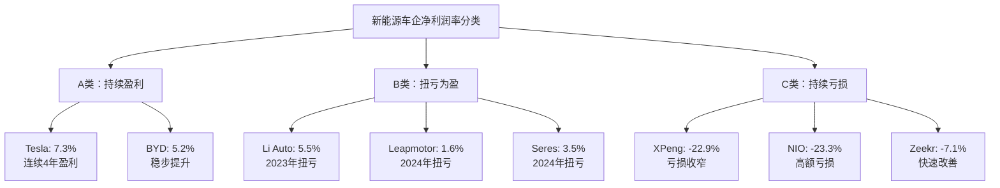

# 新能源车企净利润率表现分类分析

## 分类标准

根据2021-2024年净利润率表现，将新能源车企分为三类：

- **A类**：持续保持正的净利润率
- **B类**：呈现扭亏为盈趋势  
- **C类**：持续亏损

## A类：持续盈利企业 (2家)

### 1. 特斯拉 (Tesla)
**净利润率趋势：** 10.2% → 15.5% → 15.5%* → 7.3%
- **特点**：2021-2023年持续高盈利，2024年受价格战影响回落
- **盈利稳定性**：★★★★☆

### 2. 比亚迪 (BYD)
**净利润率趋势：** 1.4% → 3.9% → 5.0% → 5.2%
- **特点**：净利润率持续稳步上升，盈利质量不断提升
- **盈利稳定性**：★★★★★

## B类：扭亏为盈企业 (3家)

### 1. 理想汽车 (Li Auto)
**净利润率趋势：** -11.9% → -4.6% → 9.5% → 5.5%
- **扭亏时点**：2023年首次实现年度盈利
- **盈利质量**：2024年虽有回落但保持正利润

### 2. 零跑汽车 (Leapmotor) 
**净利润率趋势：** -154.8% → -41.5% → -28.7% → 1.6%*
- **扭亏时点**：2024年Q4首次季度盈利
- **盈利质量**：刚实现扭亏，盈利稳定性待观察

### 3. 赛力斯 (Seres)
**净利润率趋势：** -2.1% → -4.7% → -7.6% → 3.5%
- **扭亏时点**：2024年成功扭亏
- **盈利质量**：受益于华为合作，业绩大幅改善

## C类：持续亏损企业 (3家)

### 1. 小鹏汽车 (XPeng)
**净利润率趋势：** -20.8% → -48.3% → -50.0% → -22.9%
- **亏损特点**：2022-2023年亏损率恶化，2024年有所改善
- **趋势分析**：亏损收窄但距离盈利仍有距离

### 2. 蔚来汽车 (NIO)
**净利润率趋势：** -7.0% → -19.7% → -29.5% → -23.3%
- **亏损特点**：持续高额亏损，2024年略有改善
- **趋势分析**：亏损绝对值依然很大

### 3. 极氪 (Zeekr)
**净利润率趋势：** -69.2% → -24.1% → -15.6% → -7.1%
- **亏损特点**：亏损率持续收窄，改善趋势明显
- **趋势分析**：最有希望近期实现盈利的亏损企业

## 盈利能力表现可视化

## 分类统计分析

### 盈利分布
- **持续盈利**：2家 (25%)
- **扭亏为盈**：3家 (37.5%)
- **持续亏损**：3家 (37.5%)

### 2024年净利润率区间分布
- **高盈利 (>5%)**：Tesla (7.3%), BYD (5.2%), Li Auto (5.5%)
- **微盈利 (0-5%)**：Leapmotor (1.6%), Seres (3.5%)
- **改善中亏损 (-10% ~ 0%)**：Zeekr (-7.1%)
- **大额亏损 (< -20%)**：XPeng (-22.9%), NIO (-23.3%)

## 行业盈利能力趋势

### 整体趋势特征
1. **两极分化明显**：头部企业(Tesla、BYD)与新势力企业盈利能力差距显著
2. **扭亏为盈加速**：2024年有3家企业实现或接近盈利，显示行业成熟度提升
3. **亏损收窄普遍**：即使持续亏损的企业，亏损幅度也在显著改善

### 行业成熟度指标
- **盈利企业数量增加**：从2021年2家增至2024年5家
- **平均净利润率提升**：行业整体朝正向发展
- **商业模式验证**：不同路径（纯电、增程、换电）都有成功案例

## 预测分析

基于当前趋势，预计2025年：
- **Zeekr**最可能实现盈利（亏损率快速收窄）
- **XPeng**有望实现扭亏（技术实力较强）
- **NIO**仍需时间（商业模式复杂，成本较高）

这种分类为理解不同企业的商业模式成熟度和竞争力提供了清晰的框架。