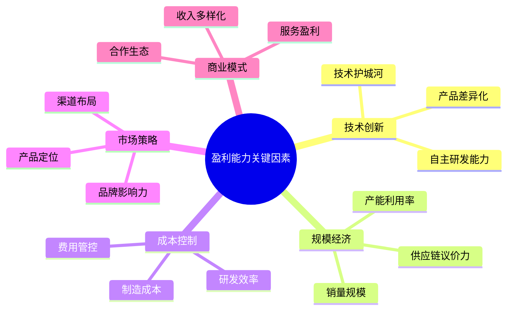

# 新能源车企盈利与亏损因素深度分析

## A类企业：持续盈利因素分析

### 1. 特斯拉 (Tesla) - 盈利驱动因素

#### 核心竞争优势
- **技术领先地位**：在自动驾驶、电池技术方面保持行业领先
- **品牌溢价能力**：强品牌力支持相对较高的售价
- **全球规模化**：2024年全球交付179万辆纯电动车
- [来源：Tesla 2024年财报分析](https://medium.com/@nambos3rd/tesla-full-year-2024-analysis-a-review-of-actual-performance-my-financial-forecast-41ee70091b5a)

#### 成本结构优势
- **制造效率**：在德州、柏林等超级工厂提高生产效率
- **研发投入适度**：2024年研发支出45.4亿美元，研发占营收比4.6%
- **毛利率稳定**：2024年毛利率保持17.9%
- [来源：Tesla与BYD研发对比分析](https://stockdividendscreener.com/auto-manufacturers/byd/tesla-vs-byd-research-and-development/)

#### 2024年盈利能力下降原因
- **价格战压力**：为应对竞争主动降价，影响利润率
- **中国市场竞争加剧**：BYD等本土品牌冲击Tesla在华份额

### 2. 比亚迪 (BYD) - 盈利驱动因素

#### 垂直一体化优势
- **电池技术自主**：刀片电池技术领先，成本控制能力强
- **供应链整合**：从电池到整车全产业链布局
- **规模经济效应**：2024年销量427万辆，规模优势显著
- [来源：BYD战略分析报告](https://www.automotivemanufacturingsolutions.com/electrification/from-battery-maker-to-ev-leader-byds-strategic-rise/46813.article)

#### 成本结构优势
- **研发投资激进**：2024年研发投入542亿元人民币（73亿美元），占营收比6.8%
- **制造成本优势**：中国制造成本低，政府政策支持
- **产品线丰富**：纯电+插混双重布局，市场适应性强
- [来源：BYD 2024年财报](https://bydukmedia.com/en/news-articles/byd-reports-its-financial-results-in-2024-revenue-hits-777.1-billion-yuan,-up-23-year-on-year.html)

#### 盈利能力持续提升原因
- **技术护城河**：超级快充技术5分钟充电400公里续航
- **全球化布局**：泰国工厂等海外产能逐步释放
- **现金流强劲**：2024年经营现金流1335亿元人民币

## B类企业：扭亏为盈因素分析

### 1. 理想汽车 (Li Auto) - 扭亏成功因素

#### 商业模式创新
- **增程式技术路线**：避开纯电动充电焦虑，市场接受度高
- **家庭用车定位**：准确把握目标客户需求
- **产品迭代能力**：L系列产品更新换代成功
- [来源：Li Auto投资者关系资料](https://ir.lixiang.com/news-releases/)

#### 成本控制能力
- **研发聚焦**：专注增程和智能驾驶技术，避免分散投入
- **供应链优化**：与宁德时代等核心供应商战略合作
- **制造效率提升**：常州工厂产能利用率提高

#### 2024年利润率下滑原因
- **竞争加剧**：华为、问界等竞品冲击
- **新车型投入**：L6等新产品研发和市场投入增加

### 2. 零跑汽车 (Leapmotor) - 扭亏关键因素

#### 成本策略成功
- **"全域自研"策略**：自主研发降低外购成本
- **价格竞争力**：产品性价比优势明显
- **规模化效应**：2024年销量28.5万辆，单车成本下降
- [来源：Leapmotor 2024年财报](https://autonews.gasgoo.com/new_energy/70035686.html)

#### 2024年扭亏成功
- **毛利率改善**：Q4毛利率达13.3%，创历史新高
- **费用控制**：销售和管理费用率下降
- **海外合作**：与Stellantis合作开拓欧洲市场

### 3. 赛力斯 (Seres) - 华为合作效应

#### 战略合作优势
- **华为生态赋能**：AITO品牌借力华为渠道和技术
- **智能化水平**：华为鸿蒙座舱和智驾系统提升竞争力
- **营销网络**：华为门店销售网络优势
- [来源：Seres 2024年业绩报告](https://eu.36kr.com/en/p/3452155823199874)

#### 2024年业绩大幅改善
- **营收暴增305%**：从66亿美元增至200亿美元
- **扭亏为盈**：净利润7.2亿美元，对比2023年亏损5.4亿美元

## C类企业：持续亏损原因分析

### 1. 蔚来汽车 (NIO) - 亏损主因

#### 成本结构问题
- **研发投入过高**：2024年研发支出130.4亿元，为中国车企最高
- **运营成本高企**：换电站建设和维护成本巨大
- **销售费用高**：SG&A费用增长显著
- [来源：NIO财务数据分析](https://cnevpost.com/2025/03/21/nio-earnings-q4-2024/)

#### 商业模式挑战
- **换电模式成本**：基础设施投资回报周期长
- **服务成本高**：蔚来服务(NIO Service)成本居高不下
- **毛利率偏低**：2024年毛利率仅9.9%，低于行业平均

#### 市场定位问题
- **高端定位**：价格区间与市场需求匹配度待提升
- **竞争激烈**：理想、问界等品牌冲击高端市场

### 2. 小鹏汽车 (XPeng) - 亏损收窄分析

#### 改善趋势明显
- **毛利率提升**：2024年毛利率14.3%，高于蔚来的9.9%
- **亏损收窄**：净损失从2023年的146.6亿元降至2024年的80.5亿元
- **研发效率**：2024年研发投入65亿元，专注智能驾驶
- [来源：XPeng财务表现分析](https://eu.36kr.com/en/p/3430905757322884)

#### 仍需解决的问题
- **销量规模**：规模化效应尚未完全释放
- **SG&A费用**：销售和管理费用仍在增长
- **市场竞争**：价格战压力持续

### 3. 极氪 (Zeekr) - 快速改善路径

#### 改善因素
- **吉利生态支持**：共享供应链和技术平台
- **产品力提升**：极氪001、009等产品市场认可度高
- **成本优化**：共享制造资源，降低单车成本
- [来源：Zeekr 2024年财报](https://cnevpost.com/2025/03/20/zeekr-q4-2024-earnings/)

#### 盈利前景
- **毛利率创新高**：Q4毛利率达19.0%
- **亏损快速收窄**：净利润率从2021年-69.2%改善至2024年-7.1%
- **规模化潜力**：预计2025年有望实现盈利

## 盈利能力关键因素总结

## 结论

新能源车企盈利能力主要取决于：
1. **规模效应**：达到盈亏平衡点的最小销量规模
2. **技术壁垒**：差异化技术带来的成本优势或产品溢价
3. **成本结构**：研发、制造、销售费用的合理控制
4. **市场定位**：产品价位与目标市场的匹配度
5. **商业模式**：可持续的盈利模式设计

持续盈利企业(Tesla、BYD)已建立起技术+规模的双重壁垒；扭亏为盈企业通过商业模式创新或战略合作实现突破；持续亏损企业正通过成本优化和规模化追求盈利目标。