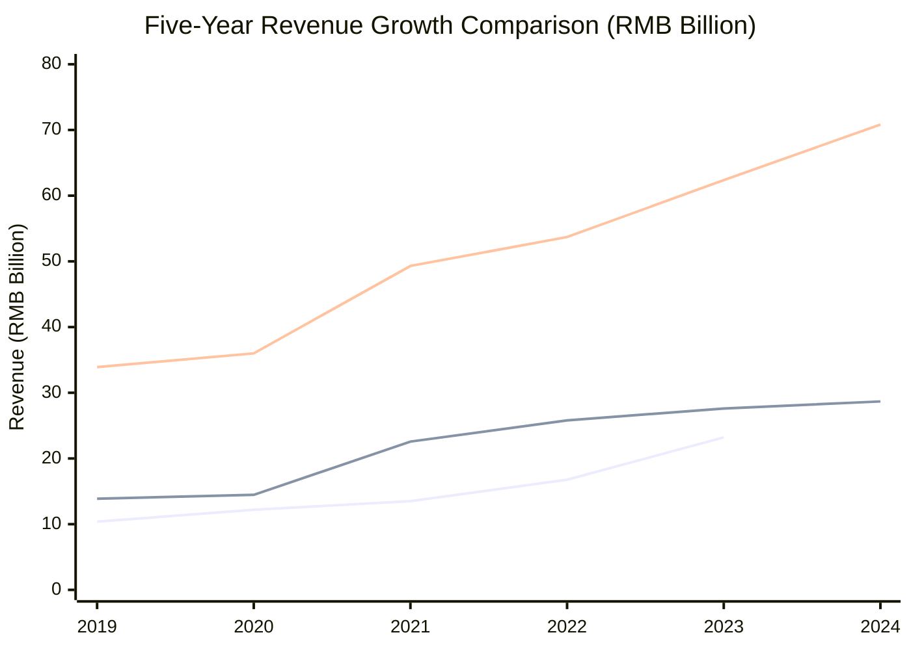
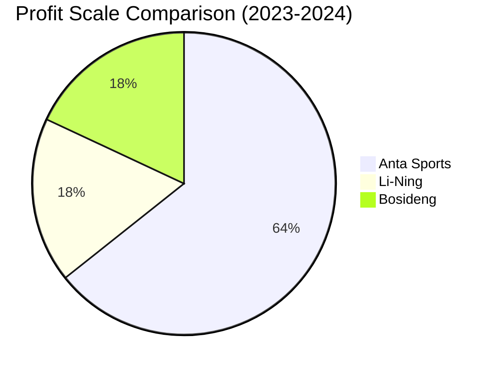
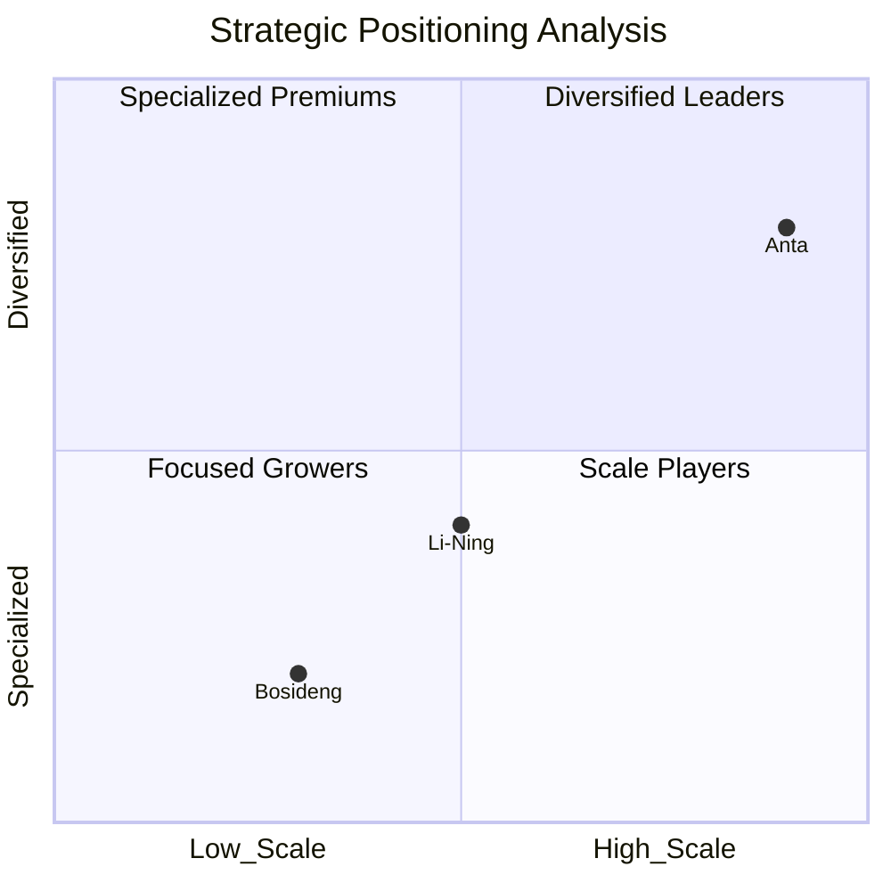
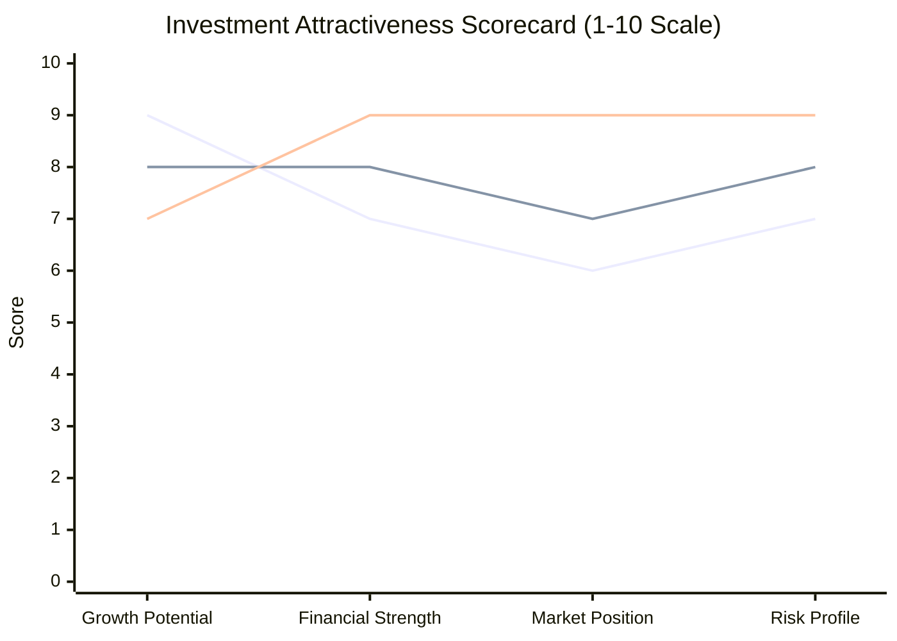

# 中国三大服装品牌近五年财报分析研究 
## Financial Analysis of China's Three Major Apparel Brands (2019-2024): Bosideng, Li-Ning, and Anta

## Executive Summary

This comprehensive research analyzes the financial performance of three leading Chinese apparel and sportswear companies from 2019 to 2024: Bosideng (波司登), Li-Ning (李宁), and Anta Sports (安踏). The analysis reveals distinct growth trajectories, strategic positioning, and investment characteristics across these market leaders.

### Key Findings

**Market Leadership:** Anta Sports dominates with RMB 70.83 billion revenue (2024), followed by Li-Ning at RMB 28.68 billion and Bosideng at RMB 23.21 billion.

**Growth Champion:** Bosideng achieved the highest compound annual growth rate at 22.4% (2019-2024), transforming from a traditional winter apparel company into a premium lifestyle brand.

**Profitability Leader:** Anta Sports demonstrates superior profitability with over RMB 10 billion net profit (2023) and industry-leading gross margins of 62.6%.

**Financial Health:** All three companies maintain strong balance sheets with robust cash generation capabilities and improving operational efficiency.

## Research Context

The Chinese apparel and sportswear industry has experienced remarkable growth over the past five years, driven by rising consumer spending, brand consciousness, and the athleisure trend. These three companies represent different strategic approaches:

- **Bosideng**: Specialized focus on winter apparel and down jackets
- **Li-Ning**: Professional sportswear with heritage brand positioning  
- **Anta**: Multi-brand portfolio strategy with international acquisitions

This analysis addresses several key questions about their comparative performance, strategic positioning, and investment attractiveness.

## Comprehensive Financial Performance Overview

### Revenue Evolution (2019-2024)

**Remarkable Growth Trajectories:**
- **Anta Sports** nearly doubled revenue from RMB 33.9B (2019) to RMB 70.83B (2024)
- **Li-Ning** more than doubled from RMB 13.87B (2019) to RMB 28.68B (2024)
- **Bosideng** achieved extraordinary growth, from RMB 10.38B (2019) to RMB 23.21B (2024)

### Profitability Comparison

**Profit Margins Leadership (2024):**
- **Anta Sports**: 62.6% gross margin, 24.6% operating margin
- **Bosideng**: 59.6% gross margin, strong premium positioning
- **Li-Ning**: 49.4% gross margin, improving efficiency

## Strategic Business Model Analysis

### Positioning Matrix

**Strategic Advantages:**

**Anta Sports (Diversified Leader):**
- Multi-brand portfolio (ANTA, FILA, Salomon, Arc'teryx)
- Risk diversification across price segments
- International brand integration expertise
- Market capitalization: $35.82 billion

**Li-Ning (Professional Focus):**
- Strong brand heritage (founded by Olympic gymnast)
- Professional sports equipment specialization
- "Single Brand, Multi-Categories" strategy
- Technology innovation leadership

**Bosideng (Specialized Premium):**
- Down jacket market dominance (68.9% of revenue)
- Premium brand positioning strategy
- Seasonal expertise and supply chain optimization
- Six consecutive years of record-high performance

## Industry Context and Market Dynamics

### Market Size and Growth
The Chinese sportswear market reached RMB 354.947 billion in 2021 (13.66% growth), driven by:
- Government policy support for sports participation
- Rising disposable income and lifestyle changes
- Athleisure and wellness trends
- Digital transformation and e-commerce growth

### Competitive Landscape
These three companies represent approximately RMB 122.72 billion in combined revenue (2024), capturing significant market share in their respective segments:
- **Premium Sportswear**: Anta vs Li-Ning competition
- **Winter Apparel**: Bosideng's specialized dominance
- **International Brands**: Anta's portfolio vs domestic players

## Detailed Analysis by Company

### [Bosideng Financial Analysis](./reports/task-1-bosideng-financial-analysis.md)

**Investment Highlights:**
- 22.4% compound annual growth rate (2019-2024)
- Premium brand transformation driving margin expansion
- Strong cash generation and dividend policy
- Market leadership in winter apparel segment

**Key Metrics (2024):**
- Revenue: RMB 23.21 billion (+38.4% YoY)
- Net Profit: RMB 3.07 billion (+43.7% YoY)
- Gross Margin: 59.6%
- Online sales growth: 26.7% (2020)

### [Li-Ning Financial Analysis](./reports/task-2-li-ning-financial-analysis.md)

**Investment Highlights:**
- Strong recovery and consistent growth trajectory
- Professional sports positioning with technical expertise
- Robust balance sheet with RMB 18.14 billion cash
- Attractive dividend policy (50% payout ratio)

**Key Metrics (2024):**
- Revenue: RMB 28.68 billion (+3.9% YoY)
- Net Profit: RMB 3.01 billion
- Gross Margin: 49.4% (+1.0pp)
- Return on Equity: 11.9%

### [Anta Sports Financial Analysis](./reports/task-3-anta-financial-analysis.md)

**Investment Highlights:**
- Largest scale with diversified risk profile
- Superior cash generation (RMB 16.74 billion operating cash flow)
- Strong international brand portfolio
- Market leadership in multiple segments

**Key Metrics (2024):**
- Revenue: RMB 70.83 billion (+13.6% YoY)
- Profit growth: +16.5% YoY
- R&D Investment: >RMB 1.6 billion
- Dividend: HK 118 cents per share

## Comparative Investment Analysis

### [Comprehensive Comparative Analysis](./reports/task-4-comparative-financial-analysis.md)

### Investment Recommendations by Profile

**Growth Investors:**
1. **Bosideng** - Highest growth rate, expanding premium positioning
2. **Li-Ning** - Professional sports market expansion potential
3. **Anta** - Large-scale diversified growth

**Value Investors:**
1. **Anta** - Strong fundamentals, diversified portfolio
2. **Li-Ning** - Improving margins, strong cash position  
3. **Bosideng** - Premium transformation value creation

**Income Investors:**
1. **Li-Ning** - Consistent dividend policy (50% payout)
2. **Anta** - Growing dividend payments  
3. **Bosideng** - Improving cash generation

## Key Industry Trends and Future Outlook

### Technology Integration
- Digital transformation driving online sales growth
- R&D investment exceeding RMB 1 billion annually (Anta)
- Smart manufacturing and supply chain optimization
- Direct-to-consumer channel expansion

### Market Expansion Opportunities
- International market penetration
- Tier 2-4 city expansion in China
- Children's and athleisure segments growth
- Premium positioning and brand elevation

### ESG and Sustainability
- Sustainable manufacturing practices
- Corporate social responsibility initiatives
- Supply chain transparency and ethical sourcing
- Environmental impact reduction programs

## Risk Factors and Considerations

**Market Risks:**
- Economic slowdown impact on consumer spending
- Increasing competition from international brands
- Raw material cost inflation
- Foreign exchange rate fluctuations

**Company-Specific Risks:**
- **Bosideng**: Weather dependency and seasonal variations
- **Li-Ning**: Competitive professional sports market
- **Anta**: Multi-brand integration complexity

**Regulatory Risks:**
- Trade tensions affecting international operations  
- Consumer protection regulations
- Environmental compliance requirements
- Intellectual property protection

## Conclusions and Key Insights

### Strategic Success Factors

1. **Brand Differentiation**: Each company has carved out distinct market positions
2. **Operational Excellence**: Consistent margin improvements across all three
3. **Innovation Investment**: Significant R&D spending driving product development
4. **Digital Transformation**: Successful online channel expansion
5. **Financial Discipline**: Strong cash generation and prudent capital allocation

### Long-term Investment Thesis

The Chinese apparel and sportswear industry offers compelling investment opportunities through these three market leaders. Each company represents different risk-return profiles suitable for various investment strategies:

- **Anta Sports** provides scale, diversification, and steady growth
- **Li-Ning** offers brand heritage, professional positioning, and financial strength
- **Bosideng** delivers specialized expertise, premium transformation, and high growth

### Market Outlook

The sector benefits from favorable long-term trends including:
- Rising consumer spending power
- Health and wellness awareness
- Athleisure lifestyle adoption
- Digital commerce expansion
- Premium brand consciousness

All three companies are well-positioned to capitalize on these trends through their distinct strategic approaches and strong financial foundations.

## Appendix: Research Methodology and Sources

### Data Sources
- Official annual reports and investor relations materials
- Financial databases (Statista, Yahoo Finance, Bloomberg)
- Industry publications and market research reports
- Company press releases and announcements
- Financial news and analysis from reputable sources

### Analysis Framework
- Five-year financial trend analysis
- Comparative ratio analysis
- Strategic positioning assessment
- Risk-adjusted return evaluation
- Industry context and competitive analysis

---

*Research completed on September 12, 2025*  
*All financial figures in Chinese RMB unless otherwise specified*  
*Past performance does not guarantee future results*