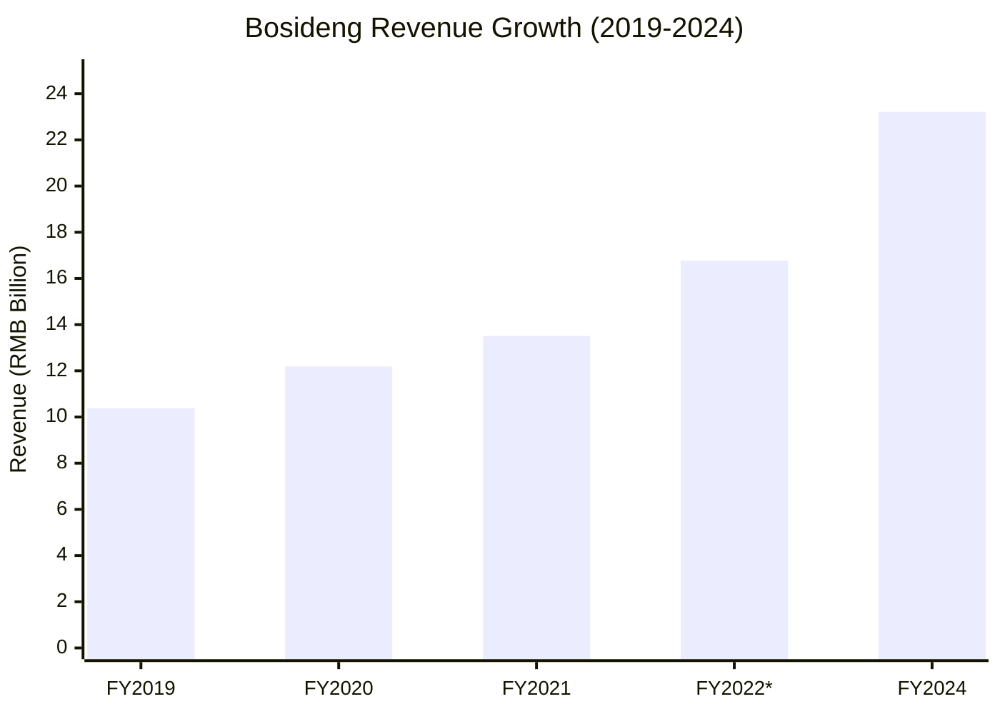
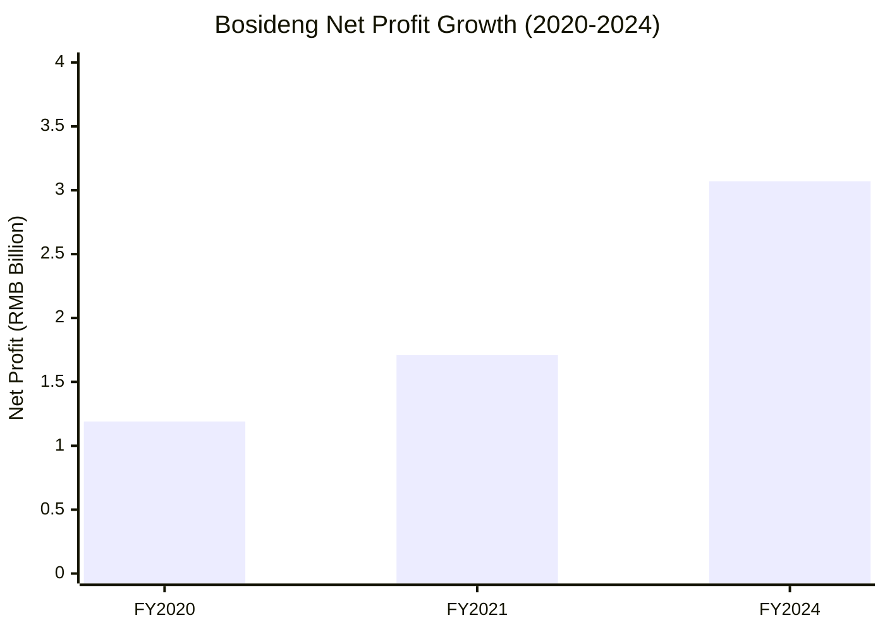

# Bosideng (波司登) Financial Analysis (2019-2024)

## Company Overview
Bosideng International Holdings Limited (HK: 3998) is China's leading down jacket and winter clothing manufacturer, founded in 1976. The company operates multiple brands including Bosideng, Snow Flying, and international brand Bogner.

## Financial Performance Summary

### Revenue Performance

**FY2020 (2019/20):**
- Revenue: RMB 12.19 billion 
- Growth: 17.4% year-over-year increase from RMB 10.38 billion in FY2019
- Source: [Fibre2Fashion](https://www.fibre2fashion.com/news/apparel-news/bosideng-revenue-jumps-17-4-to-rmb-12-2-bn-in-fy20-268184-newsdetails.htm)

**FY2021 (2020/21):**
- Revenue: RMB 13.51 billion
- Growth: 10.9% year-over-year increase
- Source: [Bamboo Works](https://thebambooworks.com/brief-winterwear-leader-bosidengs-annual-profit-rises-14/)

**FY2022 (2021/22):**
- H1 2022 Revenue: RMB 5.4 billion (15.6% growth)
- Bosideng brand revenue: RMB 3.25 billion (19.1% growth)
- Source: [Bosideng Official](https://www.bosideng.com/enmobile/news/detail/74.html)

**FY2024 (2023/24):**
- Revenue: RMB 23.21 billion
- Growth: 38.4% year-over-year (historical high for 6th consecutive year)
- Source: [LUXEPLACE](https://luxeplace.com/bosideng-groups-revenue-grew-by-38-to-23-2-billion-yuan-last-fiscal-year-bogner-strengthens-china-strategy-deployment/)

### Profitability Analysis

**FY2020 Profit Performance:**
- Net Profit: RMB 1.19 billion
- Growth: 18.9% increase year-over-year
- Source: [Fibre2Fashion](https://www.fibre2fashion.com/news/apparel-news/bosideng-revenue-jumps-17-4-to-rmb-12-2-bn-in-fy20-268184-newsdetails.htm)

**FY2021 Profit Performance:**
- Net Profit: RMB 1.71 billion  
- Growth: 42.1% year-over-year increase
- Source: [The Standard](https://www.thestandard.com.hk/breaking-news/section/2/175368/Bosideng-profit-jumps-to-1.7b-yuan)

**FY2024 Profit Performance:**
- Net Profit attributable to shareholders: RMB 3.07 billion
- Growth: 43.7% year-over-year increase
- Operating Profit: RMB 4.40 billion (55.6% increase)
- Source: [Bosideng Annual Results](https://doc.irasia.com/listco/hk/bosideng/annual/2024/respress.pdf)

### Margin Analysis

**FY2020 Margins:**
- Branded down apparel gross profit margin: 59.8% (increased by 2.4 percentage points)
- Source: Search results from financial reporting

**FY2022 Interim Margins:**
- Overall gross profit margin: 50.5% (increased by 2.7 percentage points)
- Down jacket business GPM: 61.1% (increased by 4.7 percentage points)
- Source: [Bosideng Official](https://www.bosideng.com/enmobile/news/detail/74.html)

**FY2024 Margins:**
- Gross profit margin: 59.6% (increased by 0.1 percentage points)
- Branded down apparel remains largest revenue source at 68.9%
- Source: [Bosideng Annual Results](https://doc.irasia.com/listco/hk/bosideng/annual/2024/respress.pdf)

## Business Segment Performance

### Brand Performance (FY2024)
- **Bosideng Brand**: Revenue of RMB 16.78 billion (42.7% growth), 86.0% of down jacket segment
- **Snow Flying Brand**: Revenue of RMB 2.02 billion (65.3% growth), 10.3% of down jacket segment
- Source: [Bosideng Annual Results](https://doc.irasia.com/listco/hk/bosideng/annual/2024/respress.pdf)

### Digital Transformation
**FY2020 Online Performance:**
- Total online sales revenue: RMB 2.35 billion
- Growth: 26.7% year-over-year increase
- Source: Financial reports search results

**FY2022 Digital Growth:**
- H1 2022 online sales: RMB 706.9 million (31.5% growth)
- Source: [Bosideng Official](https://www.bosideng.com/enmobile/news/detail/74.html)

## Strategic Direction
- Focus on "main channel (down jackets) and main brand (Bosideng)" strategy
- Consistent growth for six consecutive years (2019-2024)
- Strong market leadership in winter apparel segment
- Successful premium positioning and brand elevation
- Source: [LUXEPLACE](https://luxeplace.com/bosideng-groups-revenue-grew-by-38-to-23-2-billion-yuan-last-fiscal-year-bogner-strengthens-china-strategy-deployment/)

## Key Performance Indicators

*FY2022 figure is estimated based on H1 2022 results

## Investment Highlights
- Consistent double-digit revenue growth over 5-year period
- Expanding profit margins indicating operational efficiency improvements  
- Strong brand portfolio with market leadership position
- Successful digital transformation driving online sales
- Premium positioning strategy yielding higher margins
- Six consecutive years of historical highs

## References
1. [Fibre2Fashion - Bosideng FY20 Results](https://www.fibre2fashion.com/news/apparel-news/bosideng-revenue-jumps-17-4-to-rmb-12-2-bn-in-fy20-268184-newsdetails.htm)
2. [Bamboo Works - Bosideng Annual Profit Analysis](https://thebambooworks.com/brief-winterwear-leader-bosidengs-annual-profit-rises-14/)
3. [Bosideng Official - FY2022 Interim Results](https://www.bosideng.com/enmobile/news/detail/74.html)
4. [LUXEPLACE - Bosideng FY2024 Results](https://luxeplace.com/bosideng-groups-revenue-grew-by-38-to-23-2-billion-yuan-last-fiscal-year-bogner-strengthens-china-strategy-deployment/)
5. [The Standard - Profit Performance](https://www.thestandard.com.hk/breaking-news/section/2/175368/Bosideng-profit-jumps-to-1.7b-yuan)
6. [Bosideng Annual Results FY2024](https://doc.irasia.com/listco/hk/bosideng/annual/2024/respress.pdf)