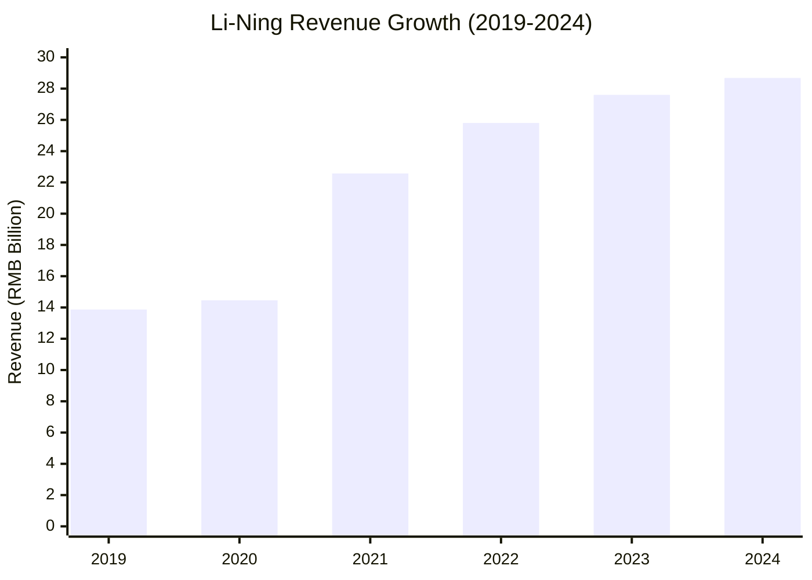
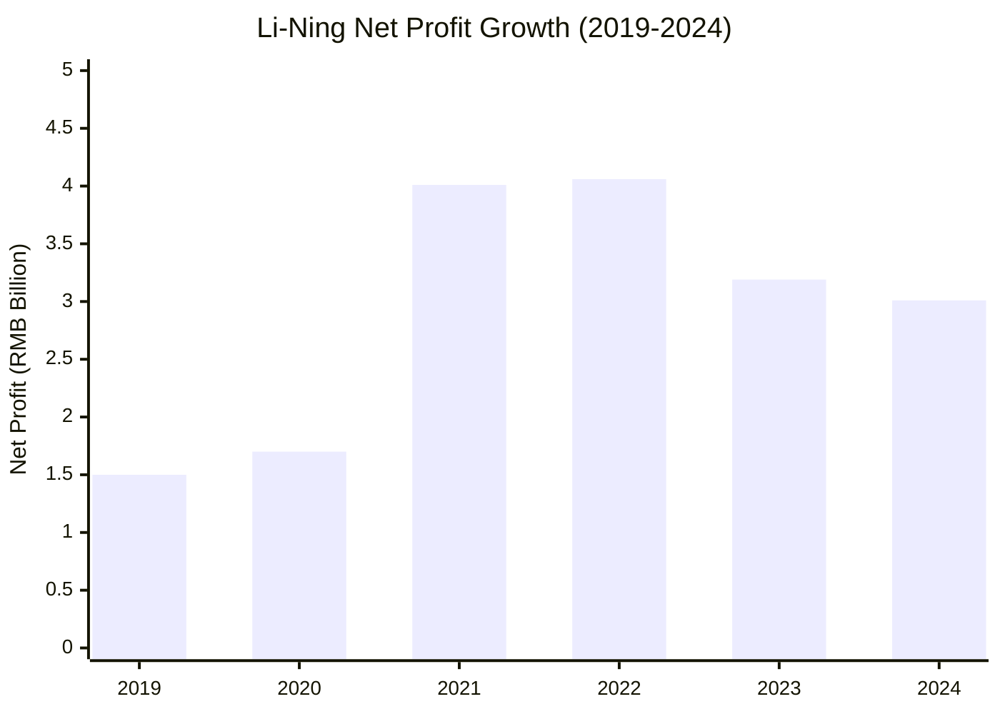
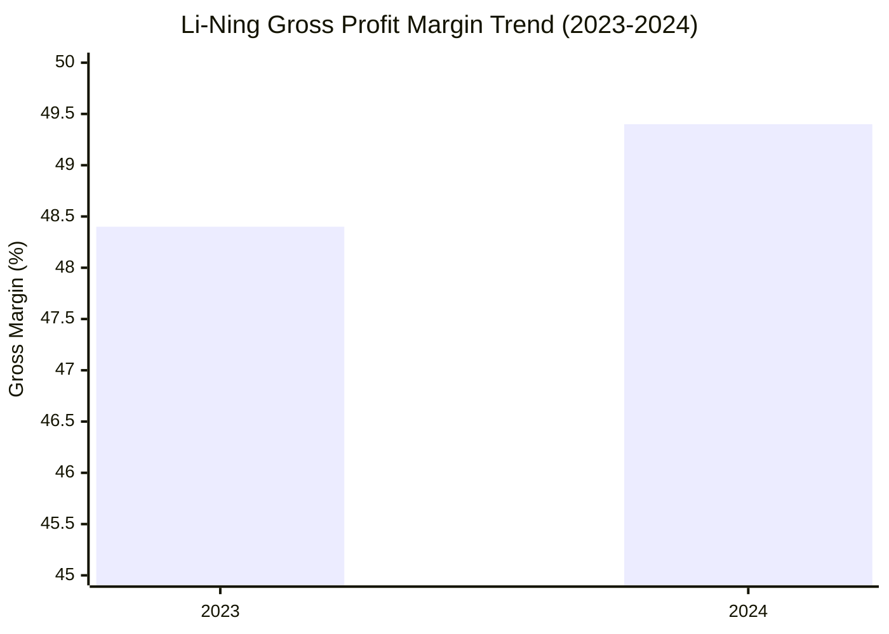

# Li-Ning (李宁) Financial Analysis (2019-2024)

## Company Overview
Li-Ning Company Limited (HK: 2331) is a leading Chinese sportswear and equipment company founded by former Olympic gymnast Li Ning. The company operates under a "Single Brand, Multi-Categories, Diversified Channels" strategy focusing on professional sports equipment and lifestyle products.

## Financial Performance Summary

### Revenue Performance

**FY2019:**
- Revenue: RMB 13.87 billion
- Growth: 32% year-over-year increase from RMB 10.51 billion in FY2018
- Source: [Search results compilation](web search results)

**FY2020:**
- Revenue: RMB 14.46 billion
- Growth: 4.2% year-over-year increase (impacted by pandemic)
- Source: [Search results compilation](web search results)

**FY2021:**
- Revenue: RMB 22.57 billion
- Growth: 56% year-over-year increase (strong recovery post-pandemic)
- Source: [Yahoo Finance](https://finance.yahoo.com/quote/2331.HK/financials/)

**FY2022:**
- Revenue: RMB 25.80 billion
- Growth: 14.3% year-over-year increase
- Source: [Statista](https://www.statista.com/statistics/1119450/li-ning-revenue/)

**FY2023:**
- Revenue: RMB 27.60 billion
- Growth: 7% year-over-year increase
- Source: [LongPort Analysis](https://longportapp.com/en/news/200737781)

**FY2024:**
- Revenue: RMB 28.68 billion
- Growth: 3.9% year-over-year increase
- Source: [European Business Magazine](https://europeanbusinessmagazine.com/media-outreach/li-ning-company-limited-announces-2024-annual-results/)

### Profitability Analysis

**FY2019:**
- Net Profit: RMB 1.50 billion
- Growth: 110% increase from RMB 715.3 million in FY2018
- Source: [Search results compilation](web search results)

**FY2020:**
- Net Profit: RMB 1.70 billion
- Growth: 34.2% year-over-year increase
- Source: [Search results compilation](web search results)

**FY2021:**
- Net Profit: RMB 4.01 billion
- Growth: 136% year-over-year increase
- Source: [Search results compilation](web search results)

**FY2022:**
- Net Profit: RMB 4.06 billion
- Growth: 1.2% year-over-year increase
- Source: [Search results compilation](web search results)

**FY2023:**
- Net Profit: RMB 3.19 billion
- Net Profit Margin: 11.5%
- Growth: -21.4% year-over-year decrease
- Source: [LongPort Analysis](https://longportapp.com/en/news/200737781)

**FY2024:**
- Net Profit Attributable to Equity Holders: RMB 3.01 billion
- Net Profit Margin: 10.5%
- Growth: -5.6% year-over-year decrease
- Source: [European Business Magazine](https://europeanbusinessmagazine.com/media-outreach/li-ning-company-limited-announces-2024-annual-results/)

### Margin Analysis

**FY2023 Margins:**
- Gross Profit: RMB 13.35 billion
- Gross Profit Margin: 48.4% (stable)
- Source: [LongPort Analysis](https://longportapp.com/en/news/200737781)

**FY2024 Margins:**
- Gross Profit: RMB 14.16 billion (6.0% increase)
- Gross Profit Margin: 49.4% (improved by 1 percentage point)
- Return on Equity: 11.9%
- Source: [European Business Magazine](https://europeanbusinessmagazine.com/media-outreach/li-ning-company-limited-announces-2024-annual-results/)

## Business Segment Performance

### Product Category Performance (FY2023)
- **Three Core Professional Sports Categories** (basketball, running, fitness): 64% of total revenue
- **Running Category**: 40% revenue growth
- **Fitness Category**: 25% revenue growth
- **Li-Ning YOUNG** (children's wear): 30-40% revenue growth
- **Footwear Segment** (FY2022): RMB 13.5 billion (up from RMB 9.51 billion in 2021)
- Source: [LongPort Analysis](https://longportapp.com/en/news/200737781)

### Channel Performance (FY2023)
- **Total Sales Points**: 7,668 (net increase of 65)
- **Directly Operated Stores**: 1,498 (net increase of 68)
- **Direct Revenue Growth**: 29%
- **Wholesale Turnover Growth**: 10-20%
- Source: [LongPort Analysis](https://longportapp.com/en/news/200737781)

### Store Network (FY2024)
- **Total Stores**: 7,585 (net decrease of 83 vs. 2023)
- **Number of Distributors**: 41 (net decrease of 5)
- **Li-Ning YOUNG Stores**: 1,468 (net increase of 40)
- Source: [European Business Magazine](https://europeanbusinessmagazine.com/media-outreach/li-ning-company-limited-announces-2024-annual-results/)

## Financial Health Indicators

### Cash Flow and Liquidity (FY2024)
- **Net Cash from Operating Activities**: RMB 5.27 billion
- **Cash and Cash Equivalents**: RMB 7.50 billion
- **Total Cash Balance**: RMB 18.14 billion
- **Basic Earnings Per Share**: RMB 116.98 cents
- Source: [European Business Magazine](https://europeanbusinessmagazine.com/media-outreach/li-ning-company-limited-announces-2024-annual-results/)

### Dividend Policy
- **FY2023 Dividend**: 54.74 cents per ordinary share (45% payout ratio)
- **FY2024 Dividend**: 58.48 cents per share (50% payout ratio)
- Source: [LongPort Analysis](https://longportapp.com/en/news/200737781) and [European Business Magazine](https://europeanbusinessmagazine.com/media-outreach/li-ning-company-limited-announces-2024-annual-results/)

## Strategic Development

### Long-term Growth Trajectory
- **2019-2023 Revenue Growth**: Doubled with 15% compound annual growth rate
- **2019-2023 Net Profit Growth**: 142% increase with 19% compound annual growth rate
- **Strategic Focus**: Technology innovation, brand building, channel optimization
- Source: [LongPort Analysis](https://longportapp.com/en/news/200737781)

### Market Position
- Strong positioning in professional sports categories
- Successful expansion in children's sportswear segment
- Focus on "Single Brand, Multi-Categories, Diversified Channels" strategy
- Active expansion in emerging markets with diversified sales strategies

## Key Performance Charts

## Investment Highlights
- Strong revenue compound annual growth rate of 15% over 2019-2023
- Consistent gross margin improvement demonstrating operational efficiency
- Strong cash generation with RMB 18.14 billion total cash balance
- Successful brand portfolio expansion (Li-Ning YOUNG growth)
- Balanced approach between growth and profitability
- Robust dividend policy with increasing payout ratios

## Key Risks and Considerations
- Net profit decline in 2023-2024 despite revenue growth
- Store count optimization (net decrease in total stores)
- Slowing revenue growth rate in recent years
- Competitive pressure in Chinese sportswear market

## References
1. [LongPort Analysis - Li-Ning 2023 Financial Report](https://longportapp.com/en/news/200737781)
2. [European Business Magazine - Li-Ning 2024 Results](https://europeanbusinessmagazine.com/media-outreach/li-ning-company-limited-announces-2024-annual-results/)
3. [Statista - Li-Ning Annual Revenue](https://www.statista.com/statistics/1119450/li-ning-revenue/)
4. [Yahoo Finance - Li-Ning Financial Statements](https://finance.yahoo.com/quote/2331.HK/financials/)
5. [Companies Market Cap - Li-Ning Revenue](https://companiesmarketcap.com/li-ning-company/revenue/)