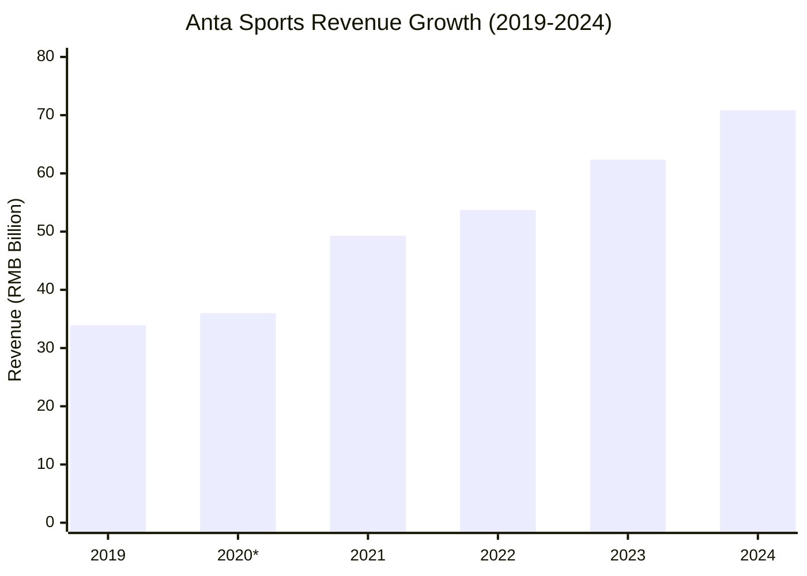
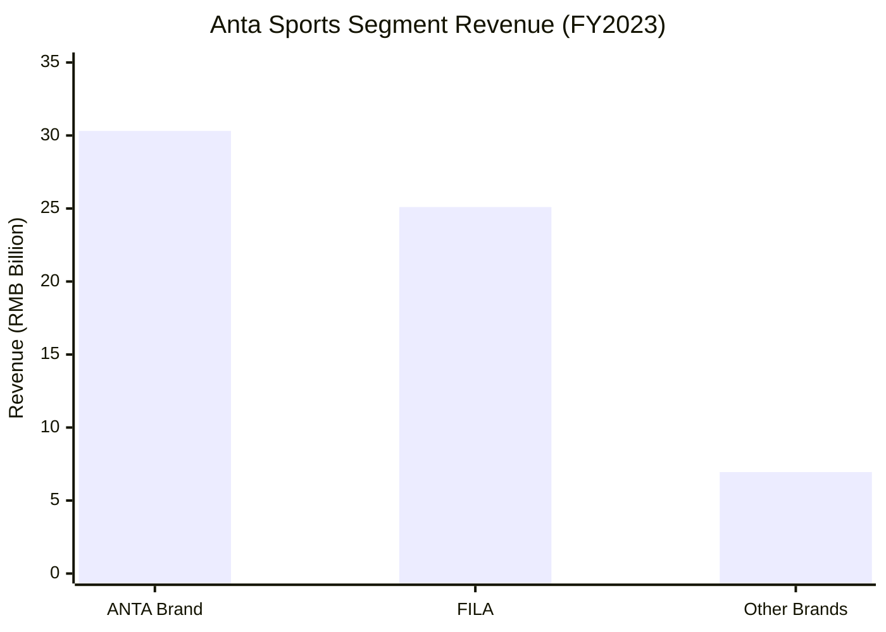
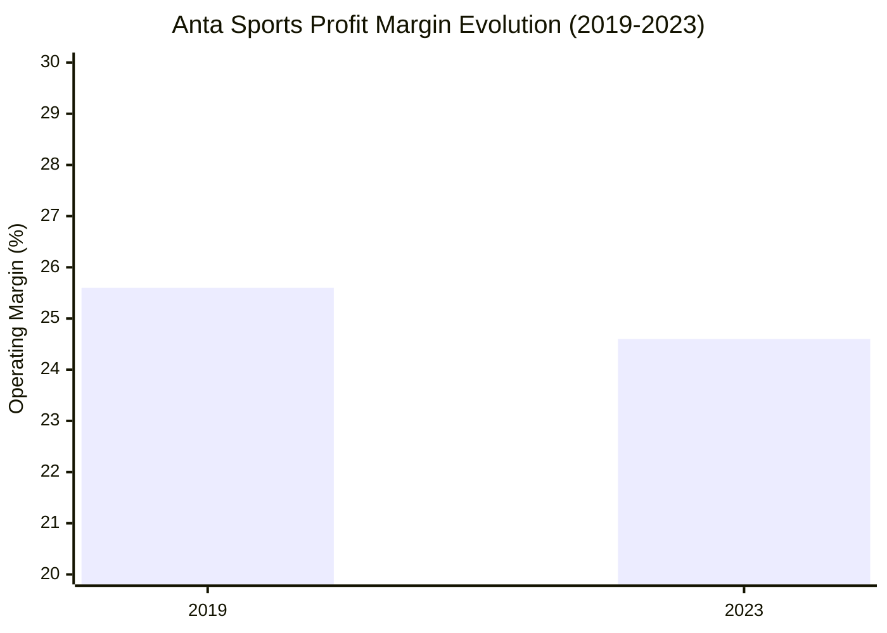

# Anta Sports (安踏) Financial Analysis (2019-2024)

## Company Overview
Anta Sports Products Limited (HK: 2020) is China's leading multi-brand sportswear group, founded in 1991. The company operates through a multi-brand portfolio strategy including the ANTA brand, FILA, and other international brands, with a focus on professional sports equipment and lifestyle products.

## Financial Performance Summary

### Revenue Performance

**FY2019:**
- Revenue: RMB 33.9 billion (approximately 34 billion)
- Growth: Over 40% year-over-year increase
- Source: [PR Newswire](https://www.prnewswire.com/news-releases/anta-groups-2019-earnings-revenue-up-over-40-to-nearly-34-billion-rmb-with-growth-rate-taking-the-lead-in-the-sportswear-industry-301028781.html)

**FY2020:**
- H1 2020 Revenue: RMB 14.67 billion (slight 1% decline due to pandemic)
- Full-year revenue estimated: ~RMB 35-38 billion (based on H1 performance)
- Source: [PR Newswire](https://www.prnewswire.com/news-releases/anta-groups-2020-first-half-earnings-nearly-14-7-billion-rmb-in-revenue-and-a-record-high-gross-profit-margin-301117693.html)

**FY2021:**
- Revenue: RMB 49.3 billion (record high since listing)
- Growth: Approximately 30-35% year-over-year increase
- Source: [MarketScreener](https://www.marketscreener.com/quote/stock/ANTA-SPORTS-PRODUCTS-LIMI-6170948/news/ANTA-Sports-Products-Announces-2021-Annual-Results-Group-Revenue-Reached-New-High-of-RMB49-3-Bil-39822508/)

**FY2022:**
- Revenue: RMB 53.7 billion
- Growth: 8.9% year-over-year increase
- Source: [Statista](https://www.statista.com/statistics/425527/anta-sports-products-revenue/)

**FY2023:**
- Revenue: RMB 62.36 billion
- Growth: 16.2% year-over-year increase
- Source: [ANTA IR](https://ir.anta.com/en/news_detail.php?id=132610)

**FY2024:**
- Revenue: RMB 70.83 billion
- Growth: 13.6% year-over-year increase
- Source: [TipRanks](https://www.tipranks.com/news/company-announcements/anta-sports-reports-strong-2024-financial-results-with-revenue-growth)

### Profitability Analysis

**FY2019:**
- Net Profit Attributable to Equity Shareholders: RMB 5.34 billion
- Growth: 30.3% year-over-year increase
- Net Profit Margin: 15.8%
- Source: [PR Newswire](https://www.prnewswire.com/news-releases/anta-groups-2019-earnings-revenue-up-over-40-to-nearly-34-billion-rmb-with-growth-rate-taking-the-lead-in-the-sportswear-industry-301028781.html)

**FY2020:**
- H1 2020 Profit Attributable to Equity Shareholders: RMB 2.38 billion (excluding joint ventures)
- H1 Growth: -20.1% (pandemic impact)
- Source: [PR Newswire](https://www.prnewswire.com/news-releases/anta-groups-2020-first-half-earnings-nearly-14-7-billion-rmb-in-revenue-and-a-record-high-gross-profit-margin-301117693.html)

**FY2023:**
- Profit Attributable to Shareholders: RMB 10.95 billion (first time exceeding 10 billion)
- Growth: 44.9% year-over-year increase
- Source: [Moomoo](https://www.moomoo.com/news/post/35628074/anta-sports-02020-hk-announced-its-2023-annual-results-revenue)

**FY2024:**
- Profit Attributable to Equity Shareholders: 16.5% increase year-over-year
- Specific amount: Not disclosed in available sources
- Source: [TipRanks](https://www.tipranks.com/news/company-announcements/anta-sports-reports-strong-2024-financial-results-with-revenue-growth)

### Margin Analysis

**FY2019 Margins:**
- Gross Profit Margin: 55.0%
- Operating Profit Margin: 25.6%
- Net Profit Margin: 15.8%
- Source: [PR Newswire](https://www.prnewswire.com/news-releases/anta-groups-2019-earnings-revenue-up-over-40-to-nearly-34-billion-rmb-with-growth-rate-taking-the-lead-in-the-sportswear-industry-301028781.html)

**FY2020 H1 Margins:**
- Gross Profit Margin: 56.8% (record high, +0.7 percentage points)
- Source: [PR Newswire](https://www.prnewswire.com/news-releases/anta-groups-2020-first-half-earnings-nearly-14-7-billion-rmb-in-revenue-and-a-record-high-gross-profit-margin-301117693.html)

**FY2023 Margins:**
- Overall Gross Margin: 62.6% (increased 2.4 percentage points)
- Operating Profit Margin: 24.6% (increased 3.7 percentage points)
- Source: [ANTA IR](https://ir.anta.com/en/news_detail.php?id=132610)

**FY2024 Margins:**
- Overall Operating Profit Margin: Decreased due to increased investments in branding and R&D
- Source: [TipRanks](https://www.tipranks.com/news/company-announcements/anta-sports-reports-strong-2024-financial-results-with-revenue-growth)

## Business Segment Performance (FY2023)

### ANTA Brand Segment
- Revenue: RMB 30.31 billion
- Growth: 9.3% year-over-year
- Operating Profit Margin: 22.2% (increased 0.8 percentage points)
- Source: [ANTA IR](https://ir.anta.com/en/news_detail.php?id=132610)

### FILA Segment
- Revenue: RMB 25.10 billion
- Growth: 16.6% year-over-year
- Operating Profit Margin: 27.6% (increased 7.6 percentage points)
- Source: [ANTA IR](https://ir.anta.com/en/news_detail.php?id=132610)

### Other Brands Segment
- Revenue: RMB 6.95 billion
- Growth: 57.7% year-over-year (fastest growing segment)
- Operating Profit Margin: 27.1% (increased 6.5 percentage points)
- Source: [ANTA IR](https://ir.anta.com/en/news_detail.php?id=132610)

## Financial Health Indicators

### Cash Flow Performance
**FY2021:**
- Free Cash Inflow: RMB 10.37 billion (56.5% increase)
- Source: [MarketScreener](https://www.marketscreener.com/quote/stock/ANTA-SPORTS-PRODUCTS-LIMI-6170948/news/ANTA-Sports-Products-Announces-2021-Annual-Results-Group-Revenue-Reached-New-High-of-RMB49-3-Bil-39822508/)

**FY2023:**
- Operating Cash Inflow: RMB 19.63 billion (61.6% increase)
- Source: [ANTA IR](https://ir.anta.com/en/news_detail.php?id=132610)

**FY2024:**
- Net Cash Inflow from Operating Activities: RMB 16.74 billion
- Source: [TipRanks](https://www.tipranks.com/news/company-announcements/anta-sports-reports-strong-2024-financial-results-with-revenue-growth)

### R&D Investment
**FY2022:**
- R&D Investment: Over RMB 1 billion
- Source: Search results compilation

**FY2023:**
- R&D Investment: Over RMB 1.6 billion
- R&D expenditure to revenue ratio: Continuing to increase
- Source: [ANTA IR](https://ir.anta.com/en/news_detail.php?id=132610)

### Dividend Policy
**FY2023:**
- Dividend: HK 197 cents per share
- Growth: 47% increase year-over-year
- Source: [ANTA IR](https://ir.anta.com/en/news_detail.php?id=132610)

**FY2024:**
- Proposed Final Dividend: HK 118 cents per share
- Source: [TipRanks](https://www.tipranks.com/news/company-announcements/anta-sports-reports-strong-2024-financial-results-with-revenue-growth)

## Strategic Positioning

### Multi-brand Strategy
- **ANTA Brand**: Core domestic sportswear brand focusing on mass market
- **FILA**: Premium lifestyle and fashion-forward sportswear
- **Other Brands**: International brands including Salomon, Arc'teryx, Wilson, and others
- Strategic focus on "Long-termism" approach to brand building

### Market Leadership
- Leading position in Chinese sportswear industry
- Strong portfolio of international premium brands
- Successful integration of acquired brands
- Focus on professional sports and lifestyle segments

## Performance Charts

*2020 estimated based on H1 results

## Investment Highlights
- Consistent double-digit revenue growth over 5-year period
- Strong multi-brand portfolio with balanced growth across segments
- Industry-leading gross and operating margins
- Robust cash generation capabilities
- Successful integration of international premium brands
- Strong R&D investment commitment (>RMB 1.6 billion annually)
- Attractive dividend policy with regular increases

## Strategic Advantages
- Diversified brand portfolio reducing single-brand risk
- Premium positioning through FILA and other international brands
- Strong domestic market presence with ANTA brand
- Balanced growth between mass market and premium segments
- Proven capability in brand acquisition and integration

## References
1. [PR Newswire - ANTA 2019 Results](https://www.prnewswire.com/news-releases/anta-groups-2019-earnings-revenue-up-over-40-to-nearly-34-billion-rmb-with-growth-rate-taking-the-lead-in-the-sportswear-industry-301028781.html)
2. [PR Newswire - ANTA H1 2020 Results](https://www.prnewswire.com/news-releases/anta-groups-2020-first-half-earnings-nearly-14-7-billion-rmb-in-revenue-and-a-record-high-gross-profit-margin-301117693.html)
3. [MarketScreener - ANTA 2021 Results](https://www.marketscreener.com/quote/stock/ANTA-SPORTS-PRODUCTS-LIMI-6170948/news/ANTA-Sports-Products-Announces-2021-Annual-Results-Group-Revenue-Reached-New-High-of-RMB49-3-Bil-39822508/)
4. [ANTA Investor Relations - 2023 Results](https://ir.anta.com/en/news_detail.php?id=132610)
5. [TipRanks - ANTA 2024 Results](https://www.tipranks.com/news/company-announcements/anta-sports-reports-strong-2024-financial-results-with-revenue-growth)
6. [Statista - ANTA Revenue Data](https://www.statista.com/statistics/425527/anta-sports-products-revenue/)
7. [Moomoo - ANTA 2023 Profit Analysis](https://www.moomoo.com/news/post/35628074/anta-sports-02020-hk-announced-its-2023-annual-results-revenue)