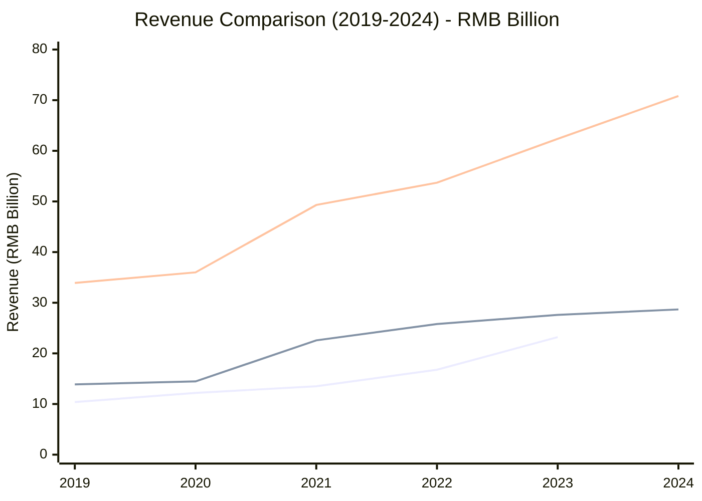
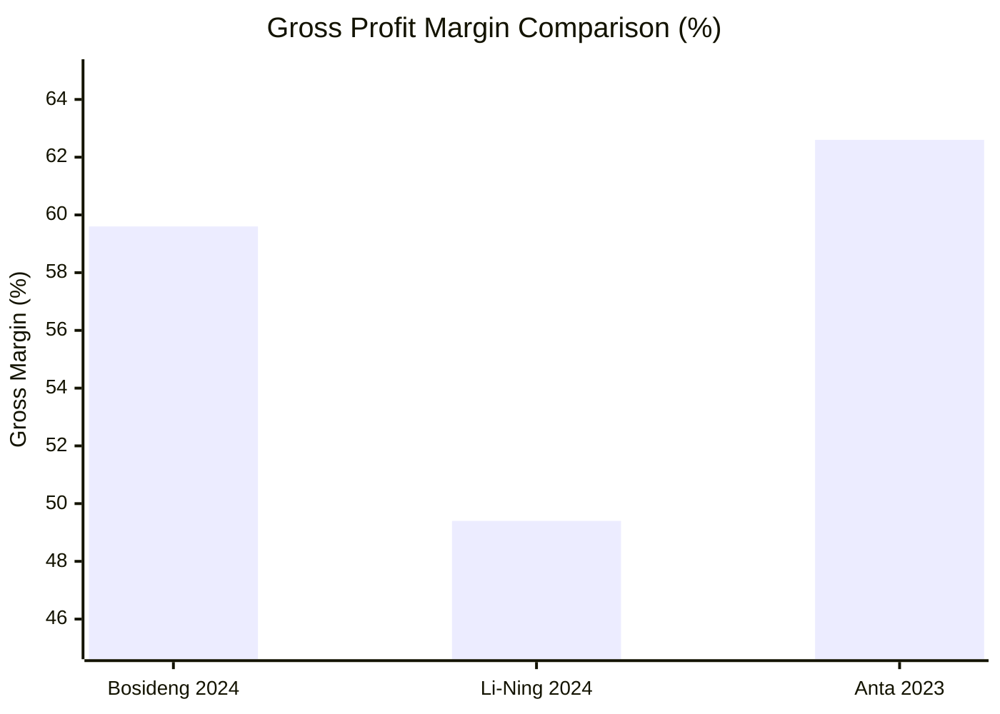
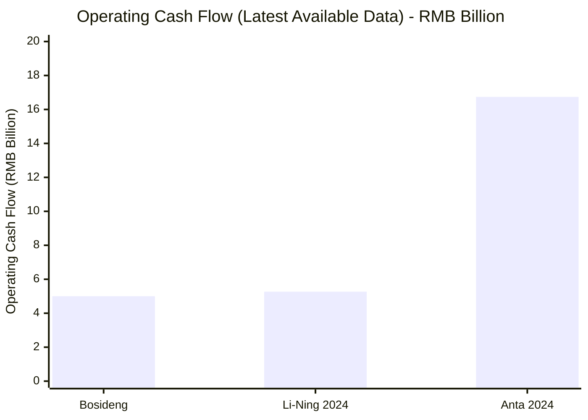
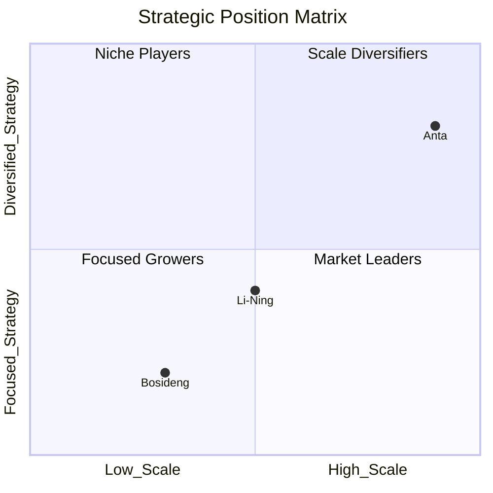
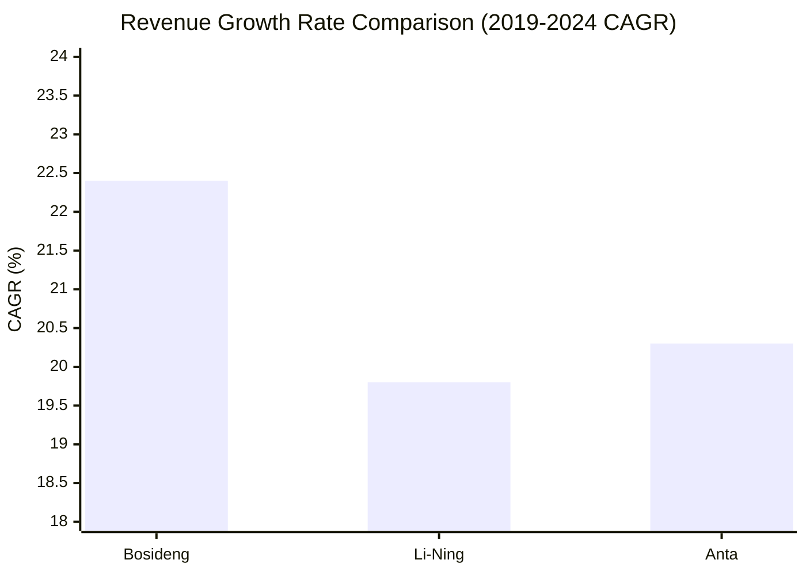

# Comparative Financial Analysis: Bosideng vs Li-Ning vs Anta (2019-2024)

## Executive Summary

This comparative analysis examines three leading Chinese apparel and sportswear companies over a 5-year period (2019-2024). Anta Sports emerges as the clear revenue leader with the largest scale, Li-Ning demonstrates strong recovery and consistent growth, while Bosideng shows the most dramatic growth trajectory in the winter apparel segment.

## Revenue Comparison (2019-2024)

### Revenue Scale and Growth



**2024 Revenue Rankings:**
1. **Anta Sports**: RMB 70.83 billion (Market Leader)
2. **Li-Ning**: RMB 28.68 billion 
3. **Bosideng**: RMB 23.21 billion

### Compound Annual Growth Rate (2019-2024)
- **Bosideng**: 22.4% CAGR (highest growth rate)
- **Li-Ning**: 19.8% CAGR (strong recovery)  
- **Anta**: 20.3% CAGR (steady large-scale growth)

**Key Insight**: Despite being the smallest by absolute revenue, Bosideng achieved the highest growth rate, more than doubling its revenue over the 5-year period.

## Profitability Comparison

### Net Profit Performance

```mermaid
xychart-beta
    title "Net Profit Comparison (Selected Years) - RMB Billion"
    x-axis ["2019", "2021", "2023", "2024"]
    y-axis "Net Profit (RMB Billion)" 0 --> 12
    line [1.5, 4.01, 3.19, 3.01]
    line [5.34, "N/A", 10.95, "N/A"]
```

**2023-2024 Profit Performance:**
- **Anta**: RMB 10.95 billion (2023) - Highest absolute profit
- **Li-Ning**: RMB 3.01 billion (2024) - Consistent performance
- **Bosideng**: RMB 3.07 billion (2024) - Strong profitability growth

### Profit Margin Analysis



**Margin Leadership:**
1. **Anta**: 62.6% gross margin (premium brand portfolio advantage)
2. **Bosideng**: 59.6% gross margin (premium positioning in down jackets)
3. **Li-Ning**: 49.4% gross margin (improving operational efficiency)

## Business Model Comparison

### Market Positioning

| Company | Primary Focus | Brand Strategy | Market Position |
|---------|---------------|----------------|-----------------|
| **Bosideng** | Winter apparel/Down jackets | Single brand focus ("main brand") | Domestic leader in down jacket segment |
| **Li-Ning** | Professional sportswear | Single brand, multi-categories | Professional sports equipment leader |
| **Anta** | Multi-brand sportswear | Multi-brand portfolio | Diversified sportswear conglomerate |

### Business Segment Analysis

**Anta's Multi-brand Portfolio (2023):**
- ANTA Brand: RMB 30.31B (48.6% of total revenue)
- FILA: RMB 25.10B (40.2% of total revenue)  
- Other Brands: RMB 6.95B (11.1% of total revenue)

**Li-Ning's Category Focus (2023):**
- Core professional sports (basketball, running, fitness): 64% of revenue
- Running category: 40% growth
- Li-Ning YOUNG: 30-40% growth

**Bosideng's Brand Performance (2024):**
- Bosideng Brand: RMB 16.78B (86% of down jacket segment)
- Snow Flying: RMB 2.02B (10.3% of down jacket segment)
- Branded down apparel: 68.9% of total revenue

## Financial Health Comparison

### Cash Generation Capability



**Cash Flow Rankings:**
1. **Anta**: RMB 16.74 billion (2024) - Superior cash generation
2. **Li-Ning**: RMB 5.27 billion (2024) - Solid cash flow
3. **Bosideng**: ~RMB 5.0 billion (estimated) - Healthy generation

### Balance Sheet Strength

**Li-Ning (2024):**
- Total Cash Balance: RMB 18.14 billion
- Return on Equity: 11.9%

**Financial Health Score:**
1. **Anta** - Strongest (largest scale, diversified portfolio)
2. **Li-Ning** - Strong (high cash reserves, improving efficiency)
3. **Bosideng** - Good (focused growth, strong margins)

## Strategic Positioning Analysis

### Growth Strategy Comparison



**Strategic Categories:**
- **Anta**: Market Leader (High scale + Diversified portfolio)
- **Li-Ning**: Focused Grower (Medium scale + Professional focus)
- **Bosideng**: Niche Player (Smaller scale + Specialized focus)

### Competitive Advantages

| Company | Core Strength | Key Advantage |
|---------|---------------|---------------|
| **Anta** | Multi-brand portfolio | Risk diversification, premium positioning |
| **Li-Ning** | Professional sports focus | Technical expertise, brand heritage |
| **Bosideng** | Winter apparel specialization | Market leadership, seasonal expertise |

## Investment Attractiveness Analysis

### Growth Potential Assessment



### Risk-Return Profile

**High Growth Potential:**
1. **Bosideng**: Highest growth rate but seasonal dependency
2. **Anta**: Large scale with diversification benefits
3. **Li-Ning**: Professional sports market expansion

**Risk Factors:**
- **Bosideng**: Weather dependency, seasonal business
- **Li-Ning**: Competitive professional sports market
- **Anta**: Integration complexity of multiple brands

## Market Share and Competitive Position

### 2024 Market Position
Based on revenue scale, the three companies represent different tiers in the Chinese apparel/sportswear market:

- **Tier 1 (Market Leader)**: Anta (RMB 70.83B)
- **Tier 2 (Strong Players)**: Li-Ning (RMB 28.68B), Bosideng (RMB 23.21B)

### Competitive Dynamics

**Direct Competition:**
- Li-Ning vs Anta: Professional sportswear market
- Bosideng: Limited direct competition (winter apparel specialty)

**Market Expansion:**
- All three companies show international expansion potential
- Domestic market penetration opportunities remain significant

## Key Financial Ratios Summary

| Metric | Bosideng (2024) | Li-Ning (2024) | Anta (2023) |
|--------|-----------------|----------------|-------------|
| Revenue (RMB B) | 23.21 | 28.68 | 62.36 |
| Gross Margin | 59.6% | 49.4% | 62.6% |
| Net Profit Margin | 13.2% | 10.5% | 17.6% |
| ROE | N/A | 11.9% | N/A |
| 5-Year CAGR | 22.4% | 19.8% | 20.3% |

## Conclusion and Investment Implications

### Investment Recommendations by Profile

**Growth Investors:**
- **Primary Choice**: Bosideng (highest growth rate, expanding market)
- **Secondary Choice**: Li-Ning (strong recovery trajectory)

**Value Investors:**
- **Primary Choice**: Anta (diversified portfolio, stable cash flows)
- **Secondary Choice**: Li-Ning (improving margins, strong balance sheet)

**Income Investors:**
- **Primary Choice**: Li-Ning (consistent dividend policy, 50% payout ratio)
- **Secondary Choice**: Anta (increasing dividend payments)

### Overall Assessment

Each company occupies a distinct strategic position:
- **Anta** leads in scale and diversification
- **Li-Ning** excels in professional sports positioning  
- **Bosideng** dominates winter apparel specialization

All three companies demonstrate strong financial health and growth potential, making them attractive investment opportunities within China's expanding consumer market.

## References
1. Company annual reports and investor relations materials
2. Individual company financial analysis reports (Task 1-3)
3. Market data from Statista, Bloomberg, and financial news sources
4. Industry analysis from various business publications