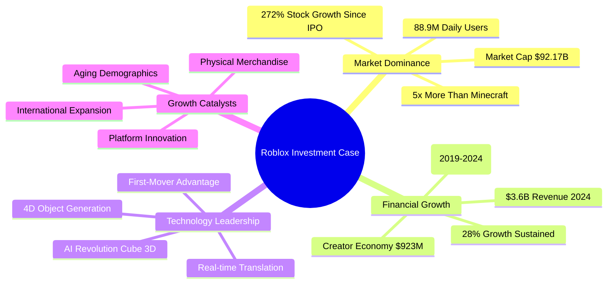
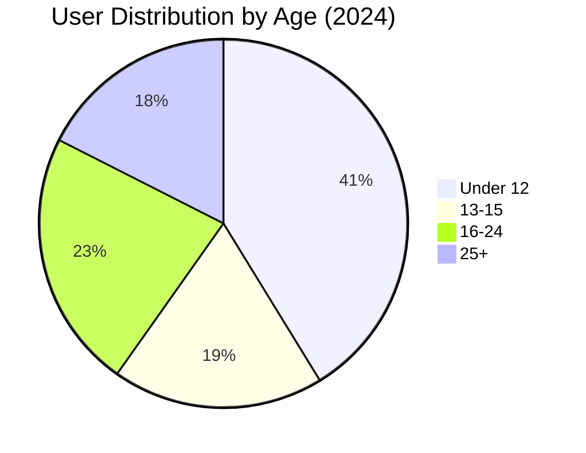

# Roblox Corporation (RBLX) Investment Analysis

## Executive Summary

**Investment Recommendation: STRONG BUY**  
**Price Target: $150-175 (25-40% upside)**  
**Current Price: ~$127 (September 2025)**

Roblox Corporation presents a compelling long-term investment opportunity driven by exceptional user engagement metrics, revolutionary AI technology developments, and multiple growth catalysts. Despite current unprofitability, the company's dominant market position, creator economy moat, and path to future profitability justify premium valuation multiples.

## Key Investment Highlights

## Research Context & Methodology

This comprehensive analysis addresses investor interest in Roblox's financial performance, business fundamentals, competitive positioning, and investment potential. The research examines five years of financial data, user demographics, competitive landscape, and forward-looking growth catalysts to provide data-driven investment guidance.

**Key Questions Addressed:**
- What is Roblox's 5-year financial trajectory and growth sustainability?
- How does Roblox's business model and competitive position support future value creation?
- Do user demographics and monetization patterns justify current valuation?
- What are the primary growth catalysts and investment risks?
- Should investors buy or sell Roblox stock based on fundamental analysis?

## Financial Performance Overview (2019-2024)

### Revenue Growth Trajectory
Roblox has delivered exceptional revenue growth, increasing from $508M in 2019 to $3.6B in 2024—a 7x increase representing a 47.8% compound annual growth rate.

| Year | Revenue | YoY Growth | Key Milestone |
|------|---------|------------|---------------|
| 2019 | $508M | +56% | Pre-pandemic foundation |
| 2020 | $924M | +82% | COVID-19 acceleration |
| 2021 | $1.92B | +108% | IPO year explosive growth |
| 2022 | $2.23B | +16% | Growth normalization |
| 2023 | $2.80B | +26% | Sustained momentum |
| 2024 | $3.60B | +29% | AI innovation year |

### Profitability & Investment Phase
Despite strong revenue growth, Roblox operates at significant losses due to aggressive growth investments:
- **2024 Net Loss**: -$935M (18% improvement from 2023)
- **R&D Investment**: 44% of revenue ($1.5B annually)
- **Path to Profitability**: Break-even projected 2027-2028
- **Cash Position**: Eight consecutive quarters of positive cash flow

**For detailed financial analysis:** [Task 1: Financial Performance Report](./reports/task-1-financial-performance.md)

## Business Model & Competitive Advantages

### Three-Sided Marketplace
Roblox operates a unique platform connecting players, creators, and brands through a virtual economy powered by Robux currency:

- **Player Spending**: $1.88B spent on Robux in H1 2024
- **Creator Payouts**: $923M paid to developers in 2024 (+25% YoY)
- **Platform Revenue**: ~30% take rate similar to app stores
- **Network Effects**: 88.9M daily active users create switching costs

### Creator Economy Moats
The platform's creator economy creates significant competitive barriers:
- **Top Developer Success**: Top 1,000 developers average $820K annually
- **Revenue Growth**: Developer payouts increased 570% since 2019
- **Tool Integration**: AI-powered creation tools lock in developer ecosystem
- **Content Scale**: User-generated content provides infinite scalability

**For detailed business model analysis:** [Task 2: Business Model Report](./reports/task-2-business-model.md)

## Stock Performance & Valuation

### Exceptional Stock Performance Since IPO
- **IPO (March 2021)**: $24.77B market cap
- **Current (September 2025)**: $92.17B market cap
- **Total Return**: +272% since IPO
- **CAGR**: 33.85% annually since public trading

### Valuation Metrics & Analyst Outlook
- **Current P/E**: -95.87 (negative due to growth investment losses)
- **Price-to-Sales**: 25.6x (premium growth multiple)
- **Analyst Consensus**: Strong Buy (19 analysts)
- **Price Target Range**: $62-$175 (average $129.90)

### Growth Stock Valuation Framework
The premium valuation is justified by:
- Superior user engagement vs. competitors
- Network effects and platform lock-in
- Multiple growth catalysts and market expansion
- Winner-take-most platform dynamics potential

**For detailed stock analysis:** [Task 3: Stock Performance & Valuation Report](./reports/task-3-stock-valuation.md)

## User Demographics & Monetization

### Multi-Generational User Base
Roblox demonstrates remarkable demographic breadth with strong monetization across age groups:

### Key Demographic Insights
- **Core Users**: 40% under 12 years old (largest segment)
- **Growing Segments**: 46.4M users over 23 years old
- **User Aging**: Platform successfully retaining users as they mature
- **Engagement**: 2.6 hours average daily usage per user

### Purchasing Behavior & Monetization
- **Household Penetration**: 60% of Roblox households spend monthly
- **Average Spending**: $12.01 per user in Q2 2024
- **Parental Involvement**: Most under-13 purchases require parent approval
- **Growth Potential**: Aging demographics have 3-5x higher purchasing power

### Answer to Key Question: Do Kids Purchase Independently?
Children under 13 typically require parental approval for purchases, with parents controlling payment methods and spending limits. However, teenagers (13+) have greater financial autonomy and represent a growing, higher-value demographic segment.

**For detailed demographic analysis:** [Task 4: User Demographics Report](./reports/task-4-user-demographics.md)

## Competitive Landscape Analysis

### Market Position Assessment
Roblox dominates key engagement metrics while facing revenue competition from larger platforms:

| Company | 2024 Revenue | P/E Ratio | User Engagement | Growth Rate |
|---------|-------------|-----------|-----------------|-------------|
| **Roblox** | $3.6B | -95.87 | 88.9M DAUs, 5x Minecraft | +29% |
| **Epic Games** | $5.7B | Private | Lower engagement | +30% |
| **Unity** | $1.8B | -21.22 | Platform provider | -17% |
| **Minecraft** | $220M | Part of MSFT | 55M DAUs | Stable |

### Competitive Advantages & Moats
**Roblox Strengths:**
- User engagement leadership (2.6 hours daily vs <1 hour industry average)
- Creator economy scale ($923M annual payouts)
- Network effects and social connections
- AI technology first-mover advantage

**Areas Where Competitors Lead:**
- **Total Revenue**: Epic Games generates 58% more revenue
- **Profitability**: Microsoft's gaming division profitable
- **B2B Model**: Unity's enterprise revenue more stable

**For detailed competitive analysis:** [Task 5: Competitive Analysis Report](./reports/task-5-competitive-analysis.md)

## Platform Innovation & New Developments

### Revolutionary AI Technology Leadership
Roblox has launched industry-leading AI creation tools that could transform content development:

#### Cube 3D AI System
- **Open Source Model**: First gaming platform to open-source 3D generation AI
- **Creator Productivity**: Potentially 10x content creation speed improvement
- **Competitive Moat**: Proprietary AI models create barriers to entry
- **Cost Reduction**: Automated content generation reduces operational costs

#### 4D Object Generation
- **Functional Creation**: Generate interactive, scripted objects from text prompts
- **Example**: "Sleek, futuristic red sports car" → fully functional, drivable vehicle
- **Industry First**: Move beyond static 3D to interactive gameplay elements
- **Creator Empowerment**: Democratizes complex game development

### New Monetization Streams
**Physical Merchandise Integration (2025)**:
- Shopify partnership enabling direct physical goods sales
- New revenue stream beyond virtual currency
- Enhanced creator monetization opportunities
- Bridge between virtual and physical commerce

**Enhanced Creator Economy**:
- DevEx rates increased 8.5% in 2024
- Real-time translation launching 2025
- Professional development tools for enterprise creators

**For detailed platform developments:** [Task 6: Platform Developments Report](./reports/task-6-platform-developments.md)

## Growth Forecast & Catalysts

### Revenue Projections
Analyst consensus projects continued strong growth with gradual moderation:
- **2025 Forecast**: $4.15-5.27B (+15-46% YoY)
- **2026 Forecast**: $4.97-6.27B (+20-26% YoY)
- **Long-term CAGR**: 15-25% through 2027

### Key Growth Catalysts

#### 1. AI-Powered Creation Revolution
- Cube 3D and 4D object generation reducing creator barriers
- First-mover advantage in AI-powered gaming tools
- Cost reduction and productivity improvements

#### 2. International Market Expansion
- Untapped markets in Asia-Pacific and Latin America
- Real-time translation removing language barriers
- Mobile-first strategy aligning with global trends

#### 3. Aging Demographics & Higher ARPU
- Current users growing up with increased purchasing power
- 25+ demographic showing 3-5x higher spending potential
- Platform successfully aging with user base

#### 4. Physical Merchandise Integration
- New revenue stream through Shopify partnership
- Cross-platform commerce opportunities
- Enhanced brand partnership potential

### Recent Catalysts (Q4 2024/Q1 2025)
- AI tool launches exceeding expectations
- Revenue beats and sustained 25%+ growth
- Creator economy record payouts ($923M)
- Eight consecutive positive cash flow quarters

**For detailed growth analysis:** [Task 7: Growth Forecast Report](./reports/task-7-growth-forecast.md)

## Investment Recommendation & Risk Assessment

### Strong Buy Recommendation
**Price Target: $150-175 (25-40% upside from ~$127)**

The recommendation is based on:
1. **Market Leadership**: Dominant user engagement and platform stickiness
2. **Technology Innovation**: AI tools creating competitive advantages
3. **Multiple Catalysts**: International expansion, aging demographics, new revenue streams
4. **Financial Momentum**: Sustained growth with improving unit economics

### Risk-Adjusted Expected Return: +37%
**Scenario Analysis:**
- **Bull Case (35% probability)**: $200+ target (60-80% upside)
- **Base Case (50% probability)**: $150-175 target (25-40% upside)
- **Bear Case (15% probability)**: $80-100 target (-20% to -30% downside)

### Key Investment Risks
1. **Profitability Timeline**: Break-even not expected until 2027-2028
2. **Platform Safety**: Regulatory scrutiny of child-focused platforms
3. **Competition Risk**: Technology giants entering metaverse space
4. **Valuation Risk**: Premium multiples vulnerable to growth deceleration

### Position Sizing & Entry Strategy
- **Growth Portfolios**: 3-5% allocation recommended
- **Conservative Portfolios**: 1-2% speculative position
- **Entry Strategy**: 50% immediate, 50% systematic accumulation
- **Investment Horizon**: Minimum 3-5 years for full thesis realization

**For detailed investment analysis:** [Task 8: Investment Recommendation Report](./reports/task-8-investment-recommendation.md)

## Conclusion

Roblox Corporation represents a rare combination of dominant market position, revolutionary technology capabilities, and multiple growth catalysts. While the company faces profitability challenges and competitive risks, the platform's exceptional user engagement, creator economy moat, and AI innovation justify premium valuation multiples.

The investment thesis centers on Roblox positioning itself as the infrastructure layer for user-generated virtual experiences, similar to how Amazon became the infrastructure for e-commerce. The combination of network effects, creator economy lock-in, and AI-powered creation tools creates potentially winner-take-most dynamics in the metaverse/gaming platform space.

**Key Success Factors for Investment Thesis:**
- Sustained revenue growth of 15%+ annually
- Successful international market expansion
- AI tools creating meaningful competitive advantages
- Path to profitability by 2027-2028
- Maintained market leadership position

For investors with appropriate risk tolerance and 3-5 year investment horizon, Roblox offers exceptional upside potential in the emerging metaverse economy.

---

## Table of Contents: Detailed Reports

1. [Financial Performance Analysis (2019-2024)](./reports/task-1-financial-performance.md)
2. [Business Model Deep Dive](./reports/task-2-business-model.md)
3. [Stock Performance & Valuation Metrics](./reports/task-3-stock-valuation.md)
4. [User Demographics & Monetization Analysis](./reports/task-4-user-demographics.md)
5. [Competitive Landscape Analysis](./reports/task-5-competitive-analysis.md)
6. [Platform Developments & Innovation](./reports/task-6-platform-developments.md)
7. [Growth Forecast & Catalysts](./reports/task-7-growth-forecast.md)
8. [Investment Recommendation & Risk Analysis](./reports/task-8-investment-recommendation.md)

---

*This research was conducted using publicly available financial data, SEC filings, analyst reports, and industry analyses. All financial projections are based on current market consensus and should be considered alongside individual investment objectives and risk tolerance.*