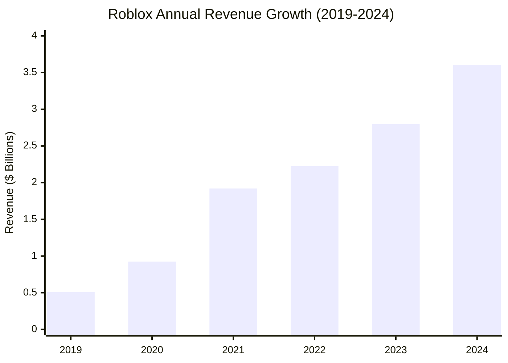

# Task 1: Roblox Financial Performance Analysis (2019-2024)

## Executive Summary

Roblox Corporation has demonstrated exceptional revenue growth over the past five years, with revenue increasing more than 7x from approximately $508 million in 2019 to $3.6 billion in 2024. However, the company remains unprofitable despite this remarkable top-line growth.

## Revenue Performance Timeline

### Year-over-Year Revenue Analysis

According to [Roblox's official financial reports](https://ir.roblox.com/news/news-details/2025/Roblox-Reports-Fourth-Quarter-and-Full-Year-2024-Financial-Results/default.aspx) and comprehensive market data from [MacroTrends](https://www.macrotrends.net/stocks/charts/RBLX/roblox/revenue):

- **2024**: $3.602B (+28.68% YoY growth from 2023)
- **2023**: $2.8B (+25.81% YoY growth from 2022) 
- **2022**: $2.225B (+15.94% YoY growth from 2021)
- **2021**: $1.92B (+107.78% YoY growth from 2020)
- **2020**: $923.89M (+81.72% YoY growth from 2019)
- **2019**: $508.39M (+56.15% YoY growth from 2018)

### Quarterly Performance Trends (2024)

Recent quarterly performance shows sustained momentum:
- **Q4 2024**: $988.2 million (+32% YoY)
- **Q3 2024**: $919 million (+29% YoY from Q3 2023)
- **Q2 2024**: $893.5 million
- **Average Q4 bookings**: $1.12 billion in Q3 2024

According to [Roblox's Q4 2024 earnings report](https://ir.roblox.com/news/news-details/2025/Roblox-Reports-Fourth-Quarter-and-Full-Year-2024-Financial-Results/default.aspx), revenue growth has remained consistently above 25% year-over-year throughout 2024.

## Profitability Analysis

### Net Loss Trends
Despite strong revenue growth, Roblox continues to operate at a loss:

- **2024 Net Loss**: -$935.38 million (-18.80% improvement from 2023)
- **Q4 2024**: Net loss attributable to common stockholders was $219.6 million
- **Consolidated net loss Q4 2024**: $221.1 million

According to [financial analysis data](https://companiesmarketcap.com/roblox/pe-ratio/), the company's current P/E ratio (TTM) is -95.87, reflecting ongoing losses but also investor expectations for future profitability.

### Cost Structure Insights
Based on industry analysis from [Matthew Ball's comprehensive Roblox study](https://www.matthewball.co/all/roblox2024):

- **R&D Investment**: Roblox invests approximately 44% of revenues in R&D, equivalent to $1.5B on a run-rate basis
- This massive R&D spend significantly outpaces competitors like Unity ($1.1B in 2024) and rivals major platforms

## Revenue Growth Drivers

### Primary Revenue Source
According to [multiple financial sources](https://www.statista.com/statistics/1189990/annual-revenue-roblox-corporation/), Roblox generates virtually all revenue through:
- **Robux Sales**: Virtual currency purchases that enable users to buy virtual items
- **Developer Revenue Share**: Platform takes percentage from developer-created content sales

### User Spending Patterns
Based on [platform spending analysis](https://www.theshelf.com/the-blog/roblox-stats-and-spending/):
- **H1 2024**: Players spent $1.88 billion purchasing Robux
- **Q2 2024**: Average player spent $12.01 on Robux (+0.8% from Q2 2023's $11.92)
- **Monthly spending**: 60% of households with Roblox players spend money monthly on the platform

## Key Financial Metrics Summary

| Metric | 2019 | 2020 | 2021 | 2022 | 2023 | 2024 |
|--------|------|------|------|------|------|------|
| Revenue | $508M | $924M | $1.92B | $2.23B | $2.80B | $3.60B |
| YoY Growth | +56% | +82% | +108% | +16% | +26% | +29% |
| CAGR (2019-2024) | - | - | - | - | - | **47.8%** |

## Investment in Growth

### Platform Development Costs
The company's significant losses are driven by substantial investments in:
- **Generative AI**: Real-time communication and asset creation tools
- **Platform Infrastructure**: Supporting 88.9 million daily active users
- **Creator Economy**: Enhanced monetization tools and higher developer payouts

According to [Roblox's official announcements](https://corp.roblox.com/newsroom/2025/03/unveiling-future-creation-native-3d-generation-collaborative-studio-tools-economy-expansion), the company increased Developer Exchange (DevEx) rates by 8.5% in 2024, meaning creators now earn more when converting Robux to cash.

## Financial Outlook Assessment

### Positive Indicators
- Consistent 25%+ annual revenue growth over 5 years
- Strong user engagement driving recurring revenue
- Improving loss margins (-18.80% better losses in 2024 vs 2023)
- Eight consecutive quarters of positive cash flows

### Risk Factors
- High R&D spending ratio (44% of revenue) pressures profitability timeline
- Dependence on virtual currency model creates regulatory risk
- Platform safety concerns could impact user growth

## References

1. [Roblox Reports Fourth Quarter and Full Year 2024 Financial Results](https://ir.roblox.com/news/news-details/2025/Roblox-Reports-Fourth-Quarter-and-Full-Year-2024-Financial-Results/default.aspx)
2. [Roblox Revenue 2019-2025 | MacroTrends](https://www.macrotrends.net/stocks/charts/RBLX/roblox/revenue)
3. [Roblox Corporation Annual Revenue | Statista](https://www.statista.com/statistics/1189990/annual-revenue-roblox-corporation/)
4. [Roblox P/E Ratio Analysis](https://companiesmarketcap.com/roblox/pe-ratio/)
5. [Everything You Need to Know on Roblox Stats and Spending](https://www.theshelf.com/the-blog/roblox-stats-and-spending/)
6. [Roblox is Already the Biggest Game In The World - Matthew Ball Analysis](https://www.matthewball.co/all/roblox2024)