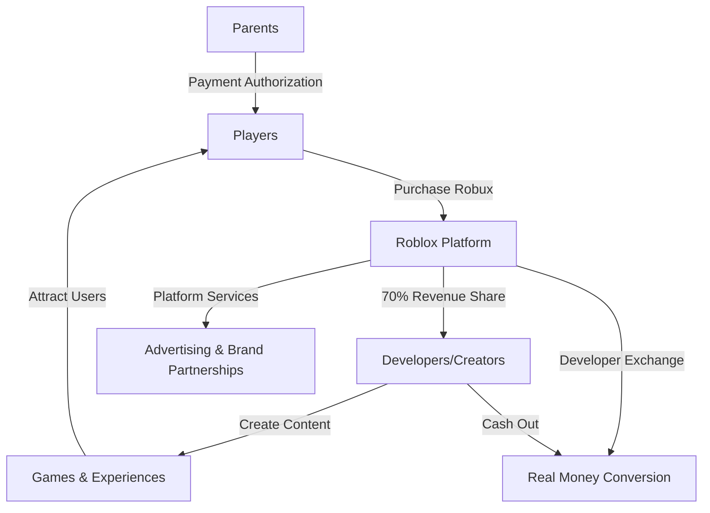

# Task 2: Roblox Business Model Deep Dive

## Executive Summary

Roblox operates as a user-generated content (UGC) platform with a unique three-sided marketplace connecting players, creators, and brands. The company generates revenue primarily through virtual currency sales (Robux) while fostering a creator economy that has paid out over $923 million to developers in 2024.

## Core Business Model Architecture

## Revenue Streams Breakdown

### Primary Revenue: Virtual Currency (Robux)
According to [comprehensive business analysis](https://www.matthewball.co/all/roblox2024), Roblox generates virtually all revenue through Robux sales:

- **Virtual Currency Model**: Players purchase Robux with real money
- **Spending Mechanism**: Robux used to buy virtual items, game passes, and premium features
- **Platform Cut**: Roblox retains approximately 30% of transactions (similar to app stores)

### Revenue Distribution Flow
Based on [financial reporting](https://ir.roblox.com/news/news-details/2025/Roblox-Reports-Fourth-Quarter-and-Full-Year-2024-Financial-Results/default.aspx):

1. **Player Purchases**: $1.88 billion spent by players in H1 2024 alone
2. **Creator Payouts**: $923 million paid to creators in 2024 (+25% from $741M in 2023)
3. **Platform Revenue**: Remainder after developer revenue share and operational costs

## Creator Economy Structure

### Developer Revenue Sharing
According to [official Roblox announcements](https://corp.roblox.com/newsroom/2025/03/unveiling-future-creation-native-3d-generation-collaborative-studio-tools-economy-expansion):

- **Enhanced DevEx Rates**: Increased by 8.5% in 2024
- **Top Developer Earnings**: Top 1,000 developers averaged $820,000 in 2024 (+570% since 2019)
- **Elite Tier Performance**: 
  - Top 10 developers: Average $33.9 million (+450% since 2019)
  - Top 100 developers: Average $6 million (+500% since 2019)

### Creator Incentive Structure
The platform employs a tiered monetization approach:
- **Revenue Sharing**: Developers receive majority of their content's earnings
- **Premium Payouts**: Additional compensation for engaging Premium subscribers
- **Marketplace Sales**: Revenue from selling virtual items and accessories

## User Engagement Model

### Platform Stickiness Metrics
According to [user engagement studies](https://www.takeaway-reality.com/post/roblox-demographics-statistics):

- **Daily Usage**: Average 2.6 hours per day per user
- **Monthly Hours**: Users spend 20.7 billion hours annually on platform
- **Retention Rate**: Platform demonstrates high user retention across age groups

### Social Network Effects
The business model benefits from strong network effects:
- **Creator-Player Loop**: More players attract more creators, creating better content
- **Social Features**: Friend networks and social gameplay increase engagement
- **Cross-Platform Access**: Available on mobile, desktop, console, and VR

## Monetization Mechanics

### Virtual Economy Structure
Based on [platform spending analysis](https://www.theshelf.com/the-blog/roblox-stats-and-spending/):

**Player Spending Patterns**:
- **Household Penetration**: 60% of Roblox households spend money monthly (+27% from 2020)
- **Average Spending**: $12.01 per player in Q2 2024
- **Spending Distribution**: Majority spend under $25 monthly

**Premium Subscription Model**:
- **Roblox Premium**: Monthly subscription providing Robux allowance and benefits
- **Enhanced Features**: Trading, higher revenue share for developers, premium-only content access

## Geographic Revenue Distribution

According to [regional analysis](https://www.statista.com/statistics/1376991/annual-revenue-roblox-corporation-region/):

- **North America**: Primary revenue contributor
- **International Growth**: Expanding presence in Europe and Asia-Pacific
- **Localization Strategy**: Multi-language support and region-specific content

## Business Model Advantages

### Scalability Factors
1. **User-Generated Content**: Infinite content creation without direct development costs
2. **Creator Incentives**: Developers motivated to create engaging content
3. **Platform Network Effects**: Growing user base attracts more creators
4. **Low Marginal Costs**: Digital-first model with high margins on virtual goods

### Competitive Moats
Based on [competitive analysis](https://contextisking.com/2022/06/17/distinguishing-the-key-competitors-in-the-metaverse-roblox-unity-epic-games/):

- **Creator Ecosystem Lock-in**: Developers invested in Roblox tools and audience
- **Social Network**: Friend connections create switching costs
- **Content Library**: Massive catalog of user-created experiences
- **Multi-Platform Reach**: Accessible across all major gaming platforms

## Investment in Platform Development

### R&D Spending Allocation
According to [business model analysis](https://www.matthewball.co/all/roblox2024):

- **R&D Investment**: 44% of revenues ($1.5B run-rate in 2024)
- **AI Development**: Generative AI tools for creators
- **Infrastructure**: Supporting 88.9 million daily active users
- **Creator Tools**: Enhanced development capabilities and monetization features

### Technology Infrastructure
Key technology investments include:
- **Cloud Computing**: Global server infrastructure for seamless gameplay
- **Content Delivery**: Optimized asset streaming and loading
- **Safety Systems**: AI-powered content moderation and user protection
- **Payment Processing**: Secure transaction systems for global markets

## Emerging Revenue Opportunities

### Physical Merchandise Integration
According to [2025 roadmap announcements](https://corp.roblox.com/newsroom/2025/03/unveiling-future-creation-native-3d-generation-collaborative-studio-tools-economy-expansion):

- **Shopify Partnership**: Creators can sell physical merchandise directly in experiences
- **Brand Collaborations**: Expanded opportunities for real-world brand integration
- **Enhanced Monetization**: New revenue-sharing models for premium experiences

### AI-Powered Creation Tools
Recent platform developments include:
- **Cube 3D AI**: Open-source 3D generation model
- **4D Object Creation**: Functional object generation beyond static assets
- **Real-time Translation**: Multi-language support for global creators

## Business Model Risks

### Revenue Concentration Risk
- **Single Revenue Stream**: Heavy dependence on virtual currency sales
- **Regulatory Risk**: Potential restrictions on virtual currency or loot box regulations
- **Platform Safety**: Content moderation challenges could impact user trust

### Creator Dependency
- **Content Quality**: Platform success dependent on creator-generated content quality
- **Creator Retention**: Need to maintain attractive revenue sharing to retain top developers
- **Competition**: Risk of creators moving to competing platforms with better terms

## Key Performance Indicators

| Metric | Value | Growth |
|--------|--------|---------|
| Creator Payouts (2024) | $923M | +25% YoY |
| Top 1,000 Dev Average Earnings | $820K | +570% since 2019 |
| Household Monthly Spending Rate | 60% | +27% from 2020 |
| Daily Active Users | 88.9M | +21% YoY |
| Average Session Time | 2.6 hours | Stable |

## References

1. [Roblox Business Model Analysis - Matthew Ball](https://www.matthewball.co/all/roblox2024)
2. [Roblox Q4 2024 Financial Results](https://ir.roblox.com/news/news-details/2025/Roblox-Reports-Fourth-Quarter-and-Full-Year-2024-Financial-Results/default.aspx)
3. [Unveiling Future Creation - Roblox Corp](https://corp.roblox.com/newsroom/2025/03/unveiling-future-creation-native-3d-generation-collaborative-studio-tools-economy-expansion)
4. [Roblox Demographics Statistics](https://www.takeaway-reality.com/post/roblox-demographics-statistics)
5. [Roblox Stats and Spending Analysis](https://www.theshelf.com/the-blog/roblox-stats-and-spending/)
6. [Distinguishing Key Metaverse Competitors](https://contextisking.com/2022/06/17/distinguishing-the-key-competitors-in-the-metaverse-roblox-unity-epic-games/)