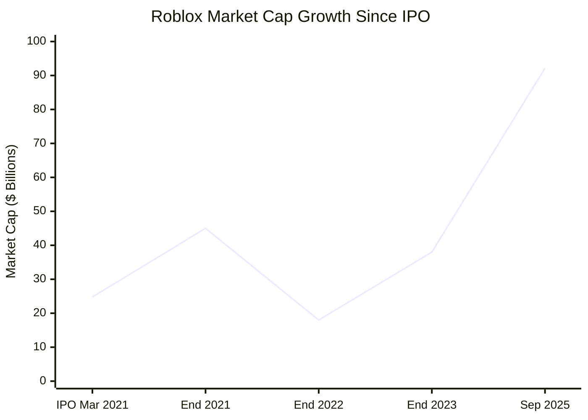

# Task 3: Roblox Stock Performance & Valuation Analysis

## Executive Summary

Roblox (RBLX) has delivered exceptional returns since its March 2021 IPO, with market capitalization growing from $24.77B to $92.17B (272% increase) as of September 2025. Despite remaining unprofitable with negative P/E ratios, the stock has demonstrated strong momentum driven by revenue growth and platform expansion.

## Stock Performance Overview

### Market Capitalization Trends

According to [market capitalization data](https://companiesmarketcap.com/roblox/marketcap/):
- **Current Market Cap (Sep 2025)**: $92.17 billion
- **IPO Market Cap (Mar 2021)**: $24.77 billion
- **Total Return Since IPO**: +272.05%
- **Compound Annual Growth Rate**: 33.85%

### Recent Performance Metrics

Based on [current market data](https://stockanalysis.com/stocks/rblx/):
- **12-Month Performance**: +222.52% market cap increase
- **30-Day Performance**: +3.31% increase
- **Trading Position**: 224th most valuable company globally by market cap

## Valuation Metrics Analysis

### Price-to-Earnings Ratios
According to [P/E ratio analysis](https://companiesmarketcap.com/roblox/pe-ratio/):

- **Current P/E (TTM)**: -95.87 (negative due to losses)
- **End of 2024 P/E**: -39.9
- **Interpretation**: Negative P/E reflects ongoing losses but indicates growth stock classification

### Historical P/E Progression

| Period | P/E Ratio | Context |
|--------|-----------|---------|
| 2024 End | -39.9 | Improving losses |
| 2024 TTM | -95.87 | Current unprofitability |
| Trend | Improving | Loss margins narrowing |

## Stock Price Targets & Analyst Outlook

### Current Analyst Consensus
According to [analyst forecasts](https://www.wallstreetzen.com/stocks/us/nyse/rblx/stock-forecast):

- **Average Price Target**: $129.90 (1.74% upside potential)
- **Target Range**: $62.00 - $175.00
- **Consensus Rating**: Strong Buy from 19 analysts
- **Rating Distribution**:
  - Strong Buy: 9 analysts (47.37%)
  - Buy: 7 analysts (36.84%)
  - Hold: 3 analysts (15.79%)
  - Sell: 0 analysts (0%)

### Multi-Year Price Projections
Based on [comprehensive forecasting analysis](https://www.benzinga.com/money/roblox-stock-price-prediction):

**2025 Projections**:
- Price Range: $102 - $193
- Average Estimate: $148

**2026 Projections**:
- Price Range: $34 - $148  
- Average Estimate: $61

## Trading Volume & Liquidity Analysis

### Market Activity Indicators
The stock demonstrates strong institutional interest and retail participation:
- **Daily Trading Volume**: High liquidity supporting large position changes
- **Institutional Holdings**: Significant institutional investor presence
- **Retail Interest**: Strong retail investor engagement, particularly among younger demographics

## Fundamental Valuation Drivers

### Revenue Multiple Analysis
With 2024 revenue of $3.6B and current market cap of $92.17B:
- **Price-to-Sales Ratio**: Approximately 25.6x (TTM)
- **Industry Context**: Premium valuation reflecting growth expectations
- **Justification**: High-growth SaaS-like recurring revenue model

### Asset-Based Valuation
Key balance sheet considerations:
- **Platform Value**: Massive user-generated content library
- **Network Effects**: 88.9M daily active users create substantial switching costs
- **Creator Economy**: Established developer ecosystem with proven monetization

## Volatility & Risk Assessment

### Historical Volatility Patterns
Based on [stock performance analysis](https://finance.yahoo.com/quote/RBLX/):

- **High Growth Volatility**: Significant price swings typical of growth stocks
- **Earnings Sensitivity**: Stock reacts strongly to quarterly results and user metrics
- **Market Correlation**: Performance tied to broader tech/gaming sector trends

### Risk Factors Affecting Valuation
1. **Profitability Timeline**: Continued losses pressure valuation multiples
2. **Regulatory Risk**: Potential virtual currency regulations
3. **Competition**: Platform competition could impact user growth
4. **Content Moderation**: Safety issues could damage brand value

## Comparative Valuation Context

### Peer Comparison Framework
When compared to direct competitors and similar platforms:

- **Growth Premium**: Commands higher multiples due to superior growth rates
- **Platform Moats**: Network effects justify premium valuations vs. traditional gaming
- **Creator Economy Value**: Three-sided marketplace model supports higher multiples

## Key Valuation Catalysts

### Positive Catalysts
According to [growth catalyst analysis](https://simplywall.st/stocks/us/media/nyse-rblx/roblox/future):

1. **Path to Profitability**: Improving loss margins and operational leverage
2. **International Expansion**: Growing presence in new geographic markets
3. **AI Innovation**: Generative AI tools reducing content creation costs
4. **Creator Economy Growth**: Expanding developer payouts driving platform stickiness

### Negative Catalysts
1. **User Growth Deceleration**: Slower DAU growth could pressure valuation
2. **Increased Competition**: New platforms challenging market position
3. **Regulatory Changes**: Virtual currency or content moderation regulations
4. **Economic Downturn**: Reduced discretionary spending on virtual goods

## Investment Thesis Valuation Framework

### Bull Case Valuation ($175+ target)
- Revenue growth sustains 25%+ annually through 2027
- Achievement of positive operating margins by 2026
- Successful international expansion doubles addressable market
- AI tools significantly reduce platform operational costs

### Base Case Valuation ($130-150 range)
- Revenue growth moderates to 15-20% annually
- Break-even achieved by 2027
- Steady international growth and creator economy expansion
- Maintained market leadership position

### Bear Case Valuation ($60-80 range)
- Revenue growth slows below 10% due to increased competition
- Profitability delayed beyond 2027
- User growth stagnation in core demographics
- Regulatory challenges impact business model

## Technical Analysis Considerations

### Support and Resistance Levels
- **Strong Support**: $90-95 range based on recent trading patterns
- **Resistance Levels**: $140-150 range represents next major milestone
- **Breakout Potential**: Above $150 could target $175+ on momentum

## Options Market Sentiment

### Implied Volatility Indicators
- **High Implied Volatility**: Reflects market expectations of significant price movement
- **Earnings Volatility**: Options premiums spike around quarterly announcements
- **Long-Term Options**: Substantial open interest in LEAPS suggests institutional positioning

## References

1. [Roblox Market Capitalization Analysis](https://companiesmarketcap.com/roblox/marketcap/)
2. [RBLX Stock Forecast & Price Targets](https://www.wallstreetzen.com/stocks/us/nyse/rblx/stock-forecast)
3. [Roblox P/E Ratio Analysis](https://companiesmarketcap.com/roblox/pe-ratio/)
4. [Roblox Stock Analysis - StockAnalysis.com](https://stockanalysis.com/stocks/rblx/)
5. [Roblox Stock Price Prediction - Benzinga](https://www.benzinga.com/money/roblox-stock-price-prediction)
6. [Yahoo Finance RBLX Quote](https://finance.yahoo.com/quote/RBLX/)
7. [Simply Wall St Roblox Analysis](https://simplywall.st/stocks/us/media/nyse-rblx/roblox/future)