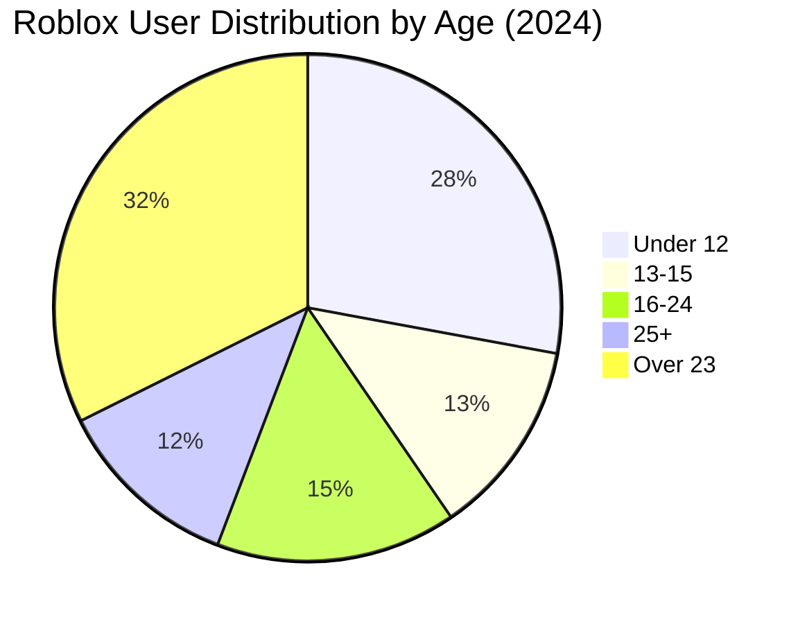
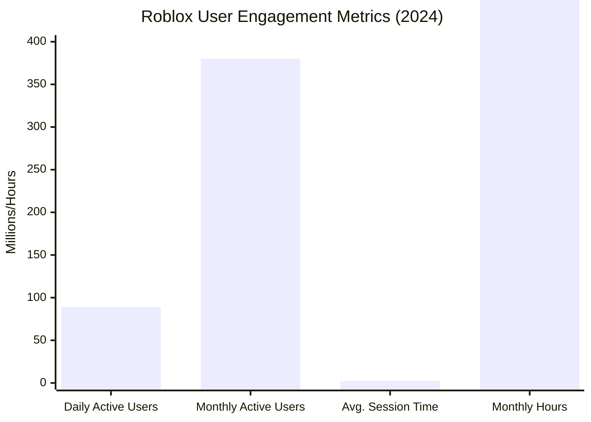

# Task 4: Roblox User Demographics & Monetization Analysis

## Executive Summary

Roblox's user base of 88.9 million daily active users spans multiple age groups, with children under 12 representing the largest segment (40%) but significant growth occurring in older demographics. The platform demonstrates strong monetization across age groups, with 60% of households making monthly purchases and average spending of $12.01 per user in Q2 2024.

## User Age Demographics Breakdown

### Primary Age Group Analysis
According to [comprehensive demographic studies](https://www.statista.com/statistics/1190869/roblox-games-users-global-distribution-age/):

- **Under 12 Years**: ~40% of user base (largest single demographic)
- **13-15 Years**: ~18% of users
- **16-24 Years**: ~22% of users  
- **25+ Years**: ~17% of users
- **Over 23 Years**: 46.4 million users (growing segment)

### Key Demographic Insights
Based on [detailed demographic analysis](https://www.takeaway-reality.com/post/roblox-demographics-statistics):

- **Younger Users (Under 16)**: Comprise 58% of total user base
- **Q3 2024 Under-13 DAUs**: Over 34 million daily active users
- **Platform Aging**: Users aging up with the platform, showing strong retention

## Geographic Distribution

### Regional User Base
According to [global usage patterns](https://techpoint.africa/guide/roblox-user-demographics/):

- **North America**: Primary market with highest revenue per user
- **Europe**: Significant user base with growing monetization
- **Asia-Pacific**: Expanding presence with localization efforts
- **Emerging Markets**: Growing user acquisition but lower ARPU

### Platform Accessibility
Based on [platform usage data](https://www.skillademia.com/statistics/roblox-statistics/):

- **Mobile Usage**: Over 70% of users play on mobile devices
- **Cross-Platform**: Accessible on desktop, console, mobile, and VR
- **Global Reach**: Available in multiple languages with localization

## User Engagement Metrics

### Daily Usage Patterns
According to [engagement statistics](https://www.notta.ai/en/blog/roblox-statistics):

- **Average Daily Usage**: 2.6 hours per user
- **Total Monthly Hours**: 20.7 billion hours in 2024
- **Session Frequency**: 1 in 5 users engage daily (380M MAUs, 79.5M DAUs)
- **Engagement Growth**: Consistent increase in time spent per user

### User Activity Breakdown

## Purchasing Behavior & Monetization

### Household Spending Patterns
According to [spending behavior analysis](https://www.theshelf.com/the-blog/roblox-stats-and-spending/):

**Monthly Spending Trends**:
- **60% of households** with Roblox players spend money monthly
- **Growth**: Up from 46% in 2020 and 59% in 2022
- **Spending Distribution**: Majority spend under $25 monthly

**H1 2024 Spending Data**:
- **Total Player Spending**: $1.88 billion on Robux purchases
- **Average Spending**: $12.01 per player in Q2 2024
- **YoY Growth**: +0.75% from $11.92 in Q2 2023

### Age-Based Purchasing Behavior

#### Children's Spending Patterns
Key insights about children's purchasing decisions:

- **Parental Involvement**: Most purchases require parental authorization
- **Payment Methods**: Parents control payment methods and spending limits
- **Purchase Triggers**: Social pressure, game progression, and aesthetic customization drive spending

#### Teenage & Young Adult Spending
- **Independent Purchasing**: Greater financial autonomy in 16+ demographic  
- **Higher Engagement**: Longer session times correlate with increased spending
- **Social Features**: Friend networks drive competitive spending patterns

## Do Kids Purchase Independently?

### Payment Structure Analysis
Based on [family spending research](https://civicscience.com/roblox-is-winning-among-younger-consumers-heres-why-brands-should-take-notice/):

**Under-13 Purchases**:
- **Parental Control**: Purchases typically require parent approval
- **Gift Cards**: Popular method for giving children spending autonomy
- **Allowance Integration**: Parents often allocate Robux as part of digital allowances
- **Supervised Spending**: Most transactions involve parental oversight

**13+ Purchases**:
- **Increased Independence**: Greater ability to make direct purchases
- **Payment Methods**: Access to debit cards and digital payment systems
- **Higher Spend**: Older users typically have higher average spending

### Family Engagement Patterns
According to [family gaming studies](https://www.enterpriseappstoday.com/stats/roblox-statistics.html):

- **Parent Participation**: 44% of Gen Alpha parents play Roblox
- **Family Gaming**: 27% of parent-gamers spend 6-10 hours weekly playing with children
- **Shared Experiences**: Family play sessions often lead to increased spending

## User Retention & Platform Stickiness

### Age-Based Retention Analysis
Based on [platform retention studies](https://www.konvoy.vc/newsletters/roblox-is-not-aging-up):

**Positive Retention Indicators**:
- **Aging Up**: Users increasingly staying on platform as they grow older
- **Brand Loyalty**: Strong attachment to platform and creator ecosystem
- **Social Networks**: Friend connections create switching costs

**Platform Evolution**:
- **Content Maturity**: Experiences evolving to serve older demographics
- **Creator Tools**: Advanced development capabilities attracting older creators
- **Monetization Growth**: Older users typically have higher lifetime value

## Demographics by Platform Usage

### Device Preference by Age Group
Based on [platform usage analysis](https://avatarfactories.com/blog/how-many-people-play-roblox-2024-2/):

- **Mobile Primary**: 70%+ usage, especially popular with younger users
- **Desktop Gaming**: Preferred by older users and serious creators
- **Console Integration**: Growing adoption across age groups
- **VR Adoption**: Early adopter usage primarily in 16+ demographic

### Session Length by Demographics
- **Under 13**: Shorter but more frequent sessions
- **13-17**: Longest average session times (2.6+ hours)
- **18+**: Consistent engagement with quality-focused gameplay

## Marketing & Brand Implications

### Advertising Effectiveness
According to [consumer behavior studies](https://civicscience.com/roblox-is-winning-among-younger-consumers-heres-why-brands-should-take-notice/):

- **Brand Awareness**: High brand recall among younger demographics
- **Purchase Influence**: Platform experiences influence real-world purchasing decisions
- **Social Commerce**: Virtual items often translate to real-world brand affinity

### Creator Economy Demographics
- **Young Creators**: Many successful developers are teenagers or young adults
- **Income Generation**: Platform provides legitimate income source for young entrepreneurs
- **Skill Development**: Users develop programming, design, and business skills

## Future Demographic Trends

### Aging User Base Implications
Based on [trend analysis](https://www.konvoy.vc/newsletters/roblox-is-not-aging-up):

**Positive Implications**:
- **Higher Purchasing Power**: Older users have greater spending capacity
- **Longer Engagement**: Mature users show sustained platform loyalty
- **Creator Quality**: More sophisticated content creation capabilities

**Platform Adaptation**:
- **Content Evolution**: Experiences becoming more sophisticated
- **Monetization Expansion**: New revenue streams targeting older demographics
- **Brand Partnerships**: Premium collaborations with mature-focused brands

## References

1. [Global Roblox Game User Distribution by Age | Statista](https://www.statista.com/statistics/1190869/roblox-games-users-global-distribution-age/)
2. [Roblox Demographics Statistics 2025](https://www.takeaway-reality.com/post/roblox-demographics-statistics)
3. [Roblox User Demographics & Usage Trends](https://techpoint.africa/guide/roblox-user-demographics/)
4. [Roblox Game News: Winning Among Younger Consumers](https://civicscience.com/roblox-is-winning-among-younger-consumers-heres-why-brands-should-take-notice/)
5. [Everything You Need to Know on Roblox Stats and Spending](https://www.theshelf.com/the-blog/roblox-stats-and-spending/)
6. [Roblox Statistics 2024: Key User, Game & Revenue Data](https://www.skillademia.com/statistics/roblox-statistics/)
7. [Roblox Is Not Aging Up - Konvoy Analysis](https://www.konvoy.vc/newsletters/roblox-is-not-aging-up)
8. [How Many People Play Roblox in 2024](https://avatarfactories.com/blog/how-many-people-play-roblox-2024-2/)