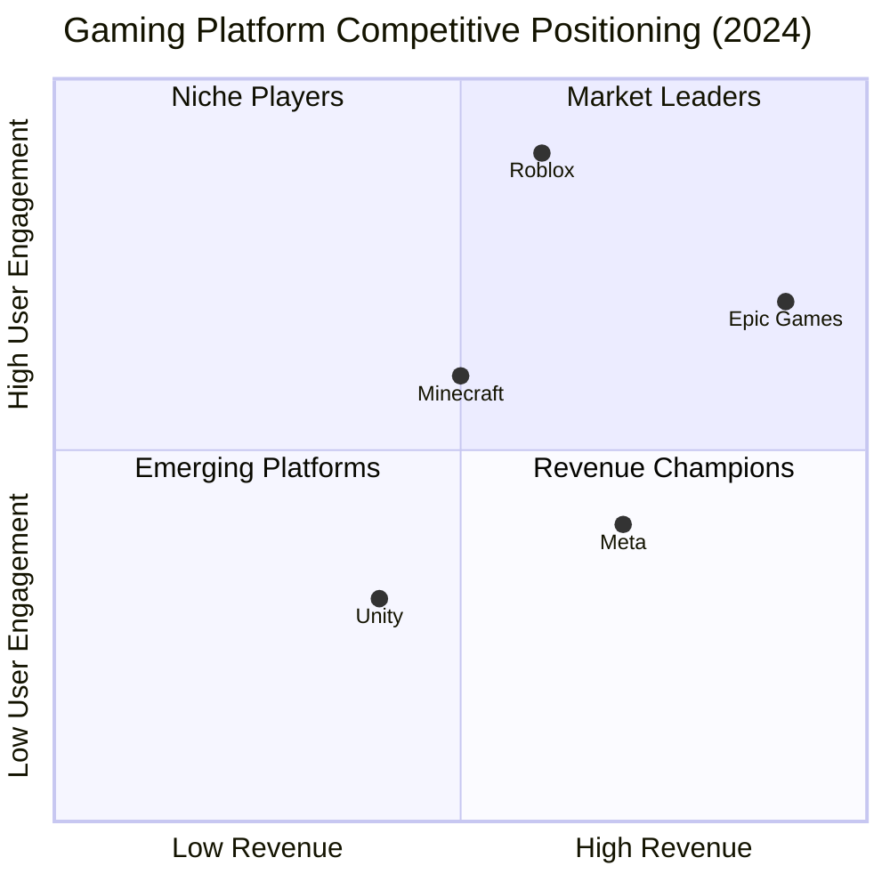
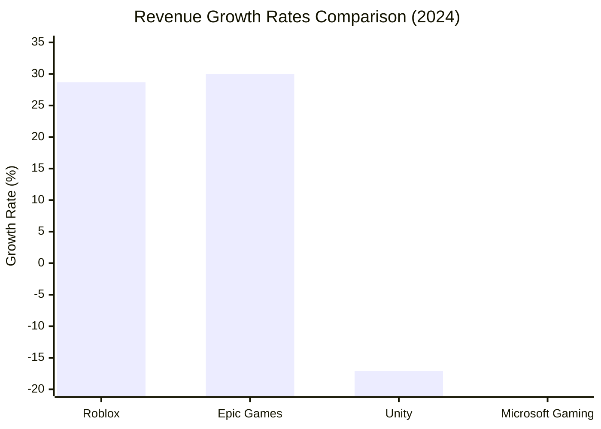
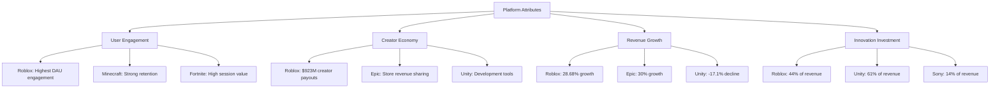

# Task 5: Competitive Landscape Analysis

## Executive Summary

Roblox operates in a competitive landscape dominated by Epic Games (Fortnite), Unity Technologies, Microsoft (Minecraft), and emerging metaverse platforms. While Roblox leads in user engagement metrics with 5x more monthly players than Minecraft and 2.25x more than Fortnite, competitors like Epic Games generate significantly higher revenue ($5.7B vs Roblox's $3.6B in 2024).

## Primary Competitors Overview

## Direct Platform Competitors

### Epic Games (Fortnite Ecosystem)
**Financial Performance (2024)**:
According to [Epic Games revenue analysis](https://sacra.com/c/epic-games/):
- **2024 Revenue**: $5.7B (+30% YoY from $5.2B in 2023)
- **Valuation**: $22.5B (February 2024)
- **P/E Ratio**: Not applicable (private company)

**Key Strengths**:
- Higher total revenue than Roblox
- Diverse revenue streams (Fortnite, Epic Games Store, Unreal Engine)
- Strong brand recognition in gaming

**Competitive Positioning**:
- **Epic Games Store**: $285M revenue in 2023
- **Unreal Engine**: $275M revenue in 2023  
- **User Base**: Smaller than Roblox but higher ARPU

### Unity Technologies (U)
**Financial Performance (2024)**:
Based on [Unity financial results](https://investors.unity.com/news/news-details/2025/Unity-Reports-Fourth-Quarter-and-Fiscal-Year-2024-Financial-Results/default.aspx):
- **2024 Revenue**: $1.813B (-17.1% YoY decline)
- **P/E Ratio**: -21.22 (TTM), -13.4 (end of 2024)
- **Q4 2024**: $442M revenue (+4% YoY)

**Key Challenges**:
- Revenue decline driven by portfolio reset
- Negative profitability similar to Roblox
- Focus shifting to Unity 6 platform adoption

**Competitive Positioning**:
- **R&D Spending**: $1.1B in 2024 (vs Roblox's $1.5B)
- **Unity 6 Adoption**: 38% of active users upgraded, 2.8M downloads
- **Market Position**: Tool provider rather than direct platform competitor

### Microsoft (Minecraft)
**Financial Performance (2024)**:
According to [Minecraft revenue analysis](https://www.businessofapps.com/data/minecraft-statistics/):
- **Minecraft Revenue**: $220M in 2024 (mobile: $115M)
- **Microsoft Gaming**: $15.47B total (down from $21.5B)
- **P/E Ratio**: Microsoft overall P/E ~28 (profitable company)

**User Metrics Comparison**:
Based on [player comparison studies](https://vocal.media/gamers/how-do-minecraft-vs-roblox-compare-analysis-of-video-games):
- **Monthly Active Users**: 204.33M (vs Roblox's 380M)
- **Daily Active Users**: 55.17M (vs Roblox's 88.9M)
- **Player Ratio**: Roblox has ~5x more monthly players

## P/E Ratio & Valuation Comparison

### Growth Stock Valuations (Negative P/E)
| Company | P/E Ratio (TTM) | P/E Ratio (2024 End) | Revenue Growth |
|---------|-----------------|----------------------|----------------|
| **Roblox** | -95.87 | -39.9 | +28.68% |
| **Unity** | -21.22 | -13.4 | -17.1% |
| **Epic Games** | N/A (Private) | N/A | +30% |

### Profitable Competitor Comparison
| Company | P/E Ratio | Market Cap | Revenue (2024) |
|---------|-----------|------------|----------------|
| **Microsoft** | ~28 | $3.1T | $245B total |
| **Meta** | ~26 | $1.4T | $134B |
| **Apple** | ~35 | $3.5T | $391B |

## Revenue Growth Rate Analysis

### Growth Performance Rankings
1. **Epic Games**: +30% revenue growth
2. **Roblox**: +28.68% revenue growth  
3. **Unity**: -17.1% revenue decline
4. **Microsoft Gaming**: -28% revenue decline

## Market Share & User Engagement

### User Engagement Comparison
According to [comprehensive user metrics](https://www.matthewball.co/all/roblox2024):

**Roblox Advantages**:
- **Monthly Players**: 5x more than Minecraft, 2.25x more than Fortnite
- **Time Spent**: 20.7 billion hours annually (6 billion monthly)
- **Session Length**: 2.4 hours average daily engagement
- **Platform Stickiness**: Users spend close to 6 billion hours monthly

**Competitor Metrics**:
- **Minecraft**: 204.33M MAUs, strong but lower engagement
- **Fortnite**: ~169M MAUs (estimated), high ARPU
- **Unity**: Platform provider, not direct user engagement competitor

## R&D Investment Analysis

### Innovation Spending Comparison
Based on [R&D investment analysis](https://www.matthewball.co/all/roblox2024):

| Company | R&D Spending (2024) | % of Revenue | Focus Areas |
|---------|---------------------|--------------|-------------|
| **Roblox** | $1.5B | 44% | AI tools, creator economy, infrastructure |
| **Unity** | $1.1B | 61% | Unity 6, development tools |
| **Sony PlayStation** | $2.2B | ~14% | Console development, games |

**Key Insights**:
- Roblox invests highest percentage of revenue in R&D
- Focus on generative AI and creator tools differentiates approach
- Investment supports long-term platform competitiveness

## Competitive Moats Analysis

### Roblox Unique Advantages
1. **Creator Economy Scale**: $923M paid to creators in 2024
2. **Network Effects**: 88.9M DAUs create strong platform lock-in
3. **User-Generated Content**: Infinite content scaling without direct costs
4. **Multi-Platform Reach**: Available across all major gaming devices

### Competitor Advantages

**Epic Games**:
- Diverse revenue streams reduce platform risk
- Unreal Engine provides B2B revenue stability
- Higher per-user monetization rates

**Microsoft/Minecraft**:
- Integrated ecosystem with Xbox and Windows
- Educational market penetration
- Brand trust and parental approval

**Unity Technologies**:
- Development tool market leadership
- B2B revenue model stability
- Creator tool ecosystem

## Emerging Competition Threats

### New Market Entrants
According to [competitive landscape analysis](https://craft.co/roblox/competitors):

1. **Meta Horizon Worlds**: VR-focused metaverse platform
2. **Apple Vision Pro**: Potential AR/VR gaming platform
3. **TikTok**: Social gaming features expansion
4. **Discord**: Gaming community and creation tools

### Platform Evolution Risks
- **AI-Generated Content**: Could commoditize user-generated content advantage
- **Blockchain Gaming**: Web3 platforms offering creator ownership models  
- **Cloud Gaming**: Reduced platform-specific advantages

## Market Positioning Assessment

### Competitive Strengths Matrix

### Strategic Positioning Summary

**Market Leadership Areas (Roblox)**:
- User engagement and time spent
- Creator economy scale and growth
- Platform stickiness and retention
- Multi-generational user base

**Areas Where Competitors Lead**:
- **Total Revenue**: Epic Games ($5.7B vs $3.6B)
- **Profitability**: Microsoft gaming division profitable
- **ARPU**: Fortnite higher revenue per user
- **B2B Revenue**: Unity's enterprise model

## Investment Implications

### Competitive Risk Assessment
1. **Low Risk**: User engagement moats create switching costs
2. **Medium Risk**: Revenue concentration in virtual currency model
3. **High Risk**: Platform safety regulations could impact competitive position

### Growth Opportunity Comparison
- **Roblox**: International expansion, aging user base monetization
- **Epic Games**: Metaverse expansion, enterprise tools growth  
- **Unity**: Recovery from portfolio reset, Unity 6 adoption
- **Microsoft**: AI integration, cloud gaming synergies

## References

1. [Epic Games Revenue Valuation & Funding - Sacra](https://sacra.com/c/epic-games/)
2. [Unity Reports Q4 2024 Financial Results](https://investors.unity.com/news/news-details/2025/Unity-Reports-Fourth-Quarter-and-Fiscal-Year-2024-Financial-Results/default.aspx)
3. [Minecraft Revenue and Usage Statistics - Business of Apps](https://www.businessofapps.com/data/minecraft-statistics/)
4. [Roblox Business Analysis - Matthew Ball](https://www.matthewball.co/all/roblox2024)
5. [Top Roblox Competitors and Alternatives - Craft.co](https://craft.co/roblox/competitors)
6. [Distinguishing Key Metaverse Competitors](https://contextisking.com/2022/06/17/distinguishing-the-key-competitors-in-the-metaverse-roblox-unity-epic-games/)
7. [Unity Software P/E Ratio Analysis](https://companiesmarketcap.com/unity-software/pe-ratio/)
8. [How Do Minecraft vs Roblox Compare - Analysis](https://vocal.media/gamers/how-do-minecraft-vs-roblox-compare-analysis-of-video-games)