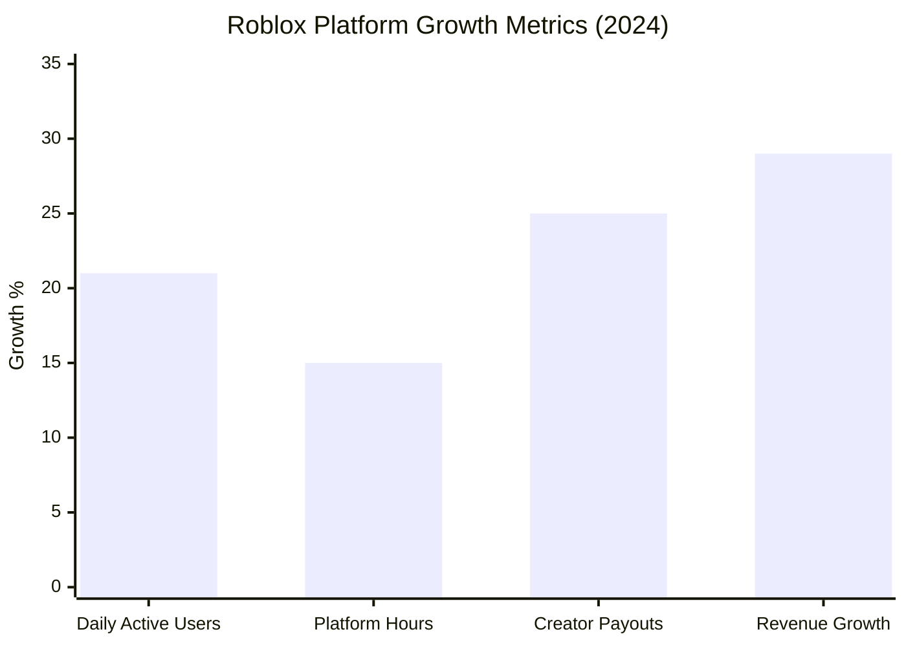

# Task 6: New Game Titles & Platform Development Analysis

## Executive Summary

Roblox has launched groundbreaking AI-powered creation tools in 2024-2025, including the revolutionary Cube 3D generative AI system and 4D object generation capabilities. The platform's focus on creator empowerment, combined with new monetization features like physical merchandise integration and enhanced revenue sharing, positions Roblox at the forefront of metaverse platform innovation.

## Major Platform Developments (2024-2025)

### Revolutionary AI-Powered Creation Tools

#### Roblox Cube 3D AI System
According to [Roblox's RDC 2025 announcements](https://corp.roblox.com/newsroom/2025/09/roblox-rdc-2025):

**Core Capabilities**:
- **Open Source Model**: First-of-its-kind open source 3D foundational model
- **Cross-Platform Usage**: Available on and off the Roblox platform
- **Cube Mesh Generation API**: Beta launch enabling 3D asset creation
- **Industry Innovation**: Leading generative AI development in gaming

**Technical Breakthrough**:
According to [MIT Technology Review coverage](https://www.technologyreview.com/2024/09/06/1103707/roblox-is-launching-a-generative-ai-that-builds-3d-environments-in-a-snap/), Roblox's generative AI builds 3D environments instantly, representing a major advancement in real-time content creation.

#### 4D Object Generation
**Next-Generation Capability**:
- **Functional Objects**: Beyond static 3D to fully interactive scripted assets
- **Vehicle Generation**: Create functional cars from text prompts ("sleek, futuristic red sports car")
- **Weapon Systems**: Generated interactive weapons with complete functionality
- **User Experience**: Seamless transition from text description to playable content

### Real-Time Communication Revolution

#### Multi-Language Support
Based on [TechCrunch coverage](https://techcrunch.com/2025/09/05/roblox-announces-short-form-video-feed-for-gameplay-clips-new-ai-tools-for-creators-and-more/):

**Translation Capabilities**:
- **Real-Time Voice Translation**: Instant translation of voice chat (2025 launch)
- **Language Support**: English, Spanish, French, and German initially
- **Text-to-Speech API**: 10 English voice presets for creators
- **Speech-to-Text**: Enhanced accessibility and interaction options

**Global Impact**:
- Breaks down language barriers for international creators
- Expands addressable market for user-generated content
- Enhances cross-cultural gaming experiences

## Content Discovery & Social Features

### Roblox Moments
**Short-Form Video Platform**:
- **Beta Launch**: Available for users 13+ in 2024
- **Content Format**: 30-second gameplay clips with music and descriptions
- **Discovery Mechanism**: Scrollable feed for experience discovery
- **Creator Tools**: Trimming, music integration, and sharing capabilities

**Strategic Importance**:
- Competes with TikTok-style content discovery
- Drives user acquisition through viral gameplay moments
- Enhances creator visibility and platform engagement

## Popular Games & Content Trends (2025)

### Top-Performing Experiences
According to [gaming performance analysis](https://gam3s.gg/news/best-roblox-games-in-may-2025/):

**"Grow a Garden" Dominance**:
- **Revenue**: $12 million in May 2025
- **Playtime**: 1.2 billion hours played (all-time high)
- **Achievement**: Highest-earning game on Roblox platform
- **User Engagement**: Demonstrates platform's content diversity beyond traditional gaming

### Content Evolution Trends
**Experience Sophistication**:
- **Mature Content**: Games evolving to serve older demographics
- **Complex Narratives**: Story-driven experiences gaining popularity
- **Social Spaces**: Virtual meetup and event spaces expanding
- **Educational Content**: Learning-focused experiences growing segment

## Technical Infrastructure Advances

### Harmony Technology Platform
According to [platform optimization announcements](https://devforum.roblox.com/t/creator-roadmap-2025-spring-update/3624895):

**Engine Streaming Optimization**:
- **Client-Side Balancing**: CPU, GPU, RAM, and bandwidth optimization
- **Server Optimization**: Enhanced performance across all devices
- **Universal Experience**: Consistent quality regardless of device capabilities
- **Future-Proofing**: Scalable architecture for growing user base

### Studio Enhancement Tools
**Creator Development Platform**:
- **MCP Integration**: Assistant integration for accelerated creation
- **Collaborative Tools**: Multi-creator development environment
- **Enhanced Publishing**: Streamlined content deployment process
- **Analytics Integration**: Advanced creator performance insights

## Monetization Platform Expansion

### Physical Merchandise Integration
Based on [economy expansion announcements](https://corp.roblox.com/newsroom/2025/03/unveiling-future-creation-native-3d-generation-collaborative-studio-tools-economy-expansion):

**Shopify Partnership**:
- **Direct Sales**: Creators sell physical merchandise within experiences
- **Revenue Stream Diversification**: Beyond virtual goods to real-world products
- **Brand Integration**: Enhanced opportunities for brand collaborations
- **Creator Economy Growth**: New income sources for successful developers

### Enhanced Revenue Sharing
**Creator Compensation Improvements**:
- **DevEx Rate Increase**: 8.5% higher conversion rates for Robux-to-cash
- **Paid Access Revenue**: Higher shares for premium-priced experiences
- **Creator Growth**: Top 1,000 developers average $820,000 (570% growth since 2019)

## Platform Performance Metrics

### User Growth Acceleration
According to [Q4 2024 financial results](https://ir.roblox.com/news/news-details/2025/Roblox-Reports-Fourth-Quarter-and-Full-Year-2024-Financial-Results/default.aspx):

**Key Metrics**:
- **DAU Growth**: 21% in 2024 (vs single-digit industry growth)
- **User Engagement**: 85.3M DAUs spending 2.4 hours daily average
- **Creator Economy**: $923M paid to creators (+25% YoY)
- **Revenue Performance**: Sustained 25%+ growth rates

## Innovation Pipeline (2025-2026)

### Upcoming Features
**Creator Tools Roadmap**:
- **Advanced AI Integration**: Expanded generative capabilities
- **Cross-Reality Support**: Enhanced VR/AR integration
- **Blockchain Integration**: Potential NFT and Web3 features
- **Professional Tools**: Enterprise-grade development capabilities

### Platform Expansion
**Market Development**:
- **Geographic Expansion**: New regional markets and localization
- **Age Demographics**: Content targeting older user segments  
- **Educational Partnerships**: Formal education integration programs
- **Enterprise Solutions**: B2B platform applications

## Competitive Technology Advantage

### AI Leadership Position
**Industry Differentiation**:
- **First Mover**: Open-source 3D AI model in gaming
- **Creator Empowerment**: Democratizing content creation through AI
- **Technical Moats**: Proprietary AI models create competitive barriers
- **Platform Lock-in**: AI tools integrated deeply into creator workflow

### Development Ecosystem
**Creator Platform Strength**:
- **Tool Integration**: Seamless development-to-deployment pipeline
- **Community Support**: Extensive creator education and resources
- **Monetization Clarity**: Transparent revenue sharing models
- **Global Reach**: Multi-platform, multi-language accessibility

## Investment in Innovation

### R&D Allocation Focus
Based on [comprehensive platform analysis](https://www.matthewball.co/all/roblox2024):

**Technology Investment Priorities**:
- **Generative AI**: Core focus on creation automation
- **Infrastructure Scaling**: Supporting massive concurrent user base
- **Creator Tools**: Professional-grade development capabilities
- **Safety Systems**: AI-powered content moderation and user protection

## Future Platform Vision

### Metaverse Integration
**Long-Term Strategy**:
- **Virtual Economy**: Expanded real-world economic integration
- **Social Commerce**: Shopping and commerce within experiences
- **Professional Networking**: Business and education use cases
- **Cultural Events**: Major brand and entertainment partnerships

### Technology Roadmap
**Innovation Trajectory**:
- **AI-Generated Worlds**: Fully automated environment creation
- **Real-Time Collaboration**: Advanced multi-creator development tools
- **Cross-Platform Integration**: Seamless experience across all devices
- **Blockchain Integration**: Potential decentralized creator ownership models

## References

1. [RDC 2025 - Roblox Corp](https://corp.roblox.com/newsroom/2025/09/roblox-rdc-2025)
2. [Unveiling Future Creation - Roblox Corp](https://corp.roblox.com/newsroom/2025/03/unveiling-future-creation-native-3d-generation-collaborative-studio-tools-economy-expansion)
3. [Roblox Announces AI Tools and Video Feed - TechCrunch](https://techcrunch.com/2025/09/05/roblox-announces-short-form-video-feed-for-gameplay-clips-new-ai-tools-for-creators-and-more/)
4. [Roblox Generative AI Analysis - MIT Technology Review](https://www.technologyreview.com/2024/09/06/1103707/roblox-is-launching-a-generative-ai-that-builds-3d-environments-in-a-snap/)
5. [Best Roblox Games May 2025 - GAM3S.GG](https://gam3s.gg/news/best-roblox-games-in-may-2025/)
6. [Creator Roadmap 2025 Spring Update](https://devforum.roblox.com/t/creator-roadmap-2025-spring-update/3624895)
7. [Roblox Q4 2024 Financial Results](https://ir.roblox.com/news/news-details/2025/Roblox-Reports-Fourth-Quarter-and-Full-Year-2024-Financial-Results/default.aspx)
8. [Roblox Business Analysis - Matthew Ball](https://www.matthewball.co/all/roblox2024)