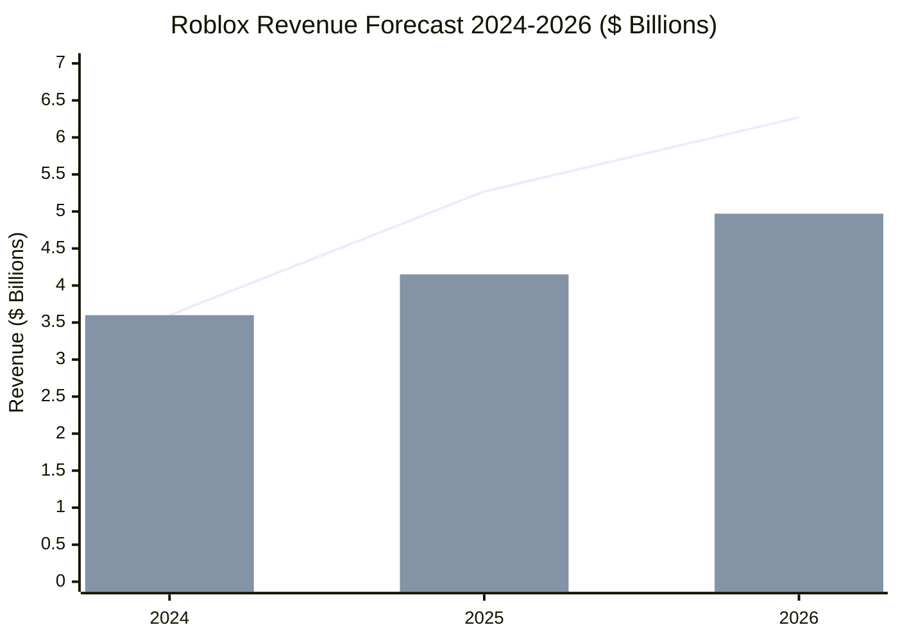

# Task 7: Growth Forecast & Catalysts Analysis

## Executive Summary

Roblox is projected to achieve $4.15-5.27 billion in revenue for 2025 and $4.97-6.27 billion for 2026, representing continued strong growth despite expected moderation from current 28%+ rates. Key catalysts include AI-powered creator tools, international expansion, aging user demographics with higher purchasing power, and new monetization streams through physical merchandise integration.

## Revenue Forecast Analysis

### Analyst Consensus Projections

According to [comprehensive analyst forecasts](https://www.wallstreetzen.com/stocks/us/nyse/rblx/stock-forecast):

**2025 Revenue Projections**:
- **Consensus Estimate**: $4.15 billion (average of 8 analysts)
- **Range**: $4.13B (low) to $4.20B (high)
- **Optimistic Scenario**: $5.27 billion
- **Implied Growth**: 15-46% YoY from 2024's $3.6B

**2026 Revenue Projections**:
- **Consensus Estimate**: $4.97 billion (average of 9 analysts)
- **Range**: $4.44B (low) to $5.23B (high)
- **Optimistic Scenario**: $6.27 billion
- **Implied Growth**: 20-26% YoY from projected 2025

## Earnings Projections & Path to Profitability

### Loss Improvement Trajectory
Based on [earnings forecasting data](https://www.tipranks.com/stocks/rblx/forecast):

**2025 EPS Projections**:
- **Average EPS Forecast**: -$1.71
- **Range**: -$1.87 (worst) to -$1.50 (best)
- **Improvement**: Narrowing losses from 2024's -$2.61 EPS

**2026 EPS Projections**:
- **Average EPS Forecast**: -$1.33
- **Range**: -$1.80 (worst) to -$0.55 (best)
- **Trend**: Continued loss reduction toward breakeven

### Profitability Timeline
According to [financial analysis projections](https://simplywall.st/stocks/us/media/nyse-rblx/roblox/future):
- **Break-even Target**: Potentially achieved by 2027-2028
- **Operating Leverage**: High fixed costs suggest rapid profitability once achieved
- **Investment Phase**: Continued heavy R&D investment delaying profitability

## Key Growth Catalysts

### 1. AI-Powered Creation Revolution
**Technology Catalyst Impact**:
According to [platform development analysis](https://corp.roblox.com/newsroom/2025/03/unveiling-future-creation-native-3d-generation-collaborative-studio-tools-economy-expansion):

- **Cube 3D AI**: Open-source model democratizes content creation
- **4D Object Generation**: Functional object creation reduces development barriers
- **Creator Productivity**: AI tools could 10x content creation speed
- **Cost Reduction**: Automated content generation reduces platform operational costs

**Revenue Impact Projection**:
- **Creator Attraction**: AI tools attract more high-quality developers
- **Content Quality**: Higher-quality experiences drive increased user spending
- **Competitive Moat**: First-mover advantage in AI-powered creation tools

### 2. International Market Expansion
**Global Growth Opportunity**:
Based on [demographic expansion studies](https://techpoint.africa/guide/roblox-user-demographics/):

- **Untapped Markets**: Significant growth potential in Asia-Pacific, Latin America
- **Localization Investment**: Multi-language support and regional content
- **Mobile-First Strategy**: 70% mobile usage aligns with global mobile adoption
- **Payment Integration**: Local payment methods expanding accessibility

**Market Size Implications**:
- **Addressable Market**: Potential 3-5x expansion from current geographic reach
- **Revenue Per User**: Lower initial ARPU but massive user volume potential
- **Network Effects**: Global user base strengthens creator economy

### 3. Aging Demographics & Higher ARPU
**Demographic Shift Catalyst**:
According to [user demographic evolution](https://www.takeaway-reality.com/post/roblox-demographics-statistics):

- **User Aging**: Current users growing up with increased purchasing power
- **25+ Segment**: 17% of users with significantly higher disposable income
- **Retention Success**: Users staying on platform as they age
- **Premium Content**: More sophisticated content commanding higher prices

**Monetization Impact**:
- **ARPU Growth**: Older users typically spend 3-5x more than younger users
- **Premium Subscriptions**: Higher-tier subscription adoption among adults
- **Brand Partnerships**: Adult users more valuable for advertiser partnerships

### 4. Physical Merchandise Integration
**New Revenue Stream**:
Based on [economy expansion announcements](https://corp.roblox.com/newsroom/2025/03/unveiling-future-creation-native-3d-generation-collaborative-studio-tools-economy-expansion):

- **Shopify Partnership**: Direct physical goods sales within experiences
- **Creator Monetization**: New income streams beyond virtual goods
- **Brand Integration**: Real-world product placement and sales
- **Cross-Platform Commerce**: Virtual-to-physical purchasing funnel

**Revenue Potential**:
- **Market Size**: Global merchandise market worth hundreds of billions
- **Platform Take Rate**: Roblox likely to capture 10-30% of transaction value
- **Creator Incentives**: Higher payouts attract premium content creators

### 5. Enhanced Creator Economy
**Platform Ecosystem Growth**:
According to [creator economy analysis](https://ir.roblox.com/news/news-details/2025/Roblox-Reports-Fourth-Quarter-and-Full-Year-2024-Financial-Results/default.aspx):

- **Developer Payouts**: $923M in 2024 (+25% YoY) creating positive feedback loop
- **DevEx Rate Increase**: 8.5% higher conversion rates incentivize creators
- **Top Developer Success**: Average $820K for top 1,000 developers attracts talent
- **Professional Tools**: Enterprise-grade development capabilities

## Recent Growth Catalysts & Market Events

### Q4 2024/Q1 2025 Catalysts
**Positive Recent Developments**:
1. **AI Tool Launch**: Cube 3D and 4D object generation capabilities
2. **Revenue Beat**: Q4 2024 revenue exceeded analyst expectations
3. **User Growth**: 21% DAU growth vs single-digit industry average
4. **Cash Flow**: Eight consecutive quarters of positive cash flows
5. **Creator Payouts**: Record $923M paid to developers in 2024

### Upcoming Catalysts (2025-2026)
**Pipeline of Growth Drivers**:
1. **Real-Time Translation**: Multi-language voice chat launching 2025
2. **VR/AR Integration**: Enhanced immersive experiences
3. **Professional Creator Tools**: Enterprise-grade development environment
4. **Educational Partnerships**: Formal education market penetration
5. **International Expansion**: New geographic market launches

## Growth Risk Factors & Headwinds

### Internal Risk Factors
**Platform-Specific Challenges**:
1. **Content Moderation**: Safety issues could damage brand trust
2. **Creator Retention**: Competition for developer talent intensifying
3. **Platform Maturity**: User growth rates may naturally decelerate
4. **Technology Costs**: Heavy R&D investment (44% of revenue) pressures margins

### External Market Risks
**Industry and Economic Factors**:
1. **Economic Downturn**: Reduced discretionary spending on virtual goods
2. **Regulatory Changes**: Virtual currency or content moderation regulations
3. **Competition**: Platform alternatives attracting users/creators
4. **Platform Safety**: Regulatory scrutiny of child-focused platforms

## Growth Scenario Analysis

### Bull Case Scenario (High Growth)
**Revenue Growth**: 25-30% annually through 2027
**Key Assumptions**:
- AI tools significantly reduce creator barriers
- International expansion accelerates user growth
- Aging demographics drive 3x ARPU increases
- Physical merchandise adds 15-20% revenue stream

**2026 Revenue Target**: $6.5-7.0 billion
**Profitability**: Break-even achieved by 2026

### Base Case Scenario (Moderate Growth)
**Revenue Growth**: 15-20% annually through 2027
**Key Assumptions**:
- Steady international expansion and creator growth
- ARPU increases 50-75% from aging user base
- AI tools provide competitive advantage but modest impact
- Physical merchandise adds 5-10% revenue stream

**2026 Revenue Target**: $5.0-5.5 billion
**Profitability**: Break-even achieved by 2027-2028

### Bear Case Scenario (Slowing Growth)
**Revenue Growth**: 5-10% annually through 2027
**Key Assumptions**:
- User growth stagnation in core demographics
- Increased competition reduces platform advantages
- Regulatory challenges impact business model
- Creator economy growth slows significantly

**2026 Revenue Target**: $4.0-4.5 billion
**Profitability**: Break-even delayed to 2028-2029

## Investment Timeline Considerations

### Near-Term Catalysts (6-12 months)
1. **Q1 2025 Earnings**: Revenue growth sustainability assessment
2. **AI Tool Adoption**: Developer uptake of new creation tools
3. **International Metrics**: User growth in new markets
4. **Creator Economy**: Developer payout growth trends

### Medium-Term Catalysts (1-3 years)
1. **Path to Profitability**: Operating leverage demonstration
2. **ARPU Expansion**: Aging demographics monetization
3. **Platform Extensions**: Physical merchandise revenue contribution
4. **Competitive Positioning**: Market share in metaverse/gaming platforms

### Long-Term Value Creation (3-5+ years)
1. **Platform Dominance**: Winner-take-most dynamics in creator platforms
2. **Global Market Leadership**: International expansion success
3. **Technology Moats**: AI and creator tool competitive advantages
4. **Economic Model**: High-margin, recurring revenue business maturity

## References

1. [RBLX Stock Forecast & Price Targets - WallStreetZen](https://www.wallstreetzen.com/stocks/us/nyse/rblx/stock-forecast)
2. [Roblox Stock Forecast & Analyst Predictions - TipRanks](https://www.tipranks.com/stocks/rblx/forecast)
3. [Roblox Future Analysis - Simply Wall St](https://simplywall.st/stocks/us/media/nyse-rblx/roblox/future)
4. [Unveiling Future Creation - Roblox Corp](https://corp.roblox.com/newsroom/2025/03/unveiling-future-creation-native-3d-generation-collaborative-studio-tools-economy-expansion)
5. [Roblox Q4 2024 Financial Results](https://ir.roblox.com/news/news-details/2025/Roblox-Reports-Fourth-Quarter-and-Full-Year-2024-Financial-Results/default.aspx)
6. [Roblox Demographics Analysis](https://www.takeaway-reality.com/post/roblox-demographics-statistics)
7. [Roblox User Demographics Guide](https://techpoint.africa/guide/roblox-user-demographics/)
8. [Roblox Stock Price Prediction - Benzinga](https://www.benzinga.com/money/roblox-stock-price-prediction)