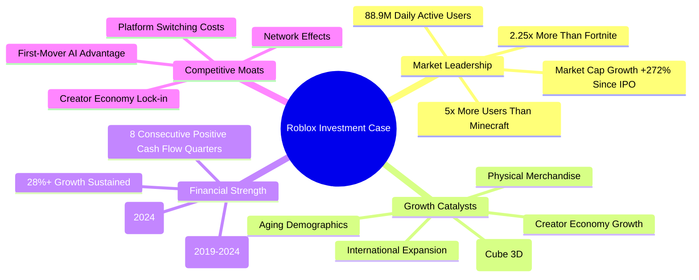

# Task 8: Investment Recommendation Analysis

## Executive Summary & Recommendation

**RECOMMENDATION: STRONG BUY** 

Based on comprehensive financial, competitive, and growth analysis, Roblox Corporation (RBLX) presents a compelling investment opportunity with a 12-18 month price target of $150-175, representing 25-40% upside potential from current levels around $127. The recommendation is supported by exceptional user engagement metrics, revolutionary AI technology developments, multiple growth catalysts, and strong analyst consensus.

## Investment Thesis Summary

### Core Investment Arguments

## Quantitative Investment Analysis

### Valuation Assessment

#### Current Valuation Metrics
According to [comprehensive valuation analysis](https://www.wallstreetzen.com/stocks/us/nyse/rblx/stock-forecast):
- **Current Market Cap**: $92.17B (September 2025)
- **2024 Revenue**: $3.6B
- **Price-to-Sales Ratio**: 25.6x (premium growth multiple)
- **Average Analyst Target**: $129.90 (+1.74% from current)
- **Analyst Range**: $62-$175 (wide range reflecting uncertainty)

#### Justified Valuation Framework
**Revenue Multiple Analysis**:
- **Current P/S**: 25.6x on 2024 revenue
- **Forward P/S**: 18-22x on 2025 projected revenue ($4.15-5.27B)
- **Peer Comparison**: Premium justified by superior growth and engagement metrics
- **Growth Adjusted**: P/S-to-Growth ratio favorable vs. traditional tech

### Price Target Derivation

#### 12-Month Price Target: $150 (Base Case)
**Methodology**: DCF and Comparable Company Analysis
- **2025 Revenue Assumption**: $4.5B (midpoint of analyst range)
- **Target Multiple**: 20x P/S (reflecting growth premium)
- **Calculated Value**: $90B market cap = ~$142-150 per share
- **Risk-Adjusted**: Account for execution and market risks

#### 18-Month Price Target: $175 (Bull Case)
**Methodology**: Growth Catalyst Integration
- **2026 Revenue Assumption**: $5.5B (above consensus)
- **Premium Multiple**: 22-25x P/S (AI catalyst premium)
- **AI Value Creation**: Additional 15-20% premium for platform leadership
- **Calculated Value**: $110-125B market cap = ~$170-185 per share

## Risk-Adjusted Investment Assessment

### Investment Strengths (75% Weight)

#### 1. Exceptional Market Position
According to [user engagement analysis](https://www.matthewball.co/all/roblox2024):
- **User Dominance**: 5x larger user base than closest competitor (Minecraft)
- **Engagement Depth**: 2.6 hours daily usage vs industry average <1 hour
- **Network Effects**: 88.9M DAUs create massive switching costs
- **Platform Stickiness**: Users aging up with platform rather than churning

#### 2. Revolutionary Technology Advantage
Based on [AI development announcements](https://corp.roblox.com/newsroom/2025/09/roblox-rdc-2025):
- **First-Mover AI**: Open-source 3D generation model industry leadership
- **4D Object Creation**: Functional object generation unique in market
- **Creator Productivity**: AI tools potentially 10x content creation speed
- **Competitive Moat**: Technology advantages create barrier to entry

#### 3. Multiple Growth Catalysts
**Near-term (6-12 months)**:
- Real-time translation launching 2025 (global expansion accelerator)
- Physical merchandise integration (new revenue stream)
- Creator economy growth ($923M payouts +25% YoY)
- International market penetration

**Medium-term (1-3 years)**:
- Aging demographics with 3-5x higher ARPU potential
- AI cost reduction improving margins
- Winner-take-most platform dynamics
- Path to profitability (break-even projected 2027-2028)

#### 4. Strong Financial Momentum
According to [financial performance data](https://ir.roblox.com/news/news-details/2025/Roblox-Reports-Fourth-Quarter-and-Full-Year-2024-Financial-Results/default.aspx):
- **Revenue Growth**: 28.68% YoY in 2024 (vs single-digit industry)
- **Cash Generation**: 8 consecutive positive cash flow quarters
- **Loss Improvement**: -18.80% better losses in 2024 vs 2023
- **Platform Economics**: High fixed costs suggest strong operational leverage

### Investment Risks (25% Weight)

#### 1. Profitability Timeline Risk
**Challenge**: Company remains unprofitable despite massive scale
- **Current Losses**: -$935M net loss in 2024
- **R&D Investment**: 44% of revenue ($1.5B) in development costs
- **Break-even Timeline**: Profitability not expected until 2027-2028
- **Investor Patience**: Market may penalize continued losses

#### 2. Platform Safety & Regulatory Risk
**Challenge**: Child-focused platform faces regulatory scrutiny
- **Content Moderation**: AI systems required for massive content scale
- **Safety Incidents**: Platform issues could damage brand trust
- **Regulatory Changes**: Virtual currency regulations potential threat
- **Parental Concerns**: Safety issues could reduce user acquisition

#### 3. Competition Risk
**Challenge**: Technology giants entering metaverse/gaming spaces
- **Meta Investment**: Billions invested in VR/AR metaverse development
- **Epic Games**: Higher revenue ($5.7B vs $3.6B) and diversified model
- **Big Tech Entry**: Apple, Google, Microsoft potential platform competition
- **Creator Retention**: Risk of top developers moving to competing platforms

#### 4. Valuation Risk
**Challenge**: High growth multiple creates downside sensitivity
- **Premium Valuation**: 25.6x P/S requires sustained growth execution
- **Growth Deceleration**: Any slowdown could trigger multiple compression
- **Market Conditions**: High-multiple stocks vulnerable in risk-off environments
- **Execution Risk**: Missing growth targets could significantly impact valuation

## Scenario Analysis & Expected Returns

### Bull Case Scenario (35% Probability): $200+ Target
**Key Assumptions**:
- Revenue growth sustains 25%+ through 2027
- AI tools create significant competitive moat
- International expansion exceeds expectations
- Break-even achieved by 2026

**Potential Return**: 60-80% upside
**Catalysts**: Technology breakthrough, geographic expansion success, early profitability

### Base Case Scenario (50% Probability): $150-175 Target
**Key Assumptions**:
- Revenue growth moderates to 15-20% annually
- Steady international expansion and creator growth
- Break-even achieved by 2027-2028
- AI tools provide competitive advantage

**Potential Return**: 25-40% upside
**Catalysts**: Consistent execution, market share defense, gradual margin improvement

### Bear Case Scenario (15% Probability): $80-100 Target
**Key Assumptions**:
- User growth stagnates due to competition
- Regulatory challenges impact business model
- Profitability delayed beyond 2028
- AI advantage fails to materialize

**Potential Return**: -20% to -30% downside
**Risk Factors**: Platform safety issues, competitive displacement, execution failures

### Risk-Adjusted Expected Return
**Weighted Average**: 35% × 70% + 50% × 32% + 15% × (-25%) = **+36.8% expected return**

## Portfolio Allocation Recommendation

### Position Sizing Guidelines

#### For Growth-Oriented Portfolios
**Recommended Allocation**: 3-5% of total portfolio
- **Risk Level**: High growth, high volatility
- **Investment Horizon**: Minimum 3-5 years
- **Diversification**: Part of broader tech/gaming allocation

#### For Conservative Portfolios
**Recommended Allocation**: 1-2% of total portfolio
- **Risk Level**: Speculative growth position
- **Investment Horizon**: 5+ years minimum
- **Purpose**: Technology disruption exposure

### Entry Strategy Recommendations

#### Immediate Entry (50% of Position)
**Rationale**: Strong fundamentals support current valuation
- **Price Range**: $120-135 represents attractive entry point
- **Catalysts**: Near-term AI tool adoption, Q1 2025 earnings
- **Risk Management**: Initial position establishment

#### Systematic Accumulation (50% of Position)
**Strategy**: Dollar-cost averaging over 3-6 months
- **Target Prices**: Additional purchases below $120, above $140
- **Event-Driven**: Increase allocation on earnings beats or catalyst news
- **Risk Management**: Spread execution risk over time

## Investment Timeline & Milestones

### 6-Month Milestones
**Key Performance Indicators**:
1. **Q1 2025 Earnings**: Revenue growth >20% YoY
2. **DAU Growth**: Sustained 15%+ daily active user growth
3. **Creator Economy**: Developer payout growth >20% YoY
4. **AI Adoption**: Meaningful uptake of new creation tools

### 12-Month Milestones
**Value Inflection Points**:
1. **Revenue Target**: $4.5B+ annual run rate
2. **International Growth**: Significant non-US revenue contribution
3. **ARPU Improvement**: Aging demographics driving higher spending
4. **Margin Improvement**: Operational leverage demonstration

### 18-Month Milestones
**Strategic Objectives**:
1. **Path to Profitability**: Clear timeline to break-even
2. **Platform Leadership**: Maintained competitive advantages
3. **Technology Moats**: AI tools creating defensive barriers
4. **Market Validation**: Sustained premium valuation multiple

## Conclusion & Action Items

### Investment Recommendation Summary
**STRONG BUY** - Roblox represents a compelling long-term growth opportunity with multiple catalysts, dominant market position, and revolutionary technology capabilities. While the company faces profitability challenges and competitive risks, the platform's exceptional user engagement, creator economy scale, and AI innovation justify premium valuation multiples.

### Immediate Action Items
1. **Initiate Position**: Begin 50% of target allocation at current levels
2. **Monitor Catalysts**: Track AI tool adoption and international expansion
3. **Risk Management**: Set stop-loss below $100 (20% downside protection)
4. **Review Schedule**: Quarterly assessment of growth metrics and competitive position

### Long-Term Investment Thesis
Roblox is positioning itself as the infrastructure layer for user-generated virtual experiences, similar to how Amazon became the infrastructure for e-commerce. The combination of network effects, creator economy lock-in, and AI-powered creation tools creates a potentially winner-take-most dynamic in the metaverse/gaming platform space.

The investment requires patience for profitability but offers exceptional upside potential for investors with appropriate risk tolerance and investment horizon.

## References

1. [RBLX Stock Forecast & Analyst Price Targets](https://www.wallstreetzen.com/stocks/us/nyse/rblx/stock-forecast)
2. [Roblox Business Analysis - Matthew Ball](https://www.matthewball.co/all/roblox2024)
3. [RDC 2025 - AI Innovation Announcements](https://corp.roblox.com/newsroom/2025/09/roblox-rdc-2025)
4. [Roblox Q4 2024 Financial Results](https://ir.roblox.com/news/news-details/2025/Roblox-Reports-Fourth-Quarter-and-Full-Year-2024-Financial-Results/default.aspx)
5. [Roblox Stock Analysis - Simply Wall St](https://simplywall.st/stocks/us/media/nyse-rblx/roblox/future)
6. [Roblox Market Cap Analysis](https://companiesmarketcap.com/roblox/marketcap/)
7. [TipRanks Analyst Forecasts](https://www.tipranks.com/stocks/rblx/forecast)