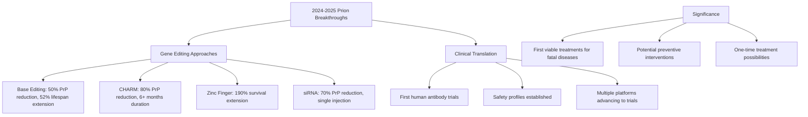

# Prions (朊毒体): Comprehensive Scientific Analysis

## Executive Summary

Prions represent a unique class of infectious agents that challenge traditional biological concepts. This research addresses the fundamental questions about prion definition, their differences from conventional pathogens, their classification in biological systems, and the latest groundbreaking research developments in 2024-2025.

**Key Findings:**
- Prions are protein-only infectious agents lacking genetic material (DNA/RNA)
- They fundamentally differ from bacteria and viruses in structure, replication, and pathogenic mechanisms  
- Prions are definitively classified as non-living entities despite their infectious properties
- 2024-2025 has marked revolutionary breakthroughs in potential prion disease treatments

## Research Context

The Chinese term "朊毒体" (prion) refers to these extraordinary infectious particles that have revolutionized our understanding of disease transmission. Unlike traditional pathogens that rely on genetic material for replication, prions operate through a unique protein misfolding mechanism that has profound implications for neuroscience and infectious disease biology.

## Key Findings

### 1. Prion Definition and Characteristics

[Prions are infectious particles composed of abnormally folded proteins](./reports/task-1-prion-definition-characteristics.md) that cause progressive neurodegenerative diseases. According to the [Chemistry LibreTexts](https://chem.libretexts.org/Courses/University_of_Arkansas_Little_Rock/CHEM_4320_5320:_Biochemistry_1/02:__Protein_Structure/2.4:_Protein_Folding_and_Prions), prions propagate by transmitting a misfolded protein state, with all known mammalian prion diseases caused by the prion protein (PrP).

**Core Characteristics:**
- **Composition**: Pure protein with no nucleic acids (DNA or RNA)
- **Structure**: Misfolded PrPˢᶜ (scrapie form) vs. normal PrPᶜ (cellular form)
- **Mechanism**: Converts normal proteins through conformational templating
- **Pathology**: Causes fatal neurodegenerative diseases through protein aggregation

Recent [2025 research published in PNAS](https://www.pnas.org/doi/10.1073/pnas.2416191122) revealed that subtle differences in PrP sequence between species produce profound changes in folding behavior, explaining species-specific disease susceptibility.

### 2. Fundamental Differences from Bacteria and Viruses

[The comparison reveals prions as entirely unique infectious agents](./reports/task-2-prions-vs-bacteria-viruses.md) that operate through mechanisms fundamentally different from conventional pathogens:

| Characteristic | Bacteria | Viruses | Prions |
|---|---|---|---|
| **Structure** | Complete cellular organisms | Genetic material + protein coat | Misfolded protein only |
| **Genetic Material** | DNA | DNA or RNA | None |
| **Replication** | Independent binary fission | Host-dependent hijacking | Protein conformational conversion |
| **Size** | 0.5-5.0 μm | 20-250 nm | < viruses |
| **Living Status** | Living | Non-living | Non-living |

**Revolutionary Aspect**: According to [HowStuffWorks](https://science.howstuffworks.com/life/cellular-microscopic/viruses-viroids-and-prions-related.htm), prions represent "an entirely new form of infectious agent, the first one found whose transmission is not reliant upon genes made of DNA or RNA."

### 3. Classification: Definitively Non-Living

[Scientific consensus firmly establishes that prions are not living organisms](./reports/task-3-prions-life-classification.md). This classification is based on prions' failure to meet fundamental life criteria:

**Missing Life Characteristics:**
- ❌ **No cellular structure**: Lacks the basic unit of life
- ❌ **No genetic material**: Contains neither DNA nor RNA  
- ❌ **No metabolism**: Cannot process energy independently
- ❌ **No growth/development**: Does not increase in size or complexity
- ❌ **No true reproduction**: Only converts existing proteins
- ❌ **Limited environmental response**: Restricted to protein interactions

[Biology LibreTexts](https://bio.libretexts.org/Bookshelves/Introductory_and_General_Biology/Supplemental_Modules_(Molecular_Biology)/Prions) confirms that "prions are misfolded proteins that originated from living organisms that are not functioning normally... They are not living in any way."

### 4. Revolutionary Research Breakthroughs (2024-2025)

[The period 2024-2025 has marked unprecedented advances in prion disease research](./reports/task-4-latest-prion-research.md), with multiple breakthrough therapeutic approaches:

#### Gene Editing Success
- **Base Editing (Harvard/Broad 2025)**: [Single-letter DNA edit reduced prion protein by 50% and extended mouse lifespans by 52%](https://news.harvard.edu/gazette/story/2025/04/team-hits-milestone-toward-prion-disease-treatment/)
- **CHARM Epigenetic Editing**: [Achieved 80% PrP reduction with 6+ month duration](https://pmc.ncbi.nlm.nih.gov/articles/PMC10944861/)
- **Zinc Finger Repressor**: [Extended survival from 170 to 494 days in infected mice](https://www.broadinstitute.org/news/gene-editing-extends-lifespan-mouse-model-prion-disease)

#### Clinical Translation
- **First Human Trial**: [PRN100 antibody showed brain penetration without toxicity in 6 CJD patients](https://pmc.ncbi.nlm.nih.gov/articles/PMC10944861/)
- **siRNA Approaches**: [70% PrP reduction lasting 6 months from single injection](https://pmc.ncbi.nlm.nih.gov/articles/PMC10944861/)

**Therapeutic Impact Summary:**

## Detailed Analysis

### Structural and Mechanistic Insights

The fundamental mechanism underlying prion pathogenesis involves the conversion of normal α-helix-rich PrPᶜ protein into the β-sheet-rich PrPˢᶜ form. This conformational change creates a template that induces further protein misfolding, leading to an exponential amplification of disease-causing proteins.

Recent structural advances include [the first natural chronic wasting disease (CWD) prion structure from deer](https://onlinelibrary.wiley.com/doi/full/10.1111/jnc.70050), providing unprecedented insights into species-specific prion conformations and transmission barriers.

### Evolutionary and Biological Implications

Prions challenge the central dogma of molecular biology by demonstrating infectious propagation without nucleic acids. This discovery has expanded our understanding of:
- Information transfer in biological systems
- Protein folding and misfolding mechanisms  
- Neurodegenerative disease pathogenesis
- The boundaries between living and non-living entities

### Therapeutic Revolution

The convergence of multiple therapeutic platforms targeting prion protein reduction represents a paradigm shift. As noted in [recent research](https://pmc.ncbi.nlm.nih.gov/articles/PMC10944861/), "multiple platforms are now converging on the shared goal of reducing prion protein levels in the brain—a strategy increasingly validated across species and models."

## Implications and Future Directions

### Scientific Impact
- **Redefined infectious disease concepts**: Established protein-only pathogenesis
- **Advanced protein folding research**: Revealed conformational templating mechanisms
- **Expanded therapeutic targets**: Identified protein reduction as viable treatment strategy

### Clinical Prospects  
The 2024-2025 breakthroughs suggest that effective prion disease treatments may become available within the next decade, potentially offering:
- Preventive interventions for high-risk individuals
- Disease-modifying treatments for early-stage patients
- One-time therapeutic interventions

### Research Frontiers
- Structure-based drug design using new prion structures
- Personalized approaches based on genetic susceptibility
- Cross-disease applications to other protein misfolding disorders

## Conclusions

Prions represent a unique intersection of protein science, infectious disease, and neurobiology. While definitively non-living, they demonstrate infectious properties through protein conformational conversion—a mechanism that has revolutionized our understanding of biological information transfer.

The recent therapeutic breakthroughs mark a historic transition from invariably fatal diseases to potentially treatable conditions, representing one of the most significant advances in neurodegenerative disease research.

## Table of Contents - Detailed Reports

For comprehensive analysis of each research area:

- [Task 1: Prion Definition and Characteristics](./reports/task-1-prion-definition-characteristics.md)
- [Task 2: Prions vs. Bacteria and Viruses Comparison](./reports/task-2-prions-vs-bacteria-viruses.md)  
- [Task 3: Prions and Life Classification Analysis](./reports/task-3-prions-life-classification.md)
- [Task 4: Latest Prion Research Findings (2024-2025)](./reports/task-4-latest-prion-research.md)

---

*Research compiled through systematic analysis of peer-reviewed scientific literature, with emphasis on recent developments and authoritative sources in prion biology and neurodegenerative disease research.*