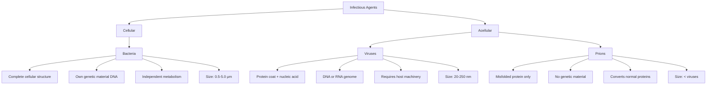

# Task 2: Prions vs. Bacteria and Viruses - Comparative Analysis

## Overview of Infectious Agent Categories

Infectious agents can be broadly categorized by their complexity and structural characteristics. According to [Biology LibreTexts](https://bio.libretexts.org/Workbench/General_Biology_I_and_II/05:_Unit_V-_Biological_Diversity/5.2:_Acellular_Entities_-_Viruses_Prions_and_Viroids), viruses, viroids, and prions are classified as "acellular entities" - infectious agents that lack cellular structure.

## Structural and Compositional Differences

### Bacteria
- **Structure**: Complete, living cellular organisms with cell walls, cell membranes, ribosomes, and their own metabolic machinery
- **Genetic Material**: Contain DNA as their genetic material
- **Size**: Typically 0.5-5.0 micrometers
- **Classification**: Living organisms with complete cellular structure

### Viruses
[Viruses are acellular parasitic entities that are not classified within any domain or kingdom](https://bio.libretexts.org/Courses/Thompson_Rivers_University/Principles_of_Biology_II_OL_ed/03:_Systematics_Phylogeny_and_Biological_Diversity/3.04:_Biological_Diversity/3.4.01:_Acellular_Entities_-_Viruses_Prions_and_Viroids). Key characteristics include:

- **Structure**: [Infectious agents that consist of genetic material wrapped in a protein coat](https://bio.libretexts.org/Courses/Mansfield_University_of_Pennsylvania/BSC_3271:_Microbiology_for_Health_Sciences_Sp21_(Kagle)/02:_Microbial_Structure/2.05:_Viral_Structue_and_Prions)
- **Genetic Material**: [Unlike nearly all living organisms that use DNA as their genetic material, viruses may use either DNA or RNA](https://bio.libretexts.org/Courses/Mansfield_University_of_Pennsylvania/BSC_3271:_Microbiology_for_Health_Sciences_Sp21_(Kagle)/02:_Microbial_Structure/2.05:_Viral_Structue_and_Prions)
- **Size**: [Very small, about 20–250 nanometers in diameter](https://bio.libretexts.org/Workbench/General_Biology_I_and_II/05:_Unit_V-_Biological_Diversity/5.2:_Acellular_Entities_-_Viruses_Prions_and_Viroids)
- **Classification**: Non-living acellular entities

### Prions
[Prions are infectious particles—smaller than viruses—that contain no nucleic acids (neither DNA nor RNA)](https://bio.libretexts.org/Bookshelves/Microbiology/Microbiology_(OpenStax)/06:_Acellular_Pathogens/6.04:_Viroids_Virusoids_and_Prions). Distinguishing features:

- **Structure**: [Small infectious particle composed of abnormally folded protein](https://www.news-medical.net/health/What-is-a-Prion.aspx)
- **Genetic Material**: [Unlike other infectious agents, such as bacteria, viruses, and fungi, prions do not contain genetic materials such as DNA or RNA](https://www.news-medical.net/health/What-is-a-Prion.aspx)
- **Size**: Smaller than viruses
- **Classification**: Non-living protein-based infectious agents

## Replication Mechanisms

### Bacterial Replication
- **Independence**: Bacteria reproduce independently through binary fission
- **Metabolism**: Use their own metabolic machinery and cellular components
- **Self-sufficiency**: Can carry out all life processes autonomously

### Viral Replication
[Viruses cannot replicate on their own](https://bio.libretexts.org/Workbench/General_Biology_I_and_II/05:_Unit_V-_Biological_Diversity/5.2:_Acellular_Entities_-_Viruses_Prions_and_Viroids). According to [NCBI Bookshelf](https://www.ncbi.nlm.nih.gov/books/NBK26917/):

- **Host Dependence**: [They must infect a host cell and hijack the host's replication machinery to produce (nearly) identical progeny virus particles](https://bio.libretexts.org/Workbench/General_Biology_I_and_II/05:_Unit_V-_Biological_Diversity/5.2:_Acellular_Entities_-_Viruses_Prions_and_Viroids)
- **No Independent Metabolism**: [Unlike bacteria and eucaryotic parasites, viruses have no metabolism of their own and no intrinsic ability to produce the proteins encoded by their DNA or RNA genomes](https://www.ncbi.nlm.nih.gov/books/NBK26917/)
- **Host Machinery Hijacking**: [They rely entirely on subverting the machinery of the host cell to produce their proteins and to replicate their genomes](https://www.ncbi.nlm.nih.gov/books/NBK26917/)

### Prion Replication
Prions have a unique replication mechanism fundamentally different from both bacteria and viruses:

- **Protein Conformational Conversion**: [PrP exists in two forms, PrPc, the normal form of the protein, and PrPsc, the infectious form. Once introduced into the body, the PrPsc prion binds to normal PrPc protein and converts it to PrPsc](https://bio.libretexts.org/Bookshelves/Microbiology/Microbiology_(OpenStax)/06:_Acellular_Pathogens/6.04:_Viroids_Virusoids_and_Prions)
- **Exponential Amplification**: [This leads to an exponential increase of PrPsc proteins, which aggregate](https://bio.libretexts.org/Bookshelves/Microbiology/Microbiology_(OpenStax)/06:_Acellular_Pathogens/6.04:_Viroids_Virusoids_and_Prions)
- **Template-Induced Misfolding**: [When a prion enters a healthy organism, it incites existing, healthy, and properly-folded proteins to take on a misfolded shape](https://science.howstuffworks.com/life/cellular-microscopic/viruses-viroids-and-prions-related.htm)

## Disease Mechanisms

### Bacterial Pathogenesis
- Multiple mechanisms including toxin production
- Direct tissue invasion and damage
- Immune system disruption
- Metabolic interference

### Viral Pathogenesis
- Cell destruction during viral replication
- Disruption of normal cellular functions
- Immune system evasion or manipulation
- Integration into host genome (some viruses)

### Prion Pathogenesis
[PrPsc is folded abnormally, and the resulting conformation (shape) is directly responsible for the lesions seen in the brains of infected cattle with BSE and humans with CJD](https://bio.libretexts.org/Bookshelves/Microbiology/Microbiology_(OpenStax)/06:_Acellular_Pathogens/6.04:_Viroids_Virusoids_and_Prions). The mechanism involves:

- [Prions accumulate in the brain, form plaques, and cause disruptions to the central nervous system](https://bio.libretexts.org/Bookshelves/Microbiology/Microbiology_(OpenStax)/06:_Acellular_Pathogens/6.04:_Viroids_Virusoids_and_Prions)
- Progressive neurodegeneration through protein aggregation
- Spongiform changes in brain tissue
- No inflammatory response (unlike bacterial or viral infections)

## Comparative Size and Complexity

[In terms of size and complexity, prions and viroids are pathogens (agents with the ability to cause disease) that have simpler structures than viruses but, in the case of prions, still can produce deadly diseases](https://bio.libretexts.org/Workbench/General_Biology_I_and_II/05:_Unit_V-_Biological_Diversity/5.2:_Acellular_Entities_-_Viruses_Prions_and_Viroids).

## Historical Significance

[Thus, the prion seems to be an entirely new form of infectious agent, the first one found whose transmission is not reliant upon genes made of DNA or RNA](https://science.howstuffworks.com/life/cellular-microscopic/viruses-viroids-and-prions-related.htm). This discovery challenged fundamental assumptions about infectious disease, as [historically, the idea of an infectious agent that did not use nucleic acids was considered impossible, but pioneering work by Nobel Prize-winning biologist Stanley Prusiner has convinced most biologists that such agents exist](https://science.howstuffworks.com/life/cellular-microscopic/viruses-viroids-and-prions-related.htm).

## Summary Table

| Characteristic | Bacteria | Viruses | Prions |
|---|---|---|---|
| **Cellular Structure** | Complete cells | Acellular | Acellular |
| **Genetic Material** | DNA | DNA or RNA | None |
| **Replication** | Independent binary fission | Host-dependent hijacking | Protein conformational conversion |
| **Metabolism** | Independent | None | None |
| **Size** | 0.5-5.0 μm | 20-250 nm | < viruses |
| **Disease Mechanism** | Toxins, invasion, inflammation | Cell destruction, dysfunction | Protein aggregation, neurodegeneration |
| **Treatment** | Antibiotics | Antivirals (limited) | None available |
| **Living Status** | Living | Non-living | Non-living |

## References

- [Acellular Entities - Viruses, Prions, and Viroids - Biology LibreTexts](https://bio.libretexts.org/Workbench/General_Biology_I_and_II/05:_Unit_V-_Biological_Diversity/5.2:_Acellular_Entities_-_Viruses_Prions_and_Viroids)
- [Introduction to Pathogens - NCBI Bookshelf](https://www.ncbi.nlm.nih.gov/books/NBK26917/)
- [Viroids, Virusoids, and Prions - Biology LibreTexts](https://bio.libretexts.org/Bookshelves/Microbiology/Microbiology_(OpenStax)/06:_Acellular_Pathogens/6.04:_Viroids_Virusoids_and_Prions)
- [What is a Prion? - News Medical](https://www.news-medical.net/health/What-is-a-Prion.aspx)
- [How are viruses, viroids and prions related? - HowStuffWorks](https://science.howstuffworks.com/life/cellular-microscopic/viruses-viroids-and-prions-related.htm)