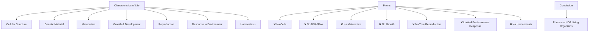

# Task 3: Are Prions Considered Life Forms?

## Scientific Consensus: Prions Are Not Living Organisms

The scientific community has reached a clear consensus: [prions are not considered living organisms](https://bio.libretexts.org/Bookshelves/Introductory_and_General_Biology/Supplemental_Modules_(Molecular_Biology)/Prions). This classification is based on fundamental biological principles and the established characteristics that define life.

## The Characteristics of Life

To understand why prions are not classified as living, we must examine the standard characteristics that define life. According to [Biology for Majors](https://courses.lumenlearning.com/suny-wmopen-biology1/chapter/the-characteristics-of-life/), all living organisms share several key characteristics:

[All living organisms share several key characteristics or functions: order, sensitivity or response to the environment, reproduction, growth and development, regulation, homeostasis, and energy processing. When viewed together, these eight characteristics serve to define life](https://courses.lumenlearning.com/suny-wmopen-biology1/chapter/the-characteristics-of-life/).

Additionally, [Biology LibreTexts](https://bio.libretexts.org/Bookshelves/Introductory_and_General_Biology/Introductory_Biology_(CK-12)/01:_Introduction_to_Biology/1.04:_Characteristics_of_Life) states that [in biology, it is generally agreed that organisms that possess the following seven characteristics are animate or living beings and thus possess life: the ability to respire, grow, excrete, reproduce, metabolize, move, and be responsive to the environment](https://bio.libretexts.org/Bookshelves/Introductory_and_General_Biology/Introductory_Biology_(CK-12)/01:_Introduction_to_Biology/1.04:_Characteristics_of_Life).

## How Prions Fail to Meet Life Criteria

### 1. Lack of Cellular Structure

[All forms of life are built of cells. A cell is the basic unit of the structure and function of living things](https://courses.lumenlearning.com/suny-wmopen-biology1/chapter/the-characteristics-of-life/). Prions fundamentally fail this criterion as they are [simply misfolded proteins, not cellular entities](https://bio.libretexts.org/Bookshelves/Introductory_and_General_Biology/Supplemental_Modules_(Molecular_Biology)/Prions).

### 2. Absence of Genetic Material

One of the most fundamental characteristics distinguishing prions from all other known infectious agents is that [prions are unlike all other known disease-causing agents in that they appear to lack nucleic acid—i.e., DNA or RNA—which is the genetic material that all other organisms contain](https://www.quora.com/What-are-prions-Are-they-living-organisms-If-yes-why-arent-they-classified-as-viruses-even-though-they-can-infect-cells).

### 3. No Independent Metabolism

[Prions do not have their own metabolism or ability to process energy independently](https://bio.libretexts.org/Bookshelves/Introductory_and_General_Biology/Supplemental_Modules_(Molecular_Biology)/Prions). They cannot respire, metabolize nutrients, or carry out any biochemical processes that characterize living organisms.

### 4. Inability to Grow or Develop

[They do not exhibit growth or developmental processes characteristic of living organisms](https://bio.libretexts.org/Bookshelves/Introductory_and_General_Biology/Supplemental_Modules_(Molecular_Biology)/Prions). Prions do not increase in size, complexity, or undergo developmental stages.

## Scientific Perspective on Protein "Self-Replication"

The apparent ability of prions to "replicate" through protein misfolding has raised interesting questions about the nature of replication and life. However, according to research findings, [it almost seemed that the prion agent was a self-replicating protein. The problem is that "a self-replicating protein" does not fit with our modern understanding of proteins. "A self-replicating protein" would be a major violation of the "Central Dogma", which says that only nucleic acids can "self-replicate"](https://bio.libretexts.org/Bookshelves/Introductory_and_General_Biology/Supplemental_Modules_(Molecular_Biology)/Prions).

The mechanism by which prions propagate is fundamentally different from biological reproduction. [Prions are infectious agents that long defied some of our basic ideas of biology. While they can propagate by causing other proteins to misfold into the same abnormal shape, this is fundamentally different from true biological reproduction involving genetic material and cellular processes](https://bio.libretexts.org/Bookshelves/Introductory_and_General_Biology/Supplemental_Modules_(Molecular_Biology)/Prions).

## Comparison with Viruses

The classification of prions as non-living becomes clearer when compared to viruses, which themselves exist in a gray area between living and non-living entities. [Viruses are acellular parasitic entities that are not classified within any domain or kingdom](https://bio.libretexts.org/Courses/Thompson_Rivers_University/Principles_of_Biology_II_OL_ed/03:_Systematics_Phylogeny_and_Biological_Diversity/3.04:_Biological_Diversity/3.4.01:_Acellular_Entities_-_Viruses_Prions_and_Viroids).

[Viruses exist in a netherworld between a living organism and a nonliving entity. Living things grow, metabolize, reproduce, and evolve. Viruses exhibit some of these abilities but cannot do any of them on their own](https://bio.libretexts.org/Courses/Thompson_Rivers_University/Principles_of_Biology_II_OL_ed/03:_Systematics_Phylogeny_and_Biological_Diversity/3.4.01:_Acellular_Entities_-_Viruses_Prions_and_Viroids).

If viruses, which possess genetic material and can hijack cellular machinery for reproduction, are not considered truly living, then prions, which lack even these capabilities, are definitively not living organisms.

## Biological Classification Context

In the context of biological classification, prions are grouped with other acellular infectious agents. They are classified as acellular infectious agents rather than living organisms, as they lack the fundamental characteristics that define life, most notably:

- Cellular structure
- Genetic material (DNA or RNA)
- Independent metabolism
- True reproductive capabilities

## Visual Representation of Life Characteristics

## Definitional Clarity

According to scientific sources, [prions are misfolded proteins that originated from living organisms that are not functioning normally and can frequently create problems for other molecules/biochemical processes as a result. They are not living in any way](https://www.quora.com/What-are-viruses-and-prion-proteins-Are-they-classified-as-living-organisms).

## Implications for Biology

The discovery and classification of prions has important implications for our understanding of infectious agents and the boundaries of life. [They appear to behave like other infectious organisms, yet they lack any of the most fundamental features of organisms. In particular, they lack any genetic material (DNA or RNA)](https://bio.libretexts.org/Bookshelves/Introductory_and_General_Biology/Supplemental_Modules_(Molecular_Biology)/Prions).

This unique status has expanded our understanding of what constitutes an infectious agent while reinforcing the established criteria for what constitutes life.

## Summary

Prions are definitively classified as non-living infectious agents because they:

1. **Lack cellular structure** - the fundamental unit of life
2. **Contain no genetic material** - essential for heredity and reproduction  
3. **Have no metabolism** - cannot process energy or materials
4. **Cannot grow or develop** - no increase in size, complexity, or organization
5. **Do not reproduce** in the biological sense - only convert existing proteins
6. **Cannot respond meaningfully to environment** - limited to protein interactions
7. **Maintain no homeostasis** - no internal regulation or balance

While prions can propagate and cause disease, their mechanism of action is fundamentally different from the processes that characterize living organisms, placing them firmly in the category of non-living infectious agents.

## References

- [The Characteristics of Life - Biology for Majors](https://courses.lumenlearning.com/suny-wmopen-biology1/chapter/the-characteristics-of-life/)
- [Characteristics of Life - Biology LibreTexts](https://bio.libretexts.org/Bookshelves/Introductory_and_General_Biology/Introductory_Biology_(CK-12)/01:_Introduction_to_Biology/1.04:_Characteristics_of_Life)
- [Prions - Biology LibreTexts](https://bio.libretexts.org/Bookshelves/Introductory_and_General_Biology/Supplemental_Modules_(Molecular_Biology)/Prions)
- [Acellular Entities - Biology LibreTexts](https://bio.libretexts.org/Courses/Thompson_Rivers_University/Principles_of_Biology_II_OL_ed/03:_Systematics_Phylogeny_and_Biological_Diversity/3.04:_Biological_Diversity/3.4.01:_Acellular_Entities_-_Viruses_Prions_and_Viroids)
- [Quora Discussion on Prions and Living Organisms](https://www.quora.com/What-are-prions-Are-they-living-organisms-If-yes-why-arent-they-classified-as-viruses-even-though-they-can-infect-cells)