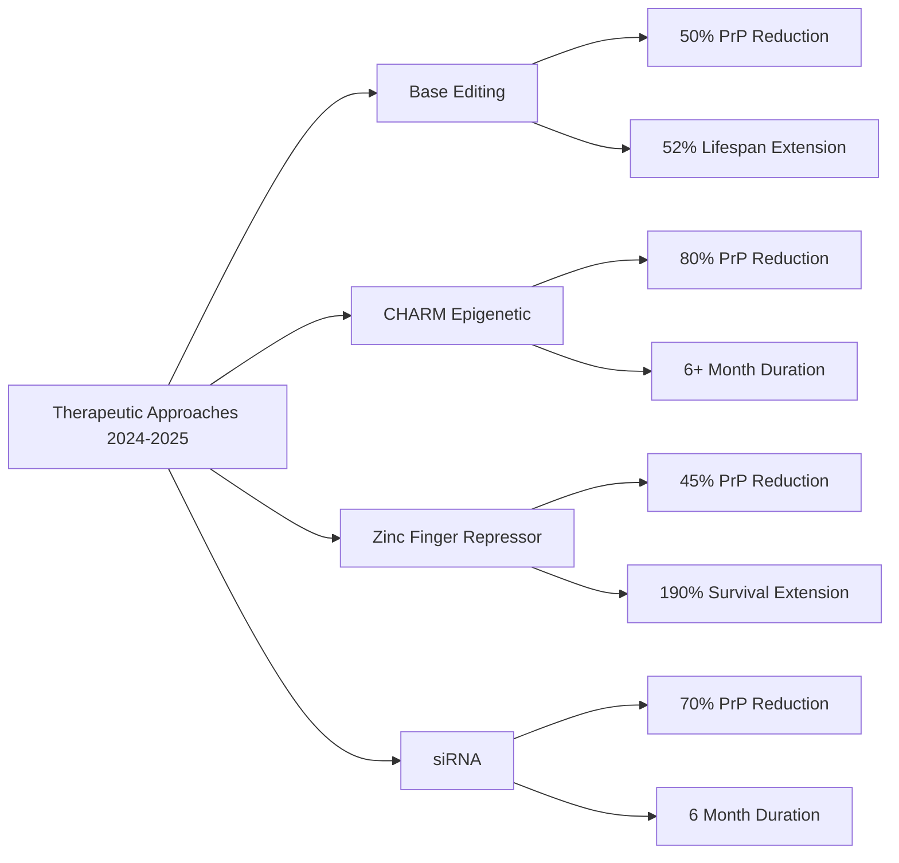

# Task 4: Latest Prion Research Findings (2024-2025)

## Executive Summary

The period of 2024-2025 has marked a revolutionary breakthrough in prion disease research, with multiple promising therapeutic approaches advancing toward human trials. The most significant developments include gene editing technologies, epigenetic modifications, and novel drug delivery systems that have shown remarkable success in extending survival and reducing prion protein levels in animal models.

## Major Gene Editing Breakthrough - Base Editing Technology

### Harvard/Broad Institute Achievement

The most significant breakthrough was [published in Nature Medicine in early 2025](https://news.harvard.edu/gazette/story/2025/04/team-hits-milestone-toward-prion-disease-treatment/), demonstrating that [altering a single base in the gene that produces the killer proteins can reduce by half the amount of that protein in the brains of laboratory mice, a step that extended their lifespans 52 percent](https://www.chemistry.harvard.edu/news/2025/04/new-research-team-hits-milestone-toward-prion-disease-treatment).

This work represents ["a milestone for sure" according to the senior author David Liu](https://news.harvard.edu/gazette/story/2025/04/team-hits-milestone-toward-prion-disease-treatment/). The research showed that [a single-letter edit in DNA reduces levels of the disease-causing prion protein in the brain and could lead to a preventative, one-time treatment for the deadly neurodegenerative disorder](https://www.marinbio.com/gene-therapy-breakthroughs-offer-new-hope-for-prion-disease-treatment/).

## Advanced Epigenetic Editing - CHARM Technology

### Science Publication (June 2024)

[A new study published in Science on June 28, 2024 introduced an improved method called CHARM (Coupled Histone tail for Autoinhibition Release of Methyltransferase)](https://pmc.ncbi.nlm.nih.gov/articles/PMC10944861/). This innovative approach achieved remarkable results:

- [CHARM, delivered via AAV to cross the blood-brain barrier, recruited endogenous DNMT3A to the Prnp promoter and achieved up to 80% PrP reduction](https://pmc.ncbi.nlm.nih.gov/articles/PMC10944861/)
- [Stable effects lasting at least six months](https://pmc.ncbi.nlm.nih.gov/articles/PMC10944861/)
- [Researchers developed a novel method to turn off prion protein production in mice. The technique could lead to treatments for prion diseases such as mad cow disease](https://www.nih.gov/news-events/nih-research-matters/developing-treatments-prion-diseases)

## Zinc Finger Repressor Technology

### Multi-Institution Collaboration

[Researchers from Sangamo Therapeutics, the Broad Institute, and Evotec reported that a single intravenous dose of an adeno-associated virus (AAV) delivering a zinc finger repressor (ZFR) achieved long-lasting repression of the PRNP gene in mice and nonhuman primates](https://www.broadinstitute.org/news/gene-editing-extends-lifespan-mouse-model-prion-disease).

#### Efficacy Results:
- [In C57BL/6 mice, neuron-specific ZFR expression led to a dose-dependent reduction of up to 50% in Prnp mRNA and 45% in PrP protein levels, with effects maintained for 17 months](https://www.broadinstitute.org/news/gene-editing-extends-lifespan-mouse-model-prion-disease)
- [In RML-inoculated mice, a single IV dose of AAV-ZFR extended survival from a median of 170 days in controls to up to 494 days at the highest dose](https://www.broadinstitute.org/news/gene-editing-extends-lifespan-mouse-model-prion-disease)
- [The therapy also improved body weight and nesting behavior, while post-mortem analyses revealed dose-dependent reductions in brain PrP and cerebrospinal fluid PrP levels (50–80%)](https://www.broadinstitute.org/news/gene-editing-extends-lifespan-mouse-model-prion-disease)

## siRNA-Based Approaches

### Dual siRNA Strategy

[The di-siRNA approach, consisting of linked siRNA duplexes targeting Prnp, reduced PrP by up to 70% in the mouse brain one month after a single cerebrospinal fluid injection and maintained target engagement for six months](https://pmc.ncbi.nlm.nih.gov/articles/PMC10944861/).

This approach represents a significant advance in RNA-based therapeutics for neurological diseases, offering long-lasting effects with minimal intervention.

## First Human Clinical Trial

### PRN100 Monoclonal Antibody Study

[A study reported the first in-body treatment of six CJD patients intravenous with a humanized monoclonal antibody to cellular prion protein (PRN100)](https://pmc.ncbi.nlm.nih.gov/articles/PMC10944861/). Key findings included:

- [PRN100 can access the brain without clinically significant adverse effects](https://pmc.ncbi.nlm.nih.gov/articles/PMC10944861/)
- [Brain autopsy report of two patients showed no evidence of neurotoxicity and suggested that PRN100 may help clear disease-related PrPSc](https://pmc.ncbi.nlm.nih.gov/articles/PMC10944861/)
- However, [all patients showed progressive neurological decline](https://pmc.ncbi.nlm.nih.gov/articles/PMC10944861/)

While the treatment showed promise in terms of safety and potential mechanism, the advanced stage of disease in treated patients limited therapeutic efficacy.

## Structural Biology Advances

### First Natural CWD Prion Structure

[In a Recent Paper (Alam et al. 2024), the Caughey Research Group Presents the First Prion Structure from a Naturally Occurring Chronic Wasting Disease (CWD), Offering a Fresh Perspective. This has now been confirmed with the first natural CWD prion fibril structure from deer (Alam et al. 2024)](https://onlinelibrary.wiley.com/doi/full/10.1111/jnc.70050).

This structural breakthrough provides crucial insights into:
- Species-specific prion conformations
- Interspecies transmission barriers
- Potential targets for therapeutic intervention

## Large-Scale Prion Generation Studies

### Comprehensive Protein Misfolding Analysis (2024)

[In this work, we present a method to generate bona fide recombinant prions de novo, allowing a comprehensive analysis of protein misfolding across a wide range of prion proteins from mammalian species. We study more than 380 different prion proteins from mammals and classify them according to their spontaneous misfolding propensity and their conformational variability](https://www.nature.com/articles/s41467-024-46360-2).

This systematic approach has enabled researchers to:
- Understand species-specific susceptibility patterns
- Identify potential therapeutic targets
- Develop predictive models for prion disease risk

## Single-Molecule Folding Studies

### Species-Specific Folding Mechanisms (2025)

[We compared the folding dynamics of single PrP molecules from three species with different disease susceptibility: dogs (immune), hamsters (susceptible), and bank voles (extremely susceptible). Measurements with optical tweezers revealed important differences between the folding cooperativity, pathways, energy barriers, and kinetics of these proteins](https://www.pnas.org/doi/10.1073/pnas.2416191122).

[These results show that subtle differences in PrP sequence between species produce profound changes in folding behavior, providing insight into the factors underlying misfolding propensity](https://www.pnas.org/doi/10.1073/pnas.2416191122).

## Therapeutic Platform Convergence

### Multiple Approaches Targeting Common Goal

[These studies represent a major leap forward in the pursuit of a durable, one-time therapy for prion disease. From zinc finger repressors and siRNA to base editing and epigenetic engineering, multiple platforms are now converging on the shared goal of reducing prion protein levels in the brain-a strategy increasingly validated across species and models](https://pmc.ncbi.nlm.nih.gov/articles/PMC10944861/).

## Clinical Translation Prospects

### Future Human Trials

[As these programs advance toward human trials, they hold promise not only for treating symptomatic patients but also for preventive intervention in individuals carrying high-risk PRNP mutations](https://pmc.ncbi.nlm.nih.gov/articles/PMC10944861/).

The potential for preventive treatment represents a paradigm shift, as [no treatments are available for the devastating brain disorders known as prion diseases. Scientists developed a way to safely turn off the prion-producing gene in mice. It reduced prion protein levels by up to 80%. The finding suggests an approach for treating prion diseases in people](https://www.nih.gov/news-events/nih-research-matters/developing-treatments-prion-diseases).

## Treatment Efficacy Summary

## Significance for Prion Disease Treatment

### Paradigm Shift

These developments mark 2024-2025 as a pivotal period in prion disease research, representing the first time multiple viable therapeutic strategies have shown significant efficacy in animal models. The convergence of gene editing, epigenetic modification, and targeted protein reduction approaches provides multiple pathways toward human treatment.

### Key Success Factors:
1. **Significant PrP reduction** (45-80% across different approaches)
2. **Extended survival** (up to 190% in some models)
3. **Durable effects** (6+ months to over 17 months)
4. **Safety profiles** suitable for clinical translation
5. **One-time treatment potential** for several approaches

## Future Directions

The research indicates that [multiple platforms are now converging on the shared goal of reducing prion protein levels in the brain—a strategy increasingly validated across species and models](https://pmc.ncbi.nlm.nih.gov/articles/PMC10944861/). This convergence suggests that effective prion disease treatments may become available within the next decade, representing a revolutionary advance for these previously untreatable conditions.

## References

- [New research: Team hits milestone toward prion disease treatment - Harvard](https://www.chemistry.harvard.edu/news/2025/04/new-research-team-hits-milestone-toward-prion-disease-treatment)
- [Team hits milestone toward prion disease treatment - Harvard Gazette](https://news.harvard.edu/gazette/story/2025/04/team-hits-milestone-toward-prion-disease-treatment/)
- [New implications for prion diseases therapy and prophylaxis - PMC](https://pmc.ncbi.nlm.nih.gov/articles/PMC10944861/)
- [Gene editing extends lifespan in mouse model of prion disease - Broad Institute](https://www.broadinstitute.org/news/gene-editing-extends-lifespan-mouse-model-prion-disease)
- [A therapy candidate for fatal prion diseases - Broad Institute](https://www.broadinstitute.org/news/therapy-candidate-fatal-prion-diseases-turns-disease-causing-gene)
- [Different folding mechanisms in prion proteins - PNAS](https://www.pnas.org/doi/10.1073/pnas.2416191122)
- [Breaking the Mould: First Structure of a Deer Prion - Journal of Neurochemistry](https://onlinelibrary.wiley.com/doi/full/10.1111/jnc.70050)
- [Protein Misfolding Shaking Amplification - Nature Communications](https://www.nature.com/articles/s41467-024-46360-2)
- [Developing treatments for prion diseases - NIH](https://www.nih.gov/news-events/nih-research-matters/developing-treatments-prion-diseases)