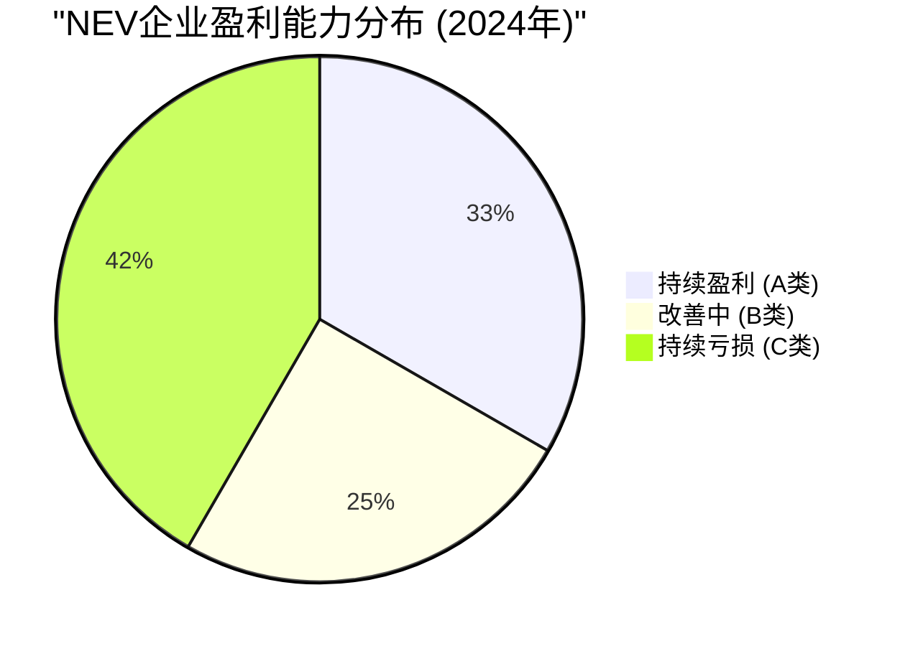
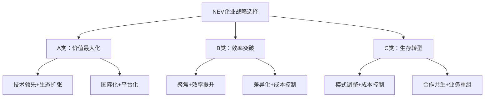

# 新能源乘用车企盈利能力提升战略研究

**研究目标**：分析新能源乘用车企的盈利能力，基于净利润率指标，为车企提升盈利能力提供战略指导。

## 执行摘要

### 核心发现

本研究通过对全球主要新能源乘用车企业2021-2024年财务数据的深度分析，发现了明确的盈利能力分化趋势：

- **A类企业（持续盈利）**：比亚迪、特斯拉、理想汽车、赛力斯问界等4家企业实现了可持续盈利
- **B类企业（扭亏为盈趋势）**：零跑、极氪、小鹏等企业呈现明显的财务改善趋势  
- **C类企业（持续亏损）**：蔚来、Rivian、Lucid、Polestar等企业仍面临重大盈利挑战

### 关键洞察



1. **规模门槛效应明显**：年销量40万辆以上是实现可持续盈利的关键门槛
2. **毛利率是盈利预测指标**：毛利率超过18%的企业通常能实现盈利
3. **商业模式差异决定成败**：垂直整合、技术差异化、生态构建是核心成功要素
4. **成本控制能力是基础**：单车亏损控制在5万元以内是扭亏的必要条件

## 研究发现详述

### 1. 企业分类与盈利表现

#### A类企业：持续盈利的领导者

**比亚迪**：垂直整合的成本优势模式
- 净利润率：2024年5.18%，四年持续提升
- 核心优势：75%组件内制，15%成本优势
- 成功要素：刀片电池技术+规模效应+供应链控制

*详细分析见：[企业分类报告](./reports/task-1-nev-company-categorization.md)*

**特斯拉**：软件定义汽车的生态模式  
- 净利润率：2024年7.3%（受价格战影响下降）
- 核心优势：软件服务收入13亿美元，毛利率80%+
- 转型方向：充电网络商业化，预计2030年收入74亿美元

**理想汽车**：聚焦策略的精准定位
- 净利润率：2024年5.6%，中国新势力盈利标杆
- 核心优势：EREV技术差异化+家庭市场精准定位
- 关键指标：平均售价33万元，车辆毛利率19.8%

**赛力斯问界**：合作共赢的华为模式
- 净利润率：约3.65%，快速实现盈利
- 核心优势：华为技术赋能+渠道协同
- 毛利率表现：问界M9达34-35%，行业最高

#### B类企业：扭亏为盈趋势明显

**零跑汽车**：成本领先突破
- 2024年Q4首次实现季度盈利0.8亿元
- 毛利率从0.5%跃升至8.4%，Q4达13.3%
- 改善路径：全栈自研+成本控制

**极氪汽车**：高端定位价值提升
- 亏损收窄30%，预计2025年实现季度盈亏平衡
- 毛利率提升至15.6%，Q4整车毛利率17.3%
- 品牌策略：依托吉利SEA架构，打造高端智能品牌

**小鹏汽车**：智能化差异驱动改善
- 净亏损收窄44%，毛利率大幅提升至14.3%
- 单车亏损降至约3万元
- 技术优势：智能驾驶技术领先，探索商业化变现

#### C类企业：面临重大挑战

**蔚来汽车**：换电模式投资负担重
- 单车亏损高达10万元，累计亏损超1093亿元
- 换电站需日均服务70次才能盈亏平衡，目前仅20%达标
- 预期2026年换电业务实现盈亏平衡

**国际新势力困境**：
- Rivian：单车亏损39,130美元，产能利用率低
- Lucid：单车亏损341,000美元，交付量与投资严重不匹配
- Polestar：品牌认知度不足，与母公司协同待加强

### 2. 盈利能力驱动因素分析

```mermaid
xychart-beta
    title "NEV企业盈利驱动因素重要性评分"
    x-axis [规模效应, 成本控制, 技术优势, 品牌价值, 供应链, 商业模式]
    y-axis "重要性评分" 0 --> 10
    bar [9.5, 9.0, 8.5, 8.0, 8.5, 9.0]
```

#### 规模效应是盈利基础
- **盈利门槛**：年销量40万辆是可持续盈利的关键门槛
- **成本摊薄**：固定成本随销量增长快速摊薄
- **议价权提升**：规模化采购降低供应链成本

*详细数据见：[四年财务数据报告](./reports/task-2-four-year-financial-data.md)*

#### 成本控制能力决定竞争力
- **垂直整合优势**：比亚迪自产75%组件，成本领先15%
- **制造效率**：智能制造提升生产速度3倍
- **供应链管理**：本土化供应链降低成本和风险

#### 技术差异化创造价值
- **核心技术控制**：电池、芯片等关键技术自主可控
- **专利护城河**：技术壁垒保护市场地位
- **技术商业化**：将技术优势转化为商业价值

### 3. 成功模式与失败教训

#### 成功模式要素

**比亚迪垂直整合模式**：
- 全产业链控制，从原材料到终端产品
- 技术自研自产，形成成本和技术双重优势
- 规模化效应，通过量产降低边际成本

**特斯拉生态模式**：
- 硬件+软件+服务一体化
- 持续收入模式，降低对单次销售的依赖
- 品牌溢价能力，支撑高毛利率

**理想聚焦模式**：
- 技术路线差异化，避开竞争红海
- 市场定位精准，满足特定用户需求
- 运营效率优化，实现快速盈利突破

*深度分析见：[A类企业成功策略](./reports/task-4-category-a-success-strategies.md)*

#### 失败模式教训

**过度多元化**：资源分散，难以形成竞争优势
**商业模式不清晰**：投入产出比不明确，难以实现盈利
**成本控制不力**：制造效率低，单车亏损巨大
**市场定位模糊**：缺乏差异化，陷入价格战

## 战略建议框架

### 分类战略指导



#### A类企业：价值最大化策略
- **比亚迪**：深化垂直整合，全球化扩张，目标海外市场份额30%
- **特斯拉**：软件服务转型，充电网络商业化，目标软件收入100亿美元
- **理想**：平台化扩展，多品牌战略，目标年销量150万辆

#### B类企业：效率突破策略
- **零跑**：全栈自研+成本领先，目标2025年实现年度盈利
- **极氪**：高端定位+品牌价值提升，目标2025年季度盈亏平衡
- **小鹏**：智能化技术商业化，目标毛利率突破18%

#### C类企业：生存转型策略
- **蔚来**：换电模式优化，目标单站日均服务70次以上
- **国际新势力**：战略重组，技术授权，寻找合作伙伴

*具体策略见：[战略建议报告](./reports/task-5-strategic-recommendations.md)*

### 关键成功要素

#### 1. 实现规模效应
- **销量目标**：优先突破40万辆年销量门槛
- **产能规划**：合理布局产能，避免过度投资
- **市场策略**：聚焦主力市场，快速建立规模

#### 2. 强化成本控制
- **制造效率**：智能制造，提升生产效率
- **供应链优化**：本土化采购，降低物流成本
- **研发聚焦**：避免技术路线分散，提高研发效率

#### 3. 建立差异化优势
- **技术创新**：掌握核心技术，建立技术壁垒
- **商业模式**：探索新的盈利模式，如服务化转型
- **品牌建设**：培育品牌价值，实现溢价能力

#### 4. 提升运营效率
- **组织优化**：精简组织结构，提高决策效率
- **数字化转型**：利用数字化工具提升管理效率
- **人才培养**：建设高效的人才队伍

## 行业发展趋势与机遇

### 市场环境变化
1. **政策支持持续**：各国政府继续推动新能源汽车发展
2. **技术成熟度提升**：电池成本下降，充电基础设施完善
3. **消费接受度提高**：用户对新能源汽车接受度不断提升
4. **竞争格局分化**：强者愈强，弱者面临淘汰压力

### 技术发展机遇
1. **固态电池商业化**：有望进一步降低电池成本
2. **自动驾驶普及**：创造新的商业模式和价值
3. **车网融合**：V2G技术带来新的盈利机会
4. **轻量化材料**：降低制造成本，提升续航能力

### 商业模式创新
1. **服务化转型**：从卖产品到卖服务
2. **生态化发展**：构建完整的出行生态系统
3. **平台化经营**：技术平台对外开放，实现多方共赢
4. **数字化变现**：数据资产价值化，创造新收入来源

## 结论与展望

### 核心结论

1. **盈利分化趋势明确**：头部企业实现盈利，尾部企业面临淘汰
2. **规模效应是关键**：40万辆年销量是盈利的基本门槛
3. **商业模式决定成败**：差异化战略比同质化竞争更有效
4. **成本控制是基础**：没有成本控制能力，难以实现可持续发展

### 发展展望

**2025-2027年关键趋势**：
- 行业洗牌加速，强者恒强局面形成
- 技术标准化程度提高，竞争焦点转向服务和生态
- 国际化竞争加剧，中国企业有望成为全球领导者
- 新商业模式不断涌现，盈利来源多元化

**战略建议总结**：
- A类企业应巩固优势，扩大领先地位
- B类企业应聚焦突破，快速实现盈利
- C类企业应调整模式，寻求生存发展
- 全行业应加强合作，共同推动产业健康发展

通过本研究的深入分析，我们为新能源汽车企业提升盈利能力提供了系统性的战略指导，有助于企业制定科学的发展战略，实现可持续的盈利增长。

---

## 报告目录

- [企业分类与盈利表现分析](./reports/task-1-nev-company-categorization.md)
- [四年净利润率数据收集与分析](./reports/task-2-four-year-financial-data.md)  
- [NEV OEM盈利能力驱动因素与战略分析](./reports/task-3-profitability-analysis.md)
- [A类企业成功策略深度分析](./reports/task-4-category-a-success-strategies.md)
- [NEV OEM战略建议与改善路径](./reports/task-5-strategic-recommendations.md)