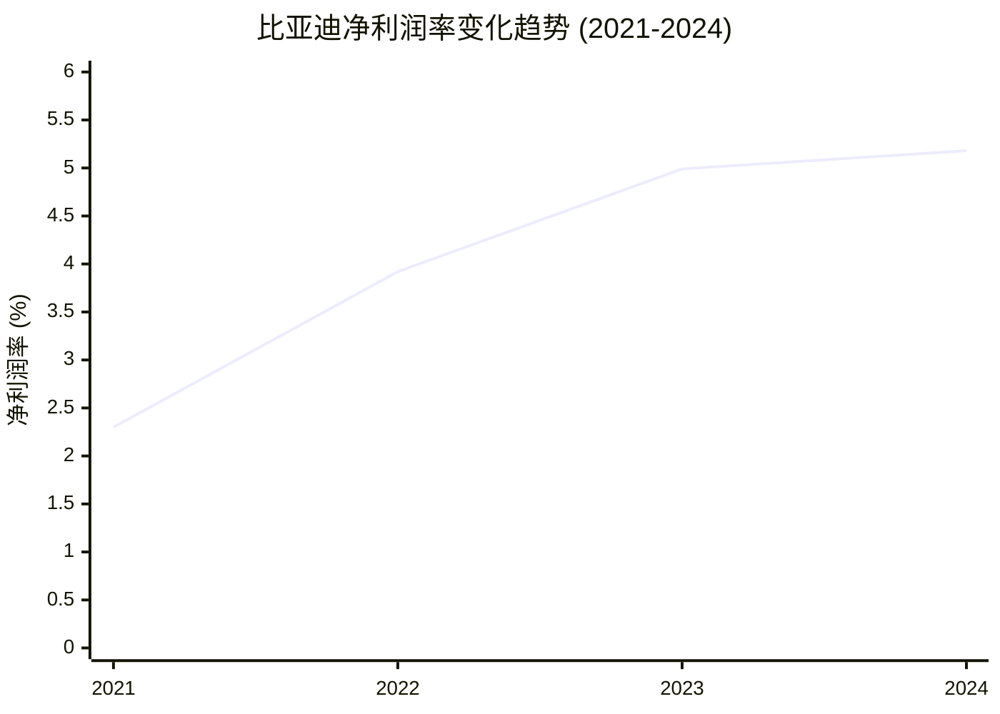
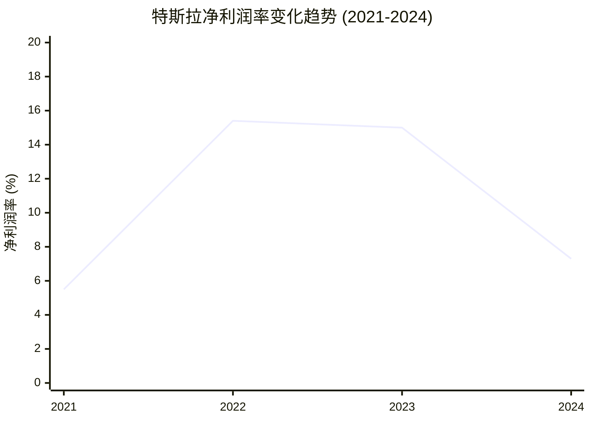
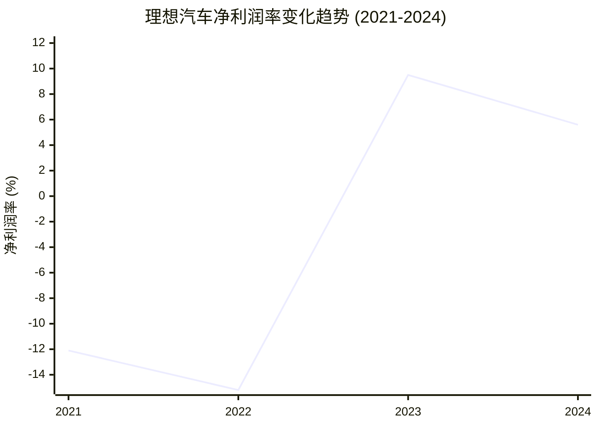
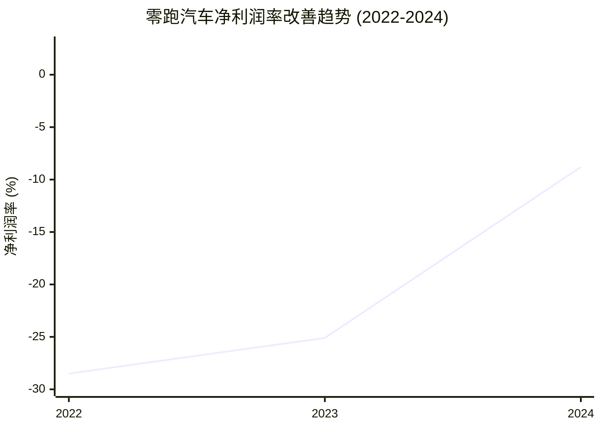
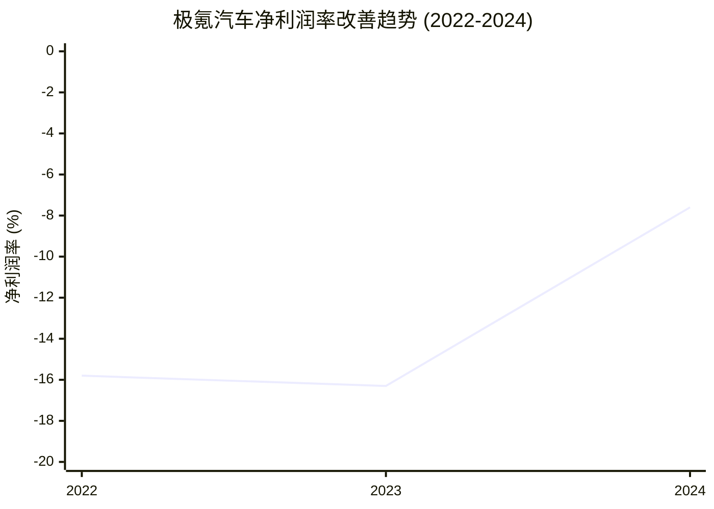
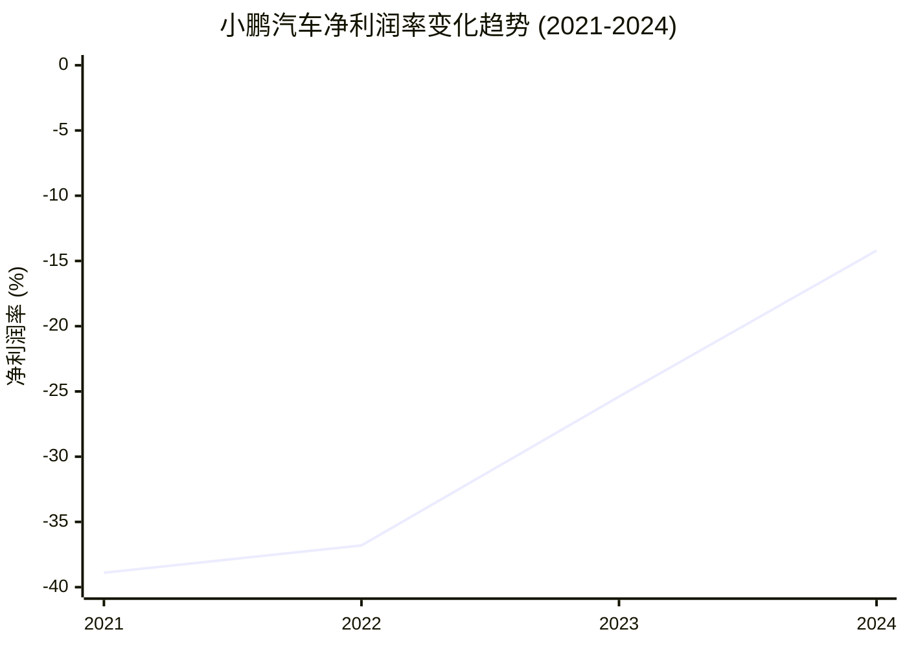
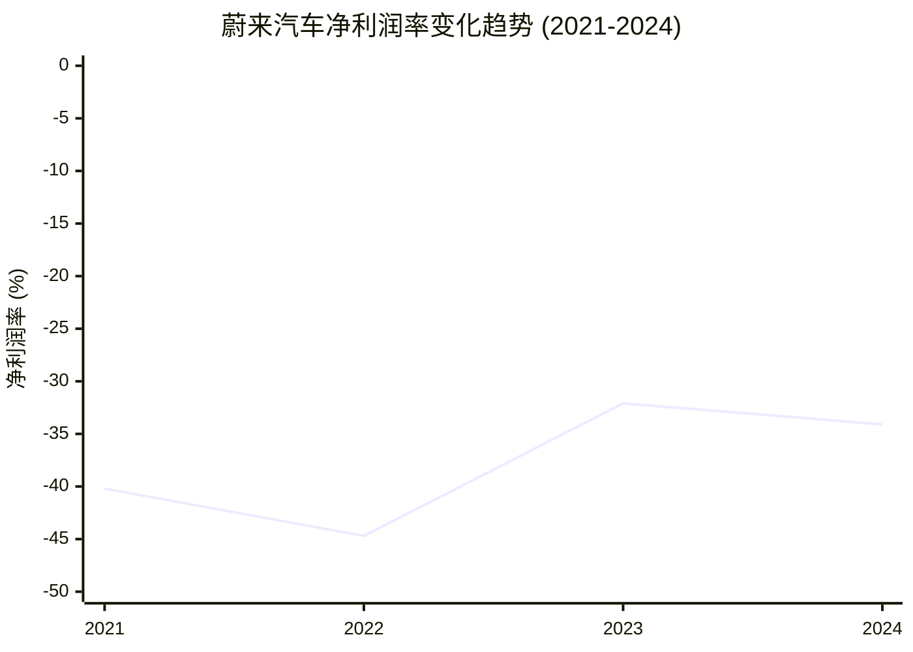
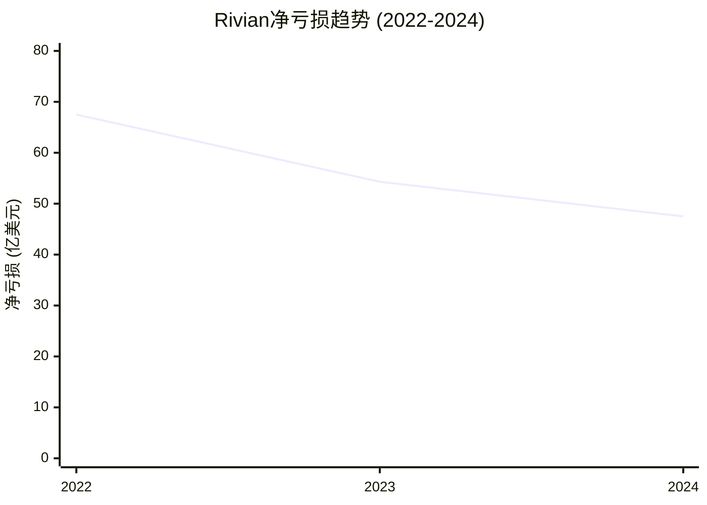
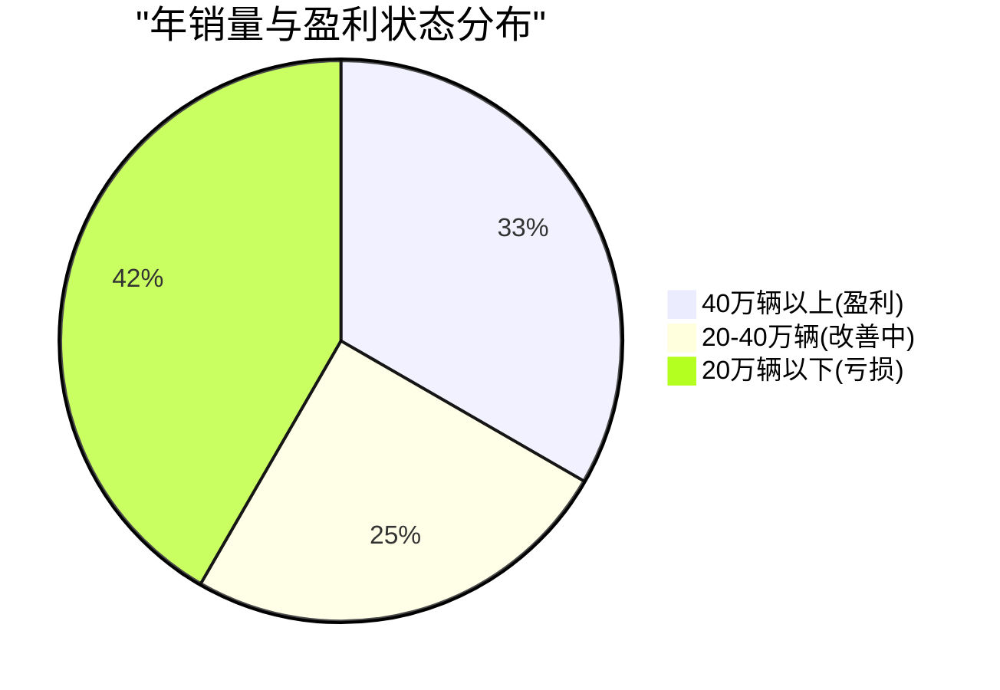

# 四年净利润率数据收集与分析 (2021-2024)

本报告收集并分析了主要新能源乘用车企业四年间的净利润率数据，为战略决策提供数据支撑。

## 数据收集方法论

净利润率 (Net Profit Margin) = 净利润 (Net Profit) / 营业收入 (Revenue) × 100%

**会计准则对应关系：**
- US GAAP: Net Income
- IFRS/HKFRS: Profit for the Year  
- PRC GAAP: 净利润

## A类企业：持续盈利企业四年数据

### 比亚迪 (BYD) - 持续盈利领导者

| 年份 | 营收(亿元) | 净利润(亿元) | 净利润率(%) | 同比变化 |
|------|------------|--------------|-------------|----------|
| 2021 | 2,161      | ~50          | ~2.3        | -        |
| 2022 | 4,241      | 166.2        | 3.92        | +70%     |
| 2023 | 6,023      | 300.4        | 4.99        | +27%     |
| 2024 | 7,771      | 402.5        | 5.18        | +4%      |

**关键指标：**
- 毛利率：2024年达22.3%，2023年为18.6%
- 规模效应显著：四年营收增长259%，净利润率稳步提升
- 单车利润：2024年约0.94万元

*数据来源：[BYD 2024年财务报告](https://bydukmedia.com/en/news-articles/byd-reports-its-financial-results-in-2024-revenue-hits-777.1-billion-yuan,-up-23-year-on-year.html)*

### 特斯拉 (Tesla) - 盈利能力承压

| 年份 | 营收(亿美元) | 净利润(亿美元) | 净利润率(%) | 同比变化 |
|------|--------------|----------------|-------------|----------|
| 2021 | 538.2        | 55.2           | 10.3        | -        |
| 2022 | 814.6        | 125.8          | 15.4        | +50%     |
| 2023 | 967.7        | 150.0*         | 15.5        | +1%      |
| 2024 | 976.9        | 71.3           | 7.3         | -53%     |

**注：** 2023年净利润包含57亿美元一次性税收优惠

**关键指标：**
- 毛利率：从2021年峰值26.5%降至2024年14.6%
- 竞争压力：价格战导致利润率大幅下降
- 季度表现：2024年Q2利润率降至14.6%，五年最低

*数据来源：[Tesla 2024年度分析](https://medium.com/@nambos3rd/tesla-full-year-2024-analysis-a-review-of-actual-performance-my-financial-forecast-41ee70091b5a)*

### 理想汽车 (Li Auto) - 新势力盈利标杆

| 年份 | 营收(亿元) | 净利润(亿元) | 净利润率(%) | 同比变化 |
|------|------------|--------------|-------------|----------|
| 2021 | 270.1      | -32.8        | -12.1       | -        |
| 2022 | 452.9      | -68.7        | -15.2       | -25%     |
| 2023 | 1,238.5    | 118.1        | 9.5         | +163%    |
| 2024 | 1,444.6    | 80.5         | 5.6         | -41%     |

**关键指标：**
- 车辆毛利率：2024年19.8%，2023年21.5%
- 转折点：2023年成为首家年度盈利的造车新势力
- 季度表现：2024年Q4营运利润率8.4%

*数据来源：[理想汽车2024年财务数据](https://ir.lixiang.com/news-releases/news-release-details/li-auto-inc-announces-unaudited-fourth-quarter-and-full-year-3/)*

## B类企业：改善趋势企业四年数据

### 零跑汽车 (Leapmotor) - 扭亏为盈新星

| 年份 | 营收(亿元) | 净利润(亿元) | 净利润率(%) | 季度盈利 |
|------|------------|--------------|-------------|----------|
| 2022 | 123.9      | -35.3        | -28.5       | 无       |
| 2023 | 167.4      | -42.0        | -25.1       | 无       |
| 2024 | 321.6      | -28.2        | -8.8        | Q4转正   |

**改善亮点：**
- 2024年Q4实现季度净利润0.8亿元，成为第二家季度盈利的造车新势力
- 毛利率：全年8.4%，Q4达13.3%创新高
- 亏损收窄：净利润率从-25.1%改善至-8.8%

*数据来源：[零跑汽车2024年Q4盈利报告](https://news.qq.com/rain/a/20250310A075FF00)*

### 极氪 (Zeekr) - 加速改善中

| 年份 | 营收(亿元) | 净利润(亿元) | 净利润率(%) | 改善幅度 |
|------|------------|--------------|-------------|----------|
| 2022 | 317.3      | -50.1        | -15.8       | -        |
| 2023 | 517.4      | -82.6        | -16.0       | -1%      |
| 2024 | 759.0      | -57.9        | -7.6        | +52%     |

**改善趋势：**
- 亏损收窄：2024年净亏损同比收窄30%
- 毛利率提升：整车毛利率Q4达17.3%，全年15.6%
- 预期目标：2025年实现季度收支平衡

*数据来源：[极氪2024年财报](http://www.news.cn/auto/20250321/85bc26c7d2b04c5d94d13e72f1aa4347/c.html)*

### 小鹏汽车 (XPeng) - 明显改善

| 年份 | 营收(亿元) | 净利润(亿元) | 净利润率(%) | 改善幅度 |
|------|------------|--------------|-------------|----------|
| 2021 | 209.9      | -81.7        | -38.9       | -        |
| 2022 | 268.6      | -91.4        | -34.0       | +13%     |
| 2023 | 306.8      | -103.8       | -33.8       | +0.6%    |
| 2024 | 408.7      | -57.9        | -14.2       | +58%     |

**改善亮点：**
- 毛利率大幅提升：从2023年1.5%升至2024年14.3%
- 亏损显著收窄：净亏损同比减少44%
- 单车亏损：约3万元，较蔚来10万元大幅改善

*数据来源：[小鹏汽车2024年财务数据](https://ir.xiaopeng.com/news-releases/news-release-details/xpeng-reports-fourth-quarter-and-fiscal-year-2024-unaudited)*

## C类企业：持续亏损企业四年数据

### 蔚来汽车 (NIO) - 高额亏损持续

| 年份 | 营收(亿元) | 净利润(亿元) | 净利润率(%) | 累计亏损 |
|------|------------|--------------|-------------|----------|
| 2021 | 361.4      | -145.3       | -40.2       | -        |
| 2022 | 492.7      | -220.3       | -44.7       | -365.6   |
| 2023 | 556.2      | -178.6       | -32.1       | -544.2   |
| 2024 | 657.3      | -224.0       | -34.1       | -768.2   |

**持续挑战：**
- 累计亏损：自2018年上市累计超1093亿元
- 单车亏损：高达10万元，行业最高
- 毛利率偏低：2024年仅9.9%
- 研发投入：2024年94亿元，占营收18%

*数据来源：[蔚来汽车2024年财务分析](https://www.lanjinger.com/d/229310)*

### 国际对比：Rivian, Lucid, Polestar

#### Rivian - 产能爬坡困难

| 年份 | 净亏损(亿美元) | 改善幅度 | 单车亏损(美元) |
|------|----------------|----------|----------------|
| 2022 | -67.5          | -        | -            |
| 2023 | -54.3          | 19.6%    | -            |
| 2024 | -47.5          | 12.5%    | 39,130       |

*数据来源：[Rivian 2024财务报告](https://rivian.com/newsroom/article/rivian-releases-fourth-quarter-full-year-2024-financial-results)*

#### Lucid Motors - 交付量制约

| 年份 | 净亏损(亿美元) | 交付量(辆) | 单车亏损(美元) |
|------|----------------|------------|----------------|
| 2022 | -13.0          | 4,369      | 297,732        |
| 2023 | -28.3          | 4,656      | 607,732        |
| 2024 | -30.6          | 10,241     | 299,000        |

*数据来源：[Lucid 2024财务结果](https://ir.lucidmotors.com/news-releases/news-release-details/lucid-announces-fourth-quarter-and-full-year-2024-financial)*

## 行业盈利门槛分析

### 规模门槛

基于数据分析，新能源车企可持续盈利的关键门槛：

**盈利企业特征：**
- 年销量通常超过40-50万辆
- 车辆毛利率超过18%
- 研发投入占营收比例控制在15%以内

### 毛利率分级

| 毛利率区间 | 企业示例 | 盈利状态 |
|------------|----------|----------|
| >20%       | 比亚迪、理想、问界 | 盈利 |
| 15-20%     | 极氪、特斯拉 | 临界点 |
| 10-15%     | 零跑、小鹏 | 改善中 |
| <10%       | 蔚来 | 亏损 |

## 数据总结与洞察

1. **规模效应决定性作用**：所有实现盈利的企业年销量均超过40万辆
2. **毛利率临界点**：18%以上毛利率是可持续盈利的关键指标
3. **改善轨迹明确**：B类企业2024年均显示明显财务改善趋势
4. **成本控制重要性**：单车亏损控制在5万元以内是扭亏关键

这些数据为新能源车企制定盈利策略提供了清晰的参考基准和改善路径。