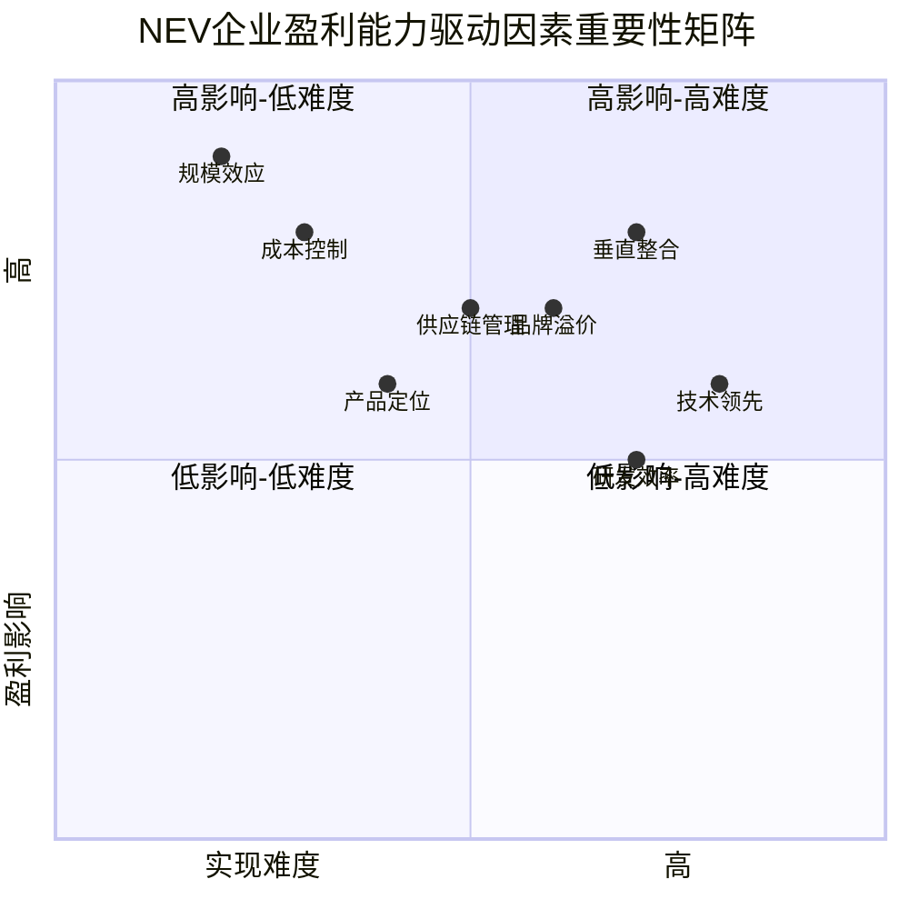
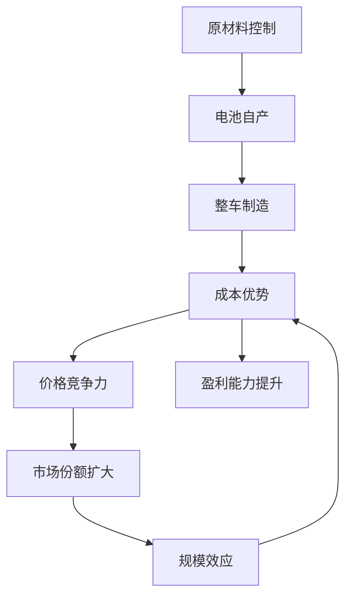
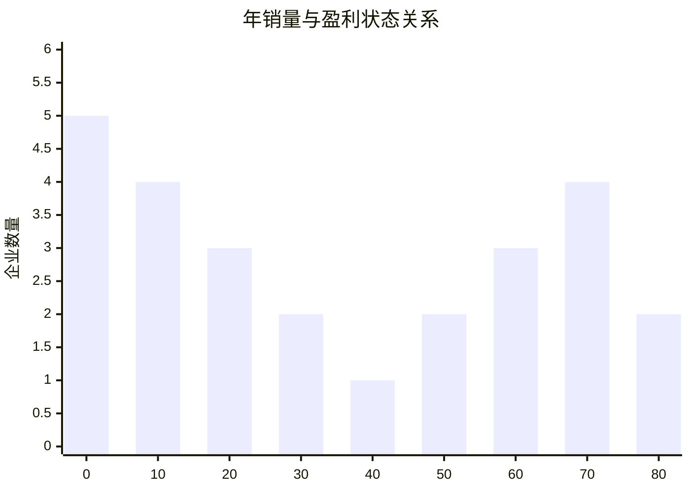

# NEV OEM 盈利能力驱动因素与战略分析

本报告深入分析新能源乘用车企业的盈利能力驱动因素，为战略决策提供详实的分析基础。

## 盈利能力核心驱动因素矩阵

## A类企业成功模式深度解析

### 比亚迪：垂直整合的成本优势模式

**核心战略要素：**

1. **全产业链垂直整合**
   - 自产75%的车辆组件，运营超过100个内部工厂
   - 电池成本低至人民币0.4元/Wh（0.055美元/Wh）
   - 相比特斯拉拥有15%的生产成本优势

2. **规模经济效应**
   - 年产能从50万辆增长至400万辆，700%增长率
   - 电池产能达135 GWh，减少对第三方供应商依赖
   - 单车利润0.94万元，通过规模摊薄固定成本

3. **技术创新与成本控制**
   - 刀片电池技术专利，Cell-to-Pack设计减少材料使用
   - AI、大数据和物联网提升供应链效率
   - 智能工厂自动化生产速度比传统制造商快3倍

**盈利路径图：**

*数据来源：[BYD垂直整合战略分析](https://evboosters.com/ev-charging-news/the-blueprint-of-an-ev-empire-how-byd-built-global-dominance-through-vertical-integration/)*

### 特斯拉：软件服务生态盈利模式

**核心战略要素：**

1. **软件服务收入模式**
   - FSD软件收入约13亿美元，毛利率超过80%
   - Autopilot和FSD订阅提供持续收入流
   - 数据货币化价值95亿美元，实时采集车辆运营数据

2. **充电网络商业化**
   - 2023年充电网络收入约17.4亿美元
   - 预计2030年充电收入可达74亿美元，利润7.4亿美元
   - 向其他品牌开放后，年收入有望达60-120亿美元

3. **生态系统集成价值**
   - 硬件、软件、服务一体化
   - 超充网络品牌营销价值
   - 从汽车制造商向科技能源公司转型

**挑战与应对：**
- 利润率从2022年峰值30%下降至2024年7.3%
- 面临价格战压力，通过软件服务收入补偿
- 投资人工智能项目，布局长期竞争优势

*数据来源：[Tesla软件服务收入模式](https://www.untaylored.com/post/decoding-tesla-s-business-model-and-revenue-streams)*

### 理想汽车：聚焦策略的精准定位模式

**核心战略要素：**

1. **技术路线专注**
   - 专注增程式电动车(EREV)技术
   - 避开纯电竞争红海，差异化定位
   - 电池容量35-60kWh，平衡成本与性能

2. **产品定位精准**
   - 聚焦15-50万元家庭SUV市场
   - 平均售价33万元，高端市场定位
   - "创造移动的家"品牌理念，家庭用户导向

3. **成本结构优化**
   - 车辆毛利率维持在19-21%高水平
   - 研发投入聚焦，避免资源分散
   - 直营销售模式，用户体验优化

**成功因素分析：**
- 首家实现连续三季度盈利的中国新势力
- 2023年净利润118亿元，净利润率9.5%
- 现金储备稳定，为未来发展奠定基础

*数据来源：[理想汽车SWOT分析](https://www.investing.com/news/swot-analysis/li-autos-swot-analysis-autonomous-driving-tech-fuels-stock-potential-93CH-4094489)*

## B类企业改善策略分析

### 零跑汽车：成本领先突破模式

**改善路径：**
1. **成本控制突破**
   - Q4毛利率达13.3%，创历史新高
   - 单季度盈利0.8亿元，成为第二家季度盈利新势力
   - 规模效应初显，年交付29.37万台

2. **技术与成本平衡**
   - 自研核心技术降低成本
   - 产品线优化，聚焦市场需求
   - 供应链管理效率提升

### 极氪：品牌溢价建设模式

**改善路径：**
1. **品牌价值提升**
   - 整车毛利率Q4达17.3%
   - 高端品牌定位，平均售价提升
   - 吉利集团资源协同

2. **运营效率改善**
   - 亏损收窄30%，向盈亏平衡点靠近
   - 预期2025年实现季度收支平衡
   - 营收高速增长47%

### 小鹏汽车：技术驱动转型模式

**改善路径：**
1. **毛利率大幅改善**
   - 从1.5%提升至14.3%，增幅12.8个百分点
   - 亏损收窄44%，显著改善趋势
   - 单车亏损降至约3万元

2. **产品竞争力提升**
   - 智能化技术优势
   - 产品矩阵完善
   - 市场认知度提升

## C类企业挑战因素分析

### 蔚来汽车：商业模式复杂性挑战

**主要挑战：**

1. **换电模式成本压力**
   - 单个换电站需日均服务60-70次才能盈亏平衡
   - 目前仅20%的站点接近盈亏平衡点
   - 基础设施投资巨大，回收期长

2. **运营成本居高不下**
   - 单车亏损高达10万元，行业最高
   - 研发投入94亿元，占营收18%
   - 现金储备从329亿元降至237亿元

**改善预期：**
- 预计2026年换电业务实现盈亏平衡
- 上海地区站点接近盈利，日均9000-10000次服务
- 长期看换电模式具备差异化价值

*数据来源：[蔚来换电模式分析](https://knowledge.insead.edu/strategy/chinese-ev-company-made-battery-swapping-work)*

### 国际新势力：Rivian, Lucid, Polestar

**共同挑战：**

1. **产能利用率低**
   - Rivian Q3单车亏损39,130美元
   - Lucid单车亏损341,000美元，行业最高
   - 交付量与产能严重不匹配

2. **制造成本过高**
   - 缺乏规模经济效应
   - 供应链管理不成熟
   - 制造效率待提升

## 行业盈利能力关键成功因素

### 1. 规模门槛效应

**关键发现：**
- 40万辆：可持续盈利的最低门槛
- 80万辆：规模优势显著体现的分界点
- 200万辆以上：具备行业定价权

### 2. 毛利率分级体系

| 毛利率区间 | 企业状态 | 代表企业 | 战略重点 |
|------------|----------|----------|----------|
| >22% | 盈利领先 | 比亚迪、问界 | 价值最大化 |
| 18-22% | 盈利稳定 | 理想、特斯拉 | 规模扩张 |
| 15-18% | 盈亏平衡 | 极氪、小鹏 | 效率提升 |
| 10-15% | 改善中 | 零跑 | 成本控制 |
| <10% | 挑战期 | 蔚来 | 模式优化 |

### 3. 成本结构优化路径

**最佳实践要素：**

1. **电池成本控制（占整车成本30-35%）**
   - 垂直整合：如比亚迪自产电池
   - 技术创新：LFP电池技术应用
   - 规模采购：与供应商建立长期合作

2. **制造效率提升**
   - 智能制造：自动化生产线
   - 精益生产：减少浪费和库存
   - 质量控制：降低返修成本

3. **研发投入优化**
   - 聚焦核心技术：避免资源分散
   - 合作研发：降低单独开发成本
   - 技术平台化：一套技术多产品应用

## 战略建议框架

### 对A类企业（持续盈利）

**战略方向：巩固优势，价值最大化**
1. 加强核心技术护城河建设
2. 扩大规模优势，提升市场份额
3. 探索新盈利模式，如软件服务
4. 国际化布局，分散风险

### 对B类企业（改善中）

**战略方向：加速突破，实现盈利**
1. 聚焦资源投入，避免分散
2. 加强成本控制和效率提升
3. 寻找差异化定位和品牌价值
4. 建立规模化生产能力

### 对C类企业（持续亏损）

**战略方向：模式调整，生存发展**
1. 重新评估商业模式可行性
2. 优化成本结构，控制现金消耗
3. 寻找战略合作伙伴或投资者
4. 考虑业务重组或退出策略

通过以上分析，新能源车企可以根据自身情况制定相应的盈利改善策略，实现可持续发展。