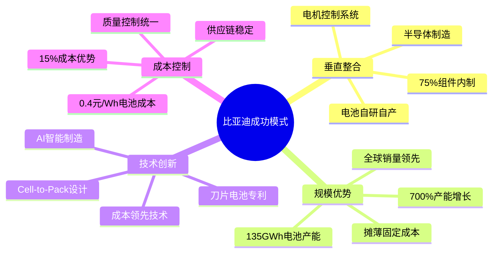
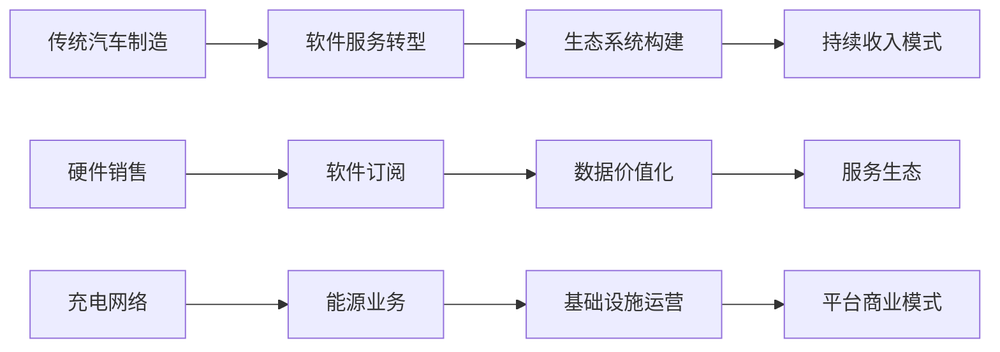
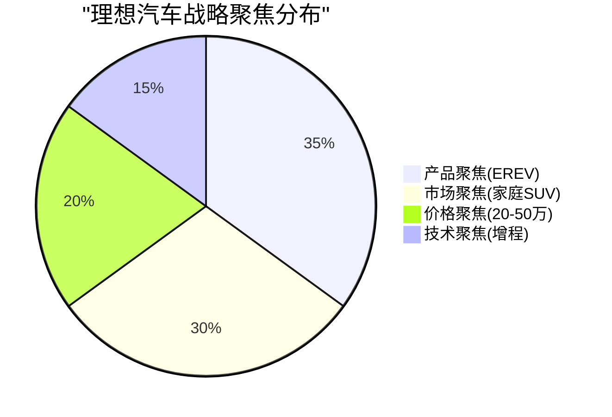
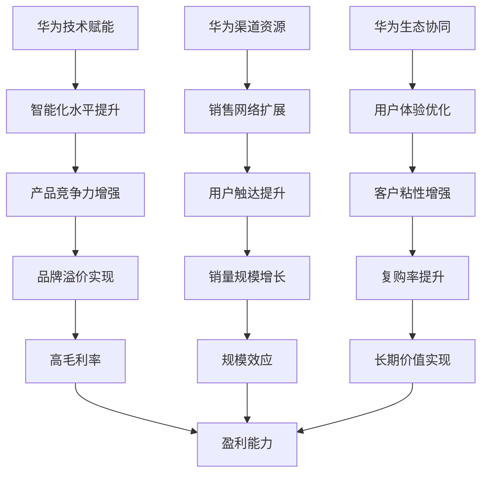

# A类企业成功策略深度分析

本报告专门分析A类企业（持续盈利）的成功策略和核心竞争优势，为其他企业提供可借鉴的经验。

## 比亚迪：垂直整合的产业链控制模式

### 核心战略框架



### 战略执行细节

**1. 垂直整合的深度与广度**
- **电池产业链完整控制**：从锂矿开采到电芯制造，控制整个价值链
- **半导体自主可控**：IGBT、SiC等功率器件自产，摆脱进口依赖
- **制造体系一体化**：超过100个内部工厂，形成完整制造生态

**2. 技术创新的商业化能力**
- **刀片电池技术领先**：安全性、成本、能量密度的最佳平衡
- **专利护城河建设**：全球专利布局，技术壁垒稳固
- **快速产业化能力**：从技术突破到量产仅需18个月

**3. 成本优势的可持续性**
- **学习曲线效应**：随产量增长，单位成本持续下降
- **供应链议价权**：规模化采购降低原材料成本
- **质量成本控制**：一体化生产减少协调成本和质量风险

### 财务表现分析

| 指标 | 2021 | 2022 | 2023 | 2024 | 年均增长率 |
|------|------|------|------|------|------------|
| 营收(亿元) | 2,161 | 4,241 | 6,023 | 7,771 | 56% |
| 净利润(亿元) | ~50 | 166 | 300 | 403 | 105% |
| 净利润率(%) | 2.3 | 3.9 | 5.0 | 5.2 | - |
| 毛利率(%) | 17.4 | 19.2 | 18.6 | 22.3 | - |

**关键绩效驱动因素：**
- 营收增长主要来自销量提升（700%增长）和产品结构优化
- 净利润率稳步提升，显示规模效应和成本控制效果
- 毛利率在2024年大幅提升，反映定价权和成本优势

*数据来源：[BYD垂直整合优势分析](https://evboosters.com/ev-charging-news/the-blueprint-of-an-ev-empire-how-byd-built-global-dominance-through-vertical-integration/)*

## 特斯拉：软件定义汽车的生态模式

### 转型战略分析



### 核心竞争优势

**1. 软件服务收入模式**
- **FSD软件价值**：每套8,000美元终身版本或99美元/月订阅
- **高毛利率特征**：软件服务毛利率超过80%
- **持续收入流**：车辆生命周期内的持续变现

**2. 充电网络商业化**
- **基础设施规模**：全球最大的快充网络
- **收入多元化**：电费收入+网络接入费+品牌价值
- **战略护城河**：充电网络形成用户粘性和品牌曝光

**3. 数据价值挖掘**
- **数据资产规模**：95亿美元数据价值评估
- **多维度应用**：保险定价、自动驾驶、车辆优化
- **平台效应**：数据越多，服务越精准，价值越高

### 挑战与应对策略

**面临的挑战：**
- 净利润率从2022年15.4%下降至2024年7.3%
- 价格战压力影响硬件销售利润
- 竞争加剧，品牌溢价承压

**应对策略：**
- 加大软件服务投入，提高收入占比
- 开放充电网络，扩大收入来源
- 投资AI和自动驾驶，布局长期竞争优势

*数据来源：[Tesla收入模式分析](https://time.com/6287589/tesla-ev-charging-business-model/)*

## 理想汽车：聚焦策略的市场突破模式

### 差异化定位策略



### 成功要素分析

**1. 技术路线差异化**
- **EREV技术优势**：平衡电动体验和里程焦虑
- **避开竞争红海**：纯电竞争激烈，增程式相对蓝海
- **成本效益最优**：35-60kWh电池容量，成本可控

**2. 精准市场定位**
- **目标客群明确**：30-40岁已婚有子女家庭
- **产品功能匹配**：六座布局、家庭出行场景优化
- **价位区间合理**：平均售价33万元，中高端定位

**3. 运营效率优化**
- **直营模式优势**：用户体验一致性，数据直接掌握
- **研发投入聚焦**：避免技术路线分散，提高效率
- **供应链管理精细**：与核心供应商深度合作

### 盈利能力突破

**关键财务指标：**
- **2023年实现年度盈利**：净利润118亿元，净利润率9.5%
- **连续季度盈利**：成为首家连续盈利的造车新势力
- **毛利率维持高位**：车辆毛利率稳定在19-21%

**盈利驱动因素：**
1. **产品溢价能力**：品牌认知度提升，用户满意度高
2. **成本控制能力**：供应链管理优化，制造效率提升
3. **规模经济效应**：销量增长带来固定成本摊薄

*数据来源：[理想汽车战略分析](https://www.investing.com/news/swot-analysis/li-autos-swot-analysis-autonomous-driving-tech-fuels-stock-potential-93CH-4094489)*

## 赛力斯（问界）：合作共赢的生态模式

### 华为赋能策略



### 成功模式要素

**1. 技术合作深度化**
- **智能化技术领先**：HarmonyOS车机系统，智能座舱体验
- **自动驾驶能力**：华为ADS高阶自动驾驶系统
- **三电系统优化**：华为DriveOne电驱动系统

**2. 渠道资源整合**
- **华为门店网络**：借助华为全国门店进行展示销售
- **品牌协同效应**：华为品牌影响力提升产品认知度
- **用户生态共享**：华为用户向汽车用户转化

**3. 盈利模式创新**
- **高毛利率实现**：问界M9毛利率34-35%，行业领先
- **快速盈利突破**：2024年预计净利润55-60亿元
- **可持续发展**：合作模式减少重复投资，提高效率

### 财务表现亮点

| 关键指标 | 2024年表现 | 行业对比 |
|----------|------------|----------|
| 毛利率 | 27.47% | 行业前列 |
| M9毛利率 | 34-35% | 豪华车水平 |
| 净利润率 | 3.65% | 盈利企业 |
| 增长率 | 营收增长300%+ | 高速增长 |

## A类企业成功模式总结

### 共性成功因素

```mermaid
xychart-beta
    title "A类企业成功因素重要性评分"
    x-axis [规模效应, 成本控制, 技术优势, 品牌价值, 运营效率, 战略聚焦]
    y-axis "重要性评分" 0 --> 10
    bar [9.5, 9.0, 8.5, 8.0, 8.5, 9.0]
```

**1. 规模效应是基础**
- 所有盈利企业年销量均超过40万辆
- 规模带来成本优势和议价权
- 固定成本摊薄效应明显

**2. 成本控制是关键**
- 垂直整合或核心技术自主可控
- 供应链管理效率高
- 制造成本持续优化

**3. 差异化是核心**
- 技术路线差异化（比亚迪垂直整合、理想EREV）
- 商业模式创新（特斯拉软件服务、问界华为合作）
- 市场定位精准（理想家庭市场、问界高端智能）

**4. 执行力是保障**
- 战略聚焦，资源集中投入
- 快速响应市场变化
- 持续的运营优化能力

### 对其他企业的启示

**对B类企业（改善中）：**
- 学习A类企业的成本控制经验
- 寻找自身的差异化定位
- 聚焦资源，避免战线过长

**对C类企业（亏损中）：**
- 重新审视商业模式可行性
- 考虑战略合作或技术授权
- 优化成本结构，延长生存期

通过深度分析A类企业的成功策略，我们可以清晰地看到新能源汽车行业盈利的关键路径和成功要素。