# NEV OEM 战略建议与改善路径

本报告基于前期分析，为不同类型新能源车企提供针对性的战略建议和具体改善路径。

## 基于企业分类的差异化战略框架

## A类企业：价值最大化与竞争优势巩固

### 战略目标
巩固现有盈利优势，扩大市场领导地位，实现长期价值最大化。

### 具体策略建议

#### 1. 比亚迪：深化垂直整合，全球化扩张

**短期策略（1-2年）：**
- **产能全球化布局**
  - 在欧洲、南美建立制造基地
  - 复制垂直整合模式到海外市场
  - 目标：海外销量占比提升至30%

- **技术护城河强化**
  - 加大固态电池研发投入
  - 扩大刀片电池技术领先优势
  - 建立更完整的专利保护体系

**中期策略（3-5年）：**
- **价值链向上延伸**
  - 进入锂矿开采和精炼业务
  - 建立全球原材料供应网络
  - 实现关键原材料的战略控制

- **商业模式创新**
  - 发展Battery as a Service业务
  - 探索储能和电网服务
  - 构建能源生态系统

**关键绩效指标：**
- 全球市场份额：目标25%
- 海外收入占比：目标40%
- 净利润率：维持5%以上

#### 2. 特斯拉：软件服务转型，平台化发展

**短期策略（1-2年）：**
- **软件收入占比提升**
  - FSD订阅用户增长至100万+
  - 推出更多软件服务产品
  - 目标软件收入占比达到15%

- **充电网络商业化加速**
  - 向更多品牌开放超充网络
  - 提升充电网络利用率至60%
  - 探索充电+零售复合业务模式

**中期策略（3-5年）：**
- **自动驾驶服务化**
  - 推出Robotaxi服务
  - 建立自动驾驶平台生态
  - 向其他车企提供技术授权

- **能源业务扩张**
  - 扩大家用储能市场份额
  - 发展工商业储能业务
  - 建立虚拟电厂服务网络

**关键绩效指标：**
- 软件服务收入：目标100亿美元
- 充电网络年收入：目标50亿美元
- 净利润率：恢复至12%以上

#### 3. 理想汽车：平台化扩展，品牌升级

**短期策略（1-2年）：**
- **产品平台扩展**
  - 基于增程平台开发轿车产品
  - 进入20万以下价格区间
  - 年销量目标100万辆

- **技术能力拓展**
  - 加强纯电技术研发
  - 布局800V高压平台
  - 提升自动驾驶能力

**中期策略（3-5年）：**
- **多品牌战略**
  - 推出高端品牌冲击50万+市场
  - 发展大众化品牌覆盖15-25万区间
  - 建立完整品牌矩阵

- **生态服务拓展**
  - 发展汽车金融服务
  - 建立车主服务生态
  - 探索出行服务业务

**关键绩效指标：**
- 年销量：目标150万辆
- 品牌矩阵覆盖率：10-60万全价位
- 净利润率：维持8%以上

## B类企业：效率提升与差异化突破

### 战略目标
实现盈亏平衡，建立可持续的盈利能力，在细分市场建立竞争优势。

#### 1. 零跑汽车：成本领先，规模突破

**核心战略：全栈自研+成本控制**

```mermaid
timeline
    title 零跑汽车3年发展路径
    2025 : 实现年度盈利
         : 销量突破50万辆
         : 毛利率达到15%
    2026 : 海外市场布局
         : 建立技术授权业务
         : 净利润率达到5%
    2027 : 成为行业前五
         : 年销量100万辆
         : 建立品牌矩阵
```

**具体措施：**
- **技术自研能力强化**
  - 继续推进全栈自研策略
  - 重点突破电池管理和智能驾驶技术
  - 建立技术授权和输出能力

- **成本控制优化**
  - 供应链本土化程度提升至90%
  - 制造效率提升30%
  - 单车制造成本降低15%

- **市场扩展策略**
  - 产品线向上下延伸
  - 海外市场开拓，重点布局东南亚
  - 建立合资和技术输出模式

#### 2. 极氪汽车：高端定位，品牌价值提升

**核心战略：高端智能+吉利协同**

**品牌建设路径：**
- **产品力提升**
  - 加强与吉利SEA架构协同
  - 提升智能化和豪华化水平
  - 建立高端品牌认知

- **运营效率优化**
  - 利用吉利全球供应链资源
  - 优化研发和制造成本结构
  - 提升单车盈利能力

- **市场定位强化**
  - 聚焦高端智能电动车市场
  - 与BBA等传统豪华品牌竞争
  - 建立品牌溢价能力

#### 3. 小鹏汽车：智能化差异，技术变现

**核心战略：智能驾驶技术领先+商业化变现**

**技术商业化路径：**
- **智能驾驶技术输出**
  - 向其他车企提供技术授权
  - 建立智能驾驶服务平台
  - 开展Robotaxi试点服务

- **成本结构优化**
  - 供应链成本降低20%
  - 制造效率提升25%
  - 研发投入产出比优化

- **产品组合调整**
  - 聚焦主销价格区间产品
  - 优化产品线，减少亏损车型
  - 提升整体毛利率水平

## C类企业：生存为先，转型求变

### 战略目标
控制亏损规模，寻找可行的商业模式，实现企业生存和发展。

#### 1. 蔚来汽车：模式优化，成本控制

**核心挑战：换电模式投资巨大，短期难以盈利**

**转型策略：**

**具体措施：**

- **换电网络优化**
  - 重点城市加密建设，提升单站利用率
  - 向其他品牌开放换电服务
  - 目标：单站日均服务70次以上

- **成本控制强化**
  - 研发投入聚焦核心技术
  - 运营费用削减30%
  - 制造成本降低25%

- **商业模式调整**
  - 换电技术对外授权
  - BaaS模式推广到更多品牌
  - 探索与其他车企合资建设换电网络

**救援时间表：**
- 2025年：单车亏损降至5万元以下
- 2026年：换电业务实现盈亏平衡
- 2027年：整体业务扭亏为盈

#### 2. 国际C类企业：战略重组，寻找出路

**Rivian：聚焦核心市场，提升制造效率**
- 暂停部分产品线，聚焦主销车型
- 制造效率提升50%，单车亏损减半
- 寻找战略投资者或合作伙伴

**Lucid：技术授权，减轻制造负担**
- 将先进技术授权给其他车企
- 减少自主制造规模，专注技术研发
- 转型为技术服务公司模式

**Polestar：母公司协同，成本共享**
- 加强与吉利/沃尔沃的平台共享
- 利用母公司全球化网络
- 专注北欧高端市场定位

## 行业级战略建议

### 1. 政策建议

- **技术创新支持**：加大对关键技术研发的税收优惠
- **基础设施建设**：统筹规划充换电网络布局
- **市场培育引导**：完善新能源汽车消费政策
- **国际合作促进**：支持企业海外并购和技术合作

### 2. 产业链协同建议

- **上游原材料**：建立战略储备，稳定价格波动
- **中游制造**：推动标准化，降低供应链成本
- **下游服务**：完善售后和充电服务体系

### 3. 企业合作建议

**联盟合作模式：**
- 技术研发联盟：共担风险，共享成果
- 制造平台共享：降低固定投资成本
- 市场开拓协同：抱团出海，降低国际化风险

## 关键成功要素总结

### 盈利能力提升的四大支柱

### 企业发展路径选择矩阵

| 企业类型 | 短期重点 | 中期目标 | 长期愿景 |
|----------|----------|----------|----------|
| A类企业 | 市场扩张 | 全球化布局 | 行业引领者 |
| B类企业 | 效率提升 | 盈利突破 | 细分领导者 |
| C类企业 | 成本控制 | 模式调整 | 生存发展 |

通过以上战略建议和改善路径，各类新能源车企可以根据自身情况制定相应的发展策略，实现从当前状态向更高盈利水平的跃升。