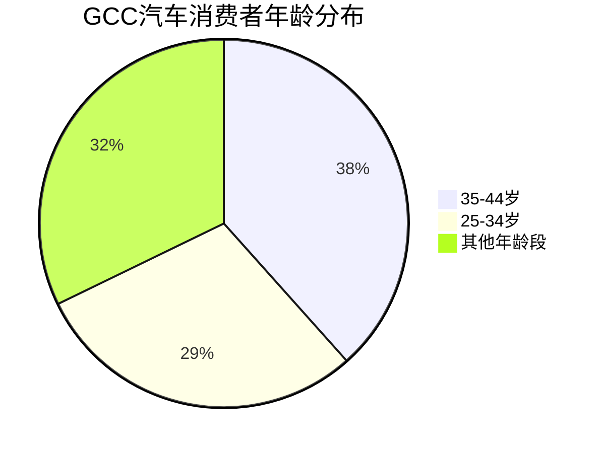
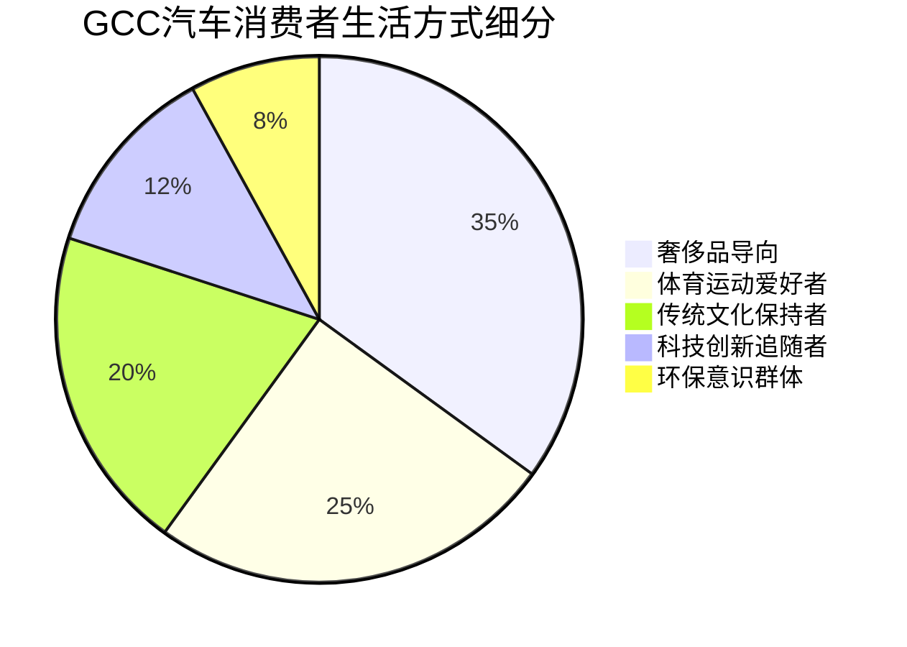
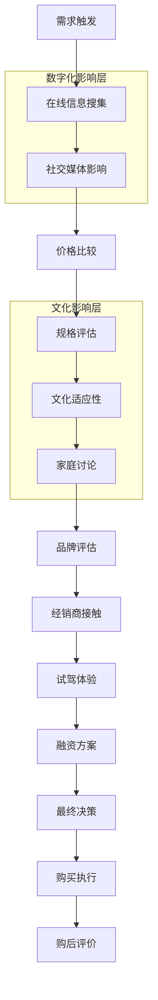

# GCC汽车消费者画像深度研究报告

## 执行摘要

本研究深入分析了海湾合作委员会（GCC）国家的汽车消费者画像，涵盖人口统计学特征、文化背景、兴趣爱好、购买决策因素和消费者决策流程等五个核心维度。研究发现，GCC汽车市场呈现出高收入、年轻化、男性主导、奢侈导向的消费特征，同时深受传统文化和数字化趋势的双重影响。

### 核心发现

- **人口特征**：67.8%的消费者集中在25-44岁黄金消费年龄段，男性占65%，平均家庭可支配收入45,000美元
- **文化影响**：奢侈汽车作为重要社会地位象征，传统阿拉伯文化与现代消费观念并存
- **生活方式**：奢侈品导向消费理念，体育运动文化深厚，数字化生活方式成熟
- **决策因素**：价格敏感性最高（65%），燃油效率和安全性并重（各占53%以上）
- **购买流程**：数字化研究成为标准，社交媒体影响力显著，决策周期延长

## 研究背景

### 市场规模与增长潜力
GCC汽车市场展现出强劲的增长势头：
- **乘用车市场价值**：271.4亿美元（2023年）→ 466.2亿美元（2029年预测）
- **复合年增长率**：9.53%（2024-2029）
- **奢侈品市场规模**：153亿美元（2023年）→ 332.8亿美元（2032年预测）

### 研究目标与意义
深入了解GCC汽车消费者特征，为汽车行业制定精准的市场进入策略、产品定位和营销活动提供数据驱动的洞察支持。

## 主要研究发现

## 一、人口统计学特征：年轻富裕的消费群体

### 年龄结构：年轻化趋势明显


**关键洞察：**
- **黄金消费群体**：25-44岁年龄段占67.8%，构成市场主力
- **人口结构优势**：超过50%的本地人口年龄在25岁以下，为未来消费增长提供潜力
- **购买力集中**：消费能力最强的中青年群体主导市场需求

### 性别分布：男性主导消费
- **男性消费者**：65%（主要决策者和购买者）
- **女性消费者**：35%（参与度逐步提升）
- **文化因素**：传统文化中男性为家庭主要购车决策者，同时具备更高的劳动参与率和收入水平

### 收入水平：高消费能力
- **平均家庭可支配收入**：45,000美元/年（阿联酋数据）
- **高收入外籍人士**：超过20万人年收入超过10万美元
- **税收优势**：零个人所得税政策平均为个人节省1万美元/年，用于汽车等大件商品购买

### 家庭结构：外籍驱动消费
- **外籍人士比例**：在阿联酋高达88%，构成主要购买力
- **消费特征**：外籍专业人士家庭收入较高，具备强大汽车消费能力
- **购买行为**：46%消费者提前规划购物，购车决策更加理性化

## 二、文化背景：地位象征与传统融合

### 社会地位文化
**奢侈汽车的象征意义：**
- 汽车作为**重要的社会地位象征**，体现家庭声望和社会定位
- 消费者通过购买奢侈品**"获得社会地位"**的动机强烈
- 受历史马术传统和新兴汽车文化影响，形成独特的汽车展示文化

**消费行为特征：**
- 优先考虑**主观品质而非客观规格**
- 重视汽车的声望、风格、视觉冲击力和社会认可度
- **现代阿拉伯漂移文化**（Tafheet）体现汽车技能展示传统

### 宗教因素的调节作用
**伊斯兰价值观影响：**
- **宗教知识水平显著削弱奢侈汽车购买冲动**
- 传统伊斯兰价值观**不鼓励过度消费**
- 宗教观点认为**以追求品质为目的的购买是被允许的**

**世俗化趋势：**
- 沙特阿拉伯和阿联酋经历**逐步世俗化过程**
- **上层阶级世俗化程度更高**，更容易接受奢侈消费
- 受西方生活方式影响，出现**新兴消费文化**

### 多元文化市场特征
**文化多样性影响：**
- 外籍人士构成主要消费群体，带来**多元化消费需求**
- **海湾地区独特偏好**：四轮驱动奢华车辆，适合沙漠道路
- 与其他阿拉伯市场形成差异化：**奢华与实用性结合**的独特需求

**适应性文化策略：**
- **色彩偏好差异**：数字搜索偏好红色，实际购买偏好白色
- **品牌地位认知**：奢侈品牌被视为成功象征
- **环保意识兴起**：高净值消费者对电动汽车需求增加

## 三、兴趣爱好：奢侈导向的生活方式

### 奢侈消费文化特征


**核心特征：**
- **高端品牌追求**：奔驰、劳力士、古奇等品牌主要面向男性营销
- **地位展示需求**：奢侈消费与社会地位密切相关
- **创新技术兴趣**：对高性能电动汽车需求增长

### 运动和户外文化
**传统体育活动：**
- **骆驼赛跑**：15个赛道遍布阿联酋，传承数百年传统
- **猎鹰运动**：历史悠久的贵族活动
- **赛马运动**：深受欢迎的传统竞技
- **足球运动**：最受欢迎的现代体育运动

**汽车运动文化：**
- **达喀尔拉力赛**等国际赛事在地区举办
- **民间汽车改装文化**盛行
- 将车辆改装成**移动休息室**用于沙漠探险

### 数字化生活方式
**数字消费习惯：**
- **90%的沙特消费者使用智能手机在线购物**
- **50%偏好在线购物，43%采用混合模式**
- 社交媒体平台（YouTube、Facebook、Instagram、WhatsApp）深度影响消费决策

**富裕阶层兴趣：**
- **私人艺术收藏**和**高端摄影**
- **游艇活动**和**私人飞行**
- **高尔夫运动**和**奢侈休闲活动**

## 四、购车关键决策因素：实用性超越美观

### 决策因素重要性排序
```mermaid
xychart-beta
    title "GCC汽车购买决策因素重要性排序"
    x-axis [价格, 燃油效率, 安全性, 舒适性, 品质, 品牌, 技术, 设计]
    y-axis "重要性评分" 0 --> 70
    bar [65, 56, 55, 50, 46, 40, 35, 32]
```

### 价格敏感性主导
**价格因素：**
- **65%消费者将价格作为最大购买动机**
- 跨国价格比较成为常态（如沙特与阿联酋5%-28%价差）
- **物有所值理念**深入人心

### 实用性考虑
**功能优先原则：**
- **燃油效率（56%）和安全性（55%）超越价格重要性**
- **舒适性和空间需求**突出（宽敞内饰、储物空间）
- **技术配置要求**提升（触摸屏、驾驶辅助、互联网连接）

### 地区特色需求
**环境适应性：**
- **强效空调系统**和**抗高温材料**的重要性
- **四轮驱动**和**沙尘防护**功能需求
- **海湾规格车辆**在保值性方面的优势

**文化适应性：**
- **家庭聚会和社交活动**的空间需求
- **地位展示**的外观设计要求
- **传统价值观与现代功能**的平衡考虑

## 五、消费者决策流程：数字化深度影响

### 决策流程现代化特征


### 数字化研究行为
**深度在线研究：**
- **59%消费者在进入展厅前在线研究数月**
- **2022年消费者平均花费15小时研究购车**（比2021年增长18%）
- **单个消费者可能有超过900次数字互动**

### 社交媒体影响力
**平台影响排序：**
1. **Facebook**：38%总受访者认为最具影响力
2. **Instagram**：视觉内容影响显著
3. **YouTube**：视频评测内容重要
4. **TikTok**：在年轻群体中影响力增长三倍

**内容类型影响力：**
- **评价推荐（61%）**：最具影响力的内容类型
- **广告宣传（55%）**：传统营销仍有效果
- **品牌内容（45%）**：官方信息的重要性
- **论坛讨论（34%）**：同龄人意见的价值

### 购买执行趋势
**在线购买意愿：**
- **57%消费者愿意在线购买汽车**（2024年数据）
- **80%消费者计划完全在线购买**
- **60%的45岁以下消费者偏好在线购买**

## 战略洞察与建议

### 市场细分策略

#### 1. 奢侈消费群体（35%）
**特征：** 追求地位象征，品牌敏感度高
**策略建议：**
- 强调品牌声望和独特性
- 提供个性化定制服务
- 利用社交媒体影响者营销

#### 2. 实用主义消费群体（40%）
**特征：** 注重性价比，功能导向
**策略建议：**
- 突出燃油效率和安全性能
- 强调长期拥有成本优势
- 提供灵活的融资方案

#### 3. 技术创新群体（25%）
**特征：** 关注新技术，环保意识强
**策略建议：**
- 展示先进技术配置
- 推广电动和混合动力车型
- 强调智能化和连接性功能

### 营销策略建议

#### 数字化营销优先
1. **社交媒体深度布局**
   - Facebook和Instagram作为主要平台
   - YouTube视频内容营销
   - TikTok年轻群体渗透

2. **内容营销策略**
   - 用户评价和推荐内容制作
   - 专业汽车评测合作
   - 品牌故事和文化内容

3. **在线销售体系**
   - 完善在线购车流程
   - 提供虚拟试驾体验
   - 建立数字化客户服务

#### 文化适应策略
1. **地位象征定位**
   - 强调品牌声望和社会认同
   - 利用成功人士代言
   - 高端活动和体验营销

2. **家庭价值观融合**
   - 强调家庭安全和舒适
   - 宽敞空间和实用功能突出
   - 家庭决策者（男性）为主要目标

3. **传统文化尊重**
   - 理解宗教价值观对消费的影响
   - 平衡奢侈与适度的消费理念
   - 尊重当地文化传统和习俗

### 产品开发建议

#### 功能配置优化
1. **基础必需功能**
   - 强效空调系统
   - 抗高温材料应用
   - 沙尘防护设计

2. **舒适性提升**
   - 宽敞内饰空间设计
   - 高品质座椅和内饰材料
   - 多区域温度控制

3. **技术配置升级**
   - 先进的驾驶辅助系统
   - 智能互联功能
   - 高品质音响和娱乐系统

#### 地区规格优化
- 针对GCC气候条件的特殊设计
- 提高车辆在当地的保值率
- 优化售后服务网络覆盖

## 未来趋势预测

### 消费行为演进
1. **数字化程度继续深化**
   - 在线研究和购买成为主流
   - AR/VR技术在汽车展示中应用
   - 个性化推荐算法优化

2. **环保意识增强**
   - 电动汽车接受度提升
   - 可持续发展理念普及
   - 政府政策推动绿色出行

3. **文化融合加速**
   - 传统与现代价值观平衡
   - 女性消费者参与度提升
   - 多元文化影响加深

### 市场机会识别
1. **高端电动汽车市场**
   - 豪华电动车型需求增长
   - 基础设施完善带来的机会
   - 政府政策支持

2. **数字化服务创新**
   - 在线销售平台完善
   - 数字化客户体验优化
   - 智能汽车服务生态

3. **细分市场深耕**
   - 女性消费者市场开拓
   - 年轻一代消费习惯适应
   - 外籍人士专属服务

## 结论

GCC汽车市场呈现出独特的消费者特征：**高收入、年轻化、男性主导、奢侈导向**，同时深受**传统文化和数字化趋势的双重影响**。成功进入该市场需要：

1. **精准定位**：针对不同消费群体制定差异化策略
2. **文化适应**：尊重当地文化传统，平衡现代化需求
3. **数字化布局**：充分利用社交媒体和在线平台
4. **产品优化**：适应当地气候和使用环境
5. **服务创新**：提供符合当地期望的高品质服务

随着该地区经济持续发展和消费观念不断演进，汽车厂商需要保持敏锐的市场洞察和快速的适应能力，才能在这个充满机遇的市场中获得成功。

---

## 详细分析报告

### 📊 [人口统计学特征分析](./reports/task-1-gcc-consumer-demographics.md)
深入分析GCC汽车消费者的年龄、性别、收入和家庭结构特征

### 🏛️ [文化背景和种族因素](./reports/task-2-cultural-ethnic-factors.md)
探讨文化传统、宗教信仰和种族多样性对汽车消费的影响

### 🎯 [兴趣爱好和生活方式](./reports/task-3-consumer-lifestyle-interests.md)
分析消费者的兴趣偏好、生活方式和消费心理特征

### ⚖️ [关键购车决策因素](./reports/task-4-key-purchase-factors.md)
识别影响购车决策的主要因素及其重要性排序

### 🛤️ [消费者决策流程分析](./reports/task-5-consumer-decision-journey.md)
映射完整的购车决策旅程和各阶段特征

---

*本研究报告基于2023-2024年最新市场数据和消费者调研，为汽车行业在GCC市场的战略决策提供科学依据。*