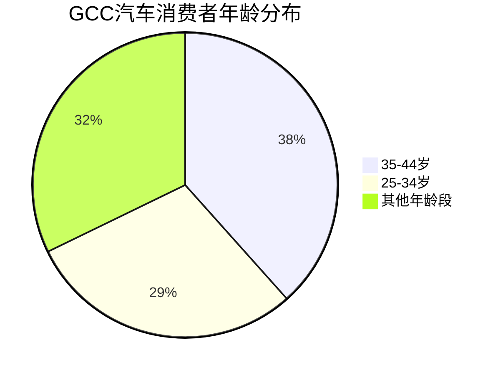
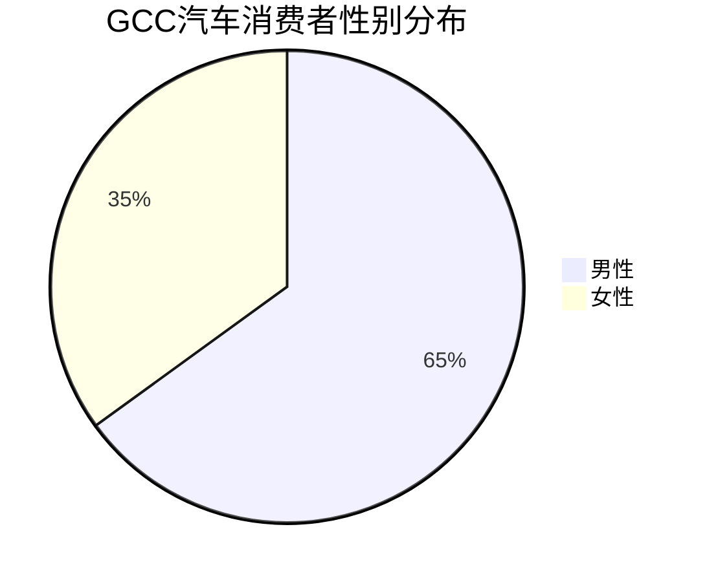

# GCC汽车消费者人口统计学特征研究报告

## 概要
本报告详细分析了海湾合作委员会（GCC）国家汽车消费者的人口统计学特征，包括收入水平、年龄分布、性别比例和家庭结构等关键指标。

## 年龄分布

### 主要消费群体
根据[Tamara 2024年消费者调研](https://tamara.co/en-SA/tamara-survey-2024)，GCC地区最活跃的消费者年龄群体为：
- **35-44岁：38.4%** - 构成最大的消费群体
- **25-34岁：29.4%** - 第二大消费群体
- **总计67.8%的消费者集中在25-44岁年龄段**

### 人口结构特点
据[人口统计研究](https://www.isi-next.org/abstracts/submission/746/view/)显示：
- GCC所有国家的本地人口都非常年轻，**超过50%的本地人口年龄在25岁以下**
- 部分国家65岁以上的本地人口**不足6%**
- 这种年轻化的人口结构为汽车市场提供了强劲的消费潜力

## 性别分布

### 消费者性别构成
根据[Tamara调研数据](https://tamara.co/en-SA/tamara-survey-2024)：
- **男性消费者：65%**
- **女性消费者：35%**

### 豪华车市场性别特征
据[GCC豪华市场报告](https://www.imarcgroup.com/gcc-luxury-market)：
- **男性主导豪华车市场**，主要由于：
  - 高男性劳动参与率
  - 更高的收入水平
  - 传统文化中男性为家庭主要购车决策者

## 收入水平

### 阿联酋收入数据
据[阿联酋汽车零售市场报告](https://www.astuteanalytica.com/industry-report/uae-automotive-retail-market)：
- **平均年家庭可支配收入：约45,000美元**（2023年）
- **高收入外籍人士：超过20万人年收入超过10万美元**
- 外籍人士占人口约88%，是汽车购买的主要贡献者

### 购买力指标
根据[Deloitte全球汽车消费者研究](https://www.deloitte.com/us/en/Industries/consumer/articles/global-automotive-consumer-study.html)：
- 年收入10-14.9万美元的家庭占车辆购买的约20%
- 年收入5-9.9万美元的家庭占车辆购买的约27%

### 税收优势
- GCC国家**零个人所得税**政策平均为个人节省每年1万美元
- 这些节省资金通常被分配用于购买汽车等大件商品

## 家庭结构

### 外籍人士主导
据[GCC人口统计数据](https://gulfmigration.grc.net/gcc-total-population-and-percentage-of-nationals-and-non-nationals-in-gcc-countries-national-statistics-mid-2022/)：
- **外籍人士占总人口的重要比例**（在阿联酋高达88%）
- 外籍专业人士通常为高收入家庭，具备强大的汽车购买力

### 消费行为特征
根据[Tamara调研](https://tamara.co/en-SA/tamara-survey-2024)：
- **46%的消费者提前规划购物**，表明购车决策更加理性和战略性
- **54%愿意在旺季为高端商品支付更多**，显示对品质的追求

## 市场规模与购买力

### 整体市场规模
据[汽车市场分析报告](https://www.technavio.com/report/automotive-market-industry-in-gcc-analysis)：
- **GCC乘用车市场价值：271.4亿美元**（2023年）
- **预计2029年达到：466.2亿美元**
- **复合年增长率：9.53%**

### 豪华车细分市场
据[阿联酋汽车零售数据](https://www.astuteanalytica.com/industry-report/uae-automotive-retail-market)：
- **豪华车年销售量超过8万辆**（仅阿联酋）
- 由于高可支配收入和对地位象征的重视，豪华车需求强劲

## 关键统计数据总结

### 核心人口统计指标

### 性别分布

## 结论

GCC汽车消费者画像显示出以下关键特征：

1. **年轻化趋势**：67.8%的消费者集中在25-44岁黄金消费年龄段
2. **男性主导**：男性消费者占65%，特别是在豪华车市场表现突出
3. **高收入群体**：平均家庭可支配收入45,000美元，远高于全球平均水平
4. **外籍驱动**：外籍专业人士构成主要购买力，具备强大消费能力
5. **理性消费**：46%消费者提前规划，购车决策更加理性和战略性

这些人口统计学特征为汽车厂商制定针对性的市场策略提供了重要依据。

## 参考资料

1. [Tamara 2024 GCC Consumer Survey](https://tamara.co/en-SA/tamara-survey-2024)
2. [GCC Demographics Research - ISI](https://www.isi-next.org/abstracts/submission/746/view/)
3. [GCC Luxury Market Analysis - IMARC](https://www.imarcgroup.com/gcc-luxury-market)
4. [UAE Automotive Retail Market - Astute Analytica](https://www.astuteanalytica.com/industry-report/uae-automotive-retail-market)
5. [GCC Population Statistics - GLMM](https://gulfmigration.grc.net/gcc-total-population-and-percentage-of-nationals-and-non-nationals-in-gcc-countries-national-statistics-mid-2022/)
6. [Deloitte Global Automotive Consumer Study](https://www.deloitte.com/us/en/Industries/consumer/articles/global-automotive-consumer-study.html)
7. [Technavio GCC Automotive Market Report](https://www.technavio.com/report/automotive-market-industry-in-gcc-analysis)