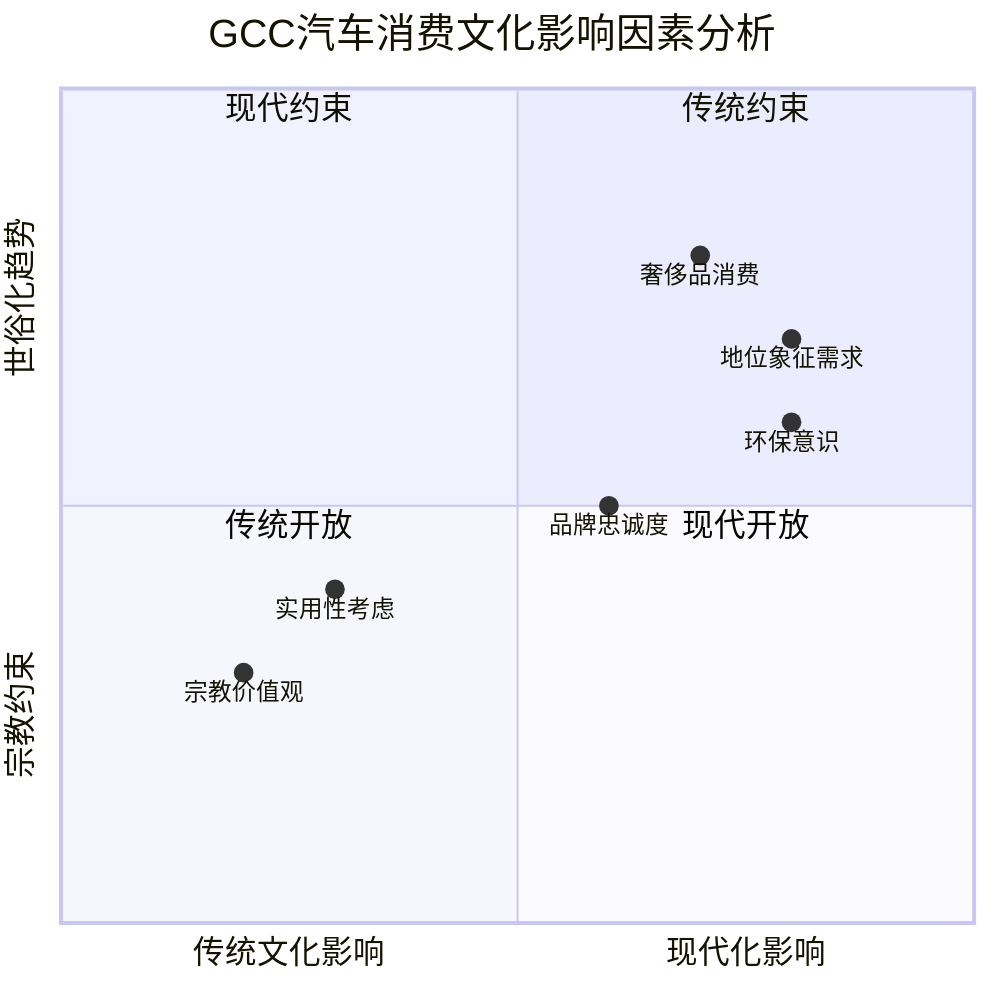

# GCC汽车市场文化背景和种族构成影响研究报告

## 概要
本报告深入分析了海湾合作委员会（GCC）国家的文化背景、种族构成和宗教信仰对汽车消费行为的影响，为理解该地区汽车市场的独特特征提供了重要洞察。

## 文化因素对汽车购买的影响

### 地位象征文化
根据[中东奢侈汽车消费研究](https://studycorgi.com/luxury-cars-consumerism-in-the-middle-east/)：
- **奢侈汽车是重要的社会地位象征**
- 消费者通过购买和消费奢侈品来**"获得社会地位"**
- 汽车所有权反映**家庭声望和社会定位**
- 受到历史马术传统和新兴汽车文化的影响

### 传统阿拉伯文化表现
据研究显示：
- **现代阿拉伯人使用汽车展示地位和技能**
- 进行危险驾驶表演如"阿拉伯漂移"（Tafheet）
- 使用汽车仅用两个轮子（左侧或右侧）行驶来展示驾驶技巧

### 消费行为特征
[中东汽车市场概述](https://medium.com/@kunalmj/overview-of-the-middle-eastern-automotive-market-49bf8914082f)指出：
- **优先考虑主观品质而非客观汽车规格**
- 寻求能够展示以下特质的汽车：
  - 声望（Prestige）
  - 风格（Style）
  - 视觉冲击力（Visual Impact）
  - 社会认可度（Social Recognition）

## 宗教因素的影响

### 伊斯兰价值观的调节作用
根据[宗教知识对奢侈汽车购买意向的影响研究](https://www.emerald.com/insight/content/doi/10.1108/jima-01-2020-0004/full/html)：
- **宗教知识水平显著削弱了消费者对奢侈汽车购买意向的影响**
- **品牌关联对穆斯林消费者的奢侈汽车购买意向具有重要影响**
- 传统伊斯兰价值观**不鼓励过度消费**

### 世俗化趋势
研究显示：
- 沙特阿拉伯和阿联酋经历着**逐步世俗化过程**
- **上层阶级的世俗化程度更高**
- 受西方生活方式影响，出现**新兴消费文化**

### 宗教与消费的平衡
据[伊斯兰教法对奢侈购买的观点](https://binbaz.org.sa/fatwas/5932/حكم-شراء-الاثاث-والسيارات-الغالية-الثمن)：
- **如果购买者有能力且意图不是奢华炫耀，而是追求品质，购买昂贵汽车是被允许的**
- 这反映了伊斯兰价值观如何影响该地区的消费行为

## 种族和文化多样性的影响

### 外籍人士的主导地位
根据[GCC人口统计数据](https://gulfmigration.grc.net/gcc-total-population-and-percentage-of-nationals-and-non-nationals-in-gcc-countries-national-statistics-mid-2022/)：
- **外籍人士在某些GCC国家占总人口的重要比例**（在阿联酋高达88%）
- 外籍专业人士通常为高收入家庭，构成**汽车市场的主要消费群体**

### 多元文化对车型偏好的影响
据[阿拉伯汽车市场分析](https://www.aljazeera.net/ebusiness/2025/8/6/%D9%85%D8%A7%D8%B0%D8%A7-%D9%8A%D8%B1%D9%83%D8%A8-%D8%A7%D9%84%D8%B9%D8%B1%D8%A8-%D8%A3%D9%83%D8%AB%D8%B1-%D8%A7%D9%84%D8%B3%D9%8A%D8%A7%D8%B1%D8%A7%D8%AA-%D9%85%D8%A8%D9%8A%D8%B9%D8%A7)：

#### 海湾地区独特偏好：
- **倾向于四轮驱动奢华车辆**，适合沙漠道路
- 偏好**宽敞舒适的内饰**，常将车辆改装成小型休息室
- 为冬季沙漠旅行配备**冷热水设施**

#### 与其他阿拉伯市场的对比：
- 其他阿拉伯市场偏好**经济型汽车**
- GCC市场独特的**奢华和实用性结合**需求

### 国际品牌的适应策略
据[中东奢侈汽车研究](https://studycorgi.com/luxury-cars-consumerism-in-the-middle-east/)：
- **法拉利、阿斯顿·马丁和特斯拉等品牌获得市场份额**
- 消费者在经济挑战期间表现出**适应性**
- 奢侈汽车市场**对经济状况敏感**

## 新兴趋势

### 中国汽车品牌的崛起
根据[中国汽车在海湾地区的增长](https://www.erembusiness.com/news/okf4rzd)：
- **中国汽车品牌增长133%**（3年半时间）
- 吉利品牌市场份额从2021年的15%增至2024年上半年的23%
- **超过60%的中国汽车销量集中在四轮驱动车型**

### 环保意识的兴起
据[GCC奢华汽车市场报告](https://www.imarcgroup.com/gcc-luxury-market)：
- **环保意识高净值消费者对电动汽车需求增加**
- 豪华SUV、越野车和电动汽车品牌如**奔驰、雷克萨斯和宝马**主导市场

## 文化适应性策略

### 色彩偏好的文化差异
根据数字研究：
- **海湾消费者偏好红色汽车**
- 红色在沙特阿拉伯和阿联酋的搜索中领先70%
- 其次是黑色、蓝色、黄色、白色和银色
- 但实际销售显示**白色汽车销量占主导**

### 品牌地位的文化认知
- **奢侈品牌与威望相关联**
- 来自高度重视社会地位文化的个人**将这些品牌视为成功象征**

## 主要文化影响因素矩阵

## 结论

GCC汽车市场的文化背景呈现以下特征：

### 1. **地位导向的消费文化**
- 奢侈汽车作为社会地位象征的重要性
- 品牌声望超越实际功能的重要性

### 2. **宗教与世俗的平衡**
- 伊斯兰价值观对过度消费的调节作用
- 上层阶级世俗化趋势增强

### 3. **多元文化市场特征**
- 外籍人士构成主要消费群体
- 不同文化背景影响车型偏好

### 4. **独特的地理文化适应**
- 沙漠环境驱动的四轮驱动偏好
- 宽敞舒适内饰的文化需求

### 5. **传统与现代的融合**
- 保持传统阿拉伯展示文化
- 接受国际品牌和新技术

这些文化因素为汽车厂商在GCC市场的定位、产品设计和营销策略提供了重要指导。

## 参考资料

1. [Luxury Cars Consumerism in the Middle East - StudyCorgi](https://studycorgi.com/luxury-cars-consumerism-in-the-middle-east/)
2. [Religious Knowledge and Luxury Car Purchase - Emerald Insight](https://www.emerald.com/insight/content/doi/10.1108/jima-01-2020-0004/full/html)
3. [Middle Eastern Automotive Market Overview - Medium](https://medium.com/@kunalmj/overview-of-the-middle-eastern-automotive-market-49bf8914082f)
4. [Islamic Ruling on Expensive Car Purchases - Binbaz.org](https://binbaz.org.sa/fatwas/5932/حكم-شراء-الاثاث-والسيارات-الغالية-الثمن)
5. [GCC Population Statistics - GLMM](https://gulfmigration.grc.net/gcc-total-population-and-percentage-of-nationals-and-non-nationals-in-gcc-countries-national-statistics-mid-2022/)
6. [Arab Car Market Analysis - Al Jazeera](https://www.aljazeera.net/ebusiness/2025/8/6/%D9%85%D8%A7%D8%B0%D8%A7-%D9%8A%D8%B1%D9%83%D8%A8-%D8%A7%D9%84%D8%B9%D8%B1%D8%A8-%D8%A3%D9%83%D8%AB%D8%B1-%D8%A7%D9%84%D8%B3%D9%8A%D8%A7%D8%B1%D8%A7%D8%AA-%D9%85%D8%A8%D9%8A%D8%B9%D8%A7)
7. [Chinese Cars Growth in Gulf - Erem Business](https://www.erembusiness.com/news/okf4rzd)
8. [GCC Luxury Market Report - IMARC](https://www.imarcgroup.com/gcc-luxury-market)