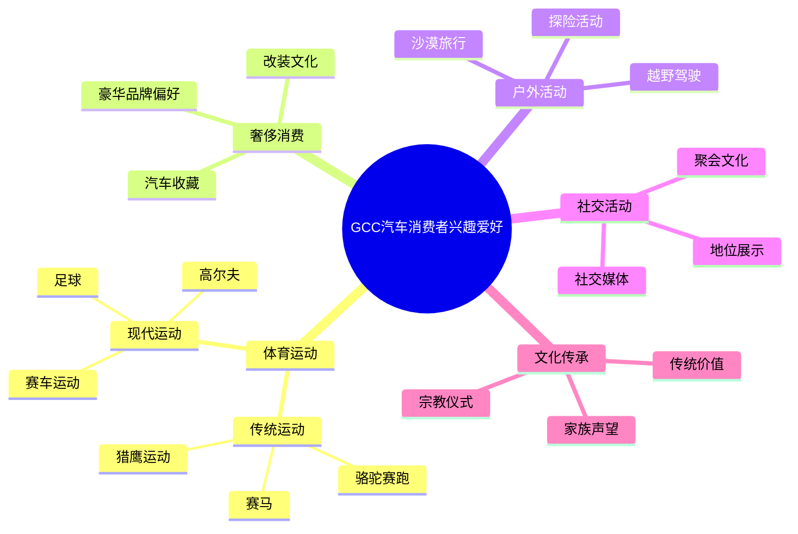
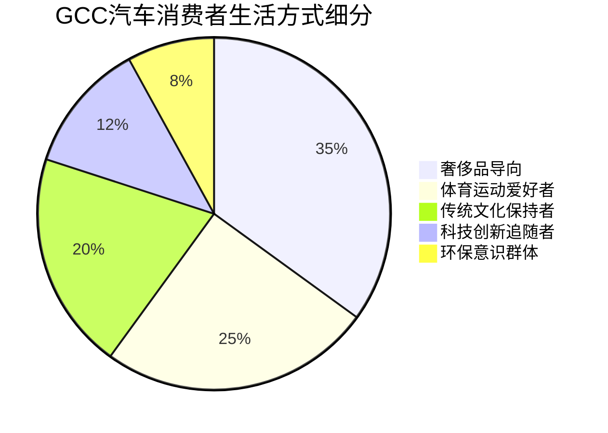

# GCC汽车消费者兴趣爱好和生活方式研究报告

## 概要
本报告深入分析了海湾合作委员会（GCC）国家汽车消费者的兴趣爱好、生活方式偏好和行为模式，为理解该地区消费者的心理特征和购买动机提供重要洞察。

## 生活方式特征

### 奢侈消费导向
根据[GCC奢侈品市场报告](https://www.imarcgroup.com/gcc-luxury-market)：
- **GCC奢侈品市场规模达到153亿美元**（2023年）
- **预计2032年达到332.8亿美元**
- **复合年增长率为10.2%**（2024-2032）
- GCC正迅速发展成为**全球奢侈消费的关键目的地**

### 社会地位追求
据[GCC奢侈品市场分析](https://www.reportsandinsights.com/report/gcc-luxury-market)：
- **奢侈消费通常与地位和社会地位相关联**
- 男性通过**高端购买积极维护社会地位**
- 传统性别角色将**财务决策和大型购买分配给男性**
- **年轻群体中奢侈购买更加突出**，受社交媒体和数字平台影响

## 汽车相关兴趣

### 豪华汽车偏好
据[GCC奢侈品市场数据](https://www.reportsandinsights.com/report/gcc-luxury-market)：
- **奔驰、劳力士、古奇等品牌主要面向男性消费者营销**
- 男性主导的奢侈品类别包括：
  - 高性能汽车
  - 男士时尚
  - 优质配饰

### 新兴汽车趋势
- **对优质电动汽车的需求正在扩大**
- 高性能车型通过创新、设计和可持续性的结合吸引消费者
- 消费者对**尖端技术和环保工程的兴趣增长**

## 运动和户外活动兴趣

### 传统体育活动
根据[阿拉伯地区体育研究](https://ar.wikipedia.org/wiki/%D8%B1%D9%8A%D8%A7%D8%B6%D8%A9_%D9%81%D9%8A_%D8%A7%D9%84%D8%A5%D9%85%D8%A7%D8%B1%D8%A7%D8%AA)：

#### 传统运动：
- **骆驼赛跑**：作为传统体育运动存在多年
- **猎鹰运动**：历史悠久的传统活动
- **赛马**：深受欢迎的贵族运动
- **足球**：最受欢迎的现代运动

#### 现代体育设施：
- **15个骆驼赛道**遍布阿联酋七个酋长国
- 现代化**足球场、赛车场、高尔夫球场**
- 专业**训练中心和体育设施**

### 汽车运动文化
据[沙特汽车运动报告](https://me.motorsport.com/general/news/رياضة-السيارات-في-المملكة-جذور-متأصلة-منذ-سنوات-طويلة/6498863)：

#### 赛车活动：
- **达喀尔拉力赛**在沙特阿拉伯举办
- **迪拜国际拉力赛**自1984年开始
- **迪拜大奖赛**（1981年首次举办）

#### 民间汽车文化：
- **"阿拉伯漂移"（Tafheet）**表演
- 汽车改装文化盛行
- 将车辆改装成**移动休息室**用于沙漠旅行

## 社交媒体和数字生活方式

### 数字消费行为
据[消费者调研数据](https://www.reportsandinsights.com/report/gcc-luxury-market)：
- **沙特阿拉伯90%的受访者使用智能手机在线购物**
- 在线市场持续推动奢侈品销售
- **传统分销渠道与在线渠道界限模糊**

### 社交媒体影响
- **YouTube、Facebook、Instagram、WhatsApp**等平台影响消费者
- **年轻一代特别受社交媒体影响**
- 社交媒体突出**独特性和个人表达**的重要性

## 富裕阶层的兴趣爱好

### 高端收藏和艺术
根据[富人爱好研究](https://sometimes-homemade.com/hobbies-for-rich-people/)：

#### 艺术收藏：
- **私人艺术收藏**：收集来自世界各地的稀有和有价值的艺术品
- **雕塑创作**：使用粘土、金属或石材创作定制雕塑
- **高端摄影**：使用先进摄影技术拍摄高端风景或肖像

#### 奢侈休闲活动：
- 高尔夫运动
- 游艇活动
- 私人飞行

## 消费心理特征分析

### 心理画像细分
据[消费者心理分析](https://www.surveymonkey.com/market-research/resources/what-is-psychographic-segmentation/)：
- 根据**生活方式、兴趣、活动、态度和价值观**进行细分
- 消费者倾向于将生活方式与特定爱好或兴趣保持一致
- 活跃生活方式的消费者可能是**户外装备或服装的潜在买家**

### 生活方式与购买决策
据[消费者生活方式研究](https://fastercapital.com/topics/understanding-consumer-lifestyles-and-preferences.html)：
- **体育、爱好、社区活动、娱乐**等活动影响购买决策
- 消费者根据个人兴趣选择产品和服务
- 生活方式选择反映个人身份和价值观

## 生活方式转变趋势

### 健康意识觉醒
据[海湾地区生活方式疾病报告](https://arabic.cnn.com/health/article/2020/01/16/boditrax-lifestyle-diseases-gcc-technology)：
- GCC国家努力**应对生活方式相关疾病**
- **政府和私人项目鼓励体育活动**
- 推广**积极生活方式**以对抗久坐文化

### 女性参与增加
据[女性体育参与研究](https://khaleejtalks.com/politics/43182.html)：
- 为女性提供**体育设施接入机会**
- 鼓励女性成为**运动员和年轻一代的榜样**
- **过去五年出现巨大飞跃**，更多人参与体育活动

## 兴趣爱好与汽车消费关联图

## 消费者生活方式细分

## 结论

GCC汽车消费者的兴趣爱好和生活方式呈现以下特点：

### 1. **奢侈导向的生活方式**
- 追求高端品牌和优质产品
- 将消费作为社会地位的象征
- 对创新技术和环保产品兴趣增长

### 2. **运动和户外文化**
- 深厚的传统体育文化底蕴
- 现代化体育设施完善
- 汽车运动文化盛行

### 3. **数字化生活方式**
- 高度依赖智能手机和社交媒体
- 在线购物习惯成熟
- 年轻群体受数字平台影响深远

### 4. **文化传承与现代融合**
- 保持传统运动和文化活动
- 接纳现代科技和全球趋势
- 注重家族声望和社会认可

### 5. **健康意识增强**
- 政府推动积极生活方式
- 体育参与度持续提升
- 女性体育参与增加

这些生活方式特征为汽车厂商提供了重要的市场细分依据，有助于开发符合GCC消费者兴趣和价值观的产品和营销策略。

## 参考资料

1. [IMARC GCC Luxury Market Report](https://www.imarcgroup.com/gcc-luxury-market)
2. [Reports and Insights GCC Luxury Market Analysis](https://www.reportsandinsights.com/report/gcc-luxury-market)
3. [UAE Sports Wikipedia](https://ar.wikipedia.org/wiki/%D8%B1%D9%8A%D8%A7%D8%B6%D8%A9_%D9%81%D9%8A_%D8%A7%D9%84%D8%A5%D9%85%D8%A7%D8%B1%D8%A7%D8%AA)
4. [Saudi Motorsports Report](https://me.motorsport.com/general/news/رياضة-السيارات-في-المملكة-جذور-متأصلة-منذ-سنوات-طويلة/6498863)
5. [Rich People Hobbies Guide](https://sometimes-homemade.com/hobbies-for-rich-people/)
6. [SurveyMonkey Psychographic Segmentation](https://www.surveymonkey.com/market-research/resources/what-is-psychographic-segmentation/)
7. [FasterCapital Consumer Lifestyles Research](https://fastercapital.com/topics/understanding-consumer-lifestyles-and-preferences.html)
8. [CNN Arabic Lifestyle Diseases Report](https://arabic.cnn.com/health/article/2020/01/16/boditrax-lifestyle-diseases-gcc-technology)
9. [Khaleej Talks Women Sports Participation](https://khaleejtalks.com/politics/43182.html)