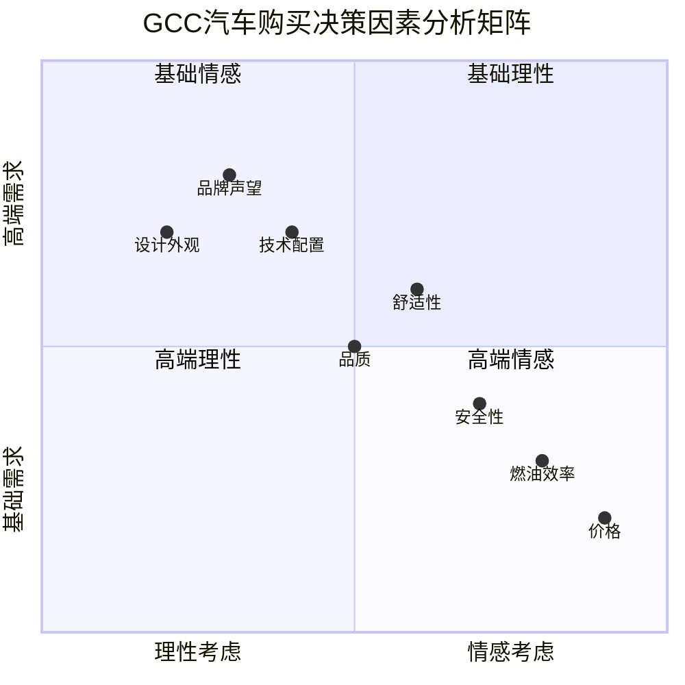

# GCC汽车购车关键决策因素分析报告

## 概要
本报告深入分析了海湾合作委员会（GCC）国家汽车消费者在购车过程中的关键决策因素，包括价格敏感度、品质要求、安全性考虑、品牌忠诚度等核心影响因子。

## 主要决策因素排序

### 价格因素的主导地位
根据[海湾地区汽车购买调研](https://www.elwatannews.com/news/details/5387213)：
- **65%的受访者表示价格优惠是最大的购买动机**
- 价格仍然是**购买决策中最重要的因素**
- 消费者寻求**物有所值的汽车产品**

### 全球汽车购买决策因素对比
据[Statista汽车购买因素调研](https://www.statista.com/chart/13075/most-important-factors-when-buying-a-car/)，全球消费者优先考虑的因素：

1. **燃油效率：53%**
2. **安全性：53%**  
3. **低价格：47%**
4. **高品质：46%**
5. **日常使用适宜性：41%**
6. **设计/外观：32%**

### GCC特有的决策因素
根据[阿尔杰齐拉汽车价格分析](https://www.aljazeera.net/ebusiness/2023/1/30/أسعار-السيارات-الجديدة-في-الدول)和相关研究：

#### 1. **舒适性和空间（Comfort & Space）**
- **宽敞舒适的内饰**是海湾消费者的核心需求
- 偏好**大空间车型**以适应家庭和社交需求
- 将车辆改装成**移动休息室**用于长途沙漠旅行

#### 2. **适应性规格（Regional Specifications）**
- **海湾规格汽车**相比美国规格有独特优势
- 更好地**适应当地环境条件**
- 在海湾地区**保值性更高**

## 详细决策因素分析

### 1. 技术特征和质量要求
据[Al Futtaim Automall研究](https://www.automall.ae/ar/news/understanding-used-car-prices-factors-that-affect-the-market/)：

#### 安全和舒适特征：
- **安全功能**（碰撞预警、自动紧急制动、车道保持辅助）
- **舒适配置**（座椅加热/制冷、多区域空调）
- **储物空间**和内外饰细节

#### 技术特性：
- **先进的触摸屏系统**
- **驾驶辅助技术**（导航、倒车影像、全景摄像头）
- **互联网连接功能**
- **照明和视觉系统**

### 2. 可靠性和维护成本
- 消费者寻求**维护需求较少的可靠汽车**
- 重视**流畅的驾驶体验**
- 考虑**长期拥有成本**

### 3. 燃油经济性
据[Deloitte全球汽车消费者研究](https://www.deloitte.com/us/en/Industries/consumer/articles/global-automotive-consumer-study.html)：
- 随着燃油价格上涨，消费者**高度关注燃油效率**
- **混合动力和节能车辆**需求上升
- 环保意识和**燃油成本考虑**推动消费者选择

### 4. 融资和购买便利性
根据海湾地区调研：
- **17%的消费者表示有吸引力的贷款选项**会积极影响购车决定
- **灵活的付款方案**影响最终决策
- **购买便利性**和**售后服务**重要性增加

## 品牌忠诚度分析

### 品牌忠诚度下降趋势
据[Deloitte研究](https://www.deloitte.com/global/en/Industries/automotive/perspectives/global-automotive-consumer-study.html)：
- **意图转换品牌的消费者比例同比增加**
- 品牌忠诚度变得**越来越脆弱**
- 需要建立**强有力的客户关系**

### GCC地区品牌偏好
根据市场数据：
- **丰田**在GCC地区保持30.4%的市场份额（2023年）
- **可靠性和客户信任**是品牌忠诚的关键因素
- **传统品牌优势**与**新兴品牌挑战**并存

## 新兴决策趋势

### 1. 环保和可持续性
据[PMC环保汽车研究](https://pmc.ncbi.nlm.nih.gov/articles/PMC10807243/)：
- **消费者对全混合动力和增程技术兴趣增长**
- 寻求**"两全其美"的解决方案**降低燃油成本和排放
- **环保属性**在决策中重要性提升

### 2. 技术集成
- **智能化功能**需求增加
- **数字化体验**成为差异化因素
- **连接性和便利性**影响购买决定

## 消费者细分群体决策特征

### 经济型消费者群体
- 主要关注**价格和燃油效率**
- **混合动力车型**受到青睐
- 重视**长期拥有成本**

### 奢侈消费者群体  
- 优先考虑**品牌声望和地位象征**
- 注重**设计美学和独特性**
- 愿意为**高端功能和服务**支付溢价

### 实用主义消费者群体
- 重视**实用性和可靠性**
- 关注**日常使用便利性**
- 平衡**价格与功能**的考虑

## 决策因素权重分析

```mermaid
xychart-beta
    title "GCC汽车购买决策因素重要性排序"
    x-axis [价格, 燃油效率, 安全性, 舒适性, 品质, 品牌, 技术, 设计]
    y-axis "重要性评分" 0 --> 70
    bar [65, 56, 55, 50, 46, 40, 35, 32]
```

## 决策流程影响因素矩阵



## 地区特殊考虑因素

### 气候适应性
- **强效空调系统**的重要性
- **抗高温材料**和组件
- **沙尘防护**功能

### 文化适应性
- **家庭聚会**和**社交活动**的空间需求
- **地位展示**的外观设计要求
- **传统价值观**与**现代功能**的平衡

### 基础设施考虑
- **燃油补贴**影响燃油效率重要性
- **道路条件**影响车辆类型选择
- **维修服务网络**可得性

## 结论

GCC汽车市场的购车决策因素呈现以下特征：

### 1. **价格敏感性仍然最高**
- 65%的消费者将价格作为首要考虑因素
- 物有所值的理念深入人心

### 2. **实用性超越美观性**
- 燃油效率、安全性和舒适性比设计更重要
- "实用主义超越风格主义"的消费理念

### 3. **地区特色明显**
- 舒适性和空间需求突出
- 适应性规格和保值性重要

### 4. **技术要求不断提升**
- 先进安全和便利功能需求增长
- 数字化和连接性成为差异化因素

### 5. **品牌忠诚度面临挑战**
- 消费者更愿意尝试新品牌
- 需要持续创新维护客户关系

这些洞察为汽车制造商在GCC市场的产品定位、功能配置和营销策略制定提供了重要指导。

## 参考资料

1. [Gulf Car Purchase Survey - Al Watan News](https://www.elwatannews.com/news/details/5387213)
2. [Car Buying Factors - Statista](https://www.statista.com/chart/13075/most-important-factors-when-buying-a-car/)
3. [Car Price Analysis - Al Jazeera](https://www.aljazeera.net/ebusiness/2023/1/30/أسعار-السيارات-الجديدة-في-الدول)
4. [Used Car Market Factors - Al Futtaim Automall](https://www.automall.ae/ar/news/understanding-used-car-prices-factors-that-affect-the-market/)
5. [Global Automotive Consumer Study - Deloitte](https://www.deloitte.com/us/en/Industries/consumer/articles/global-automotive-consumer-study.html)
6. [Environmental Car Purchase Decisions - PMC](https://pmc.ncbi.nlm.nih.gov/articles/PMC10807243/)
7. [Consumer Segments in Automotive - Kadence](https://kadence.com/en-us/understanding-consumer-segments-in-the-automotive-industry-9-types-of-car-buyers-and-their-personas/)
8. [GCC Automotive Specifications - Al Futtaim](https://www.automall.ae/ar/news/difference-between-american-and-gcc-specs/)