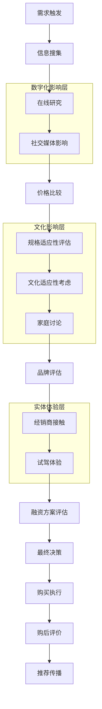

# GCC汽车消费者决策流程研究报告

## 概要
本报告详细分析了海湾合作委员会（GCC）国家汽车消费者的购买决策流程，包括各个阶段的特征、数字化影响因素、社交媒体作用以及决策触点分析。

## 消费者决策流程概述

### 传统决策流程模型
根据[消费者决策流程研究](https://www.questionpro.com/blog/consumer-decision-journey/)，汽车购买决策包含以下五个核心阶段：

#### 1. **问题识别阶段（Problem Recognition）**
- **需求觉醒**：认识到当前交通工具的不足或需要更换
- **触发因素**：车辆老化、家庭需求变化、收入提升、社会地位变化
- 在GCC地区，**地位展示需求**和**舒适性要求**是主要触发因素

#### 2. **信息搜集阶段（Information Search）**
根据[消费者决策理论](https://ar.wikipedia.org/wiki/عملية_قرار_المشتري)，信息来源包括：

##### 个人信息源：
- **家庭成员、朋友、邻居、亲戚**的建议和推荐
- 个人过往用车经验

##### 商业信息源：
- **广告、销售人员、经销商**的宣传材料
- 展示厅和展览会

##### 公共信息源：
- **杂志、报纸、文章、政府刊物**
- 专业汽车评测和媒体报道

### 现代数字化决策流程

#### 数字化研究行为
据[汽车消费者数字化研究](https://insight7.io/automotive-consumer-journey-what-you-need-to-know/)：
- **59%的买家在进入经销商展厅前在线研究数月**
- **2022年消费者花费近15小时研究和购买车辆**（比2021年增加18%）
- **一个汽车购买者在研究到最终购买之间可能有超过900次数字互动**

## GCC地区特有的决策流程特征

### 1. 价格敏感的初步筛选
根据[海湾地区汽车购买调研](https://www.elwatannews.com/news/details/5387213)：
- **65%的消费者以价格优惠作为最大购买动机**
- 初期决策阶段**价格比较**占主导地位
- **跨国价格比较**（如沙特与阿联酋间5%-28%的价差）影响购买路径

### 2. 区域规格适应性考虑
- 评估**海湾规格vs美国规格**的适用性差异
- 考虑**当地气候适应性**和**保值性**因素
- **售后服务网络**可得性评估

### 3. 社会文化因素集成
- **家庭成员参与**决策过程（特别是男性家长的主导作用）
- **社区口碑**和**同龄人影响**的重要性
- **宗教和文化价值观**对奢侈消费的调节作用

## 数字化影响因素分析

### 社交媒体的影响力
据[社交媒体汽车购买研究](https://www.adtaxi.com/blog/social-media-redefining-the-car-buying-journey/)：

#### 影响程度：
- **44%的美国消费者认为社交媒体是新车购买最具影响力的媒体**
- **64%的实际购买者**受到社交媒体影响
- **21%的汽车客户直接通过社交媒体获得购买信息**

#### 平台偏好：
1. **Facebook**：38%总受访者，53%近期购买者认为最具影响力
2. **Instagram**：排名第二的影响平台
3. **YouTube**：视频内容影响显著
4. **TikTok**：在18-29岁年龄段影响力增长三倍

### GCC地区数字化特征
根据[Tamara 2024年调研](https://tamara.co/en-SA/tamara-survey-2024)：
- **50%的GCC消费者偏好在线购物**
- **43%采用线上线下混合方式**
- **90%的沙特受访者使用智能手机在线购物**

## 详细决策阶段分析

### 阶段1：认知和觉醒（Awareness）
- **70%的近期购买者发现社交内容在认知阶段最有帮助**
- 消费者开始**探索不同品牌和车型**
- **数字广告和社交媒体内容**起到触发作用

### 阶段2：考虑和比较（Consideration）
- **60%的买家在考虑阶段重视社交媒体**
- 进行**多品牌、多车型比较**
- **在线评价和推荐**（61%受访者认为最具影响力）发挥关键作用

### 阶段3：评估和决策（Evaluation & Decision）
根据[消费者决策评估理论](https://mawdoo3.com/مراحل_اتخاذ_القرار_الشرائي)：
- **评估标准因消费者而异**（数量、类型、重要性不同）
- **88%的消费者信任在线产品评价**（Google 2016数据）
- 考虑**同龄人意见**和**突发情况**对最终决策的影响

### 阶段4：购买执行（Purchase）
#### 在线购买趋势：
- **57%的消费者愿意在线购买汽车**（2024年，比2023年的49%增长）
- **80%的消费者计划完全在线购买**
- **近60%的45岁以下买家偏好在线购买**

#### GCC地区购买便利因素：
- **17%消费者表示有吸引力的贷款选项**会影响决定
- **灵活付款方案**的重要性
- **跨境购买便利性**（如从阿联酋进口到沙特）

### 阶段5：购后评估（Post-Purchase）
- **客户满意度评估**和**实际体验反馈**
- **转介绍行为**和**口碑传播**
- **品牌忠诚度形成**或**转换倾向**评估

## 关键内容类型影响力排序

```mermaid
xychart-beta
    title "最具影响力的内容类型（按重要性排序）"
    x-axis [评价推荐, 广告宣传, 品牌内容, 论坛讨论, 专家测评, 用户生成内容]
    y-axis "影响力百分比" 0 --> 70
    bar [61, 55, 45, 34, 28, 22]
```

## 数字化触点分析

### 高影响触点
1. **社交媒体平台**（Facebook、Instagram、YouTube）
2. **在线评价和论坛**
3. **品牌官方网站和应用**
4. **数字广告投放**
5. **影响者和KOL推荐**

### 中等影响触点
1. **搜索引擎结果**
2. **汽车门户网站**
3. **价格比较平台**
4. **视频评测内容**

### 传统触点（仍有影响）
1. **经销商展厅体验**
2. **试驾活动**
3. **传统媒体广告**
4. **口碑传播**

## GCC消费者决策流程图



## 决策时间线分析

### 短期决策（1-3个月）
- **紧急替换需求**（车辆故障、事故）
- **冲动性购买**（限时优惠、情感触发）
- **简单替换**（相同品牌、相似配置）

### 中期决策（3-6个月）
- **升级换车**（收入提升、家庭需求变化）
- **品牌转换**（比较评估、功能需求变化）
- **价格敏感购买**（等待优惠、比较价格）

### 长期决策（6个月以上）
- **首次购车**（年轻消费者、详细研究）
- **奢侈品购买**（高端车型、地位考虑）
- **技术型购买**（新技术采纳者、功能研究）

## 结论

GCC汽车消费者决策流程呈现以下特征：

### 1. **数字化程度高**
- 在线研究成为标准流程
- 社交媒体影响力显著
- 移动端购物习惯成熟

### 2. **价格敏感性突出**
- 价格比较是初步筛选的关键
- 跨国价格差异影响购买路径
- 融资便利性影响决策

### 3. **文化因素深度集成**
- 家庭参与决策过程
- 社区口碑具有重要影响
- 宗教和文化价值观发挥调节作用

### 4. **体验与数字结合**
- 线上研究与线下体验相结合
- 试驾仍是重要决策节点
- 售后服务纳入考虑范围

### 5. **决策周期延长**
- 深度研究成为常态
- 多方信息源综合考虑
- 决策更加理性化

这些洞察为汽车厂商和经销商在GCC市场的客户接触策略、内容营销和销售流程优化提供了重要指导。

## 参考资料

1. [Consumer Decision Journey - QuestionPro](https://www.questionpro.com/blog/consumer-decision-journey/)
2. [Buyer Decision Process - Wikipedia](https://ar.wikipedia.org/wiki/عملية_قرار_المشتري)
3. [Automotive Consumer Journey - Insight7](https://insight7.io/automotive-consumer-journey-what-you-need-to-know/)
4. [Social Media Car Buying - AdTaxi](https://www.adtaxi.com/blog/social-media-redefining-the-car-buying-journey/)
5. [GCC Purchase Survey - Al Watan](https://www.elwatannews.com/news/details/5387213)
6. [Purchase Decision Stages - Mawdoo3](https://mawdoo3.com/مراحل_اتخاذ_القرار_الشرائي)
7. [Tamara Consumer Survey 2024](https://tamara.co/en-SA/tamara-survey-2024)
8. [Car Buyer Journey - Spyne](https://www.spyne.ai/blogs/car-buying-journey)
9. [Digital Car Buying Journey - DriftRock](https://www.driftrock.com/blog/marketing-to-the-evolving-car-buying-customer-journey)