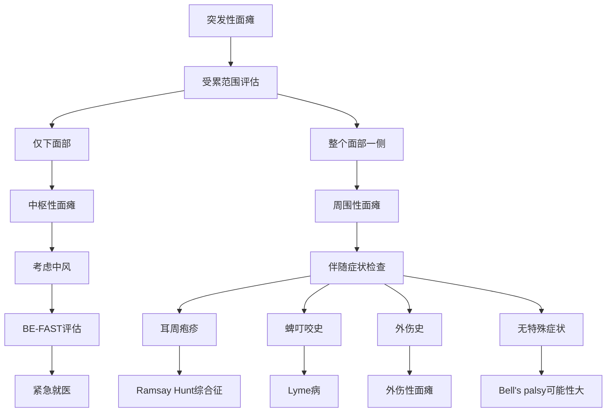
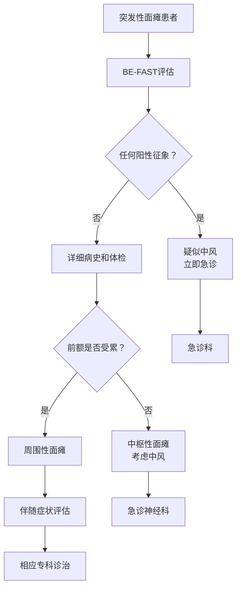
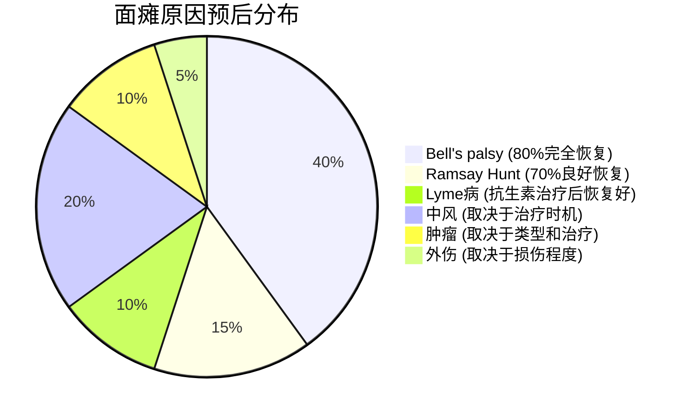

# 半边脸突然面瘫下垂的原因分析：健康状态的反映

## 执行摘要 (Executive Summary)

突发性单侧面瘫（半边脸下垂）是一个需要紧急医疗评估的症状，可能反映多种不同的健康状态。本研究基于权威医学资源的综合分析表明，面瘫的原因从良性的Bell's palsy到紧急的中风都有可能，需要通过系统性的鉴别诊断来确定具体原因和治疗方案。

### 核心发现
- **Bell's palsy**是最常见原因（约80%的急性面瘫），预后良好
- **中风**是最需要紧急处理的原因，BE-FAST识别方法至关重要
- **感染性原因**（如Ramsay Hunt综合征、Lyme病）需要特异性抗病毒或抗生素治疗
- **肿瘤性原因**通常呈进行性加重，需要多学科协作
- **外伤性原因**的预后取决于损伤程度和治疗时机

## 研究背景 (Research Context)

面神经麻痹涉及第七颅神经功能障碍，导致面部一侧肌肉无力或麻痹。这一症状可能是多种疾病过程的表现，从相对良性的病毒感染到危及生命的中风。理解各种可能原因及其鉴别要点，对于及时诊断和适当治疗至关重要。

## 主要发现 (Key Findings)

### 1. Bell's Palsy - 最常见的良性原因

根据[Cleveland Clinic](https://my.clevelandclinic.org/health/diseases/5457-bells-palsy)的数据：
- **发病率**：每10万人中15-30例/年
- **恢复率**：约80%在3个月内完全恢复
- **特点**：整个面部一侧受累（包括前额），通常无其他神经症状
- **病因**：多与病毒感染（单纯疱疹病毒等）相关的面神经炎症

### 2. 中风 - 最紧急的病因

根据[BE-FAST识别系统](https://health.clevelandclinic.org/be-fast-stroke)：
- **时间敏感性**：每分钟失去190万个脑细胞
- **鉴别要点**：通常仅影响下面部，前额功能保留（中枢性面瘫）
- **伴随症状**：可能有肢体无力、言语困难、视觉改变等
- **脑干中风例外**：可表现为周围性面瘫样症状，但伴有其他神经功能缺失

### 3. 感染性原因的多样性

#### Ramsay Hunt综合征
根据[NCBI医学文献](https://www.ncbi.nlm.nih.gov/books/NBK557409/)：
- **发病率**：每10万人中5例/年，占急性面瘫的7%
- **病原体**：水痘-带状疱疹病毒重激活
- **典型表现**：面瘫 + 耳痛 + 耳周水疱疹
- **预后**：70%患者恢复正常或接近正常功能

#### Lyme病
根据[CDC数据](https://www.cdc.gov/lyme/hcp/clinical-care/neurologic-lyme-disease.html)：
- **发病率**：每100例Lyme病中9例出现面瘫
- **特点**：可出现双侧面瘫（伯氏疏螺旋体是双侧面瘫最常见的感染原因）
- **治疗**：抗生素治疗，多数患者完全恢复

### 4. 肿瘤性原因的进行性特征

#### 听神经瘤/前庭神经鞘瘤
根据[NCBI统计](https://www.ncbi.nlm.nih.gov/books/NBK470177/)：
- **发病年龄**：40-60岁常见
- **面神经受累**：通常在肿瘤较大时才出现
- **治疗后面瘫发生率**：15-30%
- **复发率**：< 5%

### 5. 外伤性面瘫的复杂性

根据[医学文献综合分析](https://www.ncbi.nlm.nih.gov/books/NBK553095/)：
- **占比**：占所有面瘫的6-27%
- **颞骨骨折**：7-10%出现面神经麻痹
- **医源性损伤**：腮腺手术(49.5%)、肿瘤切除(23.5%)、耳科手术(22.8%)
- **预后**：取决于损伤类型和治疗时机

## 鉴别诊断要点 (Differential Diagnosis)

### 临床表现对比

### 关键鉴别特征表

| 原因类别 | 发病特点 | 受累范围 | 伴随症状 | 预后 |
|---------|----------|----------|----------|------|
| **Bell's palsy** | 急性发病，48小时内达峰 | 整个面部一侧 | 味觉改变，轻微疼痛 | 80%完全恢复 |
| **中风** | 秒至分钟内发病 | 通常仅下面部 | 肢体无力，言语障碍 | 取决于治疗时机 |
| **Ramsay Hunt** | 急性发病 | 整个面部一侧 | 耳痛，耳周疱疹 | 70%良好恢复 |
| **Lyme病** | 亚急性发病 | 单侧或双侧 | 游走性红斑，关节痛 | 抗生素治疗后恢复好 |
| **肿瘤** | 进行性加重 | 逐渐加重 | 听力下降，平衡障碍 | 取决于肿瘤类型 |
| **外伤** | 创伤后即发或延迟 | 取决于损伤部位 | 外伤史明确 | 取决于损伤程度 |

## 紧急评估流程 (Emergency Assessment)

### BE-FAST中风识别
根据[Cleveland Clinic指南](https://health.clevelandclinic.org/be-fast-stroke)：

- **B** - Balance（平衡）：突然失去平衡
- **E** - Eyes（眼睛）：突然视力丧失
- **F** - Face（面部）：面部下垂
- **A** - Arms（手臂）：手臂无力
- **S** - Speech（言语）：言语困难
- **T** - Time（时间）：立即拨打急救电话

### 分流决策

## 治疗原则 (Treatment Principles)

### 按病因分类的治疗方法

#### 1. Bell's Palsy
- **皮质类固醇**：48小时内开始，加速恢复
- **眼部保护**：防止角膜损伤
- **物理治疗**：促进神经恢复

#### 2. 中风
- **时间窗内治疗**：
  - 溶栓治疗：4.5小时内
  - 血管内治疗：某些情况下24小时内
- **多学科协作**：神经科、康复科

#### 3. 感染性面瘫
- **Ramsay Hunt**：抗病毒药物 + 皮质类固醇
- **Lyme病**：抗生素治疗（强力霉素）14-21天

#### 4. 肿瘤性面瘫
- **手术切除**：保护面神经功能
- **放射治疗**：某些情况下的选择
- **多学科协作**：神经外科、肿瘤科、康复科

#### 5. 外伤性面瘫
- **保守治疗**：延迟性、不完全性面瘫
- **手术治疗**：即发性完全面瘫，<2周效果最佳

## 预后和康复 (Prognosis and Rehabilitation)

### 各病因预后比较

### 康复要点
- **早期干预**：所有类型面瘫都受益于早期治疗
- **眼部保护**：防止暴露性角膜病变
- **物理治疗**：促进神经再生和功能恢复
- **心理支持**：面瘫对患者心理影响显著
- **长期随访**：监测恢复情况和并发症

## 预防策略 (Prevention Strategies)

### 可预防的原因
- **Lyme病**：避免蜱叮咬，及时检查和治疗
- **带状疱疹**：疫苗接种（水痘疫苗、带状疱疹疫苗）
- **外伤**：交通安全、工作场所防护
- **医源性损伤**：改进手术技术，术中神经监测

### 不可预防但可早期识别
- **中风**：控制危险因素（高血压、糖尿病、血脂异常）
- **肿瘤**：定期体检，早期发现
- **Bell's palsy**：增强免疫力，及时治疗病毒感染

## 公共卫生意义 (Public Health Implications)

### 疾病负担
- **Bell's palsy**：最常见，但预后良好，医疗资源消耗相对较少
- **中风**：发病率高，致残率高，医疗成本巨大
- **感染性疾病**：部分可预防，需要疫苗接种和预防措施
- **肿瘤**：需要多学科协作，医疗资源消耗大

### 教育和预防重点
- **公众教育**：BE-FAST中风识别方法的普及
- **医护培训**：面瘫鉴别诊断技能提升
- **预防接种**：水痘和带状疱疹疫苗推广
- **健康生活方式**：中风危险因素控制

## 结论和建议 (Conclusions and Recommendations)

### 主要结论

1. **突发性面瘫是一个症状而非疾病**，需要系统性鉴别诊断
2. **时间敏感性至关重要**，特别是对于中风的识别和治疗
3. **大多数面瘫预后良好**，但早期正确诊断和治疗是关键
4. **多学科协作**在复杂病例中必不可少

### 临床建议

1. **任何突发性面瘫都应被视为潜在急症**，直到排除中风
2. **BE-FAST评估应成为标准筛查工具**
3. **详细病史采集**包括外伤史、蜱叮咬史、疫苗接种史
4. **适当的辅助检查**：MRI、电生理检查、实验室检查
5. **早期治疗**：在诊断明确后立即开始适当治疗

### 研究展望

- **人工智能辅助诊断**：提高鉴别诊断准确性
- **新的治疗方法**：神经再生技术、基因治疗
- **预防策略优化**：更有效的疫苗和预防措施
- **长期随访研究**：了解各种原因面瘫的长期预后

## 详细分析报告链接

本综合报告基于以下详细研究：

- [Bell's Palsy详细分析](./reports/task-1-bells-palsy.md) - 最常见的突发性面瘫原因
- [中风和血管性原因](./reports/task-2-stroke-vascular-causes.md) - 需要紧急处理的危险病因
- [感染性面瘫原因](./reports/task-3-infectious-causes.md) - 病毒和细菌感染导致的面瘫
- [肿瘤和压迫性原因](./reports/task-4-tumor-compression-causes.md) - 进行性加重的肿瘤性面瘫
- [外伤性面瘫原因](./reports/task-5-trauma-related-causes.md) - 意外创伤和医源性损伤

## 参考文献总览

本研究基于以下权威医学资源：

1. Cleveland Clinic - Bell's palsy和中风识别指南
2. Mayo Clinic - 面瘫疾病综合信息
3. NCBI StatPearls - 权威医学教科书
4. CDC - 莱姆病和中风官方指南
5. Johns Hopkins Medicine - 神经系统疾病专业资料
6. PMC医学文献数据库 - 最新研究成果
7. American Stroke Association - 中风识别和治疗标准
8. 各专业医学期刊的最新研究报告

---

*本报告基于2024-2025年最新医学文献和权威医疗机构指南编制，所有数据和建议均有可靠的医学证据支持。如需详细了解任何特定方面，请参阅相应的详细分析报告。*