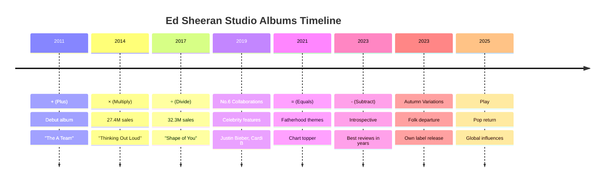
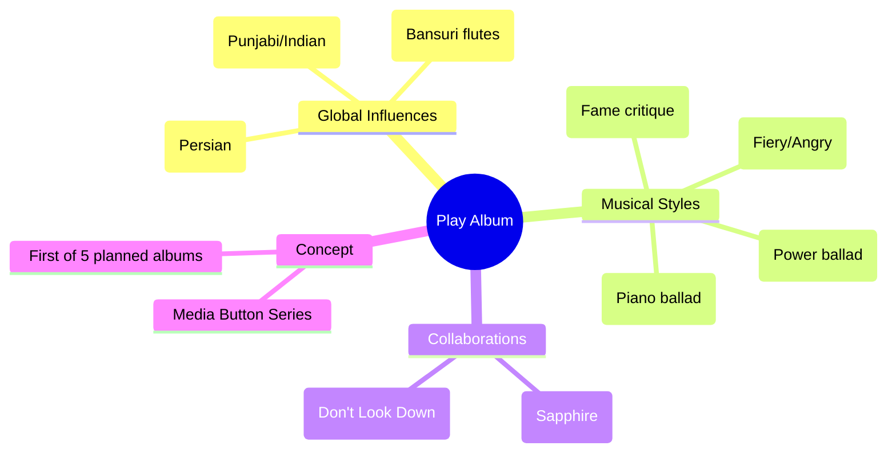
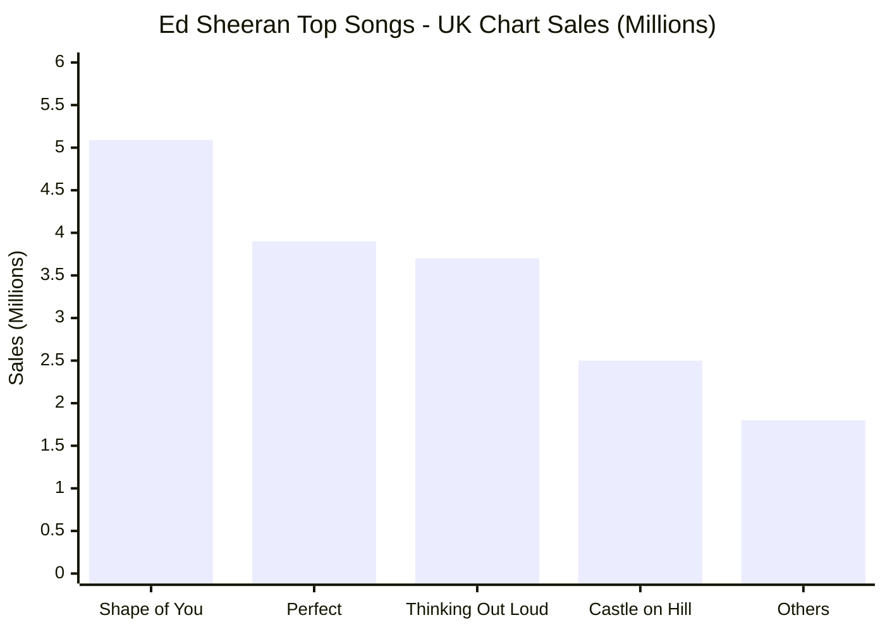
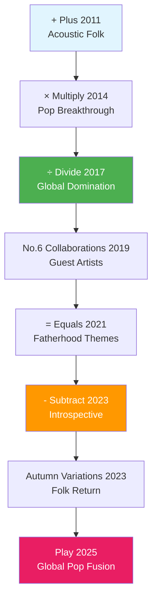

# Ed Sheeran 完整专辑研究报告 | Complete Discography Research

## 执行摘要 | Executive Summary

本报告全面研究了Ed Sheeran的完整音乐作品集，包括2025年9月12日发布的最新专辑《Play》。研究覆盖了他的八张录音室专辑、专辑曲目列表、批评评价以及主打歌曲的商业表现排名。

This comprehensive report examines Ed Sheeran's complete musical catalog, including his latest album "Play" released on September 12, 2025. The research covers his eight studio albums, track listings, critical reception, and commercial performance rankings of his hit songs.

## 关键发现 | Key Findings

### 🎵 最新发布 (2025年9月12日)
Ed Sheeran确实在2025年9月12日发布了新专辑《**Play**》，这是他的第八张录音室专辑，标志着回归流行音乐风格。

**Ed Sheeran did release a new album on September 12, 2025**: **"Play"**, his eighth studio album marking a return to pop music.

### 📊 商业成就统计
- **全球销量**: 2亿张唱片，成为史上最畅销音乐艺术家之一
- **Spotify排名**: 截至2024年7月，是Spotify上第三大关注艺术家  
- **十年成就**: 被官方排行榜公司评为2010年代英国专辑和单曲排行榜最成功的艺术家

**Commercial Achievement Statistics:**
- **Global Sales**: 200 million records, making him one of the best-selling music artists in history
- **Spotify Ranking**: Third most-followed artist on Spotify as of July 2024
- **Decade Recognition**: Named artist of the decade by the Official Charts Company for UK charts success in the 2010s

## 完整专辑目录 | Complete Discography

### 数学符号系列 | Mathematics Symbol Series

Ed Sheeran的标志性概念是数学主题专辑系列，使用符号(+、×、÷、=、-)。每张专辑探索不同的音乐领域，同时保持其独特的创作歌手风格。

Ed Sheeran's signature concept is his mathematics-themed album series using symbols (+, ×, ÷, =, -). Each album explores different musical territories while maintaining his distinctive singer-songwriter style.

## 2025年专辑《Play》详细分析 | 2025 "Play" Album Analysis

### 专辑概况 | Album Overview
- **发行日期**: 2025年9月12日
- **唱片公司**: Warner Music/Gingerbread Man Records  
- **曲目数量**: 13首歌曲
- **音乐风格**: Ed Sheeran称其为"大型流行专辑"
- **全球影响**: 融合印度和波斯音乐元素

### 五支单曲 | Five Singles Released
1. **"Azizam"** - 波斯语"我的亲爱的"，主打单曲
2. **"Old Phone"** - 怀旧主题，第二支单曲  
3. **"Sapphire"** - 与印度歌手Arijit Singh合作，含旁遮普语演唱
4. **"A Little More"** - 第四支单曲
5. **"Camera"** - 第五支单曲，被誉为"婚礼播放列表必备"

### 专辑亮点曲目 | Album Highlights

## 专辑评价分析 | Album Reviews Analysis

### 评分概览 | Review Scores Overview

| 专辑 Album | Metacritic | 主要媒体评价 Major Reviews |
|------------|------------|---------------------------|
| ÷ (Divide) | 62/100 | Rolling Stone ★★★★, Pitchfork 2.8/10 |
| - (Subtract) | 65/100 | 近年来最佳评价 Best reviews in years |
| Play (2025) | N/A | Rolling Stone: "更多相同的电台量身定制音乐" |

### 批评趋势 | Critical Patterns

**持续批评 Consistent Criticisms:**
- 商业化计算 Commercial calculation
- 歌词质量 Lyrical depth questions  
- 流行制作公式化 Generic pop production

**持续赞扬 Consistent Praise:**
- 商业效率 Commercial efficiency
- 亲和力 Relatability ("ordinary-bloke humanity")
- 创作技巧 Songwriting craft
- 流派多样性 Genre versatility

## 排行榜表现和歌曲排名 | Chart Performance and Song Rankings

### 最成功歌曲排行 | Top Hit Songs Ranking

#### 1. **Shape of You (2017)**
- **英国排行榜**: #1位14周（非连续）
- **Billboard Hot 100**: #1位12周
- **销量**: 509万综合销量
- **记录**: 英国排行榜历史上播放量最高歌曲

#### 2. **Perfect (2017)**  
- **英国排行榜**: #1，2017年圣诞节冠军单曲
- **Billboard Hot 100**: #1位6周
- **销量**: 390万综合图表销量
- **视频播放**: 6070万播放量，Ed Sheeran歌曲中最高

#### 3. **Thinking Out Loud (2014)**
- **英国排行榜**: #1，19周爬升至榜首（记录）
- **Billboard Hot 100**: #2位
- **销量**: 370万综合销量，Ed最畅销单曲
- **奖项**: 2016年格莱美年度歌曲奖

### 历史性图表成就 | Historic Chart Achievements

**2017年3月记录**: Ed Sheeran成为首位占据英国单曲榜前五名的艺术家，打破了Frankie Laine自1953年以来的记录，同时在前十名中占有九个位置。

**Historic March 2017 Record**: Ed Sheeran became the first artist to claim all top five spots on the UK Singles Chart, breaking Frankie Laine's 1953 record, with nine entries in the top ten.

## 音乐演进分析 | Musical Evolution Analysis  

## 文化影响和遗产 | Cultural Impact and Legacy

### 商业里程碑 | Commercial Milestones
- **2亿张**: 全球唱片销量
- **十年艺术家**: 2010年代英国榜单统治者
- **流媒体王者**: Spotify第三大关注艺术家
- **图表记录**: 多项英国和美国图表记录保持者

### 艺术贡献 | Artistic Contributions
- **数学概念**: 独特的数学符号专辑系列概念
- **全球融合**: 在《Play》中融入世界音乐元素
- **类型跨越**: 从民谣到流行到合作项目的成功转换
- **创作标准**: 现代流行音乐创作的基准制定者

## 详细分析报告链接 | Detailed Analysis Reports

获取更多深入分析，请查看以下专题报告：

For detailed analysis on specific topics, see the following specialized reports:

- [完整专辑目录分析 Complete Discography Analysis](./reports/task-1-complete-discography.md)
- [2025年《Play》专辑深度解析 Play Album Deep Dive](./reports/task-2-play-2025-album.md) 
- [专辑评价和批评接受度分析 Album Reviews & Critical Reception](./reports/task-3-album-reviews-reception.md)
- [图表表现和歌曲排名 Chart Performance & Song Rankings](./reports/task-4-chart-performance-rankings.md)

## 结论和启示 | Conclusions and Implications

Ed Sheeran在2025年9月12日确实发布了新专辑《Play》，这标志着他从内省民谣风格回归主流流行音乐的重要转变。该专辑融入了全球音乐元素，特别是印度和波斯音乐，代表了他艺术演进的新阶段。

**Ed Sheeran did release a new album "Play" on September 12, 2025**, marking a significant return to mainstream pop music from his introspective folk phase. The album incorporates global musical elements, particularly Indian and Persian music, representing a new phase in his artistic evolution.

他的商业成功是前所未有的，但批评接受度始终不一。然而，他在流行音乐领域的影响力和创作标准的建立使他成为21世纪最重要的音乐艺术家之一。

His commercial success is unprecedented, but critical reception remains mixed. However, his influence on pop music and standard-setting in songcraft makes him one of the most significant musical artists of the 21st century.

---

**研究完成日期 Research Completed**: 2025年9月12日 | September 12, 2025  
**数据来源 Data Sources**: Official Charts Company, Rolling Stone, Billboard, Wikipedia, Metacritic, NME