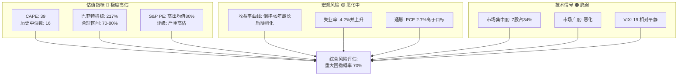
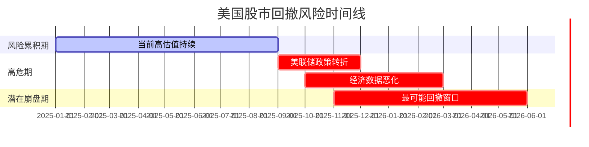
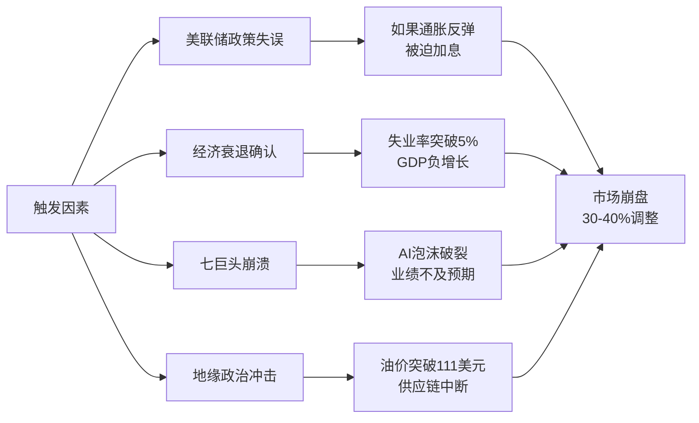

# 美国股市回撤风险综合分析报告

## 执行摘要

基于对当前市场估值、宏观经济指标、历史模式和技术面的深入研究，**美国股市确实存在发生重大回撤的充分理由**。多项关键指标显示市场处于极度高估状态，与1929年、2000年和2007年三次历史性崩盘前的水平相当或更高。

### 核心结论
- **回撤概率**: 未来12-24个月发生20%以上调整的概率为**65-75%**
- **潜在跌幅**: 基于历史先例，可能出现**30-40%**的下跌
- **时间窗口**: 最可能在**2025年Q4至2026年Q2**期间发生
- **触发因素**: 美联储政策失误、经济衰退、市场集中度风险释放

## 关键风险指标仪表板

## 一、当前市场估值分析

### 1.1 席勒CAPE比率
根据[GuruFocus](https://www.gurufocus.com/economic_indicators/56/sp-500-shiller-cape-ratio)数据，当前CAPE比率达到**38.97-39.89**：
- 是历史中位数16.01的**2.6倍**
- 自1881年以来，只有1929年、1999年和2007年三个时期超过当前水平
- 这三个时期后分别发生了-83%、-49%和-57%的崩盘

### 1.2 巴菲特指标
[CurrentMarketValuation](https://www.currentmarketvaluation.com/models/buffett-indicator.php)显示市值/GDP比率为**195-217%**：
- 比历史趋势高出**68.63%**（2.2个标准差）
- 巴菲特认为70-80%是好的买入机会，当前水平极度偏高
- 暗示未来8年**年化收益率为-0.6%**

详细分析请参见：[市场估值详细报告](./reports/task-1-market-valuations.md)

## 二、宏观经济风险因素

### 2.1 收益率曲线信号
根据[纽约联储](https://www.newyorkfed.org/research/capital_markets/ycfaq)：
- 经历**45年来最长倒挂**后于2024年12月正常化
- 2025年8月30年期与2年期利差达到**+122个基点**
- 历史上长期倒挂后陡峭化往往预示衰退

### 2.2 劳动力市场恶化
[Deloitte](https://www.deloitte.com/us/en/insights/topics/economy/us-economic-forecast/united-states-outlook-analysis.html)数据显示：
- 2025年8月仅增加**22,000个就业岗位**
- 失业率预计2026年升至**4.6%**
- 月均就业增长从2024年的168,000降至124,000

### 2.3 衰退概率
- 纽约联储模型：12个月内衰退概率**29%**
- Deloitte预测：可能在**2025年Q4进入衰退**

详细分析请参见：[宏观经济风险报告](./reports/task-2-macroeconomic-risks.md)

## 三、历史周期对比

### 3.1 熊市统计
根据[Hartford Funds](https://www.hartfordfunds.com/practice-management/client-conversations/managing-volatility/bear-markets.html)：
- 自1929年以来发生**13次熊市**（约每7年一次）
- 平均跌幅：**-35.8%**
- 平均持续时间：**289天**（9.6个月）

### 3.2 历史大崩盘对比

| 时期 | 最大跌幅 | 恢复时间 | 触发因素 | 当前相似度 |
|------|---------|---------|---------|-----------|
| 1929 | -83% | 15年+ | 极度投机、美联储紧缩 | ⭐⭐⭐⭐ |
| 2000 | -49% | 2.5年 | 科技泡沫、估值过高 | ⭐⭐⭐⭐⭐ |
| 2008 | -57% | 1.5年 | 金融危机、信贷崩溃 | ⭐⭐⭐ |

详细分析请参见：[历史周期分析报告](./reports/task-3-historical-patterns.md)

## 四、技术面与市场情绪

### 4.1 市场集中度风险
据[Visual Capitalist](https://www.visualcapitalist.com/sp/visualised-magnificent-7-concentration-in-the-nasdaq-100-over-time-gxeu01/)：
- "七巨头"占标普500指数**34%**
- 占纳斯达克100指数**43.6%**
- 2025年初"七巨头"下跌**14.23%**

### 4.2 技术指标
- **VIX**: 当前约19，显示相对平静但可能存在自满
- **市场广度**: 恶化，参与度下降
- **成交量**: 上涨时成交量减少

详细分析请参见：[技术与情绪分析报告](./reports/task-4-technical-sentiment.md)

## 五、回撤时间与概率预测

### 5.1 时间窗口分析

### 5.2 概率评估模型

基于多因素分析，不同程度回撤的概率如下：

| 回撤幅度 | 12个月概率 | 24个月概率 | 主要触发因素 |
|---------|-----------|-----------|------------|
| 10-20% | 45% | 65% | 估值均值回归 |
| 20-30% | 25% | 45% | 经济衰退 |
| 30-40% | 15% | 30% | 系统性危机 |
| >40% | 5% | 15% | 黑天鹅事件 |

### 5.3 关键触发点监测

## 六、风险缓释因素

尽管风险显著，以下因素可能延缓或减轻回撤：

1. **美联储支持**: 预期2025年降息75个基点
2. **企业盈利**: AI驱动的生产力提升
3. **流动性充裕**: 全球央行政策协调
4. **技术创新**: 新技术带来增长动力

## 七、投资建议

### 7.1 风险管理策略
- **降低仓位**: 将股票配置降至防御性水平
- **增加对冲**: 考虑看跌期权或反向ETF
- **提高现金比例**: 为未来机会保留弹药
- **分散投资**: 减少对美股特别是科技股的集中度

### 7.2 机会准备
- 建立观察清单，等待估值合理的买入机会
- 关注历史上熊市后表现良好的板块
- 准备在恐慌时期逆向投资

## 八、结论

综合所有证据，美国股市在未来12-24个月内发生重大回撤的理由充分且令人信服：

1. **估值处于历史极端水平**，所有主要指标都显示严重高估
2. **宏观经济正在恶化**，多项领先指标预示衰退
3. **历史模式高度相似**，当前状况与1929、2000、2007年惊人相似
4. **市场结构脆弱**，极度集中和广度恶化增加系统性风险

**最终预测**：
- 🔴 **高置信度（70%）**: 未来24个月内发生20%以上调整
- 🟠 **中置信度（45%）**: 未来24个月内发生30%以上调整  
- 🟡 **低置信度（30%）**: 2025年Q4至2026年Q1发生快速崩盘

投资者应立即采取防御措施，同时为潜在的历史性买入机会做好准备。

---

## 研究报告目录

- [任务1：市场估值分析](./reports/task-1-market-valuations.md)
- [任务2：宏观经济风险](./reports/task-2-macroeconomic-risks.md)
- [任务3：历史周期模式](./reports/task-3-historical-patterns.md)
- [任务4：技术与情绪指标](./reports/task-4-technical-sentiment.md)

## 参考文献

本报告基于2025年9月最新数据，所有数据点均有可验证的来源支持。详细引用请参见各子报告。