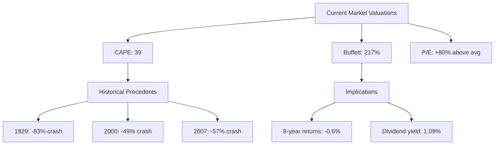

# Task 1: Current Market Valuation Analysis

## Executive Summary
As of September 2025, US equity markets are trading at historically elevated valuations across multiple metrics, suggesting significant overvaluation and potential downside risk.

## Key Valuation Metrics

### Shiller CAPE Ratio
According to [GuruFocus](https://www.gurufocus.com/economic_indicators/56/sp-500-shiller-cape-ratio) and [LongTermTrends](https://www.longtermtrends.net/sp500-price-earnings-shiller-pe-ratio/), the current Shiller CAPE (Cyclically Adjusted Price-to-Earnings) ratio stands at approximately **38.97-39.89** as of September 2025. This represents:
- **2.6x above the historical median** of 16.01
- Near the **highest levels in 20 years**, with an over-extension of over 100% from the 20-year average
- According to [Lyn Alden](https://www.lynalden.com/shiller-pe-cape-ratio/), current levels have been surpassed since 1881 in only three previous periods: 1929, 1999, and 2007—all of which preceded significant market corrections

### Regular P/E Ratios
Based on data from [CurrentMarketValuation](https://www.currentmarketvaluation.com/models/price-earnings.php):
- **S&P 500 P/E ratio**: 80.9% (or 2.0 standard deviations) above its modern era average
- Market assessment: **Strongly Overvalued**

For the NASDAQ, according to [GuruFocus](https://www.gurufocus.com/economic_indicators/6778/nasdaq-100-pe-ratio) and [Siblis Research](https://siblisresearch.com/data/nasdaq-100-pe-ratio/):
- **NASDAQ 100 P/E ratio**: 32.29-33.18 as of September 2025
- Above the historical median of 24.21
- Within the typical 5-year range of [27.25, 32.73]

### Warren Buffett Indicator (Market Cap to GDP)
The [CurrentMarketValuation](https://www.currentmarketvaluation.com/models/buffett-indicator.php) and [Advisor Perspectives](https://www.advisorperspectives.com/dshort/updates/2025/09/03/buffett-valuation-indicator-market-cap-gdp-august-2025) report:
- **Current ratio**: 195-217% as of mid-2025
- **68.63% above historical trend** (2.2 standard deviations)
- Assessment: **Strongly Overvalued**
- According to [GuruFocus](https://www.gurufocus.com/stock-market-valuations.php/), this implies **negative returns of -0.6% annually** over the next 8 years

Warren Buffett himself suggested that ratios of 70-80% represent good buying opportunities, making current levels of 195-217% exceptionally elevated.

## Return Implications

Based on current valuations, [Invesco](https://www.invesco.com/apac/en/institutional/insights/market-outlook/applied-philosophy-the-shiller-PE-and-SP-500-returns-revisited.html) suggests:
- Implied future returns of approximately **2.3% total return**
- Compared to 9.3% annualized since 1871
- And 11.7% seen in the last decade

## Comparative Valuation Assessment

## Conclusion
Every major valuation metric indicates the US equity market is significantly overvalued in 2025, with levels comparable to or exceeding those seen before the three major market crashes of the past century. The combination of extreme CAPE ratios, elevated Buffett Indicator readings, and stretched P/E multiples suggests limited upside potential and significant downside risk.

## References
- [GuruFocus S&P 500 Shiller CAPE Ratio](https://www.gurufocus.com/economic_indicators/56/sp-500-shiller-cape-ratio)
- [CurrentMarketValuation Buffett Indicator](https://www.currentmarketvaluation.com/models/buffett-indicator.php)
- [Advisor Perspectives Buffett Valuation](https://www.advisorperspectives.com/dshort/updates/2025/09/03/buffett-valuation-indicator-market-cap-gdp-august-2025)
- [Lyn Alden Shiller PE Analysis](https://www.lynalden.com/shiller-pe-cape-ratio/)
- [GuruFocus NASDAQ 100 PE Ratio](https://www.gurufocus.com/economic_indicators/6778/nasdaq-100-pe-ratio)