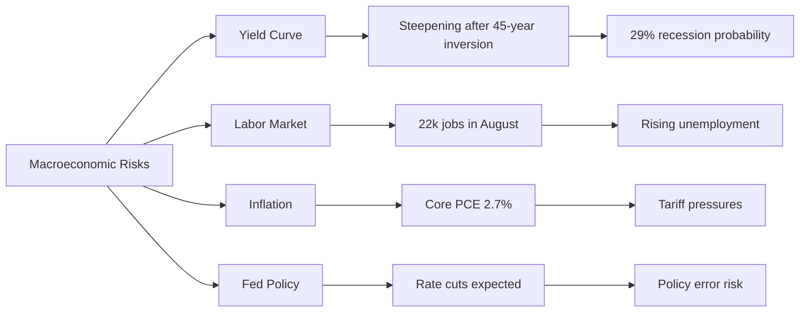

# Task 2: Macroeconomic Risk Factors Analysis

## Executive Summary
Multiple macroeconomic indicators suggest heightened recession risk in 2025-2026, with yield curve normalization after historic inversion, weakening labor markets, and persistent inflation concerns creating a challenging environment for equities.

## Yield Curve Dynamics

### Current Status
According to [FinancialContent](https://markets.financialcontent.com/stocks/article/marketminute-2025-9-9-yield-curve-steeps-amidst-weakening-labor-market-a-looming-recession-or-strategic-pivot-for-the-us-economy), the yield curve underwent dramatic transformation in 2025:
- **April 2025**: Shifted from prolonged inversion to distinct steepening
- **August 2025**: 30-year to 2-year spread widened to **+122 basis points**
- **Current**: 10-year yield sits approximately **0.59% above 2-year yield**

The [New York Fed](https://www.newyorkfed.org/research/capital_markets/ycfaq) notes that the 3-month to 10-year inversion that began October 25, 2022, ended December 13, 2024—the **longest inversion in 45 years**.

### Recession Probability
Based on [Cleveland Fed](https://www.clevelandfed.org/indicators-and-data/yield-curve-and-predicted-gdp-growth) data:
- **29% probability** of recession within 12 months
- Historically, yield curve steepening after prolonged inversion often precedes recessions

## Labor Market Deterioration

According to multiple sources including [Deloitte](https://www.deloitte.com/us/en/insights/topics/economy/us-economic-forecast/united-states-outlook-analysis.html):

### Employment Data
- **May 2025 unemployment**: 4.2%
- **Average monthly job gains**: 124,000 (first 5 months of 2025)
- Down from 168,000 average in 2024
- **August 2025**: Particularly weak with only **22,000 jobs added**

### Projections
- Unemployment expected to rise to **4.6% by 2026**
- Potential decline to 4.1% by 2029

## Federal Reserve Policy

### Current Stance
Per [Federal Reserve](https://www.federalreserve.gov/monetarypolicy/fomcprojtabl20250618.htm) and [U.S. Bank](https://www.usbank.com/investing/financial-perspectives/market-news/federal-reserve-tapering-asset-purchases.html):
- **Federal funds rate**: 4.25%-4.50% range (July 2025)
- **Interest on reserves**: 4.4%

### Expected Actions
- **25 basis point cut** fully priced for September 2025
- Total of **75 basis points** in cuts expected by December 2025
- **50 basis point cut** expected in Q4 2025

## Inflation Dynamics

### Current Readings
According to [BLS](https://www.bls.gov/news.release/cpi.nr0.htm) and [Federal Reserve](https://www.federalreserve.gov/monetarypolicy/2025-02-mpr-part1.htm):
- **PCE inflation**: 2.5% (June 2025)
- **Core PCE**: 2.7% (June 2025)
- **CPI**: 2.9% year-over-year (August 2025)

### Challenges
- Disinflation has **stalled** according to [Cleveland Fed](https://www.clevelandfed.org/indicators-and-data/inflation-nowcasting)
- Tariff policies creating upward pressure on goods inflation
- Core PCE expected to reach **3.6% by Q4 2025** due to tariff impacts

## Recession Scenarios

### Deloitte Economic Forecast
According to [Deloitte](https://www.deloitte.com/us/en/insights/topics/economy/us-economic-forecast/united-states-outlook-analysis.html):
- **Recession scenario**: Beginning Q4 2025
- **Recovery timeline**: GDP not returning to pre-recession levels until early 2027

### Historical Catalysts
Per [Game of Trades](https://www.gameoftrades.net/blog/us-recession-stage-is-set-here-are-the-catalysts-to-watch/), three primary recession catalysts historically:
1. **Oil shocks** (would need oil at $111+ to trigger)
2. **Pandemic events**
3. **Market crashes**

## Risk Matrix

## Key Risk Factors

1. **Policy Error Risk**: Fed faces difficult balance between fighting inflation and supporting growth
2. **Labor Market Weakness**: Sharp deterioration from 168k to 22k monthly job gains
3. **Inflation Persistence**: Core PCE remains above 2% target with tariff pressures building
4. **Yield Curve Signal**: Historic inversion followed by rapid steepening often precedes recessions

## Conclusion
The convergence of yield curve normalization after historic inversion, deteriorating labor markets, persistent inflation, and challenging Fed policy decisions creates substantial macroeconomic headwinds. Multiple indicators suggest elevated recession risk in Q4 2025 through 2026.

## References
- [New York Fed Yield Curve](https://www.newyorkfed.org/research/capital_markets/ycfaq)
- [Deloitte US Economic Forecast](https://www.deloitte.com/us/en/insights/topics/economy/us-economic-forecast/united-states-outlook-analysis.html)
- [Federal Reserve FOMC Projections](https://www.federalreserve.gov/monetarypolicy/fomcprojtabl20250618.htm)
- [BLS Consumer Price Index](https://www.bls.gov/news.release/cpi.nr0.htm)
- [Cleveland Fed Inflation Nowcasting](https://www.clevelandfed.org/indicators-and-data/inflation-nowcasting)