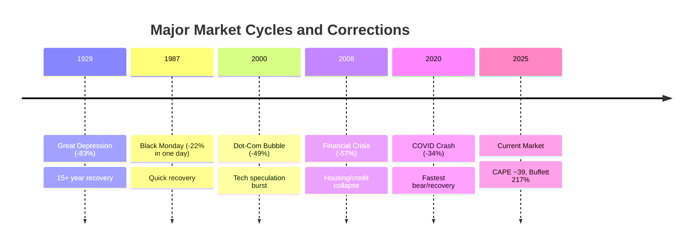

# Task 3: Historical Market Cycles and Correction Patterns

## Executive Summary
Historical analysis reveals that major bear markets occur approximately every 7 years, with an average decline of 35.8% lasting about 289 days. Current market conditions show parallels to periods preceding the 1929, 2000, and 2008 crashes.

## Historical Bear Market Overview

### Frequency and Duration
According to [Hartford Funds](https://www.hartfordfunds.com/practice-management/client-conversations/managing-volatility/bear-markets.html) and [Guggenheim Investments](https://www.guggenheiminvestments.com/advisor-resources/interactive-tools/sp-500-historical-trends):
- **13 bear markets** since 1929 (approximately once every 7 years)
- **Average duration**: 289 days (9.6 months)
- **Average decline**: -32.73% to -35.8%
- **Bull market average**: 988 days (2.7 years)

## Major Historical Crashes

### 1929 Great Depression
Per [Morningstar](https://www.morningstar.com/economy/what-weve-learned-150-years-stock-market-crashes) and historical records:
- **Peak decline**: -83% (worst in 150 years)
- **$100 investment** would have fallen to $21 by May 1932
- **Recovery time**: 15+ years (negative returns until January 1945)
- **Causes**: Post-WWI economic boom, overconfidence, overinflation, Federal Reserve tightening (discount rate raised from 5% to 6% in August 1929)

### 2000-2002 Dot-Com Bubble
According to [Sensible Financial](https://www.sensiblefinancial.com/how-has-the-sp-500-performed-over-the-last-98-years/):
- **Peak decline**: -49%
- **$100 investment** in August 2000 fell to $52.76
- **Duration**: Extended bear market lasting over 2 years
- **Causes**: Overinflated tech valuations, speculative excess

### 2007-2009 Financial Crisis
Based on [Raymond James](https://www.raymondjames.com/neunuebelbarrantes/pdfs/history-of-market-corrections.pdf) data:
- **Peak decline**: -57%
- **Combined "Lost Decade"**: 2000-2013 saw -54% total decline
- **Recovery**: Market didn't reach 2000 highs until May 2013 (12+ years)
- **Causes**: Housing bubble, mortgage-backed securities collapse

## Crash Triggers and Catalysts

### Common Catalysts
According to [U.S. News](https://money.usnews.com/investing/articles/will-the-stock-market-crash-risk-factors) and [Britannica](https://www.britannica.com/event/stock-market-crash-of-1929):

1. **Extreme Valuations**
   - High P/E ratios, CAPE above historical norms
   - Market cap to GDP at extreme levels

2. **Monetary Policy Tightening**
   - Federal Reserve rate increases
   - Credit tightening cycles

3. **External Shocks**
   - Oil price spikes (need $111+ historically)
   - Geopolitical events
   - Pandemic-type disruptions

4. **Confidence Cascade Events**
   - One shock triggering domino effect
   - Panic selling and margin calls

## Recovery Patterns

### Historical Recovery Data
From [MFS](https://www.mfs.com/content/dam/mfs-enterprise/mfscom/sales-tools/sales-ideas/mfse_resdwn_fly.pdf):
- Markets always recovered to new highs eventually
- **$1 invested in 1926** grew to ~$17,000 by February 2025 with dividends reinvested
- Strong buying opportunities typically emerge at bear market troughs
- S&P 500 significantly higher 1-, 3-, and 5-years after trough

## Pattern Recognition

## Current Market Parallels

### Valuation Similarities
According to [Project Syndicate](https://www.project-syndicate.org/commentary/trump-economic-policy-could-lead-to-us-stock-market-crash-by-desmond-lachman-2025-08):
- Current valuations "reminiscent of periods just before significant market corrections in 2000 and 1929"
- CAPE levels surpassed only in 1929, 1999, and 2007

### 2025 Market Events
Per [Wikipedia](https://en.wikipedia.org/wiki/2025_stock_market_crash):
- **April 2, 2025**: Global markets crashed amid tariff policy announcements
- Largest decline since 2020 COVID crash
- Triggered by policy uncertainty and panic selling

## Correction Frequency

### Minor vs Major Corrections
Based on [Covenant Wealth Advisors](https://www.covenantwealthadvisors.com/post/understanding-stock-market-corrections-and-crashes):
- **10% corrections**: Occur about once per year
- **20% bear markets**: Every 3.5 years on average
- **30%+ crashes**: Approximately every 7-10 years

## Key Lessons from History

1. **Valuations Matter**: Extreme valuations preceded all major crashes
2. **Duration Varies**: Bear markets last 9.6 months on average but can extend years
3. **Recovery Certain**: Markets always recovered but timing varies (months to decades)
4. **Catalysts Differ**: Each crash has unique triggers but patterns repeat
5. **Sentiment Extremes**: Euphoria precedes crashes, panic marks bottoms

## Conclusion
Historical patterns suggest the current market exhibits characteristics similar to previous major tops: extreme valuations, prolonged bull market, concentrated leadership, and emerging economic headwinds. While timing is uncertain, the historical precedent for significant corrections from these levels is strong.

## References
- [Hartford Funds Bear Market Analysis](https://www.hartfordfunds.com/practice-management/client-conversations/managing-volatility/bear-markets.html)
- [Morningstar 150 Years of Crashes](https://www.morningstar.com/economy/what-weve-learned-150-years-stock-market-crashes)
- [Raymond James Market Corrections History](https://www.raymondjames.com/neunuebelbarrantes/pdfs/history-of-market-corrections.pdf)
- [Guggenheim S&P 500 Historical Trends](https://www.guggenheiminvestments.com/advisor-resources/interactive-tools/sp-500-historical-trends)
- [Wikipedia 2025 Stock Market Crash](https://en.wikipedia.org/wiki/2025_stock_market_crash)