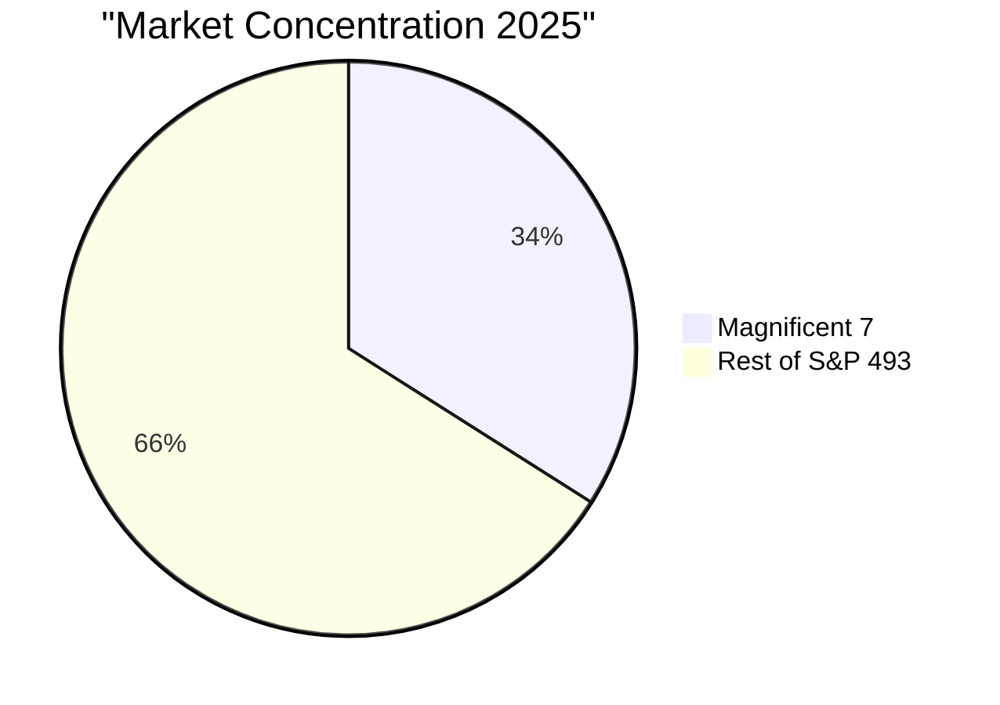
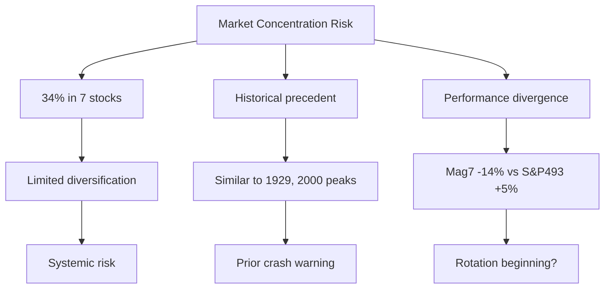

# Task 4: Technical and Sentiment Indicators Analysis

## Executive Summary
Technical and sentiment indicators show mixed signals with moderate VIX levels around 19, extreme market concentration in the Magnificent Seven stocks (40% of NASDAQ), and declining market breadth, suggesting underlying fragility despite surface calm.

## VIX Volatility Index

### Current Levels
According to [Above the Green Line](https://abovethegreenline.com/fear-index/) and [FRED Blog](https://fredblog.stlouisfed.org/2025/02/measuring-fear-what-the-vix-reveals-about-market-uncertainty/):
- **12-month range**: High of 22.75, Low of 16.11
- **Current average**: ~19 (30-day average)
- **12-month mean**: 18.75

### VIX Interpretation Scale
Per [TD Direct Investing](https://www.td.com/ca/en/investing/direct-investing/articles/understanding-vix):
- **0-15**: Optimism and very low volatility
- **15-25**: Normal volatility levels (current range)
- **25-30**: Increasing market turbulence
- **30+**: Highly volatile, extreme fear

### Key Relationships
- **Inverse correlation** with S&P 500 performance
- VIX above 30 indicates heavy put buying for downside protection
- Current level suggests complacency despite elevated valuations

## Market Sentiment Indicators

### Fear & Greed Index
According to [CNN Markets](https://www.cnn.com/markets/fear-and-greed) and [Liberated Stock Trader](https://www.liberatedstocktrader.com/fear-and-greed-index/):
- Incorporates 7 indicators: momentum, price strength, breadth, options, junk bonds, volatility, safe havens
- Scale: 0 (maximum fear) to 100 (maximum greed)
- Correlation stronger during extreme fear than extreme greed

### Put/Call Ratio
Per [Charts Watcher](https://chartswatcher.com/pages/blog/top-market-sentiment-indicators-for-smarter-trading-in-2025):
- High VIX (>30) correlates with elevated put buying
- Current moderate VIX suggests balanced options positioning
- Ratio serves as contrarian indicator at extremes

## Market Concentration Risk

### Magnificent Seven Dominance
According to [Visual Capitalist](https://www.visualcapitalist.com/sp/visualised-magnificent-7-concentration-in-the-nasdaq-100-over-time-gxeu01/) and [CNBC](https://www.cnbc.com/2024/07/01/how-magnificent-7-affects-sp-500-stock-market-concentration.html):

**NASDAQ 100 Concentration**:
- Magnificent Seven: **43.6% of index** (July 2025)
- Nearly **40% concentration** overall

**S&P 500 Concentration**:
- Magnificent Seven: **34% of index** (August 2025)
- Up from 12.3% in 2015
- Market cap: **$19.397 trillion combined**

### 2025 Performance Divergence
Per [YCharts](https://get.ycharts.com/resources/blog/what-happened-to-the-magnificent-seven-stocks/) and [FinancialContent](https://markets.financialcontent.com/stocks/article/marketminute-2025-9-8-the-magnificent-seven-and-market-concentration-a-growing-concern):
- Magnificent Seven: **-14.23% YTD** (early 2025)
- S&P 493 (ex-Mag7): +5.12% initially, then gave up gains
- Tesla fell below $1T market cap
- Microsoft and NVIDIA dropped below $3T

## Market Breadth Indicators

### NYSE Advance/Decline Ratio
According to sentiment analysis sources:
- Ratio >2 indicates greed (2 stocks rising per 1 falling)
- Current breadth showing deterioration
- Weakening internals despite index levels

### Stocks Above Moving Averages
- **$SPXA50R**: Tracks % of S&P 500 above 50-day MA
- Provides insight into internal market strength
- Declining readings suggest narrowing participation

## Concentration Risk Analysis

## Technical Warning Signs

### Negative Divergences
1. **Leadership Breakdown**: Magnificent Seven underperforming broader market
2. **Breadth Deterioration**: Fewer stocks participating in rallies
3. **Volume Patterns**: Declining volume on advances

### Risk Indicators
According to [T. Rowe Price](https://www.troweprice.com/institutional/us/en/insights/articles/2025/q2/magnificent-7-equity-market-concentration-and-portfolio-strategy-na.html):
- Concentration makes future returns "less sustainable and more uncertain"
- Active managers struggle when >30% of risk budget in handful of stocks
- Historical data shows active management outperforms when concentration decreases

## Sentiment Extremes and Market Dynamics

### Current Environment Characteristics
Per [U.S. News](https://money.usnews.com/financial-advisors/articles/vix-vs-fear-and-greed-index-as-a-market-sentiment-indicator):
- **Complacency**: VIX at 19 despite high valuations
- **Concentration Risk**: Unprecedented index concentration
- **Divergence**: Magnificent Seven weakness vs broader market

### Historical Context
- Current concentration levels "have not been seen in decades"
- Top 10 holdings: **34.85% of S&P 500** (up from 25.43% in Feb 2023)
- NASDAQ-100 top 10: **50.96% concentration** (January 2025)

## Key Technical/Sentiment Conclusions

1. **Mixed Signals**: VIX suggests calm but concentration extreme
2. **Fragile Structure**: Market dependent on 7 stocks' performance
3. **Rotation Risk**: Magnificent Seven breakdown could trigger broader decline
4. **Breadth Warning**: Deteriorating internals despite index strength
5. **Historical Parallel**: Concentration levels match previous major tops

## Conclusion
While the VIX at 19 suggests moderate near-term risk, extreme market concentration, deteriorating breadth, and Magnificent Seven underperformance signal underlying technical weakness. The market structure appears fragile and vulnerable to rapid sentiment shifts.

## References
- [Above the Green Line VIX Analysis](https://abovethegreenline.com/fear-index/)
- [Visual Capitalist Magnificent 7 Concentration](https://www.visualcapitalist.com/sp/visualised-magnificent-7-concentration-in-the-nasdaq-100-over-time-gxeu01/)
- [CNBC Market Concentration](https://www.cnbc.com/2024/07/01/how-magnificent-7-affects-sp-500-stock-market-concentration.html)
- [T. Rowe Price Concentration Strategy](https://www.troweprice.com/institutional/us/en/insights/articles/2025/q2/magnificent-7-equity-market-concentration-and-portfolio-strategy-na.html)
- [YCharts Magnificent Seven Performance](https://get.ycharts.com/resources/blog/what-happened-to-the-magnificent-seven-stocks/)