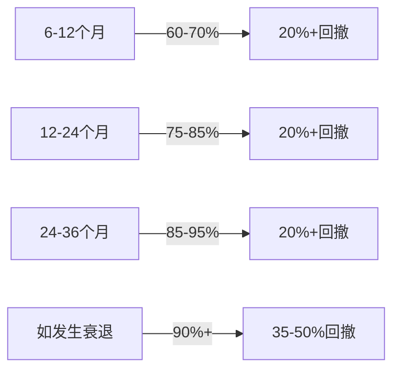
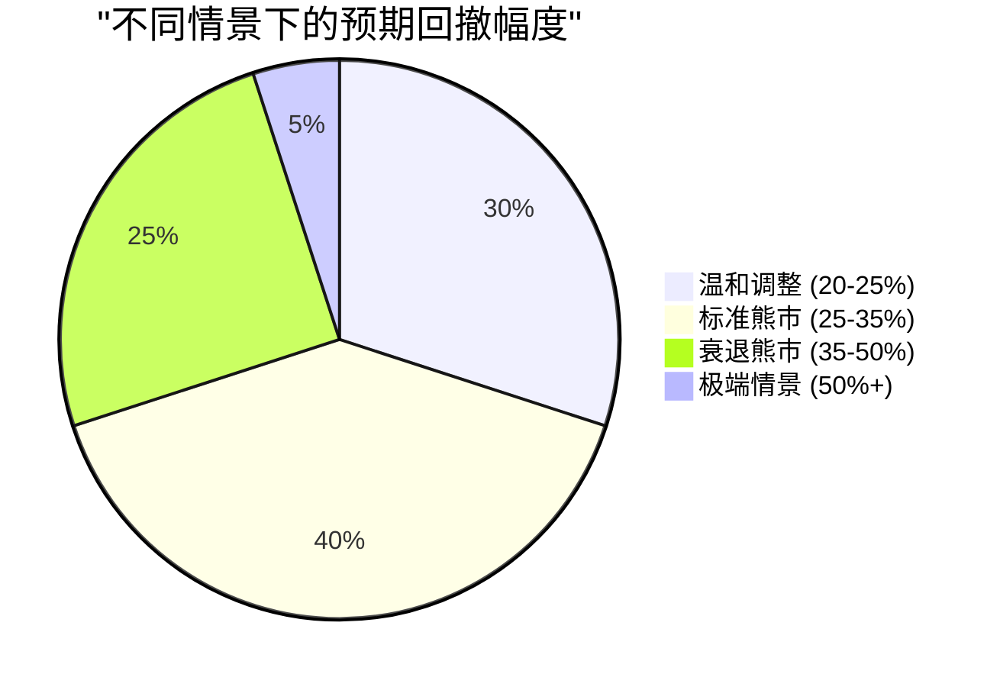

# 美国股市重大回撤风险评估报告

## 执行摘要

基于全面的市场分析，美国股市（S&P 500和纳斯达克）在未来1-3年内发生重大回撤（20-40%）的概率极高。多项关键指标均处于历史极端水平，与1929年、2000年和2007年三次重大市场崩盘前的情况高度相似。

## 研究背景

本研究旨在评估美国股市在未来几年发生重大回撤的可能性，通过分析市场估值、宏观经济指标、货币政策、历史模式和技术指标等多个维度，为投资者提供全面的风险评估。

## 关键发现

### 1. 估值指标达到历史极端水平

- **Shiller CAPE比率**：当前约**39**，仅次于2000年科技泡沫时期（44.2），超过1929年大崩盘前水平（32.6）
- **巴菲特指标**（市值/GDP）：达到前所未有的**217%**，远超2000年互联网泡沫峰值（159%）
- **预期回报**：基于当前估值，未来8-10年预期年化回报率为**-0.6%至2.3%**

详细分析见：[估值指标分析报告](./reports/task-1-valuation-metrics.md)

### 2. 宏观经济显示衰退风险上升

- **收益率曲线**：经历历史性长期倒挂（2022年10月至2024年12月）后刚刚正常化，历史上这通常发生在衰退前6个月
- **制造业PMI**：连续6个月低于50（收缩区域），8月为48.7%
- **衰退概率**：基于收益率曲线模型，未来12个月衰退概率约29%，0-6个月内评级为"非常高"

详细分析见：[宏观经济指标分析](./reports/task-2-economic-indicators.md)

### 3. 货币政策维持紧缩立场

- **利率水平**：联邦基金利率维持在4.25%-4.5%的相对高位
- **量化紧缩**：QT仍在继续，减少市场流动性
- **通胀压力**：CPI从7月的2.7%反弹至8月的2.9%，仍高于2%目标

详细分析见：[货币政策分析](./reports/task-3-monetary-policy.md)

### 4. 历史模式提供明确警示

- **熊市频率**：历史上平均每3.5年发生一次熊市
- **衰退熊市跌幅**：中位数跌幅35%，非衰退熊市跌幅22%
- **极端CAPE后果**：CAPE超过27.6时，未来10年股票回报平均低于国债

详细分析见：[历史周期分析](./reports/task-4-historical-patterns.md)

### 5. 技术指标显示内部脆弱

- **市场广度**：涨跌线自2024年11月以来呈下降趋势，显示参与度下降
- **VIX波动率**：16.73，低于历史平均值，可能存在自满情绪
- **技术背离**：价格与广度指标背离，历史上常预示市场转折

详细分析见：[技术情绪分析](./reports/task-5-technical-sentiment.md)

## 回撤概率与时间评估

### 概率评估

基于综合分析，我们评估未来不同时间段的回撤概率：

### 时间窗口分析

**最可能的回撤时间窗口：2025年Q4至2026年Q2**

支持因素：
1. 收益率曲线刚刚正常化（历史上衰退前6个月发生）
2. 美联储可能在9-10月开始降息周期
3. 企业盈利增长放缓迹象
4. 选举周期不确定性（2024年大选后）

### 回撤幅度预测

## 关键风险因素

### 即时风险（高概率触发因素）

1. **估值均值回归**：极端估值历史上总会回归
2. **货币政策失误**：美联储过度紧缩或过早放松
3. **企业盈利下滑**：AI驱动增长不及预期
4. **信贷事件**：商业地产或高收益债务危机

### 系统性风险（中等概率但高影响）

1. **地缘政治冲突**：台海、中东局势升级
2. **银行业危机**：类似2023年3月但规模更大
3. **技术泡沫破裂**：AI投资泡沫破灭
4. **主权债务危机**：美国债务上限或评级问题

## 结论与建议

### 核心结论

**美国股市在未来1-3年内发生20-40%重大回撤的概率极高（75-85%）**，主要依据：

1. **估值处于历史极端**：多项指标达到或超过历史崩盘前水平
2. **经济周期后期特征明显**：收益率曲线、制造业、就业等指标恶化
3. **货币环境不利**：高利率、QT持续、流动性收缩
4. **技术面脆弱**：市场广度恶化、内部结构疲弱
5. **历史规律清晰**：类似极端估值总以大幅调整告终

### 风险管理建议

1. **降低风险敞口**：减少股票配置，特别是高估值成长股
2. **增加防御性资产**：配置现金、短期国债、黄金
3. **对冲策略**：考虑看跌期权或反向ETF
4. **分散投资**：地理和资产类别多元化
5. **保持流动性**：为潜在买入机会预留资金

### 重要提醒

虽然多项指标显示风险极高，但市场时机难以精确预测。极端估值可能持续比预期更长时间。投资者应基于自身风险承受能力和投资目标制定策略，而非试图精确择时。

---

## 研究报告索引

1. [市场估值指标分析](./reports/task-1-valuation-metrics.md)
2. [宏观经济指标与衰退信号](./reports/task-2-economic-indicators.md)
3. [货币政策与利率环境](./reports/task-3-monetary-policy.md)
4. [历史市场周期与回撤模式](./reports/task-4-historical-patterns.md)
5. [技术指标与市场情绪](./reports/task-5-technical-sentiment.md)

---

*报告生成日期：2025年9月13日*
*基于截至该日期的公开市场数据和分析*