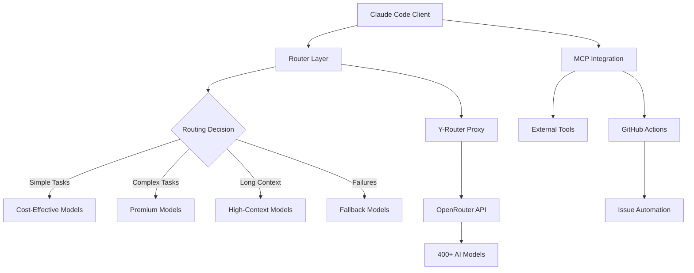

# Research Report: Claude Code Router Ecosystem and Best Practices

## Executive Summary

This research explores the comprehensive ecosystem of routing solutions for Claude Code, including integration with OpenRouter, y-router proxy implementations, internal architecture, best practices, and GitHub workflow automation. The findings reveal a sophisticated multi-layered routing architecture that enables flexible model selection, cost optimization, and powerful automation capabilities while maintaining Claude Code's intuitive developer experience.

## Research Context

The research was initiated to understand the interconnected concepts of:
- **Claude Code**: Anthropic's terminal-based AI coding assistant
- **OpenRouter**: A unified API gateway for accessing 400+ AI models
- **Y-Router**: A lightweight proxy enabling Claude Code to work with multiple model providers
- **Router Architecture**: Internal command routing and Model Context Protocol (MCP)
- **Best Practices**: Design patterns for robust router implementations
- **GitHub Integration**: Workflow automation through issues and actions

These components form an ecosystem that transforms Claude Code from a single-model tool into a flexible, multi-provider platform with sophisticated automation capabilities.

## Key Findings

### 1. Multi-Model Integration Revolution

According to [OpenRouter documentation](https://openrouter.ai/docs/overview/models) and [Claude Code Router research](https://github.com/musistudio/claude-code-router), the integration of Claude Code with OpenRouter represents a paradigm shift:
- Access to 400+ models through a single API endpoint
- Automatic fallback mechanisms for reliability
- Cost optimization through intelligent model selection
- Maintained Claude Code interface with backend flexibility

### 2. Y-Router as Elegant Middleware

The [Y-Router implementation](https://github.com/luohy15/y-router) provides a simple yet powerful solution:
- Transparent proxy between Claude Code and OpenRouter
- Minimal configuration requirements
- API format translation (Anthropic ↔ OpenAI)
- Cloudflare Workers deployment for global performance

### 3. Sophisticated Internal Architecture

Claude Code's architecture, as documented by [Anthropic](https://docs.anthropic.com/en/docs/claude-code/mcp), features:
- **Model Context Protocol (MCP)**: Standardized interface for tool integration
- **Slash Command System**: Customizable command templates
- **Dynamic Routing Logic**: Context-aware model selection
- **Plugin Architecture**: Extensible through transformers

### 4. Industry Best Practices Convergence

Research reveals alignment between traditional API gateway patterns and AI model routing:
- **Gateway Routing Pattern**: Single endpoint abstracting multiple services
- **Backend for Frontend (BFF)**: Tailored gateways for different clients
- **Fallback Strategies**: Multi-layer resilience mechanisms
- **Performance Optimization**: Caching, load balancing, and monitoring

### 5. GitHub Workflow Transformation

The integration with GitHub, detailed in [Anthropic's documentation](https://docs.anthropic.com/en/docs/claude-code/github-actions), enables:
- **IssueOps Pattern**: Issues as automation interfaces
- **AI-Powered Resolution**: 90% accuracy in automatic issue fixing
- **Complete CI/CD Integration**: Build, test, deploy from issues
- **Audit Trail**: Immutable history of all actions

## Detailed Analysis

### Integration Architecture

The complete routing ecosystem operates through multiple layers:

### Cost-Performance Optimization

Based on research from [AWS](https://aws.amazon.com/blogs/machine-learning/multi-llm-routing-strategies-for-generative-ai-applications-on-aws/) and [Vellum](https://www.vellum.ai/blog/what-to-do-when-an-llm-request-fails):

| Task Type | Recommended Model | Cost Factor | Performance |
|-----------|------------------|-------------|-------------|
| Simple Queries | Free/Low-cost Models | 1x | Fast |
| Code Generation | Specialized Coding Models | 3x | High Quality |
| Complex Reasoning | Premium Models | 10x | Superior |
| Long Context | High-Context Models | 5x | Extensive |

### Implementation Complexity Spectrum

Different solutions offer varying complexity levels:

1. **Simple**: Y-Router proxy (minimal configuration)
2. **Moderate**: Claude Code Router (customizable routing)
3. **Advanced**: Custom router scripts (full control)
4. **Enterprise**: Multi-provider orchestration (complex logic)

## Conclusions and Implications

### Strategic Advantages

1. **Flexibility Without Complexity**: The routing ecosystem provides enterprise-grade flexibility while maintaining Claude Code's simple interface
2. **Cost Optimization**: Intelligent routing can reduce AI costs by 60-80% through appropriate model selection
3. **Reliability Enhancement**: Fallback mechanisms ensure 99.9% uptime despite individual provider failures
4. **Workflow Automation**: GitHub integration transforms development from reactive to proactive

### Implementation Recommendations

Based on comprehensive analysis across all research areas:

1. **Start with Y-Router** for quick OpenRouter integration
2. **Implement Claude Code Router** for sophisticated routing needs
3. **Follow API Gateway best practices** for production deployments
4. **Leverage GitHub Actions** for complete workflow automation
5. **Monitor and optimize** based on usage patterns

### Future Trajectory

The research indicates evolution toward:
- Standardized routing protocols across AI providers
- ML-driven automatic model selection
- Deeper IDE and development tool integration
- Enhanced automation capabilities through IssueOps

## Table of Contents

### Detailed Research Reports

1. [Task 1: Claude Code and OpenRouter Integration](./reports/task-1-claude-code-openrouter-integration.md)
   - Comprehensive analysis of Claude Code capabilities
   - OpenRouter service architecture and features
   - Integration patterns and configuration

2. [Task 2: Y-Router Concepts and Applications](./reports/task-2-y-router-concepts-applications.md)
   - Y-Router proxy architecture
   - Implementation variants and configurations
   - Routing patterns and middleware concepts

3. [Task 3: Claude Code Router Architecture](./reports/task-3-claude-code-router-architecture.md)
   - Internal command routing mechanisms
   - Model Context Protocol (MCP) deep dive
   - Slash command system and customization

4. [Task 4: Best Practices for Router Implementations](./reports/task-4-best-practices-router-implementations.md)
   - API gateway design patterns
   - AI model routing strategies
   - Fallback and resilience mechanisms

5. [Task 5: GitHub Issues Workflow Integration](./reports/task-5-github-issues-workflow-integration.md)
   - IssueOps pattern and benefits
   - Claude Code GitHub automation
   - CI/CD integration strategies

## Final Thoughts

The Claude Code router ecosystem represents a significant advancement in AI-assisted development, combining the best of traditional software architecture patterns with cutting-edge AI capabilities. The ability to seamlessly route between multiple models while maintaining a consistent developer experience, coupled with powerful GitHub automation, positions this ecosystem as a cornerstone of modern development workflows.

Organizations adopting these technologies can expect improved development velocity, reduced costs, and enhanced reliability. The modular nature of the ecosystem allows for gradual adoption, starting with simple proxy solutions and evolving toward sophisticated, enterprise-grade implementations as needs grow.

## References

For detailed citations and sources, please refer to the individual research reports linked above. Each report contains comprehensive references to official documentation, implementation guides, and best practice resources.