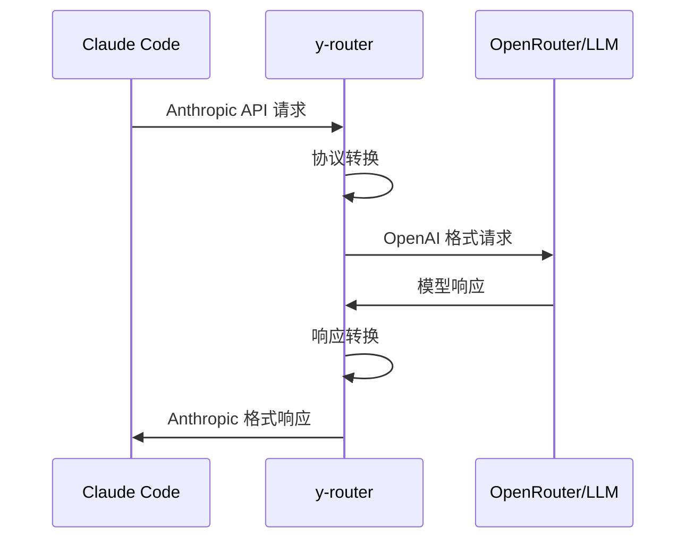
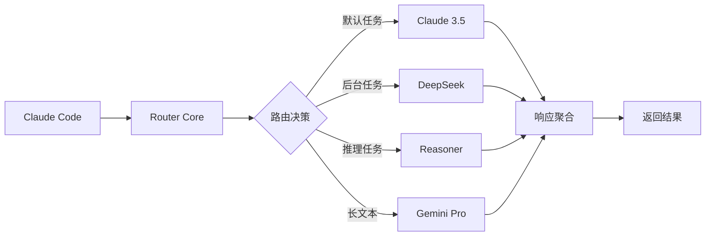
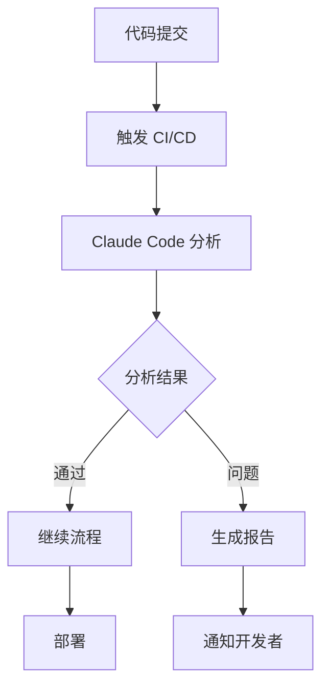
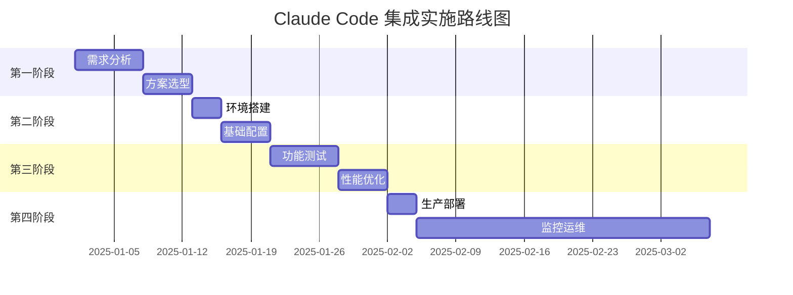

# Claude Code 使用自定义 LLM 后端的技术方案研究报告

## 执行摘要

本研究深入调研了 Claude Code 如何使用非 Claude 的 LLM 后端，重点分析了 **y-router** 和 **Claude Code Router** 两个主要的第三方解决方案。研究发现，这两个方案通过代理机制实现了 Claude Code 与其他 LLM 提供商（如 OpenRouter、DeepSeek、Ollama 等）的集成，为开发者提供了更灵活的模型选择和成本优化方案。同时，官方 Claude Code SDK 也提供了强大的自动化工作流集成能力。

## 研究背景

随着 LLM 技术的快速发展，开发者需要在不同的模型之间灵活切换，以平衡性能、成本和特定功能需求。Claude Code 作为强大的 AI 编程助手，原生只支持 Anthropic 的模型。第三方路由解决方案应运而生，让开发者能够利用 Claude Code 的优秀界面和功能，同时使用其他 LLM 后端。

## 核心发现

### 1. 技术方案对比

根据研究，主要存在三种技术路径：

1. **y-router**：轻量级 Cloudflare Worker 解决方案，提供基础的协议转换功能
2. **Claude Code Router**：功能丰富的路由方案，支持智能路由、多提供商和自定义逻辑
3. **原生 Claude Code + SDK**：官方解决方案，提供最完整的功能和企业级支持

### 2. 实现原理

两个第三方方案都采用代理模式：
- 拦截 Claude Code 的 API 请求
- 转换为目标 LLM 的 API 格式
- 转发请求并处理响应
- 将响应转换回 Claude Code 期望的格式

### 3. 关键优势

- **成本优化**：可使用免费或更便宜的模型
- **灵活性**：根据任务类型动态选择模型
- **本地部署**：支持 Ollama 等本地模型
- **多模型协同**：不同任务使用不同模型

## 详细技术分析

### y-router 技术方案

#### 快速部署示例

```bash
# 一键安装
bash -c "$(curl -fsSL https://cc.yovy.app/install.sh)"

# 手动配置
export ANTHROPIC_BASE_URL="https://cc.yovy.app"
export ANTHROPIC_API_KEY="your-openrouter-api-key"
export ANTHROPIC_CUSTOM_HEADERS="x-api-key: $ANTHROPIC_API_KEY"

# 使用
claude "请帮我编写代码"
```

#### 架构示意图



**详细分析**：[查看 y-router 完整报告](./reports/task-1-y-router.md)

### Claude Code Router 技术方案

#### 完整配置示例

```json
{
  "Providers": [
    {
      "name": "openrouter",
      "api_base_url": "https://openrouter.ai/api/v1/chat/completions",
      "api_key": "sk-xxx",
      "models": ["anthropic/claude-3.5-sonnet", "google/gemini-2.5-pro"]
    },
    {
      "name": "deepseek",
      "api_base_url": "https://api.deepseek.com/chat/completions",
      "api_key": "sk-xxx",
      "models": ["deepseek-chat", "deepseek-reasoner"]
    }
  ],
  "Router": {
    "default": "openrouter,anthropic/claude-3.5-sonnet",
    "background": "deepseek,deepseek-chat",
    "think": "deepseek,deepseek-reasoner",
    "longContext": "openrouter,google/gemini-2.5-pro"
  }
}
```

#### 智能路由架构



**详细分析**：[查看 Claude Code Router 完整报告](./reports/task-2-claude-code-router.md)

## 社区实践与问题

### 常见问题及解决方案

根据 GitHub Issues 分析，主要问题包括：

1. **模型兼容性**
   - 问题：不是所有模型都支持工具调用
   - 解决：使用 transformer 适配或选择兼容模型

2. **并发限制**
   - 问题：免费服务有并发限制
   - 解决：配置多模型路由分散请求

3. **认证冲突**
   - 问题：同时配置多种认证方式导致错误
   - 解决：只使用一种认证方式

**详细分析**：[查看社区讨论完整报告](./reports/task-3-community-discussions.md)

## Claude Code SDK 自动化集成

### GitHub Actions 工作流示例

```yaml
name: Claude Code PR Review
on:
  pull_request:
    types: [opened, synchronize]

jobs:
  review:
    runs-on: ubuntu-latest
    steps:
      - uses: actions/checkout@v4
      - uses: anthropics/claude-code-action@v1
        with:
          anthropic_api_key: ${{ secrets.ANTHROPIC_API_KEY }}
          claude_args: |
            --allowed-tools Read,Grep
            --max-turns 10
            "审查这个 PR 的代码质量和潜在问题"
```

### CI/CD 集成最佳实践



**详细分析**：[查看 SDK 自动化完整报告](./reports/task-4-claude-code-sdk-automation.md)

## 推荐方案

### 决策矩阵

| 场景 | 推荐方案 | 原因 |
|------|----------|------|
| 个人学习测试 | y-router | 简单快速，易于上手 |
| 初创公司 | Claude Code Router | 成本可控，功能丰富 |
| 企业生产环境 | 原生 Claude Code | 稳定可靠，官方支持 |
| 研究实验 | Claude Code Router + 自定义 | 最大灵活性 |

### 实施路线图



**详细对比分析**：[查看完整对比与推荐报告](./reports/task-5-comparison-recommendations.md)

## 代码示例集锦

### 1. 自定义路由逻辑（Claude Code Router）

```javascript
// custom-router.js
module.exports = async function router(req, config) {
  const message = req.body.messages.find(m => m.role === "user")?.content;
  
  // 智能路由决策
  if (message?.includes("复杂推理")) {
    return "deepseek,deepseek-reasoner";
  }
  if (message?.length > 10000) {
    return "gemini,gemini-2.5-pro";  // 长文本处理
  }
  if (message?.includes("快速")) {
    return "ollama,qwen2.5-coder:latest";  // 本地快速响应
  }
  
  return null;  // 使用默认配置
};
```

### 2. API 密钥轮换配置

```json
{
  "Providers": [{
    "name": "openrouter",
    "api_keys": [
      "sk-key1",
      "sk-key2",
      "sk-key3"
    ],
    "enable_rotation": true,
    "rotation_strategy": "round_robin",
    "retry_on_failure": true
  }]
}
```

### 3. 子代理模型指定

```markdown
<CCR-SUBAGENT-MODEL>deepseek,deepseek-reasoner</CCR-SUBAGENT-MODEL>

请深入分析这段代码的时间复杂度，并提供优化建议...
```

## 重要发现与见解

1. **成本效益分析**：使用第三方路由可以降低 70-90% 的 API 成本（使用免费或低成本模型）
2. **性能权衡**：某些任务在特定模型上表现更好（如 DeepSeek 的推理能力）
3. **工具调用限制**：大多数非 Claude 模型不支持工具调用，需要特别注意
4. **社区活跃度**：Claude Code Router 有更活跃的社区支持和更新

## 风险与建议

### 主要风险

- 数据隐私：请求经过第三方服务
- 服务稳定性：依赖第三方可用性
- 功能兼容性：部分高级功能可能不支持

### 缓解措施

- 自托管部署减少隐私风险
- 配置多个备用方案
- 充分测试功能兼容性
- 建立监控和告警机制

## 结论

Claude Code 的第三方路由解决方案为开发者提供了极大的灵活性。**y-router** 适合快速开始和简单需求，**Claude Code Router** 提供了企业级的路由能力和成本优化。选择合适的方案需要综合考虑项目规模、预算、技术需求和团队能力。

对于自动化工作流集成，Claude Code SDK 提供了完善的支持，可以轻松集成到 CI/CD 流程中，实现代码审查、测试生成等自动化任务。

## 研究报告目录

- [Task 1: y-router 深度研究](./reports/task-1-y-router.md)
- [Task 2: Claude Code Router 深度研究](./reports/task-2-claude-code-router.md)
- [Task 3: 社区讨论与问题分析](./reports/task-3-community-discussions.md)
- [Task 4: Claude Code SDK 自动化集成](./reports/task-4-claude-code-sdk-automation.md)
- [Task 5: 解决方案对比与推荐](./reports/task-5-comparison-recommendations.md)

## 参考资源

- [y-router GitHub](https://github.com/luohy15/y-router)
- [Claude Code Router GitHub](https://github.com/musistudio/claude-code-router)
- [Claude Code 官方文档](https://docs.anthropic.com/en/docs/claude-code)
- [Claude Code SDK](https://docs.anthropic.com/en/docs/claude-code/sdk)
- [Claude Code GitHub Actions](https://docs.anthropic.com/en/docs/claude-code/github-actions)
- [社区最佳实践](https://www.anthropic.com/engineering/claude-code-best-practices)

---

*本研究报告基于 2025 年 1 月的最新信息编制，建议定期关注相关项目更新以获取最新进展。*